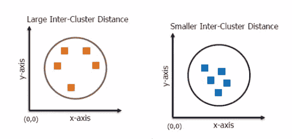

# 了解 Mahout 中的距离测量

> 原文：<https://www.edureka.co/blog/distance-measure-in-mahout>

[//www.youtube.com/embed/b9FuzdhONZE](//www.youtube.com/embed/b9FuzdhONZE)

您可以通过自己的实现来控制距离测量技术。并不总是强制要求您拥有由 Mahout 算法或 Mahout 库提供的距离测量技术。如果您认为您对自己的数据有所了解，并且希望根据自己的算法进行计算，那么您可以实现距离测量接口并提供权重因子，或者实现距离方法并对向量点应用适当的数学逻辑，然后为它们提供值，以确定特定实现是否落在特定质心内。Mahout 中有各种距离度量，可以用来确定一个集群的质量。**

## **余弦距离测度**

*   余弦距离度量对于文本来说是一种更好的距离度量，因为它根据文档之间权重最高的常用词对文档进行分组。
*   如果 TF-IDF 加权向量对于主题词具有较高的权重，则使用余弦距离度量聚类的相似文档在它们之间具有共同的主题词。
*   这使得聚类质心向量对于主题词比对于停用词具有更高的平均权重。

## **簇间距离**

聚类间距离是了解聚类质量的良好度量。好的聚类可能没有彼此太靠近的质心，因为这将表明聚类过程正在创建具有相似特征的组，并且可能在聚类成员之间画出难以支持的区别。

**簇内距离**

类内距离与类间距离正好相反。与集群间距离相比，集群成员之间的集群内距离将较小。好的距离度量将返回相似对象之间的小距离，并产生更紧密的聚类，因此更可靠地区分彼此。

上图显示了使用两种不同的距离度量进行聚类时可能获得的类内距离。

类内距离是对点之间距离的度量。这取决于两个因素:距离测量对更远的物体造成的损失，以及对更近的物体造成的更小的损失。这两个值的比值越大，聚类就越分散。

看看这个 [**NLP 课程**](https://www.edureka.co/python-natural-language-processing-course) 由 Edureka 提供，让你的人工智能技能更上一层楼有问题吗？请在评论区提及它们，我们将会回复您。

**相关帖子**

[监督学习中的阿帕奇](https://www.edureka.co/blog/supervised-learning-technique-in-mahout/ "Supervised Learning in Apache Mahout")

[和看象人一起开始你的机器学习训练](https://www.edureka.co/mahout-self-paced "Training in Machine Learning with Mahout")