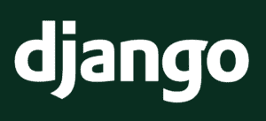
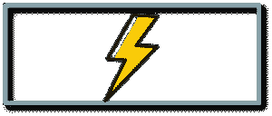
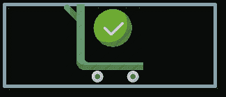
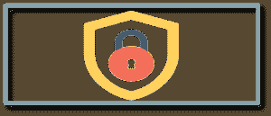
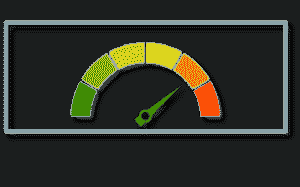
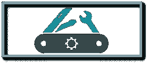
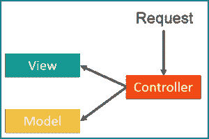
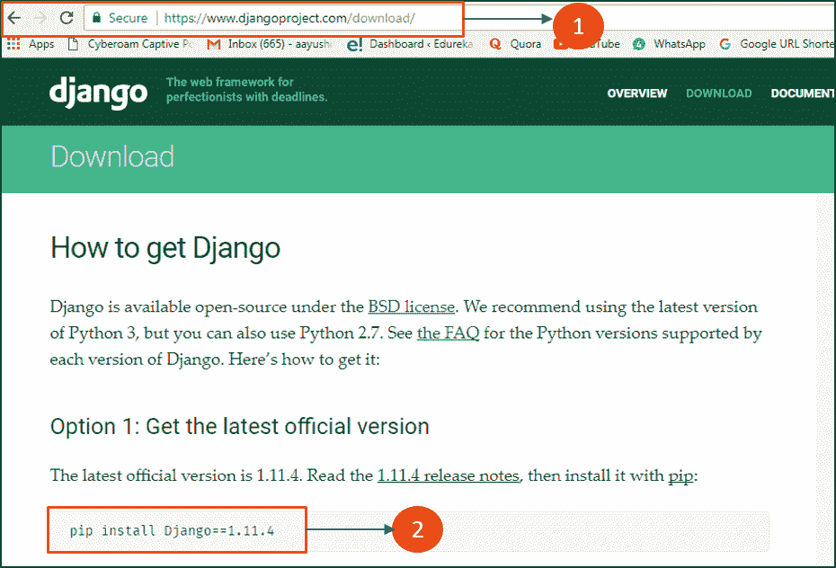
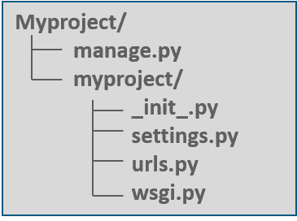
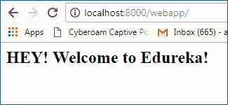

# Django 教程——使用 Python Django 框架进行 Web 开发

> 原文：<https://www.edureka.co/blog/django-tutorial/>

Web 开发是一个充满机会的常青领域。现在你已经登陆了这个博客，你要么是一个网络开发人员，要么渴望成为一个。不管怎样，你都应该知道 ***[Python Django 认证](https://www.edureka.co/python-django)*** 是快速 web 项目开发的高需求技能，被戏称为“有期限的完美主义者的 web 框架”。我将谈论最流行的 web 开发框架之一 Django，并帮助您开始使用它。在本 Django 教程中，我将向您介绍 Django 的基本概念，并帮助您理解在构建 Django 应用程序时所有的东西是如何组合在一起的。所以让我们从这个 Django 教程开始，按照以下顺序理解所有的主题:

*   [为什么是 Web 框架，为什么是 Django？](#whydjango)
*   [Django Python 是什么？](#WhatIsDjango)
*   [如何安装 Django](#howtoinstalldjango)
*   [姜戈](#features)的特点
*   [姜戈建筑](#architecture)
*   [姜戈安装](#installation)
*   [在 Django](#webapp) 构建您的第一个 Web 应用程序

## **Django 教程:为什么是 Web 框架，为什么是 Django？**

在了解 Django 之前，我们先来了解一下为什么我们需要一个 web 框架？web 框架是一个 服务器端应用 框架，旨在支持动态网站的开发。在框架的帮助下，你不必处理 web 开发及其各种组件的麻烦。因此，这使得 web 应用程序开发人员的生活变得更加容易，因为他们不必从头开始编写代码。市场上有各种 web 开发框架。下面列举了其中的一些:

*   [反应 JS](https://www.edureka.co/blog/reactjs-tutorial)
*   [角度](https://www.edureka.co/blog/angular-tutorial/)
*   [Ruby on Rails](https://www.edureka.co/blog/ruby-on-rails-tutorial/)
*   表达

Django 的一大亮点是它是建立在 python 之上的。几年来，python 一直是最流行的编程语言，并继续受到熟练程序员的喜爱。因此，Django 提供了透明和高质量的代码编写，这对开发人员和客户都很重要。它还有其他各种优势，因为它有一个自动管理界面、对象关系映射器(ORM)等等。所以让我们来了解一下到底是什么。

## **Django Python 是什么？**

Django 是一个开源的 web 框架，以坦哥·雷恩哈特 命名。

它遵循“不重复自己”的原则。 顾名思义，这个原则就是保持代码简单和不重复。 Django 也是一位高水平的 MVT 建筑师，代表模型视图模板。

## Django 好学吗？

Django 非常容易学习和上手。你可以在几周内学会 Django，但是要真正精通 Django，你需要时间，你需要建立项目。

## **如何安装 Django？**

在这个 Python Django 教程中，你可以从头开始学习如何安装 Django 和其他概念，这对初学者和专业人士都是理想的。

## Python Django 教程| 3 小时学会 Python Django | Python Web 开发| Edureka


[https://www.youtube.com/embed/HRLIEgwYSHc?rel=0&showinfo=0](https://www.youtube.com/embed/HRLIEgwYSHc?rel=0&showinfo=0)This Edureka Python Django Course video will help you learn Django from scratch with examples. This Python Django Tutorial is ideal for both beginners as well as professionals who want to master the Django Framework.

## **姜戈**的特征

Django 的一些关键特性是:

  * **快** * : Django 快得可笑。It  用干净实用的设计鼓励快速开发。它是免费和开源的，有助于开发者尽快完成他们的应用程序。Django 处理了 Web 开发的许多麻烦，而不需要重新发明轮子。



***吨包** :* Django 包含 组组件，帮助您更快更轻松地开发您的网站。您不需要单独下载它，因为 Django 会安装所有的附加组件、包和相关的依赖项来处理常见的 web 开发任务。它还负责用户认证、内容管理、站点地图等等。



***安全**:*Django非常安全，因为 python web 社区已经做了很多工作。它帮助开发者避免许多常见的安全错误，如 SQL 注入、跨站脚本、csrf 和点击劫持。其用户认证系统提供了一种安全的方式来管理用户帐户和密码。



***可扩展** :* Django 有一套好的默认值Python 把它做得很显式。此外，Instagram 和 Disqus 是两个服务于数百万用户的产品，并使用 Django 作为他们的主要后端。所以我宁愿说它是相当可扩展的。

****

–Django 被用于构建各种各样的东西——从内容管理系统到社交网络，再到科学计算平台。所以 Django 在各个领域都是极其全能的。

## **Django 比 PHP 好吗？**

Django 相对于 PHP 的优势:

*   更好的设计
*   Python 和长期
*   更好的网络框架
*   更简单的语法
*   调试工具

接下来，让我们继续学习 Django 教程，了解 Django 的架构或内部工作方式。

## **姜戈建筑**

Django 遵循 MVC- MVT 架构。

MVC 代表*模型视图控制器*。它用于开发网络出版物，我们将代码分成不同的部分。这里我们有 3 个部分，模型视图和控制器。

  **模型**–模型用于存储和维护您的数据。它是定义数据库的后端。

**视图**–In Django 模板，视图为 html 格式。视图是关于表现的，它根本不知道后端。无论用户看到什么，都被称为视图。

**控制器**–控制器是一个业务逻辑，它将与模型和视图进行交互。

现在我们已经理解了 MVC，让我们学习一下 ***姜戈 MVC 模式*** 。

MVT 代表*模型视图模板*。 在 MVT，有一个预定义的用户界面模板。我们举个例子，说 你想写几个静态的 html 表单像 hello user 1，hello user2 等等。使用 template，您将只有一个打印 hello 和变量名的文件。现在，这个变量将在特定的模板中使用一些 jinja 逻辑进行替换。这就是模板的神奇之处，你不需要把代码再重写 n 遍！

现在你可能想知道控制器在哪里？

在 MVT 的例子中，Django 本身负责控制器部分，它是内置的。

继续学习 Django 教程，让我们了解一下内部的工作原理。

在上图中，模板是你的前端，它将与视图交互，而模型将被用作后端。然后视图将访问模型和模板，并将其映射到一个 url。之后，Django 扮演控制者的角色， 为用户服务。

现在你已经理解了 Django 的架构和内部工作方式，让我们继续学习 Django 教程，并在我们的系统中安装 Django。

## Django 是前端还是后端？

*   都不是，Django 是一个框架，Python 是编写 Django 的语言。
*   对于前端，Django 帮助您选择数据、格式化和显示。它的特点是 URL 管理，模板语言，认证机制。
*   对于后端，Django 附带了一个 ORM，可以让您轻松地操作数据源，还附带了处理用户输入和验证数据和信号的表单，以及一个 observer 模式的实现。

***如何用 Python 启动 Django？***

## **姜戈安装**

让我来指导您在系统上安装 Django 的过程。只需遵循以下步骤:

**第一步**:转到链接:[https://www.djangoproject.com/download/](https://www.djangoproject.com/download/)[](https://www.djangoproject.com/download/)**第二步**:在命令行输入 pip 命令，安装开始。

参考下面的截图，以便更好地理解。



按照上面的步骤，你就完成了 Django 的安装部分。接下来， 该是我们构建自己的 web 应用的时候了。

## **Python 对于 Web 开发来说够用吗？**

Python 确实是应用程序员和 web 开发人员的最爱(感谢 Django ),因为它非常强调可读性和效率。

兴奋？我们开始吧！

**在 Django** 构建你的第一个 Web 应用

为了创建 web 应用程序，首先让我们创建一个项目。要创建一个项目，只需进入您想要共享代码的目录，然后运行下面的命令:

```

django-admin startproject myproject

```

一旦你的项目被创建，你会在项目目录中找到一个文件列表。让我们逐一讨论。

**manage . py**–这是一个命令行实用程序，可以让您以各种方式与这个 Django 项目进行交互。

**【my project/**–它是您的项目的实际 Python 包。它用于导入任何内容，比如——my project . URLs .



**init . py**–Init 只是告诉 python，这将被视为 python 包。

**settings . py**–这个文件管理你的项目的所有设置。

**URLs . py**——这是将它映射到你的网站的主控制器。

wsgi . py-它是兼容 WSGI 的 web 服务器的入口点。

请注意，要创建您的应用程序，请确保您与 manage.py 在同一个目录中，然后键入以下命令:

```

python manage.py startapp webapp

```

现在，如果我们看一下“webapp”目录，我们会发现一些来自原始 myproject 的额外内容。它包括与后端数据库相关的模型、测试。

接下来，在 Django 教程中，您需要在项目设置中手动导入您的应用程序。为此，打开您的 myproject/settings.py 并手动添加您的应用:

```
INSTALLED_APPS = (
    'webapp',
    'django.contrib.admin',
    'django.contrib.auth',
    'django.contrib.contenttypes',
    'django.contrib.sessions',
    'django.contrib.messages',
    'django.contrib.staticfiles',
)

```

安装好你的应用程序后，现在让我们创建一个视图。打开你的 webapp/views.py，把下面的代码放进去:

```
from django.shortcuts import render
from django.http import HttpResponse

def index(request):
    return  HttpResponse("

&amp;lt;H2&amp;gt;HEY! Welcome to Edureka! &amp;lt;/H2&amp;gt;

")

```

在上面的代码中，我创建了一个返回 httpResponse 的视图。现在我们需要将这个视图映射到一个 URL。我们的应用程序中需要一个 URLconf。因此，让我们在 webapp 中创建一个新的 python 文件“urls.py”。在 webapp/urls.py 中包含以下代码:

```
from django.conf.urls import url
from . import views
urlpatterns = [
 url(r'^$', views.index, name='index'),
]

```

在上面的代码中，我引用了一个将返回 index(在 views.py 文件中定义)的视图。url 模式采用正则表达式格式，其中^代表字符串的开头，$代表字符串的结尾。

下一步是将根 URLconf 指向 webapp.urls 模块。打开 myproject/urls.py 文件，编写下面的代码:

```
from django.conf.urls import include, url
from django.contrib import admin

urlpatterns = [
    url(r'^admin/', include(admin.site.urls)),
    url(r'^webapp/', include('webapp.urls')),
]

```

在上面的代码中，我已经添加了我的 webapp 并包含了 webapp.urls，现在不要忘记导入 django.conf.urls.include 并在 urlpatterns 列表中插入一个 include()。include()函数允许引用其他 URLconfs。

请注意，正则表达式没有' $ '而是有一个尾随斜杠，这意味着每当 Django 遇到 include()时，它就砍掉 URL 中与该点匹配的部分，并将剩余的字符串发送给 include URLconf 进行进一步处理。

我们现在已经完成了编码部分！现在让我们启动服务器，看看会发生什么。要启动服务器，请键入以下命令:

```

python manage.py runserver

```

运行服务器后，在你的浏览器中进入**http://localhost:8000/web app/**，你应该会看到文字“*嘿！欢迎来到 Edureka！*，这是您在索引视图中定义的。



*万岁*！我们已经成功地创建了一个基本的 Web 应用程序。

## **2020 年的 Django 值得学习吗？**

*   Django 绝对值得学习，尤其是如果你没有编程经验的话。这是最流行的 Python 框架之一。
*   至于 Django 的其他优势，该框架提供了许多构建常规应用的基本工具。

## **。Django 适合初学者吗？**

Django 是一个网络框架，它可以处理你所有的数据，而且处理得比任何网络框架都好。Django 是 Python 的第一个 Web 框架，这是有原因的:它对初学者来说足够简单，但对专业人士来说又足够强大。

我希望你喜欢阅读这篇 Django 教程。我们已经介绍了 Django 的所有基础知识，所以您现在可以开始练习了。在这篇 Django 教程之后，我将在 Django 上发表更多关于 web 应用程序开发、REST 框架、Django 模型和更多内容的博客。请继续关注我这个系列的下一篇博客！

*既然你已经了解了 Django 的基础知识，那就来看看 Edureka 的 [**Python Django 培训**](https://www.edureka.co/python-django)* *。Edureka 的 Django 课程帮助您获得 Django REST 框架、Django 模型、Django AJAX、Django jQuery 等方面的专业知识。您将在处理实时用例的同时掌握 Django web 框架，并在课程结束时获得 Django 认证。*

*有问题吗？请在这个“Django 教程”博客的评论部分提到它，我们会尽快回复你。*