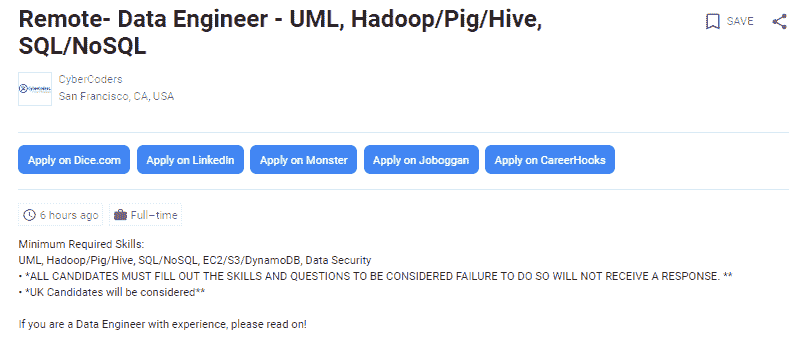

# 学 Hadoop 需要 Java 吗？

> 原文：<https://www.edureka.co/blog/do-you-need-java-to-learn-hadoop>

说到学习 Hadoop，这是每个&每个学习者都会想到的一个非常常见的问题，即“ ***我需要 Java 来学习 Hadoop*** ”。这个博客将帮助你澄清所有的疑问。

## **学 Hadoop 需要 Java 吗？**

这个问题的简单答案是——**不**，Java 的知识并不是学习 Hadoop 的强制。

你可能知道 Hadoop 是用 Java 编写的，但是，相反，我想告诉你，Hadoop 生态系统是为了迎合来自不同背景的不同专业人士而设计的。

谈论来自非编程背景的专业人士 Hadoop 生态系统提供了各种工具，他们可以利用这些工具来处理存储在 Hadoop 中的大数据。没有 Java 知识，你会轻松拿到[大数据认证](https://www.edureka.co/blog/top-big-data-certifications)。

两个重要的 Hadoop 组件证明了一个事实，即你可以在没有 Java 功能知识的情况下使用 Hadoop——**猪**和**蜂房**。

Pig 是用于并行计算的高级数据流语言和执行框架，而 Hive 是提供数据汇总和即席查询的数据仓库基础设施。Pig 被研究人员和程序员广泛使用，而 Hive 则是数据分析师的最爱。

一个有趣的事实:

**10 行猪=约。200 行 Java 代码。**查看 ***<u>[本博客](https://www.edureka.co/blog/pig-tutorial/)</u>*** 为一只猪演示。

因此，无需编写复杂的 Java 代码，您可以使用 Pig 轻松实现相同的实现。再次谈到 SQL，它被脸书的工程师和分析师广泛使用，因此，脸书开发了 Hive，在 Hadoop 的基础上提供类似 SQL 的查询。

*这些语言简单易学，80%以上的 Hadoop 项目都围绕它们展开。*

## **如何与 Hadoop 乔布斯结盟**

**为了在没有 Java 作为先决条件的情况下探索与 Hadoop 相关的工作角色，你需要让自己适应 Hadoop 的两个关键方面**；**储存**和**加工**。对于围绕 Hadoop 存储的工作，您可以了解 Hadoop 集群如何工作，以及 Hadoop 如何使其数据安全稳定。为此，了解 Hadoop 分布式文件系统( **HDFS** )和 **HBase** ，即 Hadoop 的分布式 NoSQL 数据库的各种细微差别将会有很大帮助。

如果您选择在 Hadoop 的处理端工作，您可以使用 Pig 和 Hive，它们会自动将您的代码转换到后端，以便与基于 Java 的 MapReduce 集群编程模型一起工作。

因此，即使不运行 MapReduce，您仍然可以控制项目的整个生命周期。只要你精通 Pig 和 Hive，以及 HDFS 和 HBase，Java 就可以退居二线。  从 [数据工程课程](https://www.edureka.co/microsoft-azure-data-engineering-certification-course) 中了解大数据及其应用。

我希望这张图片能证明我的观点。

*edu reka 的大数据和 Hadoop 培训课程旨在增强您的知识和技能，使您成为一名成功的 Hadoop 开发人员。点击 <u>[大数据课程](https://www.edureka.co/big-data-and-hadoop)</u> 了解更多。*

## **对 Java 编码的罕见要求**

但是，**如果希望给 Pig、Hive 等工具添加自定义函数，就需要 Java 编码了。**仅当您希望创建自定义输入/输出格式时，这才是必需的。我们很高兴地通知您，这种要求很少见。

另一个可能需要基本 Java 编码的罕见场景是调试。在 Hadoop 程序崩溃的罕见情况下，您可能需要使用 Java 调试程序。

还不相信不懂 Java 就能学会 Hadoop？观看下面的网络研讨会，了解 Hadoop 对于一个没有编程背景的人来说是如何相关的！你甚至可以通过 [Azure 新加坡数据工程培训](https://www.edureka.co/microsoft-azure-data-engineering-certification-course-singapore) 了解大数据的细节。

[//www.youtube.com/embed/qwa66igX9uk](//www.youtube.com/embed/qwa66igX9uk)

*Edureka 是一个全球性的电子学习平台，提供趋势技术方面的实时讲师指导培训。他们提供由在线资源支持的短期课程，以及 24×7 终身支持。Edureka 坚定不移地致力于帮助工作专业人士跟上不断变化的技术，并迎合学术机构无法跟上不断变化的需求。Edureka 目前在 100 多个国家拥有学习社区，其愿景是让全球数百万学习者能够轻松、有趣、负担得起地学习。*

**相关帖子:**

[大数据和 Hadoop 入门](https://www.edureka.co/blog/big-data-tutorial)

[Hadoop 生态系统的不同组件](https://www.edureka.co/blog/hadoop-ecosystem)

[学习 Hadoop 的十大理由](https://www.edureka.co/blog/10-reasons-to-learn-hadoop/)