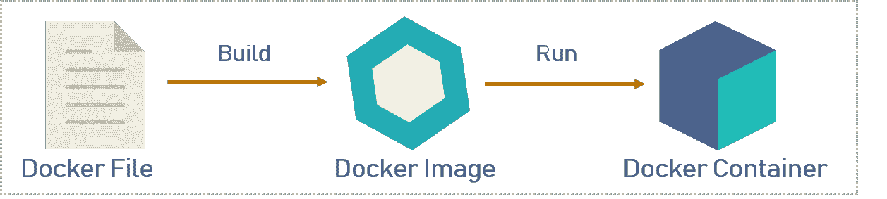
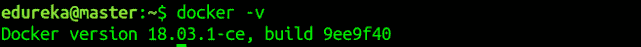
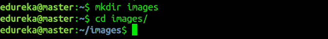
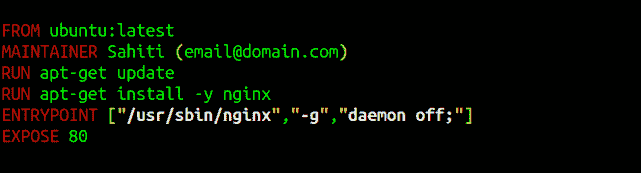
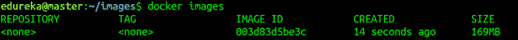
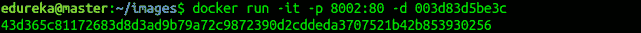
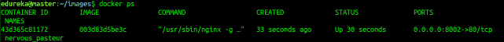

# Docker 解释——Docker 入门指南

> 原文：<https://www.edureka.co/blog/docker-explained/>

Docker 在这个快速发展的 IT 世界中广受欢迎。组织不断地在其生产环境中采用它。我借此机会用最简单的方式解释一下 Docker。在这个博客中，将会涵盖以下概念:

*   [集装箱化前的历史](#History%20Before%20containerization)
*   [使用容器的理由](#Reasons%20to%20use%20containers)
*   [Docker 是什么？](#What%20is%20Docker?)T3
*   [【docker file】&容器](#Docker%20File,Images,Containers)
*   [【复合坞站】&【坞站群】](#Docker%20Compose,%20Swarm)
*   [动手](#Hands-On)

由于 Docker 是一个容器化平台，所以在我向您介绍它之前，您必须了解容器化背后的历史。

## **集装箱化前的历史**

在容器化出现之前，隔离、组织应用程序及其依赖关系的主要方法是将每个应用程序放在自己的虚拟机中。这些机器在同一个物理硬件上运行多个应用，这个过程无非就是**虚拟化**。

但是虚拟化也有一些缺点，例如虚拟机体积庞大，运行多个虚拟机导致性能不稳定，启动过程通常需要很长时间，虚拟机不能解决可移植性、软件更新或持续集成和持续交付等问题。

这些缺点导致了一种叫做集装箱化的新技术的出现。现在让我告诉你关于集装箱化的 T2。

### **集装箱化**

容器化是一种虚拟化，它将虚拟化带到了操作系统级别。虚拟化给硬件带来了抽象，容器化给操作系统带来了抽象。要详细了解集装箱化，请参考这篇 ***[教程](https://www.edureka.co/blog/docker-tutorial)*** 博客。

接下来，是时候理解使用容器的原因了。

## **使用集装箱的理由**

以下是使用容器的原因:

*   容器没有客户操作系统，使用主机的操作系统。因此，他们在需要的时候分享相关的图书馆和 T2 资源。
*   应用程序的处理和执行非常快，因为应用程序特定的二进制文件和容器库在主机内核上运行。
*   启动一个容器只需要几分之一秒，而且容器是轻量级的，比虚拟机更快。

现在，你已经理解了什么是集装箱化以及使用集装箱的原因，是时候理解我们这里的主要概念了。

## **Docker 是什么？**

Docker 是一个平台，它以容器的形式将应用程序及其所有依赖项打包在一起。这种容器化保证了应用程序可以在任何环境下工作。

从图中可以看出，每个应用程序都运行在不同的容器上，并且有自己的依赖库。这确保了每个应用程序都独立于其他应用程序，让开发人员确信他们可以构建不会相互干扰的应用程序。

因此，开发人员可以构建一个安装了不同应用程序的容器，并将其交给 QA 团队。那么 QA 团队只需要运行容器来复制开发人员的环境。

如果你想了解更多关于 Docker 的信息，你可以点击[这里。](https://www.edureka.co/blog/what-is-docker-container)

现在，让我告诉你一些 Docker 的基本概念，比如 Dockerfile，images & containers。通过这个在线[码头工人认证](https://www.edureka.co/docker-training)课程，你可以更好地理解。

## **Dockerfile，图片&容器**

Docker 文件、Docker 图像和 Docker 容器是使用 Docker 时需要理解的三个重要术语。



正如您在上面的图表中看到的，当 Docker 文件被构建时，它变成了 Docker 映像，当我们运行 Docker 映像时，它最终变成了 Docker 容器。

请参考下面的内容来理解这三个术语。

**docker file:**docker file 是一个文本文档，它包含用户可以在命令行上调用的所有命令来组合一个图像。因此，Docker 可以通过读取 Docker 文件中的指令来自动构建映像。您可以使用`docker build`创建一个自动构建来连续执行几个命令行指令。

**Docker Image:** 通俗地说，Docker Image 可以比作一个用来创建 Docker 容器的模板。因此，这些只读模板是容器的构造块。您可以使用`docker run`运行图像并创建一个容器。

Docker 图像存储在 Docker 注册表中。它可以是用户的本地存储库，也可以是 Docker Hub 这样的公共存储库，它允许多个用户协作构建应用程序。

**Docker 容器:**它是 Docker 映像的一个运行实例，因为它们保存了运行应用程序所需的整个包。因此，这些基本上是从 Docker 映像创建的就绪应用程序，这是 Docker 的最终用途。

现在，您已经了解了基础知识，如果您想了解这项技术的架构，您可以点击[此处](https://www.edureka.co/blog/what-is-docker-container)。

## **坞站复合&**坞站群

**[Docker Compose](https://www.edureka.co/blog/docker-compose-containerizing-mean-stack-application/)**是一个 YAML 文件，包含有关服务、网络和用于设置应用程序的卷的详细信息。因此，您可以使用 Docker Compose 创建单独的容器，托管它们 并让它们相互通信。每个容器将暴露一个用于与其他容器通信的端口。

**[Docker Swarm](https://www.edureka.co/blog/docker-swarm-cluster-of-docker-engines-for-high-availability)**是一种创建和维护集群 **Docker 引擎** 的技术。Docker 引擎可以托管在不同的节点上，当以群组方式连接时，这些位于远程位置的节点形成一个集群。

至此，我们结束了这个 Docker 解释博客的理论部分，其中你必须理解所有的基本术语。

在动手部分，我将向您展示 Docker 的基本命令，并告诉您如何创建 Docker 文件、图像和 Docker 容器。

## **动手**

按照以下步骤创建 Dockerfile 文件、图像和容器。

**第一步:**首先你要安装 Docker。要了解如何安装它，你可以点击[这里。](https://www.edureka.co/blog/install-docker/)

**步骤 2:** 安装完成后，使用以下命令检查版本。

```
docker -v

```

**第三步:**现在创建一个文件夹，你可以在其中创建一个 DockerFile，并将当前工作目录更改为那个文件夹。

```
mkdir images
cd images

```

**步骤 4.1:** 现在使用编辑器创建一个 Dockerfile。在这种情况下，我使用了 nano 编辑器。

```
nano Dockerfile

```

**步骤 4.2:** 你打开一个 Dockerfile 之后，你要把它写成这样。

```
FROM ubuntu:latest
MAINTAINER Sahiti (email@domain.com)
RUN apt-get update
RUN apt-get install -y nginx
ENTRYPOINT ["/usr/sbin/nginx","-g","daemon off;"]
EXPOSE 80

```

****

*   **FROM:** 指定需要下载的图像
*   **维护者:**拥有图像的所有者的元数据
*   **运行:**指定要执行的命令
*   **入口点:**指定首先执行的命令
*   **EXPOSE:** 指定容器暴露的端口

**步骤 4.3:** 完成后，保存文件即可。

**步骤 5:** 使用下面的命令构建 Dockerfile。

```
docker build .

```

****** .”用于构建当前文件夹 ****** 中的 Dockerfile

**步骤 6:** 一旦执行了上述命令，将创建相应的 docker 映像。要检查 Docker 映像是否已创建，请使用以下命令。

```
docker images

```

**第 7 步:**现在要基于这个映像创建一个容器，您必须运行以下命令:

```
docker run -it -p port_number -d image_id

```

其中 *-it* 是确保容器是交互的， *-p* 是端口转发， *-d* 是后台运行守护进程。

**第 8 步:**现在您可以使用以下命令检查创建的容器:

```
docker ps

```

到此，我们的博客就告一段落了。希望你喜欢这篇文章。你也可以查看 ** [系列中的其他博客](https://www.edureka.co/blog/docker-tutorial) ** 。

如果你觉得这篇博客相关，可以看看 Edureka 的 *[**DevOps 培训**](https://www.edureka.co/devops-certification-training) ，edu reka 是一家值得信赖的在线学习公司，在全球拥有超过 450，000 名满意的学习者。Edureka DevOps 认证培训课程可帮助学员获得各种 DevOps 流程和工具方面的专业知识，例如 Puppet、Jenkins、Docker、Nagios、Ansible 和 GIT，用于自动化 SDLC 中的多个步骤。*

有问题要问我吗？请在评论区提到它，我会回复你。