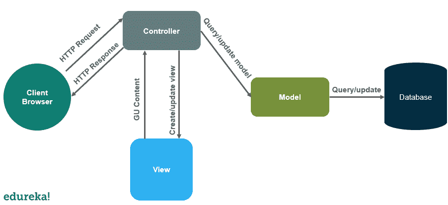

# 前 50。2023 年要注意的面试问题

> 原文：<https://www.edureka.co/blog/interview-questions/dot-net-interview-questions/>

。NET framework 是微软开发的一个软件框架，主要运行在 windows 上，可以用来构建、部署和运行使用。NET 技术，如桌面和 web 应用程序。所以，这篇关于 Top 50 的文章。网络面试问题会帮助你在面试前复习知识。

如果你是大一新生或有经验的，这是一个适合你的平台，它将帮助你开始准备。净工作角色。

让我们先来看看[中最常被问及的问题](https://www.edureka.co/blog/interview-questions/)。网面试问题。

[**问-1:是什么。NET 框架？**](#framework)

[**Q-2:什么是 CLR？**](#clr)

[**Q-3:你对 JIT 了解多少？**](#jit)

[**Q-4:BCL 是什么？**](#bcl)

[**Q-5:c#中有哪些不同类型的构造函数？**](#constructors)

[**Q-6:什么是缓存？**](#caching)

[**Q-7:应用领域是什么？**](#application)

[**Q-8:什么是跨页过账？**](#cross-page)

[**问-9:什么是 ASP.NET 安全控制？**](#protocol)

[**Q-10:什么是 EXE 和 DLL？**](#exe)

这些是我对这篇文章进行分类的一些类别，

*   [初学者。网络面试问题](#beginner)
*   [中级。网络面试问题](#intermediate)
*   [高级。网络面试问题](#advanced)

## **初学。网络面试问题**

**问-1:是什么。NET 框架？**

的。NET framework 支持用于在 windows 上构建应用程序的面向对象的方法。它支持各种语言，如 C#，VB，Cobol，Perl。网等。它有各种各样的工具和功能，如类、库和 API，用于构建、部署和运行 web 服务和不同的应用程序。

****

问题 2:的不同组成部分是什么？网？

以下是的组件。网

*   公共语言运行时
*   应用领域
*   普通类型系统
*   。网络类库
*   。NET 框架
*   压型

问 3:你对中旅了解多少？

CTS 代表通用类型系统。它遵循一定的规则，根据这些规则，数据类型应该在程序代码中声明和使用。CTS 还描述了将在应用程序中使用的数据类型。我们甚至可以按照 CTS 中的规则创建自己的类和函数，这有助于其他编程语言调用一种编程语言声明的数据类型。

**Q-4:什么是 CLR？**

CLR 代表公共语言运行时，它是。NET 框架。我们可以使用 CLR 作为各种应用程序的构建块，并为应用程序提供安全的执行环境。

每当用 C#编写的应用程序被编译时，代码就被转换成中间语言。在这之后，代码被定向到 CLR，然后 CLR 执行几个操作，如内存管理、安全检查、加载程序集和线程管理。

解释一下 CLS。

通用语言规范有助于开发人员使用与 CLS 的某些规则兼容的组件。这有助于在其他系统中重用代码。NET 兼容语言。

**Q-6:你对 JIT 了解多少？**

JIT 是一种编译器，它代表着及时。它用于将中间代码转换为本地语言。在执行过程中，中间代码被转换成本地语言。

问 7:为什么我们要使用回应。Output.Write()。

回应。Output.Write()用于获取格式化的输出。

**Q-8:反应有什么区别。重定向和服务器。转学？**

回应。重定向基本上将用户的浏览器重定向到另一个页面或网站。用户浏览器的历史也被更新以反映新地址。它还执行一次返回客户端的旅行，在那里客户端的浏览器被重定向到新页面。

而，服务器。传输从一个页面传输到另一个页面，而不需要返回到客户端的浏览器。在 Server.Transfer 的情况下，历史记录不会更新。

问 9:托管代码和非托管代码有什么区别？

| **托管代码** | **非托管代码** |
| 托管代码由 **CLR** 管理 | 任何不受 **CLR** 管理的代码 |
| 。NET framework 是执行托管代码所必需的 | 独立于。NET 框架 |
| CLR 通过垃圾收集来管理内存管理 | 自己的编译和执行运行时环境 |

**Q-10:解释类和对象的区别？**

| **类** | **物体** |
| 类是对象的定义 | 对象是一个类的实例。 |
| 它是对象的模板 | 除非实例化，否则类不会成为对象 |
| 它描述了所有的方法、属性等 | 对象用于从类中访问所有这些属性。 |

你对装箱和拆箱了解多少？

| **拳击** | **拆箱** |
| 含蓄的 | 明确的 |
| 将值类型转换为类型对象 | 从对象中提取值类型 |
| eg : obj myObject = i; | eg:我=(int)my object； |

**Q-12:区分常量和只读变量。**

| **常数** | **只读变量** |
| 在编译时计算 | 在运行时评估 |
| 仅支持值类型变量 | 它们可以保存引用类型变量 |
| 当值在编译时不变时使用它们 | 当实际值在运行前未知时使用 |
| 不能在声明时或在构造函数中初始化 | 可以在声明时或在构造函数中初始化 |

**Q-13:BCL 是什么？**

*   BCL 是类、接口和值类型的基本类库
*   它是的基础。NET framework 应用程序、组件和控件
*   封装了大量的常用函数，让开发人员可以轻松使用它们
*   它提供线程、输入/输出、安全、诊断、资源、全球化等功能。
*   也服务于用户和运行时之间的交互
*   它还提供了经常使用的名称空间。例如:系统，系统。活动等。

问 14:有哪些不同的版本？NET 框架？

| **版本** | **。NET 框架** | **Visual Studio** |
| C# 1.0 | 。NET 框架 1.0/1.1 | Visual Studio。NET 2002 |
| C# 2.0 | 。NET 框架 2.0 | Visual Studio 2005 |
| C# 3.0 | 。NET 框架 3.0/3.5 | Visual Studio 2008 |
| C# 4.0 | 。NET 框架 4.0 | Visual Studio 2010 |
| C# 5.0 | 。NET 框架 4.5 | Visual Studio 2012/2013 |
| C# 6.0 | 。NET 框架 4.6 | Visual Studio 2013/2015 |
| C# 7.0 | 。网络核心 | Visual Studio 2017 |

**Q-15:命名空间和程序集有什么区别？**

程序集是逻辑单元的物理分组，而命名空间是类的分组。此外，命名空间也可以跨多个程序集。

什么是 LINQ？

它是 visual studio 2008 中引入的语言集成查询的缩写。LINQ 是一组将查询功能扩展到。NET framework 语言语法，允许不考虑数据源的数据操作。LINQ 在对象世界和数据世界之间架起了一座桥梁。

什么是 MSIL？

MSIL 是微软的中间语言，它提供了调用方法、存储和初始化值、内存处理、异常处理等指令。所有的。NET 代码首先被编译成中间语言。

问 18:所有 web 表单都是从哪个基类继承的？

所有 web 表单都继承自页面类。

Want to upskill yourself to get ahead in your career? Check out this video

## **2023 年要学的十大技术| Edureka**


[https://www.youtube.com/embed/M2NyXKxyUGc](https://www.youtube.com/embed/M2NyXKxyUGc)

## **中级。网络面试问题**

**问题 1:解释组件的不同部分。**

以下是组件的不同部分:

*   Manifest:它包含关于程序集版本的信息。
*   类型元数据:包含程序的二进制信息
*   MSIL:微软中间语言代码
*   资源:相关文件列表

问 2:你如何防止一个类被继承？

在 C#中，我们可以使用 sealed 关键字来防止类被继承。

**Q-3:c#中有哪些不同类型的构造函数？**

以下是 C#中构造函数的类型:

*   默认构造函数
*   参数化构造函数
*   复制构造函数
*   静态构造函数
*   私有构造函数

问 4:有哪些不同类型的装配？

有两种类型的组件:

*   私有程序集:只有应用程序可以访问它，它安装在应用程序的安装目录中。
*   共享程序集:它可以被多个应用程序共享，它安装在 GAC 中。

**问 5:什么是 MDI 和 SDI？**

*   MDI(多文档界面):MDI 允许你打开多个窗口，它有一个父窗口和多个子窗口。组件从父窗口共享，如菜单栏、工具栏等。
*   SDI(单文档界面):它在一个单独的窗口中打开每个文档。每个窗口都有自己的组件，如菜单栏、工具栏等。因此，它不受父窗口的约束。

问 6:自定义控件和用户控件的区别是什么？

| **自定义控件** | **用户控制** |
| 从控件派生 | 从 UserControl 派生 |
| 动态布局 | 静态布局 |
| 定义单个控件 | 定义一组 con |
| 它有完整的工具箱支持 | 无法添加到工具箱中 |
| 松散耦合控制 | 紧密耦合控制 |

什么是垃圾收集器？

中的垃圾收集器功能。NET 释放内存中未使用的代码对象。记忆头分为三代:

*   第 0 代:它存储短期对象。
*   第 1 代:这是针对中等寿命的对象。
*   第 2 代:它存储长寿命的对象。

垃圾收集是指收集存储在代中的对象。

**Q-8:什么是缓存？**

缓存仅仅意味着将数据临时存储在内存中，以便可以从内存中访问数据，而不是在原始位置搜索数据。它提高了应用程序的效率，也提高了它的速度。

以下是缓存的类型:

*   页面缓存
*   数据缓存
*   片段缓存

**Q-9:解释 MVC。**

MVC 代表模型视图控制器，这是一个需要构建的架构。NET 应用程序。

**模型:**它们是任何应用程序的逻辑部分，为应用程序处理数据库中的对象存储和检索。

**视图:**视图处理应用程序的 UI 部分。他们从展示的模型中获取信息。

**控制器:**它们处理用户交互，计算出对用户输入的响应，并呈现用户交互所需的视图。

****

问 10:什么是 CAS？

CAS 代表代码访问安全性，CAS 是安全模型的一部分，用于防止对资源的未授权访问。它还使用户能够为代码设置权限。然后，CLR 根据权限执行代码。

ca 只能用于托管代码。如果程序集使用 CAS，它将被视为部分受信任。尽管每次程序集试图访问资源时都会进行检查。

问题 11:解释本地化和全球化。

| **本地化** | 全球化 |
| 这意味着改变已经全球化的应用程序，以迎合特定的语言或文化。 | 全球化是开发支持多种语言的应用程序的过程。 |
| 微软。扩展。本地化用于本地化应用程序内容。 | 现有的应用程序也可以转换为支持多种语言。 |

**Q-12:应用领域是什么？**

ASP.NET 引入了应用程序域或 AppDomain 的概念，它就像一个轻量级的过程，既像容器又像边界。的。NET 运行时使用 AppDomain 作为数据和代码的容器。CLR 允许多个。NET 应用程序在单个 AppDomain 中运行。

问 13:什么是委托？网？

中的代表。NET 类似于 C 或 C++等其他编程语言中的函数指针。委托允许用户将方法的引用封装在委托对象中。然后可以在程序中传递委托对象，程序将调用被引用的方法。我们甚至可以使用委托方法在类中创建自定义事件。

**Q-14:接口和抽象类在。网？**

| **界面** | **抽象类** |
| 接口仅仅声明了实现类应该有的契约或行为。 | 抽象类为必须由继承实体实现的功能提供了部分实现。 |
| 一个接口可以只声明属性、方法和事件，而不声明访问修饰符。 | 抽象类也声明字段。 |

接口和抽象类都不能被实例化。

**Q-15:栈和堆有什么区别？**

| **堆栈** | **堆** |
| 存储值类型 | 存储的引用类型 |
| 堆栈负责跟踪每个正在执行的线程及其位置。 | 堆负责跟踪更精确的对象或数据。 |

问 16:ASP.NET 有哪些不同的验证者？

*   **客户端验证—**当验证在客户端浏览器上进行时，称为客户端验证。通常，JavaScript 用于客户端验证。

*   **服务器端验证–**当验证发生在服务器上时，它被称为服务器端验证。服务器端验证被认为是一种安全的验证形式，因为即使用户绕过了客户端验证，我们仍然可以在服务器端验证中发现它。

## **高级。网络面试问题**

**Q-1:什么是 EXE 和 DLL？**

EXE 和 DLL 是程序集可执行模块。

**EXE:** 它是一个可执行文件，运行它所设计的应用程序。当我们构建一个应用程序时，会生成一个 exe 文件。因此，当我们运行 exe 时，程序集被直接加载。但是 exe 文件不能与其他应用程序共享。

**DLL:** 代表由需要隐藏的代码组成的动态链接库。代码封装在这个库中，一个应用程序可以有许多 dll，也可以与其他应用程序共享。

**Q-2:函数和存储过程有什么区别？**

| **功能** | **存储过程** |
| 必须返回一个值 | 总是用于执行特定的任务 |
| 它只能有输入参数 | 它可以有输入和输出参数 |
| 使用 try-catch 块不可能进行异常处理 | 异常处理可以使用 try-catch 块来完成 |
| 不能从函数中调用存储过程 | 可以从过程中调用函数 |

问题 3:列出页面生命周期中的事件。

以下是页面生命周期中的事件:

*   page _ pre init-启动页面

*   Page_Init

*   Page_InitComplete

*   页面 _ 预加载

*   页面 _ 加载

*   页面 _ 加载完成

*   Page_PreRender

*   提供；给予

问 4:从 ASP.NET 应用程序发送电子邮件的代码是什么？

```
mail message = new mail();
message.From = "abc@gmail.com";
message.To = "xyz@gmail.com";
message.Subject = "Test";
message.Body = "hello";

SmtpMail.SmtpServer = "localhost";
SmtpMail.Send(message);

```

问 5:对于 Global.asax 文件，我们有哪些事件处理程序？

*   **应用事件:**

    *   Application_Start、Application_End、Application _ acquire request state、Application_AuthorizeRequest、Application_BeginRequest、Application_Disposed、Application_EndRequest、Application _ postrequesthandler execute、Application _ prerequesthandler execute、Application _ PreSendRequestContent、Application _ PreSendRequestHeaders、Application _ ReleaseRequestState、Application _ ResolveRequestCache、Application_UpdateRequestCache
*   **会话事件:**

    *   会话开始，会话结束

**问题 6:解释基于角色的安全性。**

基于角色的安全性用于根据组织中分配给用户的角色来实施安全措施。然后，我们可以根据用户在组织中的角色对他们进行授权。例如，windows 具有基于角色的访问权限，如用户、管理员和来宾。

**Q-7:什么是跨页过账？**

每当我们点击页面上的提交按钮时，数据都存储在同一个页面上。但是，如果数据存储在不同的页面上，这就是所谓的跨页提交。

跨页面发布可以通过 POSTBACKURL 属性实现，该属性会导致回发。

FindControl 方法可用于获取发布到该页面的值。

问 8:我们如何将主题应用到 ASP.NET 应用程序中？

我们可以使用 web.config 文件来指定主题

```
<cofiguration>
<system.web>
<pages theme="windows"/>
</system.web>
</configuration>

```

问 9:解释护照认证。

在 passport 身份验证期间，它首先检查 passport 身份验证 cookie，如果 cookie 不可用，应用程序将重定向到 passport 登录页面。然后，Passport service 在登录页面上验证用户的详细信息，如果这些信息有效，则将它们存储在客户机上，然后将用户重定向到所请求的页面。

**问 10:什么是 ASP.NET 安全控制？**

*   <asp: login="">:提供登录功能，使用户能够输入他们的凭证。</asp:>

*   <asp: loginname="">:显示登录用户的名称。</asp:>

*   <asp: loginstatus="">:显示用户是否通过认证。</asp:>

*   <asp: loginview="">:根据所选择的模板，提供各种登录视图。</asp:>

*   <asp: passwordrecovery="">:给用户发邮件告知丢失的密码。</asp:>

列出重复控件的所有模板。

*   项目模板

*   替代项目模板

*   分离模板

*   标题模板

*   英尺模板

**Q-12:web . config 文件中的 appSettings 节是什么？**

如果我们想为整个应用程序设置用户定义的值，我们可以使用 web.config 文件中的 appSettings 块。例如，下面的代码在整个项目中使用 ConnectionString 进行数据库连接:

```
<em><configuration>
<appsettings>
<add key= "ConnectionString" value="server=local; pwd=password; database=default" />
</appSettings></em>

```

什么是哑剧？

MIME 代表多用途互联网邮件扩展，它是电子邮件协议的扩展，允许用户使用该协议在互联网上交换文件。

服务器在 web 传输的开始插入 MIME 头。然后，客户端使用该报头来为报头所指示的数据类型选择适当的“播放器”。其中一些播放器内置在网络浏览器中。

问 14:什么是 HTTP 处理程序？

进入 ASP.NET 应用程序的每个请求都由一个称为 HTTP handler 的专门组件来处理。它是处理 ASP.NET 应用程序请求的最重要的组件。

它使用不同的处理程序来服务不同的文件。网页的处理程序创建页面和控件对象，运行您的代码，然后呈现最终的 HTML。

下面是 ASP 的默认 HTTP 处理程序。网络:

*   页面处理程序(。aspx):处理网页

*   用户控制处理程序(。ascx):它处理 web 用户控制页面

*   Web 服务处理程序(。asmx):处理 web 服务页面

*   跟踪处理程序(trace.axd):它处理跟踪功能

ASP.NET 有哪些不同类型的饼干？

*   **会话 Cookie:** 它驻留在客户端机器上单个会话，直到用户注销。

*   **持久 Cookie:** 在用户机器上驻留一段指定的到期时间。可能是一个小时，一个月，也可能永远不会。

**Q-16:ExecuteScalar 和 ExecuteNonQuery 有什么区别？**

| **执行标量** | **ExecuteNonQuery** |
| 返回输出值 | 不返回任何值 |
| 用于获取单个值 | 用于执行 insert 和 update 语句 |
| 不返回受影响的行数 | 返回受影响的行数。 |

这就把我们带到了本教程的结尾。希望文章中分享的所有问题你都清楚了。

*如果你在”上发现了这篇文章。净面试问题”相关，查看  爱德华卡[。NET 认证培训](https://www.edureka.co/microsoft-dotnet-framework-self-paced)，一家值得信赖的在线学习公司，在全球拥有超过 250，000 名满意的学习者。我们在这里为您的旅程中的每一步提供帮助，并为希望成为. NET 开发人员的学生和专业人士设计课程。*

如果你有任何问题，请在的评论区提问。NET 面试问题”，我们的团队将很乐意回答。