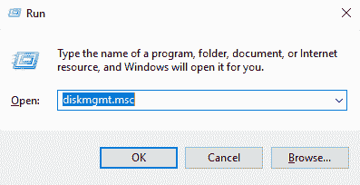
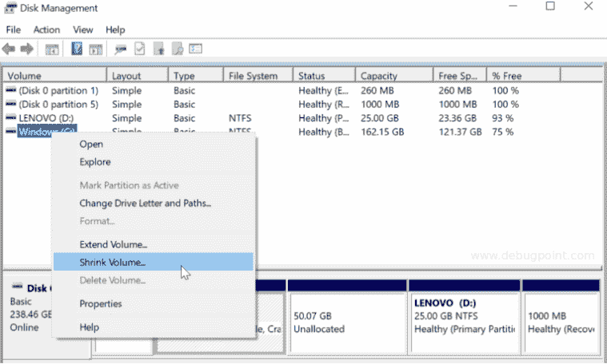
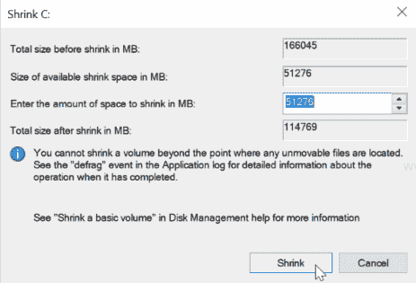
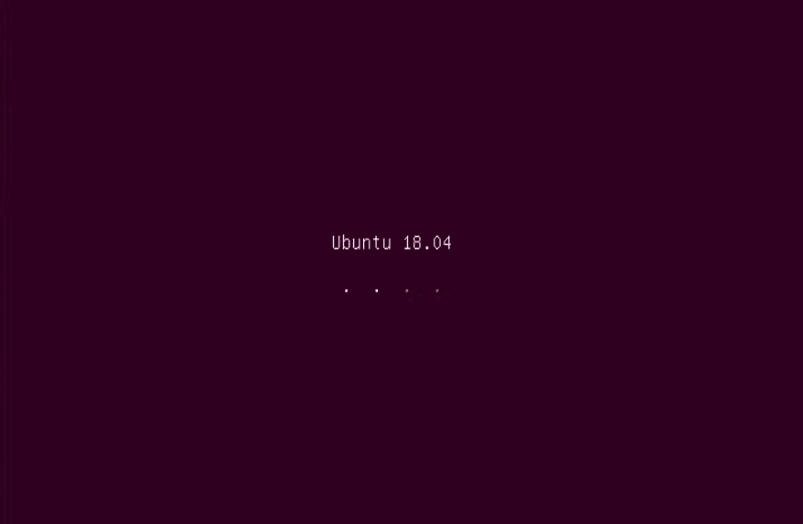
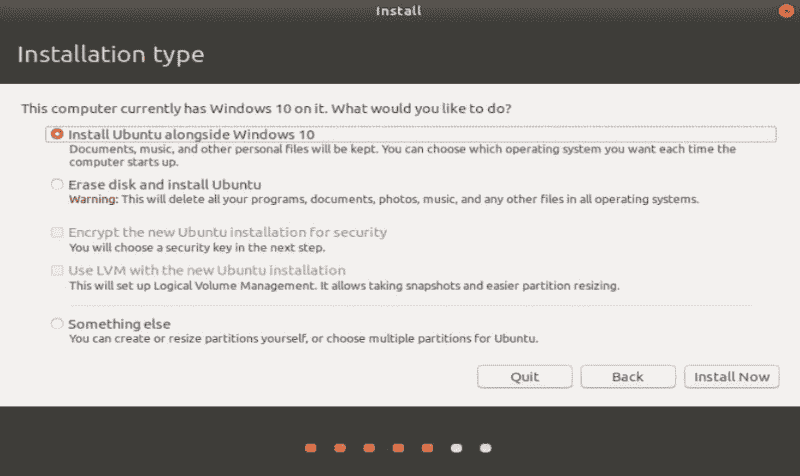
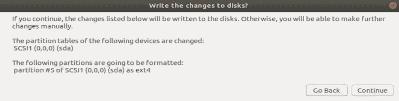
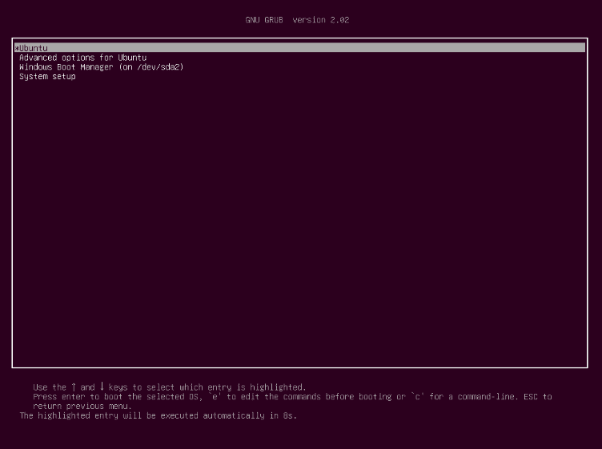

# 如何通过 5 个简单的步骤双启动 Ubuntu 和 Windows 10

> 原文：<https://www.edureka.co/blog/dual-boot-ubuntu-18-04-and-windows-10/>

由于某些特性和限制，在预装 Windows 的笔记本电脑上安装 Linux 发行版作为双引导是很困难的。但这并不意味着对一个的 Linux 管理员和一个初学者来说，都需要做同样的事情。所以，我给你带来了一个简单的指南来帮助你在你的系统中双引导 Ubuntu 和 Windows 10。

按照几个简单的步骤，你应该可以立刻双启动 Windows 10 和 Ubuntu！

*   [**双启动 Ubuntu 和 Windows 10 的先决条件**](#prerequisites)
*   [**备份和恢复**](#backup)
*   [**为 Ubuntu** 创建分区](#partition)
*   [**安装 Ubuntu**](#installubuntu)
*   [**登录 Ubuntu**](#logintoubuntu)

您应该知道下面的说明是特定于配置的。然而， ***显然，尽管不同硬件的里程数不同，但它应该适用于大多数笔记本电脑*** 。

本教程在一台相当新的 HP348 G4 笔记本电脑上执行，该笔记本电脑采用酷睿 i5 第七代处理器、1 TB 硬盘、16 GB RAM 和内置英特尔高清显卡 620。

这里我将使用 Ubuntu 作为例子，但是接下来的步骤也适用于其他的 [***Linux***](https://www.edureka.co/blog/linux-tutorial/) 发行版，比如 Linux Mint 和 Elementary OS。

现在，我们闲话少说，看看**H****ow to dual boot Ubuntu 和 Windows 10** 。

## **第一步:双启动 Ubuntu 和 Windows 10 的先决条件**

在安装之前，您必须考虑一些要求。你需要以下东西。

*   OEM 安装了 Windows 10 的笔记本电脑。
*   一个 u 盘最小 16 GB，用于 Windows 10 恢复。
*   装有最新可启动 Ubuntu 的 u 盘。

**第二步:备份和恢复**

在您继续下面的说明之前，请确保您已经备份并为 Windows 10 创建了一个恢复 u 盘，因为您可能会导致系统崩溃。另外，我认为你应该为 Windows 10 系统文件创建一个恢复棒。

要创建恢复 USB，您可以按照给定的步骤。

*   将一个空的 16g b+u 盘插入 Windows 10 机器

*   导航至 ***控制面板>系统。T3***

*   点击 ***在 ***系统*** 下创建恢复驱动器*** 。

*   等待恢复完成。完成后，您可以安全地从机器中取出 u 盘。

***注意:**为了安全起见，你可以通过启动来检查恢复棒是否工作。一点安全从来不会伤害任何人！*

## **第三步:为 Ubuntu 创建分区**

如果你已经有了一个分区，你可以用它 [***安装 Ubuntu***](https://www.edureka.co/blog/how-to-install-ubuntu/) ，你可能想跳过这一步。

原始设备制造商(OEM) 安装了 Windows 10 的机器通常带有两个基本分区，不包括恢复分区。c 盘和 D 盘。c 盘包含 Windows 10 系统文件，D 盘保留给用户数据。Ubuntu 18.04 需要 ***最少 25 GB*** 的存储空间分区，我们需要通过收缩我们的 c 盘(通常包含大部分空间)来创建。

要为 Linux 创建一个分区，您需要遵循这些给定的步骤。

*   打开 ***分区编辑器/磁盘管理控制台*** 。为此，打开运行提示(通过按 Windows 键+ R 或在搜索栏中键入‘运行’)&键入***diskmgmt . MSC***。

*   右键单击 c 盘。点击 ***缩小体积*** 。

*   在接下来出现的窗口中，您可以看到以 MB 为单位的可用大小。输入 ***您想要收缩的空间量****【MB】***。 

***注意**:如果你需要 **50 GB** 进行分区——你必须输入 **50*1024= 51200 MB*** 。

*   点击 ***缩小*** ，等待完成。

*   您将在存储的图形显示中看到一个未分配的空间。你将使用这个空间来安装 Ubuntu。

***注意:**现在不要格式化，因为 Ubuntu 安装程序会在安装过程中给你格式化的选项。*

## **第四步:安装 Ubuntu**

插入 Ubuntu 盘。重启。

*   如果到目前为止一切正常，Ubuntu 安装程序应该从 u 盘开始。你可以在这里 获得 Ubuntu [***的整个安装过程。***](https://www.edureka.co/blog/how-to-install-ubuntu/)

*   继续按照屏幕上的指示操作，直到出现 ***安装类型*** 窗口。

*   由于我们是用 Windows 10 双引导，选择第一个选项 ***和 Windows 10*** 一起安装 Ubuntu，其余选项可以在我们重新安装 Ubuntu 的时候选择。

*   在接下来的屏幕上，选择 ***将更改写入磁盘*** 继续安装。 

*   安装完成后，安装程序将重新启动系统。

*   重启前移除可启动 u 盘。

## **第五步:登录 Ubuntu**

你应该会看到带有 Windows 引导加载程序和 Ubuntu 的 GRUB 屏幕。

*   [***选择你想要的操作系统***](https://www.edureka.co/blog/linux-vs-windows/) 并继续进行。

*   现在，您将看到登录屏幕。选择用户&输入密码登录。

我希望这个指南对你有用。如果你愿意，你可以改变启动顺序，让 Ubuntu 成为你的默认操作系统。现在，您可以继续尝试并享受这个漂亮的、用户友好的 Linux 发行版。