# AWS EC2 教程:亚马逊弹性计算云

> 原文：<https://www.edureka.co/blog/ec2-aws-tutorial-elastic-compute-cloud/>

在预测所需的计算能力时，可能会出现两种情况:您可能会高估需求，购买大量无用的服务器；或者您可能会低估使用量，这将导致您的应用崩溃。在本 AWS EC2 教程中，我们将按以下顺序理解所有关键概念和实例创建:

*   [AWS EC2 介绍？](#what)
*   [EC2 的特性](#Features)
*   [EC2 计算实例的类型](#types)
*   [亚马逊 EC2 的优势](#Advantages)
*   [亚马逊 EC2 定价](#Price)
*   [AWS EC2 实例创建](#steps)

## **AWS EC2 教程:AWS EC2 简介**

**亚马逊弹性计算云**，EC2 是亚马逊的一项网络服务，它在云中提供**可调整规模的**计算服务。它们是可调整的，因为如果您的计算需求发生变化，您可以快速增加或减少正在使用的服务器实例的数量。

实例是在 Amazon 的 EC2 上运行应用程序的虚拟服务器。它也可以理解为大型计算机的一个微小部分，一个拥有自己的硬盘、网络连接、操作系统等的微小部分。但其实都是虚拟的。您可以在一台物理机上拥有多台“微型”计算机，所有这些微型计算机都称为实例。

****

### **AWS EC2 教程:为什么是 AWS EC2？**

### ****

假设你是一个开发者，由于你想独立工作你买了一些服务器，你估计了正确的容量，计算能力足够了。 现在，你每天都要负责安全补丁的更新，你还要解决服务器后端可能出现的任何问题，等等。

但是如果你买了一个 EC2 实例，你不必担心这些事情，因为它们都将由 Amazon 管理；你只需要专注于你的应用。 那也是，只需你之前花费的一小部分！那不是很有趣吗？

### **如何在 EC2 中运行系统？**

*   登录您的 AWS 账户，点击 AWS EC2。
*   在创建实例下，点击启动实例。

现在你必须选择一个**亚马逊机器映像(AMI)，**AMI 是操作系统的模板，它们提供启动实例所需的信息。

当我们想要启动一个实例时，我们必须指定我们想要使用哪个 AMI。可能是 Ubuntu，windows server 等。

*   ami 可以预先配置，您也可以根据自己的需求自行配置。
    *   对于预配置的 ami，您必须从 AWS 市场中选择。
    *   要设置您自己的，请转到快速入门并选择一个。

接下来在这个 AWS EC2 教程中，让我们学习各种类型。

## **AWS EC2 教程:EC2 的特点**

亚马逊 EC2 有很多功能。下面列举了其中的一些:

*   亚马逊 EC2 提供虚拟计算环境，也称为实例。
*   AWS EC2 已经为您的实例预配置了模板，也称为 Amazon 机器映像或 ami，它打包了操作系统以及一些附加软件。
*   EC2 为您的实例提供了 CPU、内存、存储和网络功能的多种配置。
*   有了 Amazon EC2，您可以使用密钥对安全地登录到您的实例，防止实例被不必要的访问。
*   Amazon EC2 有各种存储卷，用于存储当您停止、休眠或终止实例时删除的临时数据。这也称为实例存储卷。
*   Amazon EC2 使用 Amazon Elastic Block Store(Amazon EBS)为您的数据提供持久存储卷。
*   Amazon EC2 为您的资源提供了多个物理位置，例如实例和 Amazon EBS 卷

## **AWS EC2 教程:EC2 计算实例的类型**

计算是一个非常宽泛的术语。您的任务性质决定了您需要哪种计算。 因此，AWS EC2 提供了如下 5 种类型的实例:

*   ***一般实例***
    *   适用于需要平衡性能和成本的应用。
        *   例如，电子邮件回复系统，因为它不需要太多的处理过程，所以你需要一个及时的回复，并且它应该是有成本效益的。

*   ***计算实例***
    *   适用于需要 CPU 进行大量处理的应用。
        *   例如，从 Twitter 流等数据流中分析数据

*   ***记忆实例***
    *   因此，对于本质上很重的应用，需要大量的 RAM。
        *   例如，当您的系统需要在后台运行大量应用程序时，即多任务处理。

*   ***存储实例***
    *   适用于规模庞大或数据集占用大量空间的应用程序。
        *   例如，当你的应用程序非常大的时候。

*   ***GPU 实例***
    *   适用于需要大量图形渲染的应用。
        *   例如 3D 建模等。

**现在，每种实例类型都有一组针对不同工作负载优化的实例:**

| **一般实例** | **计算实例** | **内存实例** | **存储实例** | **GPU 实例** |
| 

 | 

*   补体第四成份缺乏

 | 

*   R3

 | 

*   I2

 | 

*   栅级Ⅱ

 |

现在，您已经了解了不同类型的实例，让我们在本 AWS EC2 教程中了解创建实例所涉及的步骤。

从 [AWS 云迁移](https://www.edureka.co/migrating-to-aws)中了解更多关于 AWS 及其框架的信息。

## **AWS EC2 教程:亚马逊 EC2 的优势**

*   您只需为您使用的东西付费
*   根据需要轻松放大或缩小
*   无需拥有或维护物理服务器
*   亚马逊 EC2 实例高度安全，您可以安全登录
*   能够从世界任何地方访问 EC2 实例

## **AWS EC2 教程:亚马逊 EC2 定价**

你可以免费使用亚马逊 EC2。使用免费层帐户，您可以在长达一年的时间内使用 750 小时的 Windows 和 Linux t2.micro 实例。建议免费用户只使用微实例，因为其他实例可能需要付费。支付 Amazon EC2 实例的费用有多种方法。它们是按需、节约计划、预留实例和现场实例。让我们看看这些产品的定价结构。

### **按需定价**

EC2 按需实例按秒(最少 60 秒)或小时计费。这不包括长期承诺，因此您不必过多考虑硬件的规划、购买或维护。

这是实例类型的定价

| 实例名 | 按需时薪 |
| a1 .培养基 | $0.0255 |
| 1.4x 大 | $0.408 |
| t3.nano | $0.0052 |
| t3 .培养基 | $0.0416 |
| t3.large | $0.0832 |
| t 3.2x 大 | $0.3328 |

### **储蓄计划**

储蓄计划是一种灵活的定价模式，在 Amazon EC2、Amazon Lambda 和 AWS Fargate 上提供低价使用。作为交换，您将获得 1 至 3 年的承诺，并持续使用该服务。

### **斑点实例**

您可以使用 Spot 实例请求备用 EC2 计算。对于开始和结束时间灵活的应用程序，建议这样做。下面提供了一些现货实例定价，但您可以参考官方网站了解更多信息。

| 实例类型 | Linux/ UNIX 使用情况 | Windows 使用情况 |
| t2.micro | $ 0.0035/小时 | $ 0.0081/小时 |
| t2.small | $ 0.0069/小时 | $ 0.0159/小时 |
| t2 .培养基 | $ 0.0139/小时 | $ 0.0319/小时 |
| t2.large | $ 0.0278/小时 | $ 0.0558/小时 |
| t2.xlarge | $ 0.0557/小时 | $ 0.0967/小时 |

## **AWS EC2 教程:实例创建步骤**

接下来，在这个 AWS EC2 教程中，让我们通过一个用例来理解整个 EC2 实例创建过程，在这个用例中，我们将为测试环境创建一个 Ubuntu 实例。

*   **登录 AWS 管理控制台。【T2**

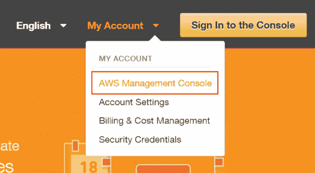

*   **选择你喜欢的地区。** 接下来， 从下拉列表中选择一个区域，区域的选择可以根据博客前面讨论的标准来完成。

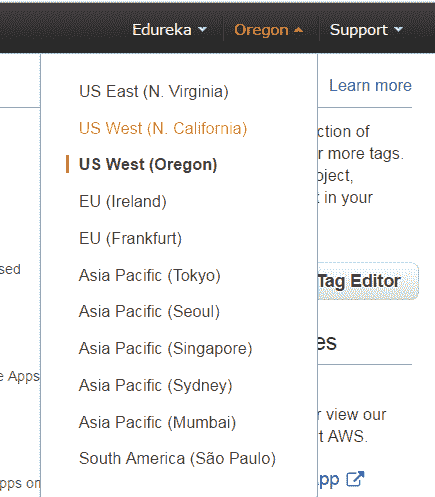

*   **选择 EC2 服务** 点击计算部分下的 EC2。这将带您到 EC2 仪表板。

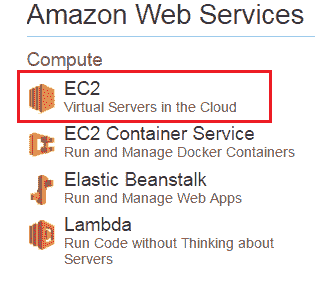

*   点击**启动实例**。

*   **选择一个 AMI :** 因为您需要一个 Linux 实例，所以在 basic 64 位 Ubuntu AMI 所在的行中，单击 Select。

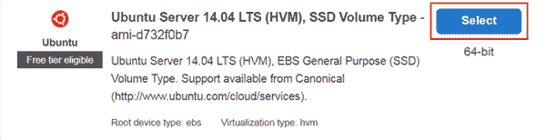

*   **选择一个实例**

选择 t2.micro 实例，该实例符合自由层条件。 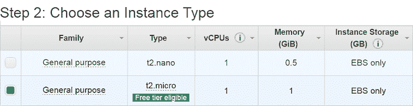

*   **配置实例详细信息。** 配置好所有细节后点击添加存储

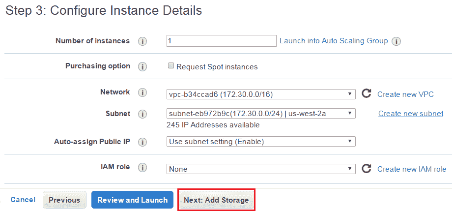

*   **添加存储**

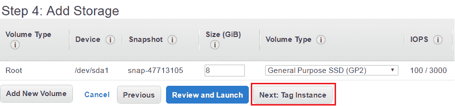

*   **标记一个实例**

在值框中键入 AWS EC2 实例的名称。这个名称，更确切地说是 tag，将在实例启动时出现在控制台中。它使得在复杂的环境中跟踪运行的机器变得容易。使用一个容易识别和记忆的名称。

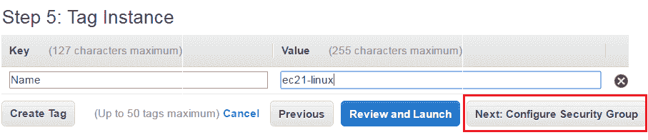

*   **创建安全组**

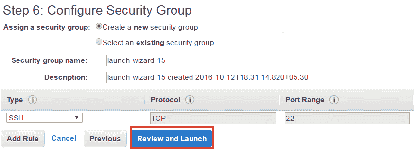

*   **审核并发起实例**

验证您为启动实例而配置的详细信息。

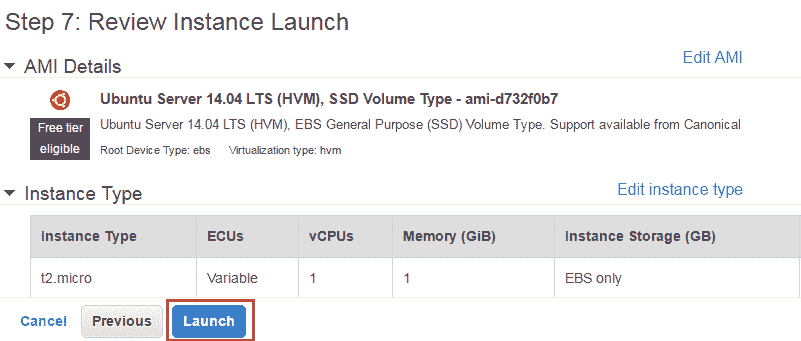

*   **创建密钥对&启动实例**

接下来，在 AWS EC2 教程中，选择“创建新的密钥对”选项，并给出密钥对的名称。之后，将其下载到您的系统中，并保存以备将来使用。

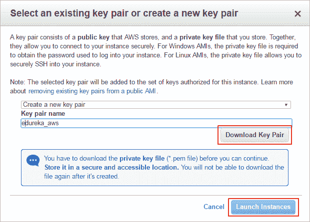

*   **查看已启动实例的详细信息。**

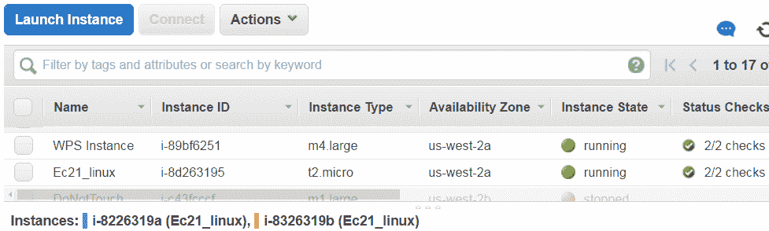

*   **使用 PuTTYgen** 转换您的私钥

PuTTY 本身不支持私钥格式(。pem)由亚马逊 EC2 生成。PuTTY 有一个工具叫 PuTTYgen，可以把密钥转换成需要的 PuTTY 格式(。ppk)。您必须将您的私钥转换成以下格式(。ppk)，然后尝试使用 PuTTY 连接到您的实例。

*   点击加载。默认情况下，PuTTYgen 只显示扩展名为. ppk .的文件。pem 文件，选择该选项以显示所有类型的文件。

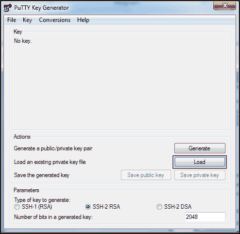

*   为启动实例时指定的密钥对选择您的. pem 文件，然后单击打开。单击确定关闭确认对话框。
*   点击保存私钥，将密钥保存为 PuTTY 可以使用的格式。PuTTYgen 显示一条关于保存没有密码的密钥的警告。单击是。
*   为密钥指定与密钥对相同的名称(例如，my-key-pair)。PuTTY 会自动添加。ppk 文件扩展名。

*   **使用 SSH 和 PuTTY** 连接到 EC2 实例

*   打开 PuTTY.exe
*   在主机名框中，输入实例的公共 IP。
*   在类别列表中，展开 SSH。
*   点击 Auth(不要展开)。
*   在用于认证的私钥文件框中，浏览至您下载的 PPK 文件并双击它。
*   点击打开。

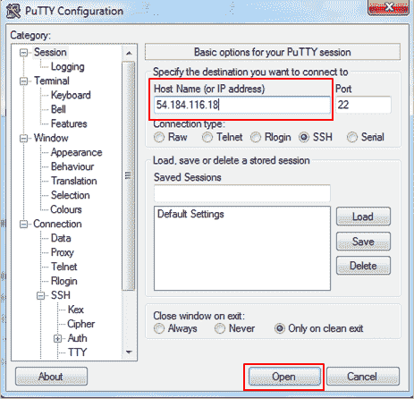

*   当提示输入登录 ID 时，输入 Ubuntu。

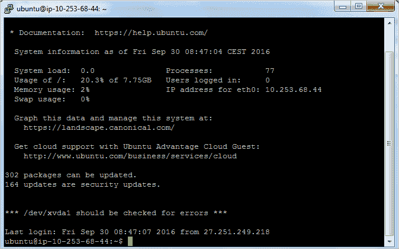

恭喜你！您已经成功启动了一个 Ubuntu 实例。

## **结论:**

现在您已经创建了自己的 Amazon EC2 实例，您可以开始您的云之旅了。如果您想开始学习如何使用 AWS 构建基础设施，我们强烈建议您查看我们关于 [AWS 解决方案架构师的课程。](https://www.edureka.co/aws-certification-training)在这里，你不仅将学习如何建立自己的云基础设施，还将学习如何为企业级项目构建解决方案。这是一门关于如何利用 Amazon Web Services 的全部功能来部署、管理和维护云的综合课程。

这里有一个简短的 AWS EC2 教程视频，解释了 Amazon AMI EC2、AMI 创建演示、安全组、密钥对、弹性 IP 与公共 IP 以及启动 EC2 实例的演示等。这对那些想成为 AWS 认证解决方案架构师的人来说非常重要。

## **AWS EC2 初学者教程| AWS 认证解决方案架构师教程| AWS 培训| Edureka**

[//www.youtube.com/embed/QNIPh4DhLx0?rel=0&showinfo=0](//www.youtube.com/embed/QNIPh4DhLx0?rel=0&showinfo=0)

我希望你喜欢这篇深入研究 AWS EC2 的教程。这是招聘人员在 AWS 解决方案架构师专业人员中寻找的最受欢迎的技能之一。这里收集了 [AWS 面试问答](https://www.edureka.co/blog/interview-questions/aws-interview-questions/) 帮助你准备下一次 AWS 的工作面试。你可以查阅的另一个有趣的读物是 [AWS S3 教程](https://www.edureka.co/blog/s3-aws-amazon-simple-storage-service/) ，为了更广泛地了解 AWS，请查阅我们的[亚马逊 AWS 教程](https://www.edureka.co/blog/amazon-aws-tutorial/)。

*如果你觉得这个 AWS EC2 教程相关，可以去看看 Edureka 在 [上的直播和讲师指导课程，AWS 课程](https://www.edureka.co/aws-certification-training) ，由行业从业者共同打造。*