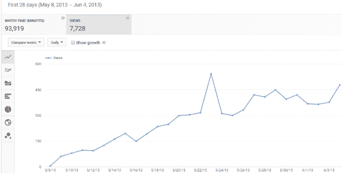
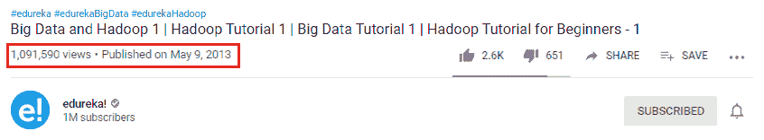
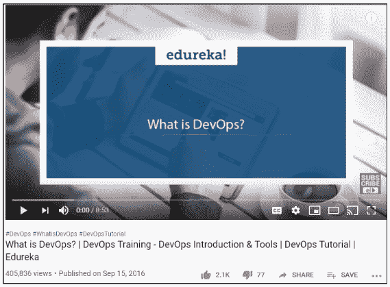
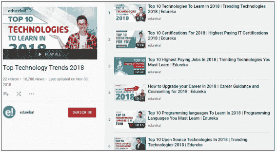
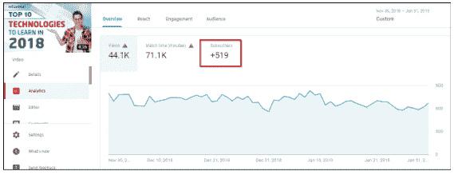
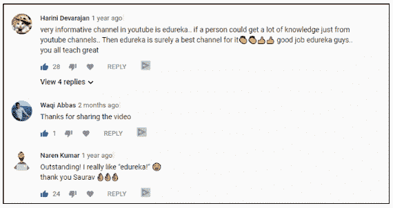
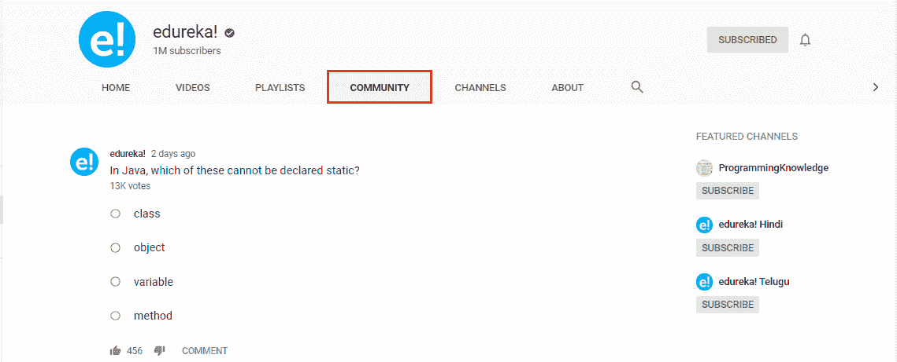
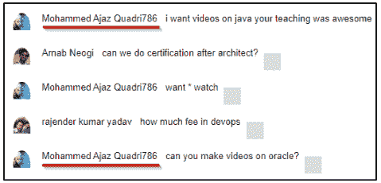

# 发现 YouTube 的力量:Edureka 通往 100 万 YouTube 用户的旅程

> 原文：<https://www.edureka.co/blog/edurekas-journey-1-million-youtube-subscribers/>

始于 2012 年的 [Edureka YouTube 频道](https://www.youtube.com/channel/UCkw4JCwteGrDHIsyIIKo4tQ)已经成为科技爱好者的终极目的地。这是我们频道的故事，从一个简单的记录开始，后来扩展到财富和名声，拥有 100 万 YouTube 订户的社区。那么，我们开始吧……

## 【YouTube 百万用户之旅的起点

你第一次做某事是一种强大的体验。它标志着一些新的和令人兴奋的事情的开始，然而不仅仅是有点可怕。

【2012 年 6 月 28 日，我们的联合创始人 Kapil Tyagi 和 Lovleen Bhatia 萌生了创建 YouTube 频道的想法。对他们来说，创建这个渠道最重要的方面是让技术学习变得可及和最新。

Edureka 通过上传我们关于当时最流行的技术的一个现场会议的简单记录开始了它的 YouTube 频道——**大数据 Hadoop** 。会议由我们的首席执行官亲自主持。没有花哨的摄制组，没有剪辑，没有现代设备。只是一个人热情地谈论大数据 Hadoop。这是一个长达三个半小时的视频，他们不确定人们是否会留下来看完整个视频。现实比这个简洁的小故事要混乱得多，创始人度过了几个不眠之夜，担心第一个视频的接收。

但令他们惊讶的是，该视频表现出色。它获得了意想不到的浏览量和点赞数，推动了该频道的发展。它随后增加了我们课程的销量，并很快完全填满了[大数据 Hadoop 课程](https://www.edureka.co/big-data-hadoop-training-certification)批次。那时，我们的创始人意识到了 YouTube 内容的力量。他们发现，当内容吸引人时，人们会选择留下来观看，不管它有多长。这个视频给了 Edureka 在那个时候所需要的启动，去年它成为我们在 YouTube 上第一个超过 100 万次观看的视频。

该视频在最初的 28 天内就超过了 500 次浏览，这在 YouTube 还处于起步阶段的时候是一个巨大的壮举。

**

*如今，它的浏览量已经超过 100 万次*

## **发现像病毒一样传播的感觉……**

在 2012 年至 2015 年间，Edureka 团队学会了围绕我们的受众所热衷并表现出高需求的话题来创作内容。我们发现，坚实的内容基础有助于充分利用围绕产品、类别或兴趣领域的对话，为吸引受众提供跳板。

因此，我们开始定期在 YouTube 上创建和上传更多基于最新技术的视觉内容。我们仍处于实验阶段，上传我们现场会议的不同录音，观察他们的表现。尽管我们目前没有特定的工具来衡量我们的成功，但我们将订户数量作为基准。

我们鼓励通过 YouTube 进行病毒式营销，这只是在一段时间内增加了我们 YouTube 频道的订户和观众数量。令人惊讶的是，我们没有在促销上花一分钱，仍然设法抓住了观众的眼球，并建立了一个拥有 10 万订户的家庭。在这一点上，我们很清楚 YouTube 将会在未来改变我们的游戏规则。我们还保留着 YouTube 发来的第一个 10 万银的播放按钮，骄傲地挂在我们办公室的墙上。

慢慢地，我们明白了品牌的重要性，一个没有重点的频道不太可能增加观众，或者获得大量订户。我们想让我们的观众着迷，这就需要对我们的内容进行剪裁，以符合我们的最终目标。

因此，真正的游戏开始于 2016 年 8 月，当时我们意识到我们需要一个更大的内容营销团队，拥有聪明的人，能够在更短的时间内制作更多优质内容。于是招聘开始了。很快，我们就有了一个由内容营销人员、视频编辑和创意设计师组成的成熟团队，我们都开始为我们的观众制作引人入胜的有用内容。内容营销团队由我们的内部专家 Vineet、Awanish 和 Vardhan 领导，他们由我们的联合创始人 Lovleen Bhatia 指导。

下一个挑战是在行业内建立专业知识、声誉和可信度。因此，我们试图找出最受欢迎的 YouTube 视频，通过检查与我们的利基相关的不同频道，并密切观察哪些视频对他们很有效。把事情做好的压力很大。老实说，大部分压力来自我们，因为我们想让我们的第一个官方 YouTube 视频尽可能完美。因为我们担心如果我们以后改变方向，我们会被视为一个怪人。

为了应对所有这些压力，我们制定了一项战略，并计划制作我们的第一个 YouTube 视频。我们瞄准了当年最抢手的技术——[**DevOps**](https://www.edureka.co/devops-certification-training)，开始在“什么是 devo PS”上创作我们的第一个官方视频内容。制作这个视频投入了大量的精力。内容改了差不多一百遍。大约有 50 次重拍，在我们得到最终剪辑之前，视频被编辑了大约 15 次。以下是视频背后的研究分析师 Vardhan(目前是 Edureka 的社区经理)对他的创作经历的看法—

*“From experience, I can say that re-inventing the wheel is the best feeling ever. It’s like bringing the same (massive) impact all over again. There was no board with a road-map of how it’s done. I felt like an artist, listening to that marvel.”*

****

**但是最后，所有的努力都是值得的。这个视频很快就给了我们 100 个赞(这在当时对我们来说是件大事)。我们在评论区受到了订阅者的赞赏。确实有人要求创建更多这样的内容。我们的许多不活跃的订户现在都积极参与了。该视频引起了巨大的轰动，并让我们获得了急需的宣传，这让我们知道优质视频是品牌故事的重要试金石。制作一个高质量的视频需要一个好的想法，一个合适的剧本，一个有创意的方法，以及一群粉丝来推动它。或者，如果你幸运的话，你需要的只是一个非常棒的主意！**

**这让我们进入下一部分， **我们的内容营销团队所做的努力，移动针头的战术****

**到这个时候，我们明白了要在 YouTube 上为一个品牌创造内容，考虑人们想看什么是很重要的。他们想要可以评论的故事。他们想要有价值的教学视频。他们想要的视频让他们想保存下来以后再看。他们想要可以分享的内容。**

**为了提高你的品牌参与度，你需要了解你的客户想要从你这里得到什么，然后提供给他们。我们了解到，如果有一件事会迅速扼杀一个渠道，那就是不一致。我们必须建立我们的势头，真正开始取得进展。我们必须保持一个可以坚持的一致的发布时间表。**

**因此，我们进行了研究，挖掘人们最想了解的热门技术。这些技术是——**devo PS、Hadoop、Tableau、Python、Selenium 和亚马逊网络服务** 。到目前为止，我们有三个不同的团队在研究不同的技术。因此，这些受欢迎的技术被分配给这些团队，他们开始在这些技术上创造高质量的内容。我们开始每天发布这些内容，很少错过一天。有时我们甚至会发布多个视频。这个计划是为了让我们的观众明白，总会有新的东西给他们看。这将促使他们成为一个可靠的订户，与品牌进行长期互动。**

**随着时间的推移，我们的视频开始在 YouTube 搜索上排名，通过持续发布高质量的内容，我们成功增加了订户数量。**

**策略现在对我们来说非常清楚了。挖掘出搜索次数最多的关键词–在这些关键词上创建优质内容–上传！有了这个，我们能够破解我们的努力和结果之间的关联。只要我们的任何视频表现良好，它就会自动增加内容页面的流量，从而增加该课程的销售线索数量。**

**到 2017 年，我们的订户数量已经步入正轨，我们的视频表现非常好。我们已经有了 50 万用户。唯一的问题是，我们制作的视频对所有 50 万用户都没有用。这很公平，因为为什么 AWS 工程师会对学习 Tableau 感兴趣，或者为什么 DevOps 工程师会对学习 Apache Hadoop 感兴趣。为什么这种小状况对我们的渠道不利？嗯，它创造了许多没有品牌想要的不活跃用户。**

**因此，我们需要一个计划来激活这些用户。因此，我们想出了生成一些对我们所有订户都有巨大价值的特定内容的主意。这包括像这样的主题**

***   [2018 年要学的十大技术](https://www.youtube.com/watch?v=evU3TzbraQM&list=PL9ooVrP1hQOH7x1ndW9u0j7H8GTcwk8A2&index=1)

    *   [2018 年十大认证](https://www.youtube.com/watch?v=8KeodgxXc0c&list=PL9ooVrP1hQOH7x1ndW9u0j7H8GTcwk8A2&index=2)

    *   [2018 年如何升级职业](https://www.youtube.com/watch?v=AlgJ4qNEPaM&list=PL9ooVrP1hQOH7x1ndW9u0j7H8GTcwk8A2&index=4)

    *   [2018 年十大高薪工作](https://www.youtube.com/watch?v=9UBLe4dktWA&list=PL9ooVrP1hQOH7x1ndW9u0j7H8GTcwk8A2&index=3)等。** 

**从我们开始创作这类内容的那一刻起，我们的订户数量再次飙升。越来越多的人开始学习和参与。我们得到了关于学习者、评论、喜欢和分享的鼓舞人心的故事。这些视频的表现比我们预期的要好。**

****

****

***来自我们订阅者的评论***

** 我们现在可以清楚地看到 YouTube 用户突破 100 万大关。但是，我们需要最后一次推动。一些能在更短时间内见效的令人兴奋的东西。这是我们偶然发现 YouTube 惊人的实时会话功能的时候。YouTube Live 是一种实时接触观众的便捷方式。无论你是在播放视频游戏、主持现场问答&还是在授课，YouTube Live 工具套件都可以帮助你管理视频流，并与观众实时互动。**

****YouTube 直播** 为我们培养了更多的参与度。我们观察到，当一大群人同时观看直播时，这比他们在自己的时间观看点播视频更具社交体验。现场活动期间的社交联系和互动是可以实现的，而且非常有价值。观众与活动本身息息相关。现场活动是所有观众都可以分享和谈论的一个共同点。**

**现场活动的另一个好处是，我们可以实时监控参与度和社交对话。这有助于我们发现我们想要传达的信息是否被接收到了，如果没有，我们可以根据从积极参与的观众那里得到的线索来改变它。随着我们不断开展越来越多有价值的现场会议，观众继续渴望和消费更多我们的现场视频，因此我们的可能性继续扩大。**

**我们努力开发的另一个出色的 YouTube 功能是 **YouTube** **社区** 。有了 YouTube 社区，我们能够与我们的订户分享文本帖子、图像、gif、竞赛、投票和所有其他类型的内容。而追随者，在他们这边，在每个帖子上竖起大拇指或放下大拇指，并发表评论，增加了参与度。**

****

**此外，用户现在可以在他们的 YouTube 移动应用程序的“订阅”提要中看到所有这些信息。如果他们点击了铃铛图标，他们也会收到我们发来的关于这些帖子的推送通知。**

**YouTube 社区对我们来说是一个很好的功能，可以直接与我们的用户交流，加强我们与他们的联系。YouTube 社区帮助我们在创作者和粉丝之间建立了强有力的联系。**

**凭借所有这些策略，Edureka 建立了自己的 YouTube 营销，这要归功于我们 YouTube 频道的最初创建者做出的明智决定，他们利用这个机会创建了一个品牌形象。我们在旅途中学到的一件事是，如果你一直等待完美的想法或正确的时刻，你永远也找不到。搞定你的第一个 YouTube 视频背后的秘密就是简单地去做，然后一直做下去。**

**[//www.youtube.com/embed/di__IEgY1rc?rel=0&showinfo=0](//www.youtube.com/embed/di__IEgY1rc?rel=0&showinfo=0)

请记住，并不是每个视频都会成为网络黄金，但拥有一个专业团队会有所帮助，因为他们知道什么会起作用，以及它如何与你的营销目标相结合。没有自动扶梯；通往成功只有楼梯。努力工作是无可替代的。成为 YouTube 上的红人需要很多努力。你需要倾听你的听众，做到真实、相关、定期和可靠。至少对我们来说是这样的。

最后，我们要感谢 100 万 YouTube 用户 Edureka，是他们成就了我们的今天。这里有几个订阅者，我们想对他们惊人的支持表示感谢。

来见见*凯瓦尔·巴特*——这位订户两年来一直虔诚地参加我们所有的直播会议。

Mohammed*Ajax Quadri*——总是渴望了解更多的订户。

**