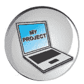
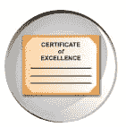

# 爱德华卡的在线学习方法论

> 原文：<https://www.edureka.co/blog/edurekas-learning-methodology-on-online-learning/>

今天，很多人都在谈论在线学习。不同的感知，不同的视野和思考让我们远离选择学习的方式。为什么一个人选择在线学习呢？这个问题可能有几个答案，但我们相信这只是关于实现学习的自由，最重要的是，当你学习时的自由！在 Edureka，我们通过现场讲师指导的 **[在线培训](https://www.edureka.co/)** 对多种技术和领域进行在线学习，彻底改变了在线学习的方式。

今天，在线教育前所未有地彻底改变了世界。越来越多的组织正在转向在线，这样越来越多的人就有机会在自己舒适的家中学习或与他人分享他们的知识，并改善他们的职业前景！意识到当前的需要， **Edureka** 设计了独特的**学习方法**，为渴望随时随地从世界级行业专家那里学习最新技术的学生。**看一看！**

### **edu reka 的学习方法:**

Edureka 的学习方法有几个与众不同的显著特点！

#### 1.我们提供现场互动课程！

 如果你认为只有课堂培训可以互动，那么你一定要看看 Edureka 的现场互动课。这些课程由在特定领域拥有丰富经验的行业专家授课。这些互动课程最大的好处是，在网上，学生们可以在世界任何地方充分利用这些课程。*例如，与来自孟买甚至纽约的学生相比，来自莫拉达巴德偏远地区的学生可以获得同样的好处！*

我们的实时互动课程的第二个优势是，由于许多学生同时参与这些课程，您不仅有机会解决自己的问题，还可以了解其他学生的新问题，并从讲师那里获得他们的答案。这就导致了丰富的学习！如果您错过了这些会议或需要重新咨询怎么办？放心吧！我们的学生也将获得这些直播课程的录音！

#### 2.基于项目的学习——重要吗？

 Edureka 的学习方法论是“ ***基于项目的*** ”。这意味着，在每门课程结束时，你将被要求提交一个基于你在课程中学到的东西的项目(一个现实生活中的应用程序)。它可以是 Android 中的一个流行应用，也可以是一个 Java 项目，或者是你在 Edureka 选择的任何其他技术。这些课程被分成小模块，每个模块都有“学习目标”，它定义了学生在该特定模块中将学习的内容。

这个想法不是——你在每个模块中涵盖什么主题，而是在每个模块之后你将能够“”做什么。这些项目由我们的专家在每一步进行审查，我们为学生成功完成项目提供全面的帮助。Edureka 基于项目的学习帮助我们的学生应用他们在课程中学到的所有概念，使课程变得充实、相关和有价值！其实我们很多同学都在 Android 中创造了很棒的项目，比如 [***PNR 状态 app***](https://www.edureka.co/blog/android-tutorial-on-pnr-enquiry/) 和一个 ***Droid 远程 app*** 。为了增加魅力，我们还帮助他们在 Goggle Play 上发布了这些内容！我们还在我们的 ***每周简讯*** 中展示项目。

#### 3.24×7 随叫随到的专家随时帮助解决您的疑问！

 想象你即将为你想到的 Android 应用编写一个伟大的 Java 程序！突然，你遇到了项目中的一个问题…例如“如何连接 GPS”？在那个特殊的时刻，你会许什么愿？Edureka 的全天候支持让您可以随时向我们的专家咨询任何问题。您只需要与我们的专家安排一个个性化的一对一会议！我们的目标是通过 Skype、电子邮件甚至电话支持，随时随地为学习者提供最高质量的教育。当你需要的时候，你会得到它。

**下面是我们的一名学生“法尔汉·卡尔马里”对 Edureka 的学习方法的看法:**

“Edureka, aptly named, gives the students a “Eureka” Moment during the course, Unparalleled support via the forums, live chat, skype, email. Learning is an adventure, it is a world toexplore, new paths to discover and edureka provides us with the navigation maps. The training at edureka helps you no matter what your question is, at the same time they do not spoon feed you and let you explore and learn by yourself. The entire staff is very friendly and helpful, they know you personally and know all your interactions, I never for a minute felt that I am doing this course online away from the faculty and the staff. Thanks a lot edureka!”

#### 4.向行业专家学习！

 我们的导师都是业内专家，有着丰富的实际项目经验，因此是指导学生正确方向的最佳人选。他们不是全职教练，而是经验丰富的专业人士，知道现实世界中的最新趋势。他们中的一些人有超过 15 年的经验，并与我们一起兼职工作。这些人热衷于教学，并希望与学生分享他们的实践知识。迄今为止，我们的培训师已经培训了数千名学生，并帮助他们在各个领域创建动态应用。

#### 5.你会收到一份“个人学习计划”，这是怎么回事？

我们的学生中有些是大学毕业生，有些是拥有丰富工作经验的专业人士。此外，我们知道并不是所有的学生都以相同的速度和相似的方式学习。这是 Edureka 学习方法的一个重要方面，我们甚至在每个学生开始学习课程之前就评估他们的要求，并在需要时提供额外的帮助，以便他们能够充分利用他们注册的课程。毕竟，在线学习就是根据你自己的进度灵活学习！

#### 6.Edureka 的个性化反馈和评估！

没有对你所学知识的正确评估，没有明确你需要在哪些方面努力成为一名熟练的专业人士，任何形式的学习都是不完整的。在课程中，我们的学生将会得到 ***的作业和*** 的测验以及教学视频进行常规评估。这些练习帮助他们巩固他们在课堂上学习的概念。我们的学生知道他们的确切位置，问题在哪里，以及他们需要改进的地方。

#### 7.社区学习-与同伴一起学习

 爱德华卡坚信，一个人从他/她的同龄人那里学到的东西甚至比从老师那里学到的还要多。我们通过脸书的 Edureka 社区，如 Edureka android 社区，为您创造丰富的学习环境。我们还为您提供了 Skype group，您可以在这里发表您的疑问，为他人解答，与志同道合的人交朋友。事实上，我们有来自世界各地的学生，你将有机会与具有不同经历的不同群体互动。例如，那些刚从大学毕业或仍在学习的人可以从注册我们课程的专业人士那里学到很多东西。反过来，我们专业的学生得到了认识志同道合的人，交流知识的机会。为了打造社区学习的精髓，我们还宣布了' ***月度应用*** '和' ***每周学生*** '并在我们的学生中创造健康的竞争精神，以便他们尽最大努力。

#### 8.像你的旅程一样，我们与你的关系永远不会结束！

 由于学习是一个持续的过程，我们相信与学生的关系是终生的。我们独特的学习方法允许您访问我们的 LMS ***，即使您已经完成了*** 课程。你可以随时再次修改你的概念，提出你的疑问，以同样的速度和热情解决你的疑问，而不用为此付出一分钱！

#### 9.认证流程！

 一旦你完成了你的项目，我们会在对项目提供多次评论和反馈后进行评估。接下来是 *** Skype 访谈*** ，我们的专家会就您的项目向您提问。一旦您成功通过在线面试，您将获得一份证书，并根据您的表现进行评分。如果你在面试中表现不佳或者不能成功完成你的项目，你可以免费参加我们的现场互动课程，提高你的表现，直到你满意为止。

我们相信每个人的大脑都是独特的，学习方式也是不同的，我们努力帮助你找到在线学习的方式。 **我们的学习者是我们不断改进学习方法的灵感来源，帮助你发现你身上的技术！**

