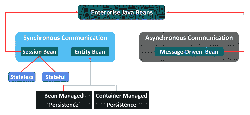

# Java 中的 EJB 是什么，如何实现？

> 原文：<https://www.edureka.co/blog/ejb-in-java/>

如果你想知道 EJB 是什么，那么你来对地方了。EJB 代表企业 Java beans。它是企业软件标准制造的几个[**Java**](https://www.edureka.co/java-j2ee-training-course)API 之一。在本教程中，您将对这个主题有一个全面的了解。

本文的议程如下:

*   爪哇的 EJB 是什么？
*   EJB 的功能是什么？
*   [EJB 有哪些种类](#WhataretypesofEJB)
*   什么时候使用 EJB？
*   [EJB 的优势](#AdvantagesofEJB)
*   [EJB 的劣势](#DisadvantagesofEJB)

让我们开始吧！

## 爪哇的 EJB 是什么？

EJB 是一种服务器端软件，帮助总结某个应用程序的业务逻辑。EJB 由 sun micro-systems 提供，目的是开发健壮、安全的应用程序。EJB 枚举是 Java EE 枚举的子集。Enterprise Java beans 管理人员关心的问题，如耐久性、安全性和跨国属性，这将使程序员能够更多地关注手头的企业软件部分。

理解了企业 Java beans 的含义之后，让我们开始理解其功能。

## EJB 的功能是什么？

每当你必须运行一个 EJB 应用程序时，就需要一个应用服务器，例如 Glass-fish、Web-logic、Web-sphere 等等。它执行的功能如下:

*   生命周期管理
*   安全性
*   事务管理
*   对象池

有不同类型的企业 Java beans。我现在将与你讨论它们。

## EJB 有哪些类型？

有几种类型的企业 Java beans。列表如下所示:

1.  **会话 bean**
2.  **实体 bean**
3.  **消息驱动 bean**

**会话 bean:**这些是非持久性企业 bean。会话 Bean 有两种: **有状态:**有状态会话 Bean 跨多个事务维护特定于客户端的会话信息。它存在于单个客户机/服务器会话期间。无状态:无状态会话 bean 是一个旧的容器，因此它们可以轻松地处理来自客户端的多个请求。

**实体 bean:**这些 bean 包含持久数据，可以保存在数据源中。有两种类型:

*   容器管理的持久性:这些实体 beans 将其持久性分配给 EJB 容器
*   Bean 管理的持久性:这些实体 bean 管理它们自己的持久性。

**消息驱动 bean:**消息驱动 bean 是接收和处理 Java 消息服务消息的企业 bean。它们只能通过消息传递来访问。它们没有接口。队列和侦听器之间发生异步通信。

这些是不同类型的企业 Java beans。下一个话题是 EJB 的用法。让我们开始吧！

## 什么时候使用 EJB？

在某些情况下，您可以使用企业 Java beans。看一看:

*   当应用程序需要远程访问时。
*   当您的应用程序是业务逻辑时。
*   当您的应用程序需要可伸缩时。

接下来，让我们研究一下 EJB 的优势。

## **EJB 的优势**

我提到了 EJB 的几个优势，如下:

*   EJB 是一个 API，因此在 EJB 上构建的应用程序可以在 Java EE web 应用服务器上运行。
*   EJB 开发人员专注于解决业务问题和业务逻辑。
*   Java beans 是可移植的组件，帮助 Java 应用程序组装者为现有的 JavaBeans 制定新的应用程序。
*   EJB 容器有助于为企业 Java beans 提供系统级服务。
*   EJB 包含业务逻辑，因此前端开发人员可以专注于客户端界面的呈现。
*   它提供了大型企业级应用程序的简化开发。

以上是一些优点，现在让我们了解一下企业 Java beans 的缺点。

## **EJB 的劣势**

以下是展示企业 Java beans 缺点的列表:

*   EJB 的规格相当复杂和庞大
*   它产生了昂贵且复杂的解决方案
*   他们利用丰富的资源，拥有大量的人工制品
*   发展需要时间
*   规格的不断修订
*   有比简单的 Java 类更复杂的城市

至此，我们结束了这篇 Java 中的 EJB 的文章。我希望你已经理解了什么是 Java 中的 EJB，以及如何实现它。

通过本“Java 中的 EJB”，您已经了解了 **EJB** 的基础知识，请查看 Edureka 提供的 [**Java 培训**](https://www.edureka.co/java-j2ee-soa-training) *，edu reka 是一家值得信赖的在线学习公司，在全球拥有超过 25 万名满意的学习者。Edureka 的 Java J2EE 和 SOA 培训和认证课程是为想成为 Java 开发人员的学生和专业人士设计的。该课程旨在让您在 Java 编程方面有一个良好的开端，并训练您掌握核心和高级 Java 概念以及各种 Java 框架，如 Hibernate&[Spring](https://spring.io/projects/spring-framework)。*

有问题要问我们吗？在这个“Java 中的 EJB”博客的评论部分提到它，我们会尽快回复您。