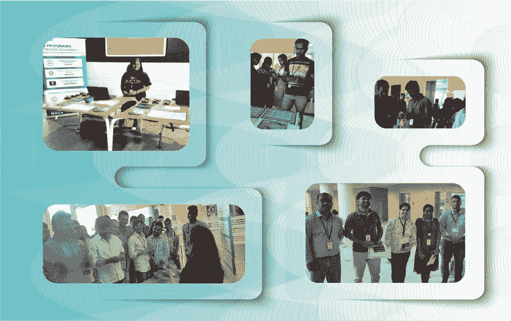
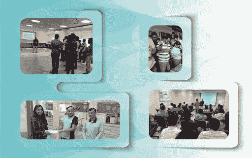
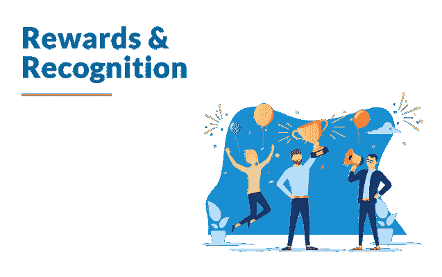

# 参观 Edureka 的员工参与计划@ Infosys EdgeVerve

> 原文：<https://www.edureka.co/blog/employee-engagement-program-infosys-edgeverve/>

Edureka 为印度不同地点的[Infosys edge verve](https://www.edgeverve.com/)员工组织了一次生动的员工参与计划。该活动旨在提高知识基础，让他们参与有趣的游戏，并评估他们在各种技术方面的现有技能。整个活动由全球人力资源业务合作伙伴 **Jean Thomas** (班加罗尔)和人力资源高级成员 **Madhumitha** (钦奈&浦那)负责。

## 活动地点

我们在 Infosys EdgeVerve 园区成功开展了员工参与计划(学习嘉年华):

*   *班加罗尔–2019 年 8 月 27 日*
*   *钦奈–2019 年 8 月 29 日*
*   *浦那——2019 年 9 月 5 日*

## 【EdgeVerve 事件的焦点

在数字革命的时代，了解 it 领域正在发生什么以及将会发生什么非常重要。考虑到这一点，我们为技术人员提供了一个知识分享会议，以培养更深层次的技能，并保持在技术的前沿。

我们学习计划的很大一部分包含了两个主要的引人注目的技术:

*   ### AI (Artificial Intelligence)

*   ### Machine learning

## 赛事集锦

EdgeVerve 员工积极参与学习嘉年华和其他连续的员工参与活动。在 EdgeVerve 员工活跃而好奇的环境中，Edureka 在技术讲座期间提供了与人工智能和机器学习相关的关键问题的答案。

在活动期间，Edureka 专注于 4 种主要内容，以吸引 EdgeVerve 员工:

### 

1.  ### Technical Speech by Industry Experts

由与 Edureka 相关的行业专家进行的关于人工智能和机器学习的技术讲座。他讨论了人工智能和机器学习的几个有趣的概念。我 t 带来了很多现代工业挑战围绕 AI 的有趣问题，比如:

*   #### Is artificial intelligence dangerous?

*   #### Application of artificial intelligence

*   #### AI subset (machine learning and deep learning)

*   #### Introduction to Machine Learning (ML)

*   #### Type of machine learning

因此，员工在学习人工智能、深度学习、机器学习及其未来应用时，更加了解他们可以瞄准的主要技能。

2.  ### Field skill test

Edureka 还组织了一次 MCQ 技术技能测试，采用 QR 扫描码的方法，我们允许 EdgeVerve 员工从提供的技术列表中选择他们最喜欢的技术。大约有 500 人热切地参与了技能测试，并很想知道他们在各自的技术上取得了多少分数。

3.  ### Fun brain games

我们已经创建了一个“猜技术”游戏的详细列表，以及相关的片段和提示，以使互动变得有趣。这也是 EdgeVerve 活动引人注目的亮点之一。

4.  ### Reward and commendation

总而言之，Infosys EdgeVerve L & D 团队的高级成员代表 Edureka 给予了奖励和认可。技能测试中表现优异的员工有 3 个奖项:

*   #### Excellent performance-skill test certificate+LVC worth 20,000 and exquisite gifts

*   #### Excellent performance-skill test certificate+SP worth 8000 yuan and gift

*   #### Best performer-skill test certificate+prize

同样，我们在 Infosys Finacle 开展了一项 员工参与计划。退房，[这里](https://www.edureka.co/blog/edureka-employee-engagement-program-infosys-finacle/)。

*您是否有兴趣为您的组织开展员工参与计划或[企业培训](https://www.edureka.co/corporate-training)？请联系 corp@edureka.co 的我们，或者拨打+91-86606 74718 与我们联系。*