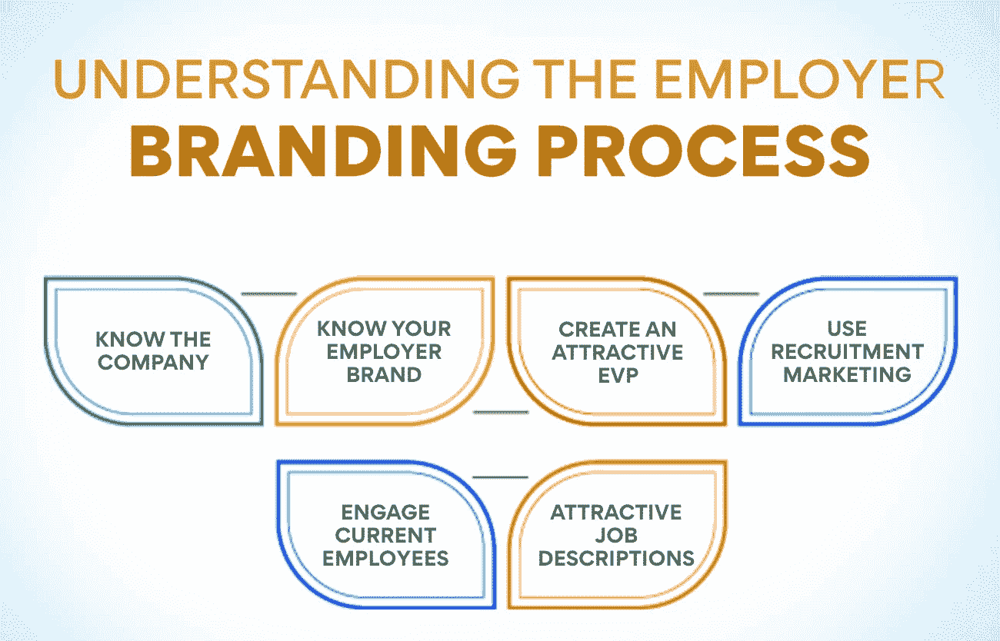

# 雇主品牌:什么是品牌，如何做？

> 原文：<https://www.edureka.co/blog/employer-branding/>

每个公司都想在顾客中拥有良好的市场声誉。这有助于增加他们的销售和收入。拥有优质制造商的良好形象也有助于快速销售新产品。但这并不是一家公司必须拥有的唯一形象。一家公司必须能够吸引优秀人才为其工作，因为它能吸引顾客购买其产品。建立这样的声誉也很重要，因为让最好的人手为你工作并不容易。这就是雇主品牌帮助的地方。

## 什么是雇主品牌？

那么，我们如何定义雇主品牌？在竞争激烈的就业市场上，公司必须在求职者中树立正面形象。获得优秀人才并不容易，因为国内外的许多公司都向他们提供高薪和福利。但并不是所有的候选人都只看重金钱。许多人关注公司如何对待员工。人们关注他们希望加入的公司的工作环境和职业前景。

从薪水、福利、发展前景和愉快的工作环境等各个方面，都在展示公司作为雇主的形象方面发挥着积极的作用。这样的正面形象有助于让优秀的人加入公司，并留住高效的员工。所有的公司都需要优秀的员工来推动他们前进，实现他们的目标。雇主品牌在获得和留住优秀员工以及帮助公司发展方面发挥着重要作用。它是公司在未来、现在和过去的员工中拥有的声誉。

人力资源团队的工作是在未来的员工中为公司创造良好的声誉。你可以参加[人力资源管理](https://www.edureka.co/blog/role-of-human-resource-management-in-an-organization/)的研究生证书课程，学习如何创造这样的形象。你可以访问我们的网站，了解这门课程对你的工作有何帮助。

## **为什么要建立雇主品牌？**

不投资雇主品牌对公司来说可能代价高昂。它增加了招聘成本，影响了公司的人力资源和总预算。首先，一家有着好雇主形象的公司比一家没有好雇主形象的公司申请人数多一倍。这本身对建立你的声誉是一个很大的好处。你收到的申请越多，你就有越多的选择来雇佣合适的人。人力资源经理会发现填补公司的技能缺口更容易。

从对许多求职者的采访中可以观察到，他们不愿意为一家被认为是糟糕雇主的公司工作，即使[报酬](https://www.edureka.co/blog/compensation-in-hrm)更好。公司将不得不花更多的钱招聘优秀人才来填补空缺。即便如此，他们也很可能找不到最合适的人手来做这项工作。因此，该组织将需要更长的时间来实现其目标。有了良好的雇主品牌，公司就成了吸引市场顶尖人才的磁石。

## **谁是雇主品牌？**

在小公司里，首席执行官可能会承担起树立雇主良好形象的工作。但在较大的公司，这项工作留给人力资源经理，他们将在营销部门的支持下完成这项工作。这将有助于为未来的员工创造一个良好的信息。一家公司为改善其雇主形象而传达的信息并不是在公司网站上看到的。这是员工对公司的评价。该信息必须来自该组织的现有员工。

员工可能无法像需要的那样清楚地表达他们的观点。这是人力资源和营销部门开始行动的地方。他们将帮助员工使用正确的词语，告诉那些在就业市场上的人，这家公司很适合工作。但这些信息必须得到员工社交媒体平台上帖子的支持。这是候选人观察公司形象的地方。良好的雇主品牌只有在公司的员工感到快乐的情况下才会发生，而这只有在公司创造了良好的工作环境的情况下才会发生。

## **了解雇主品牌化流程**

作为雇主，想要塑造一个良好的形象是不够的。这需要做很多工作，而且必须有系统地去做。让我们看看雇主品牌流程是如何运作的。

1.  **了解公司**

在你着手为你的公司在员工中建立良好的声誉之前，你必须熟悉你的公司。这意味着你必须知道公司代表什么。有必要了解它的目标，以及它作为一个好雇主想要达到的目标。你必须知道公司的核心业务是什么。负责雇主品牌的人也必须了解公司的文化、使命和愿景。只有熟悉所有这些的人才能创造出有吸引力的雇主价值主张。

2.  **了解你的雇主品牌**

大多数人都知道一家公司的产品或服务在市场中的地位。但是，即使是公司里的员工也不知道公司作为雇主的立场。在进行雇主品牌之前，有必要先了解这个职位。这个形象来自于员工对组织的看法。了解这一点的理想方法是调查该公司。人们还可以从社交媒体平台了解公司的形象。前雇员或参加过面试的人留下的评论能告诉我们很多关于这家公司的信息。

3.  **创造有吸引力的 EVP**

这是雇主品牌流程中的关键一步。雇主价值主张是公司向潜在员工传达的信息。它谈到了人们为公司工作所获得的好处。信息清楚地表明了他们为组织提供技能和经验的回报。它不仅仅谈论金钱利益，还谈论公司的文化和工作环境。一个有吸引力的执行副总裁可以让[更容易吸引市场上最优秀的人才](https://www.edureka.co/blog/talent-management-and-its-importance/)。

4.  **利用招聘营销**

在公司寻找人才的时候，你的执行副总裁必须简明扼要，告诉未来的员工他们想听的话。这就是招聘营销发挥作用的地方。你必须用正确的语言来吸引顶尖人才到你的公司。有文字创造力的人是构建信息的最佳人选。在公司的市场部找到这样的人才是可能的。这个过程应该从知道公司的目标是谁和目标是什么开始。这样的信息必须针对目标受众。

5.  **吸引现有员工**

没有员工的参与，公司的雇主品牌将是不完整的。求职者更相信一个现任员工的话，而不是公司首席执行官的话。这意味着你必须让你的员工在各种平台上谈论公司。最好的地方是他们的社交媒体账户。人力资源部门可以帮助他们确定职位的写作方式。让员工在招聘网站上写评论是在就业市场上吸引人才的另一种方式。

6.  **有吸引力的工作描述**

职位描述是未来员工看到的关于公司的第一件事。大多数人申请一个职位是基于它所说的或者它有多吸引人。有了好的描述，即使是最平凡的工作也能变得令人兴奋。虽然它必须准确地传达这份工作是什么，但你也必须看到阅读的人对公司有所了解。一旦职位描述在最合适的论坛上发布，公司必须优化搜索引擎，找到理想候选人在找工作时可能使用的词汇。

这些是企业改善其雇主形象的几种方法。要了解更多，你可以参加人力资源管理研究生证书课程。我们的网站会告诉你课程的细节以及你如何从中受益。

## **改善雇主形象的方法**

1.  **不要过多谈薪酬**

将优秀人才吸引到公司的方法之一是谈论公司的各种事情，而不要过于关注薪酬。当试图为一个职位找到更年轻的候选人时，这一点尤其重要。雇主价值主张必须更多地谈论员工如何会觉得工作更令人满意。必须对公司的工作环境有足够的了解，以及新人如何能轻松快速地适应工作。雇主品牌的一个重要部分应该是组织如何平等地考虑所有员工的晋升。

2.  **创建公司博客**

申请公司工作的人经常会阅读公司博客。创建一个谈论公司的博客肯定有助于吸引优秀人才加入公司。这样的博客必须谈论公司正在发生的事情。它可以提供涉及员工事件的新闻。你可以让工作人员写文章并发布在博客上。这些文章有助于未来的雇员了解公司及其文化。展示公司致力于员工幸福的博客在雇主品牌中非常有用。

3.  **使用照片和视频**

在博客中使用大量媒体对提高组织的声誉大有裨益。你必须试着张贴关于工作场所的照片。员工及其家人参与活动的视频会给公司一种亲近员工的形象。首席执行官谈论公司及其政策的视频可以提升公司的形象。员工面试谈论他们的工作经验是极好的品牌宣传材料。这应该是雇主品牌流程的一个常规部分，必须为此分配单独的预算。

4.  **确保员工的多样性**

当你招聘员工时，要确保不同背景的人都有。这对于向未来的候选人展示公司的包容性非常重要。有这样一群人谈论公司的工作环境有多好也是好的。这是一个为所有人提供平等机会的好例子。这样的行动将比仅仅谈论它对雇主品牌大有裨益。大多数年轻人更喜欢在拥有各种背景和种族的人的公司工作。

## **雇主品牌的优势**

现在我们已经看到了流程是如何完成的，是时候看看它对公司有什么好处了。

1.  **接触最优秀的人才**——当公司树立起一个好雇主的形象时，优秀的人才就会来寻找机会，而不是相反。
2.  **降低雇佣成本**——当你执行雇主品牌化时，你正在为公司创造一个永久的形象。在招人的同时不需要做特别的营销活动。
3.  **品牌得分高于薪酬**–许多年轻的有志之士希望为一家拥有良好工作环境和优惠员工政策的公司工作。这些是他们比报酬更看重的品质。这意味着你在人力资源上的花费会下降。
4.  **改善你的业务**——虽然雇主品牌对公司的销售没有直接影响，但客户更有可能青睐一家有良好员工政策和提供良好工作环境的公司。

要了解这一过程的方方面面，请参加由一家知名机构举办的[人力资源管理研究生证书课程](https://www.edureka.co/highered/human-resourse-management-course-iim-shillong)。你可以从我们的网站上了解课程。

## **结论**

员工是任何组织最有价值的资产。他们帮助推动公司实现其目标。一家公司必须获得市场上最优秀的人才。实现这一目标的方法是改善公司作为一个好雇主的形象。雇主品牌是一项有助于为企业建立良好声誉的活动，因为该公司善待员工，并为他们提供愉快的工作环境。每个人力资源专业人员都必须学习这个过程，并在他们的公司中实施。

## **更多信息:**

[什么是人力资源会计？](https://www.edureka.co/blog/human-resource-accounting/)

[人力资源审计:了解其目标、重要性&局限性](https://www.edureka.co/blog/hr-audit/)

[如何克服 HR 职业中的挑战？](https://www.edureka.co/blog/challenges-in-hr/)

[你应该知道的高级人力资源工具](https://www.edureka.co/blog/hr-tools/)