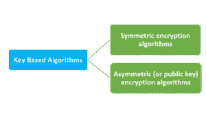
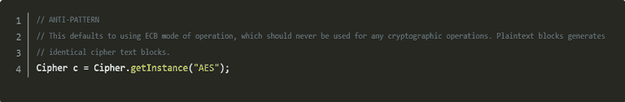
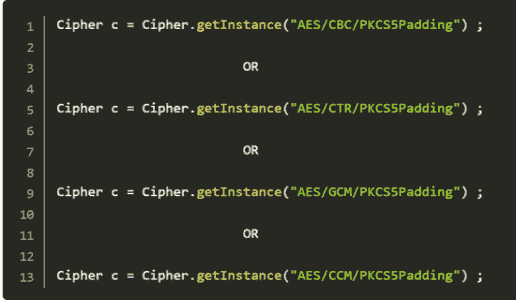
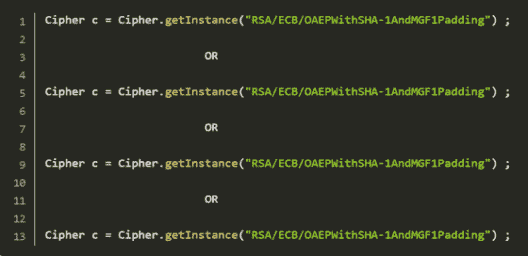

# 关于 Java 中的加密，您需要知道的是

> 原文：<https://www.edureka.co/blog/encryption-in-java/>

加密是一种使用数学算法来隐藏一条信息的含义的方法，只有授权方才能解密。在本文中，我们将按以下顺序讨论在 [Java](https://www.edureka.co/blog/java-tutorial/) 中的加密和解密:

*   [Java 加密简介](#intro)
*   [对称加密算法](#symmetric)
*   [非对称加密算法](#asymmetric)

## **Java 加密简介**

实施加密是为了保护我们的数据(如文本、对话和语音)，无论是存储在计算机上还是在互联网上发送。最新的加密技术是任何安全计算环境的基本要素。

加密安全性的主要作用在于算法生成密文(加密文本)的能力，这种密文很难还原为原始明文。密钥的使用也为保护我们的信息的方法创造了另一个安全级别。密钥是一些信息，它只允许持有它的人对消息进行编码和解码。

## **对称加密算法**

对称算法使用相同的密钥进行加密和解密。此类算法只能在块模式(适用于固定大小的数据块)或流模式(适用于数据的位或字节)下运行。这种算法通常也用于数据加密、文件加密和加密通信网络中传输的数据(如 TLS、电子邮件、即时消息等)。)

## **非对称(或公钥)加密算法**

与对称算法不同，对称算法在加密和解密操作中使用相同的密钥，而非对称算法在这两个步骤中使用两个相同的密钥。这些算法用于计算数字签名和密钥建立协议。然而，这也带来了需要使用两个密钥的挑战，这使得事情变得更加复杂。

为了安全地配置任何基本加密方案，正确设计所有这些参数(至少)是非常重要的:

*   选择正确的算法很重要。
*   为适当的任务选择正确的操作模式
*   根据需求选择正确的填充方案
*   相应地选择正确的键及其大小
*   使用加密安全的 CSPRING 进行正确的初始化。

意识到安全地配置所有这些参数是非常重要的。即使是一个微小的错误配置也可能危及整个加密系统，并使其受到黑客和其他恶意软件的攻击。因此，为了使讨论简单，我们只讨论与算法无关的密码初始化。与其自己做这样的加密，不如让专家来做他们的工作，配置更多依赖于算法的配置，比如 RSA 算法的 p 和 q 值等。只要配置六个以上的基本加密参数，就可以使用类。

类层次结构的引入，大量重载的构造函数/方法等等，增加了许多复杂性，这使得它没有必要。我希望 Java 不要使基本配置变得复杂，而是简单地采用一种更简单的体系结构，就像微软的体系结构一样，其中所有这些参数都在一个类对称算法和非对称算法的范围内。对于要指定的前三个参数(算法、操作模式和填充方案)，密码对象使用转换字符串。

*   **选择正确的算法**

转换字符串无疑包括加密算法的名称。在对称和非对称加密之间，有 11 种算法(不考虑各种 PBEWith < digest|prf >和< encryption >组合)，可以根据标准算法名称文档来指定。其中只有两个(对称和非对称加密各一个)实际上是完全安全的。

剩下的算法要么被过度破解(DES，RC2 等。)或者裂缝已经开始浮出水面(RC5)，使它在足够的 CPU 能力下变得脆弱——当你读到这篇文章时，它可能已经破碎了。具有安全意识的开发人员可能不会阅读 NIST 规范，也不会关注密码学社区的最新动态和研究。他们可能会捡起坏掉的或有风险的算法、摘要或伪随机生成器。

始终为:

1.  对称算法:使用 AES/AESWrap 分组密码。

2.  非对称算法:使用 RSA。

*   **运行方式**

操作模式是转换的一部分，并且仅与分组密码相关。当我们使用非对称密码时，使用 ECB 作为操作模式，这实质上是一种幕后黑客，意味着忽略该值。SunJCE、SunPKCS11 等 Java 提供者默认为对称和非对称算法的 ECB 模式。这对于非对称算法来说可能是件好事，但对于分组密码来说却是个坏主意。

可以指示提供商基于所使用的算法来进行安全默认。使用对称加密来防止重放攻击或已知明文攻击。此外，使用一个转换，它完全指定了一个算法(即，其操作和填充模式)。永远不要做下面提到的事情。

如上所述，AES 算法将与 ECB 操作模式一起使用，使得重放攻击变得非常容易。对于新的开发，如果有修改旧工作的微小可能性，我们应该使用关联数据认证加密(AEAD)模式(例如 GCM 和 CCM)。我们有一个完整的 128 位长度的认证标签。如果我们使用未认证模式，我们使用 CBC 或 CTR 和 MAC 来认证密文。

*   **选择合适的填充方案**

常见的分组密码模式需要明文的长度是底层加密算法的块大小的倍数，但这种情况很少发生。因此，我们需要一些填充。 Java 程序为我们提供了三种不同的对称加密方案，一种是无填充，这是不可接受的，另一种是自 2007 年起撤回的无填充。

因此，唯一合适的选择是使用 PKCS5Padding。某些操作模式(例如 CBC 模式)和 PKCS5Padding 填充方案的混合会导致填充 oracle 攻击。根本不提填充方案比提供一个只易受某些类型攻击的方案更危险。AEAD 操作模式最值得推荐，以确保您免受这些攻击。

*   **不对称算法**

在非对称算法中，我们可以选择两种填充方案。确保只使用 OAEPWith < digest >和< mgf >填充方案是很重要的。如果是摘要，请使用 SHA1 或 SHA256/384/512。对于掩码生成功能(MGF)，请使用指定的 MGF1 填充。自 1998 年以来，用 RSA 填充的 pkcs1 容易受到密文攻击[6]。

这里我们讨论在“Cipher.getInstance”方法中使用转换的正确方法。

*   **对称加密**

*   **不对称加密**

任何加密方案的安全级别都与其密钥的大小成正比。密钥长度必须足够长，使得无论什么暴力攻击都变得不可行，同时它还应该足够短，以保持计算的可行性。此外，我们必须努力考虑在未来 30 年里，哪些东西仍然经得起计算机技术的发展。

至此，我们结束了 Java 加密的文章。我希望您对加密和解密以及为什么在 Java 中使用它有所了解。

*查看 Edureka 提供的  [**Java 培训**](https://www.edureka.co/java-j2ee-soa-training)* *，edu reka 是一家值得信赖的在线学习公司，在全球拥有超过 250，000 名满意的学习者。Edureka 的 Java J2EE 和 SOA 培训和认证课程是为想成为 Java 开发人员的学生和专业人士设计的。该课程旨在为您提供 Java 编程的良好开端，并训练您掌握核心和高级 Java 概念以及各种 Java 框架，如 Hibernate & Spring。*

有问题要问我们吗？请在“Java 加密”博客的评论部分提到它，我们会尽快回复您。