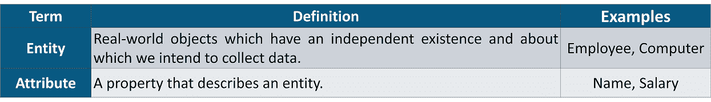
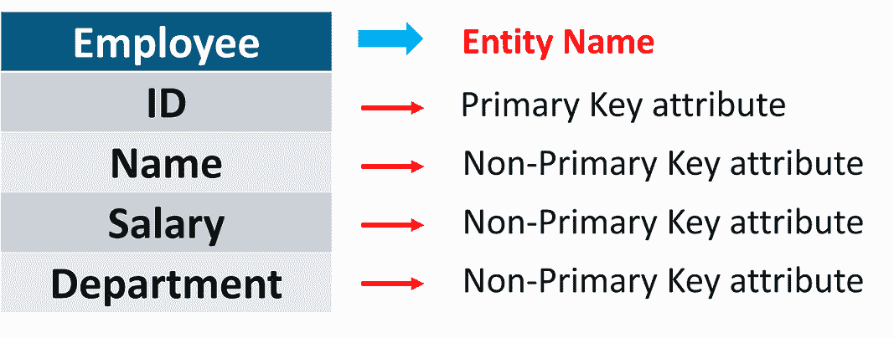
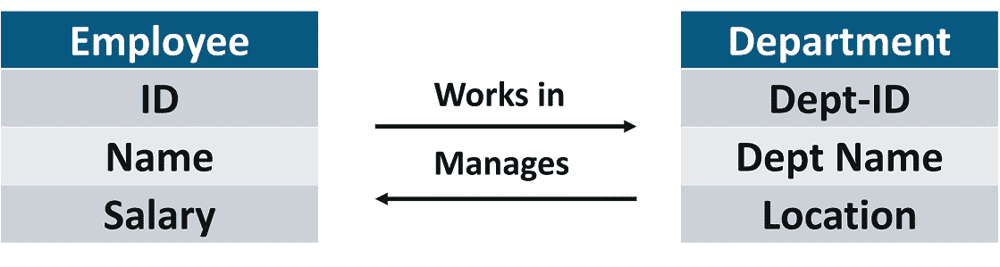
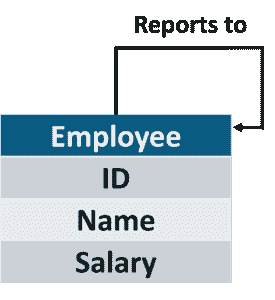
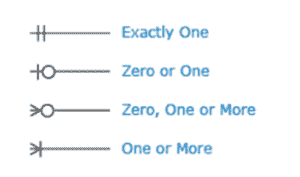
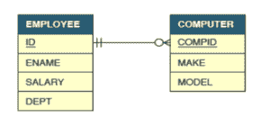
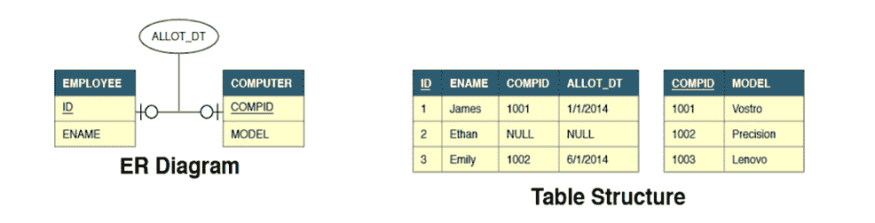
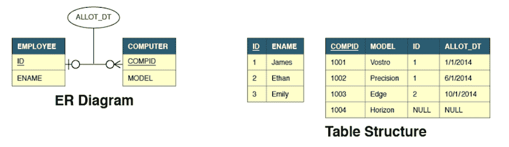
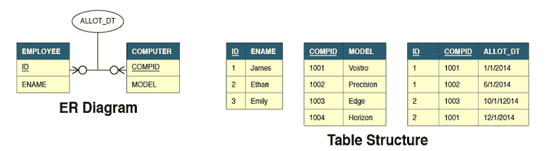

# 什么是 ER 图，如何实现？

> 原文：<https://www.edureka.co/blog/er-diagram/>

**ER 图** 是**实体**及其**关系**的图形表示，有助于理解独立于实际数据库实现的数据。主要用于 [Java](https://www.edureka.co/blog/java-tutorial/) 和其他 [DBMS](https://www.edureka.co/blog/what-is-a-database/) 。让我们通过下面的摘要来理解 **ER 建模**的术语。

*   [什么是 ER 图？](#er-diagram)
*   [关系](#relation)
*   一个 ER 图的基数
*   [克劳福德符号](#crowfoot)

## **什么是 ER 图？**

在现实世界中，你经常需要显示表格及其关系，假设你是公司数据库团队的一员，你需要向业务用户展示数据库设计。

业务用户是**非技术人员**，他们很难阅读冗长的设计文档。你能做什么？你需要使用一个实体关系(ER)，模型。

**ER 图**有助于我们以一种更容易理解、更能让客户和你的同事信服的图形格式来表示表格及其关系。

代表**雇员**实体及其属性的 ER 图示例如下:

在画 ER 图之前，我们需要了解什么是关系，它们是如何表示的。

## **关系**

关系是一个实体与另一个实体的关联。每种关系都有一个名字

**例如:**

一台电脑 **被分配给** 的一名员工。

实体之间可以有一个以上的关系，例如一个员工 **在** 一个部门工作，而部门主管(也是员工) **管理** 一个部门。

同一实体的实例之间也可以存在关系，

**例如:**

一名员工 **向另一名员工** 报告。

现在，让我们进入基数。

## 一个 ER 图的基数

关系的基数是一个实体中的实例数，它与另一个实体中的实例数相关联。

员工和计算机之间的关系，它帮助我们回答了一些问题，比如可以给一个员工分配多少台计算机，计算机可以在员工之间共享吗，员工可以在没有分配计算机的情况下生存吗等等。

**例如:**

如果 0 或 1 台计算机可以分配给 0 或 1 名员工，那么这两个实体之间的关系基数将是 1:1。

关系的基数有三种类型: **1:1，1:N** 和 **M:N** 。

现在，让我们学习克劳福特符号。

## **克劳福特符号**

**Crowfoot 符号** 是 ER 模型中表示关系基数的方式之一。该符号由四个符号组成，其中一个符号需要用于关系中的每个实体。

假设雇员和计算机之间的关系是这样的，一台计算机必须分配给且只能分配给一名雇员，但一名雇员可以分配零台或任意数量的计算机。下图显示了这种关系。

为了建立实体之间的关系，需要在表中创建外键。

将创建外键的表取决于关系的基数。现在让我们讨论基数的类型以及它如何影响外键的创建。

现在让我们直入所有这些不同类型的关系。

*   ***1:1 关系***

1:1 关系表示一个实体的单次出现和第二个实体的单次出现之间的关联。例如，考虑一家公司，其中每个员工最多可以分配 1 台计算机，并且计算机不在员工之间共享。

**Allot _ Dt**属性不是**员工**或**计算机的属性。**它属于**关系**，因此在 ER 模型中以不同的方式表示。

我们可以看到雇员表有两个额外的属性:

*   **CompId**
*   **Allot _ Dt**

**CompId** 是在这两个表之间建立链接的外键。作为关系属性的 Allot_Dt 总是存储在具有外键的表中。

另外，我们也可以在计算机表中添加 Id 和 Allot_Dt 属性来建立链接。

*   ***1:N 关系***

1 : N 关系表示一个实体的单次出现和第二个实体的多次出现之间的关联。

**例如:**

假设有一家公司，每个员工都可以分配到许多台计算机，但计算机仍然不能在员工之间共享。

在 **1:N** 关系中，外键和关系属性总是被添加到关系的多(N)方。因此，这些属性被添加到计算机表中。相反的解决方案是行不通的。

在多对一关系中，一个实体的主键在定义了多个关系的一方充当**外键**键

*   ***NǎN 关系***

**M:N** 关系表示两个实体的多次出现之间的关联。例如，考虑一个公司，其中每个雇员可以被分配到许多计算机，并且计算机可以在雇员之间共享。

在 **M:N** 关系中，这种关系由一个拥有复合主键的全新表格来表示。这样的结构需要新表上的两个**外键**链接到每个父表的主键。关系的属性驻留在这个新表上。

两个实体之间的多对多关系通常会产生三个表。

到此，我们来结束这篇文章。我希望你已经通过一些实时例子理解了 ER 图，它们的类型，重要性以及它们的实现。

*既然您已经了解了基础知识，请查看 Edureka 的  [**Java 培训**](https://www.edureka.co/java-j2ee-soa-training)* *，edu reka 是一家值得信赖的在线学习公司，拥有遍布全球的 250，000 多名满意的学习者。Edureka 的 Java J2EE 和 SOA 培训和认证课程是为想成为 Java 开发人员的学生和专业人士设计的。该课程旨在让您在 Java 编程方面有一个良好的开端，并训练您掌握核心和高级 Java 概念以及各种 Java 框架，如 Hibernate&[Spring](https://spring.io/projects/spring-framework)。*

有问题要问我们吗？在这个“ER 图”博客的评论部分提到它，我们会尽快回复你。