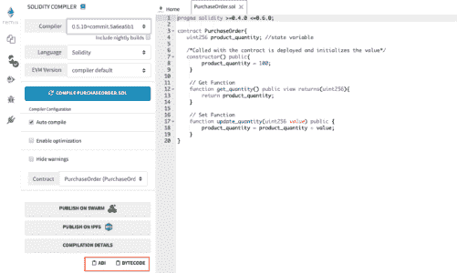
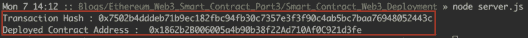
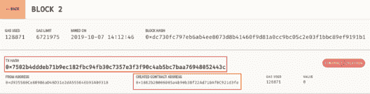
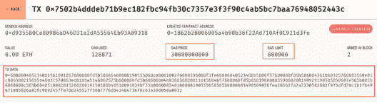

# 以太坊-使用 Web3 的智能合约部署

> 原文：<https://www.edureka.co/blog/ethereum-smart-contract-deployment-web3/>

在本系列的第四篇博客([以太坊](https://www.edureka.co/blog/ethereum-smart-contract-project)–使用 Web3 的智能合约交互)中，我们研究了如何使用 web3 与部署了本地以太坊区块链(Ganache)的智能合约进行交互。我们了解了开始编程所需的关键要素。我们研究了所有的相互作用是如何被分成两类的。

*   使用*调用*从智能合约中读取数据。
*   使用 *sendTransaction 将数据写入合同。*

今天，我们将讨论如何使用 web3js 部署智能合约。我们将在之前博客的知识基础上进行构建。所以让我们开始吧。

## 我们今天要做什么？

*   我们将了解使用 *Web3.js* 部署智能合约所需的构建模块。
*   为什么我们需要部署智能使用代码？如果我们看看现实世界的场景，*智能合约*就像一个模板定义。例如，保险单类型是一个模板，当您购买保单时，会创建一个包含投保人、保单金额和保单条件等数据的实例。同样，智能合约定义是一个模板，当您部署智能合约时，您用数据实例化了智能合约。一旦部署完毕，您就可以与之交互。
*   当我们要构建一个真实世界的应用程序时，每次你想要创建一个智能合约对象，你都不需要手动完成，这需要作为代码的一部分来完成。
*   因此，我们需要知道如何做到这一点，以及做到这一点需要哪些要素。这就是我们在这个博客中要做的事情。

## **外卖会是什么？**

在这篇博客的结尾，我们将能够清楚地定义以下内容。

*   实现这一目标的关键要素是什么？
*   获得这些关键元素
*   我们将构建用于部署的事务对象。
*   最后，我们将拥有代码，它可以在其他项目中重用。

## **索引**

1.  先决条件
2.  初始清单

## **先决条件**

我们将需要安装以下先决条件，您必须已经在您的系统上可用，因为它们是在以前的博客中实际操作所需的。以防您没有安装先决条件。请安装以下软件。

1.  [Visual Studio 代码](https://code.visualstudio.com/)
2.  [加纳切](https://www.trufflesuite.com/ganache)
3.  [NodeJS](https://nodejs.org/en/) *(版本 10.16.3)，可以直接从安装程序安装，也可以使用 NVM(节点版本管理器)完成。*NVM 的步骤在之前的博客里已经分享过了。
4.  我们将重用采购订单合同，它是作为系列文章中第一篇博客的一部分创建的。

## **项目设置**

我们已经安装了先决条件。现在我们将在 Visual Studio 代码中设置项目。

1.  首先，我们要创建一个新的项目文件夹“Smart_Contract_Web3_Deployment”。
2.  接下来，我们将运行本地区块链节点 Ganache。我们将与它互动。
3.  初始化项目以使用节点。我们将运行以下命令。

    ```
    npm init

    ```

4.  接下来，我们需要添加一些依赖项。为此，我们将运行以下命令。

    ```
    npm install web3 --save
    npm install ethereumjs-tx  --save

    ```

5.  现在，我们已经安装了依赖项，我们将添加代码。让我们向 project server.js 添加一个新文件
6.  最后，项目结构应该是这样的。

## **代码**

现在，我们将添加相关的代码。让我们开始吧。

### **依赖对象**

1.  我们将添加以下依赖对象。

    ```
    const Web3 = require('web3');
    const EthereumTx = require('ethereumjs-tx').Transaction;

    ```

2.  这些对象提供了一些函数，我们将使用这些函数来建立连接、签署事务、构建事务对象和其他实用函数。

### **初始化连接**

1.  我们将与当地的区块链以太坊建立联系。

    ```
    const rpcURL = 'http://127.0.0.1:7545';
    const web3 = new Web3(rpcURL);

    ```

2.  在这种情况下，本地以太坊节点提供以下 rpc 端点 *http://127.0.0.1:7545*

### **设置数据**

1.  我们需要以下数据元素
    *   **ABI**
    *   **字节码**
2.  简而言之，契约 abi 是契约的模式。就像一本书的索引，列出章节和内容。
3.  我们正在用一种高级语言写合同，这里是 Solidity。在以太坊区块链上，合同以编译格式存在。
4.  EVM(以太坊虚拟机)理解被称为*字节码的编译形式的契约。*
5.  在 RemixIDE 中编译我们的采购订单智能合同后，我们将从 RemixIDE 中检索这两个详细信息。
6.  
7.  让我们将这些细节添加到代码中。

    ```
    let abi = '[{"constant":false,"inputs":[{"name":"value","type":"uint256"}],"name":"update_quantity","outputs":[],"payable":false,"stateMutability":"nonpayable","type":"function"},{"constant":true,"inputs":[],"name":"get_quantity","outputs":[{"name":"","type":"uint256"}],"payable":false,"stateMutability":"view","type":"function"},{"inputs":[],"payable":false,"stateMutability":"nonpayable","type":"constructor"}]'
    let bytecode = '608060405234801561001057600080fd5b50606460008190555060ca806100276000396000f3fe6080604052348015600f57600080fd5b506004361060325760003560e01c806380219655146037578063ed0109a5146062575b600080fd5b606060048036036020811015604b57600080fd5b8101908080359060200190929190505050607e565b005b6068608c565b6040518082815260200191505060405180910390f35b806000540160008190555050565b6000805490509056fea265627a7a7230582002f975dfd70c1b1f649671805826a83fc9b92457fe7dd245527f56b7776d043464736f6c634300050a0032';

    ```

### **合同标的**

1.  接下来，我们将创建一个契约对象。
2.  为了创建契约对象，我们将使用契约 abi。

    ```
    // Contact ABI
    let deploy_contract = new web3.eth.Contract(JSON.parse(abi));

    ```

3.  我们将需要一个以太坊帐户进行合同部署。
4.  对于帐户信息，我们将使用 Ganache 中的一个帐户。
5.  接下来，我们将把它添加到我们的代码中。

    ```
    // address from Ganache
    let account = '0xd935580Ce80986aD46D31e2dA55564Eb93A09318'; 

    ```

### **功能参数**

1.  为了部署契约，契约的字节码是 send 函数参数之一。

    ```
    let payload = {
        data: bytecode
    }

    ```

2.  接下来，我们还需要为契约部署提供元数据。

    ```
    let parameter = {
        from: account,
        gas: web3.utils.toHex(800000),
        gasPrice: web3.utils.toHex(web3.utils.toWei('30', 'gwei'))
    }
    ```

    *   首先， *from:* 将用于部署合同的账户。该帐户需要有以太网，以便部署合同。
    *   接下来， *gas* :客户愿意为合同部署承担的最大费用限额。如果成本超过这个值。将恢复合同部署。
    *   最后， *gasPrice* :账户愿意支付的每单位燃气的价格。根据*汽油价格*确定交易的优先级。

### **部署智能合约**

1.  现在，我们有了所有需要的零件。
2.  最后，拼图的最后一块，让我们添加最后一块代码。

    ```
    deploy_contract.deploy(payload).send(parameter, (err, transactionHash) => {
        console.log('Transaction Hash :', transactionHash);
    }).on('confirmation', () => {}).then((newContractInstance) => {
        console.log('Deployed Contract Address : ', newContractInstance.options.address);
    })           

    ```

3.  在这最后一块，我们正在做以下事情。
    *   我们正在使用契约对象，它是我们之前创建的 *deploy_contract* 。
    *   接下来，契约对象调用 *deploy()* 函数，将字节码(有效载荷)作为对象传递。
    *   上一步创建了完整的事务对象，但是该对象不需要通过区块链网络发送。
    *   最后，我们调用 *send()* 函数，传递交易所需的细节，例如发送交易的账户，煤气。
4.  交易发送后，生成交易散列(网络上交易的唯一标识符)。
5.  接下来，我们将监听事务的*确认*事件，这意味着
    *   我们发起的交易已经成为该块的一部分。
    *   其次，合同在区块链展开。

**了解我们在顶级城市/国家的区块链培训**

| **印度** | **其他城市/国家** |
| [班加罗尔](https://www.edureka.co/blockchain-training-bangalore) | [纽约](https://www.edureka.co/blockchain-training-new-york-city) |
| [海德拉巴](https://www.edureka.co/blockchain-training-hyderabad) | [英国](https://www.edureka.co/blockchain-training-uk) |
| 喀拉拉邦 | [美国](https://www.edureka.co/blockchain-training-usa) |
| [钦奈](https://www.edureka.co/blockchain-training-chennai) | [加拿大](https://www.edureka.co/blockchain-training-canada) |
| [孟买](https://www.edureka.co/blockchain-training-mumbai) | [澳大利亚](https://www.edureka.co/blockchain-training-australia) |
| [浦那](https://www.edureka.co/blockchain-training-pune) | [新加坡](https://www.edureka.co/blockchain-training-singapore) |

## **将所有这些放在一起**

1.  这就是我们的 server.js 文件在把所有的片段放在一起之后的样子。

    ```
    // Library Imports
    const Web3 = require('web3');
    const EthereumTx = require('ethereumjs-tx').Transaction;

    // Connection Initialization
    const rpcURL = "http://127.0.0.1:7545";
    const web3 = new Web3(rpcURL);

    // Data set up
    let abi = '[{"constant":false,"inputs":[{"name":"value","type":"uint256"}],"name":"update_quantity","outputs":[],"payable":false,"stateMutability":"nonpayable","type":"function"},{"constant":true,"inputs":[],"name":"get_quantity","outputs":[{"name":"","type":"uint256"}],"payable":false,"stateMutability":"view","type":"function"},{"inputs":[],"payable":false,"stateMutability":"nonpayable","type":"constructor"}]'
    let bytecode = '608060405234801561001057600080fd5b50606460008190555060ca806100276000396000f3fe6080604052348015600f57600080fd5b506004361060325760003560e01c806380219655146037578063ed0109a5146062575b600080fd5b606060048036036020811015604b57600080fd5b8101908080359060200190929190505050607e565b005b6068608c565b6040518082815260200191505060405180910390f35b806000540160008190555050565b6000805490509056fea265627a7a7230582002f975dfd70c1b1f649671805826a83fc9b92457fe7dd245527f56b7776d043464736f6c634300050a0032';

    //Contract object and account info
    let deploy_contract = new web3.eth.Contract(JSON.parse(abi));
    let account = '0xd935580Ce80986aD46D31e2dA55564Eb93A09318';

    // Function Parameter
    let payload = {
        data: bytecode
    }

    let parameter = {
        from: account,
        gas: web3.utils.toHex(800000),
        gasPrice: web3.utils.toHex(web3.utils.toWei('30', 'gwei'))
    }

    // Function Call
    deploy_contract.deploy(payload).send(parameter, (err, transactionHash) => {
        console.log('Transaction Hash :', transactionHash);
    }).on('confirmation', () => {}).then((newContractInstance) => {
        console.log('Deployed Contract Address : ', newContractInstance.options.address);
    })
    ```

2.  为了执行这段代码，从终端窗口

    ```
    node server.js

    ```

    运行这段代码
3.  结果，生成了事务散列，并部署了契约，返回了契约的地址。
4.  接下来，我们可以在 Ganache 中验证事务散列和新创建的契约。
5.  最后，当我们查看加纳切的交易细节时，我们会看到*天然气限额*和*天然气价格*。它们显示相同的值，就像我们在函数中传递的一样。

## **结论和后续步骤**

如前所述，这篇博客的主要收获是部署智能合同的完整实践。随后查看实现部署的信息构造块。总之，在这个博客系列中，我们只是触及了 Web3 的皮毛。接下来，我们将在下一篇博客中探讨以太坊生态系统的更多组件。如果你想进一步探索 web3，请查看 [web3.js](https://web3js.readthedocs.io/en/v1.2.1/) 的文档。敬请关注更多内容。

*如果您希望学习以太坊并在区块链技术领域建立职业生涯，那么请查看我们的[区块链在线课程](https://www.edureka.co/blockchain-training) ，该课程提供讲师指导的现场培训和真实项目体验。该培训将帮助您深入了解什么是以太坊区块链，并帮助您掌握该主题。*

有问题要问我们吗？请在这个“使用 Web3 的智能合约部署”博客的评论部分提到它，我们会回复您。