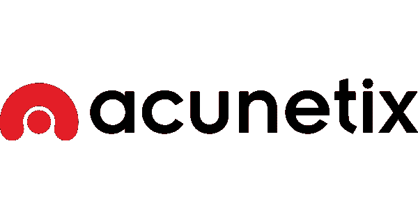
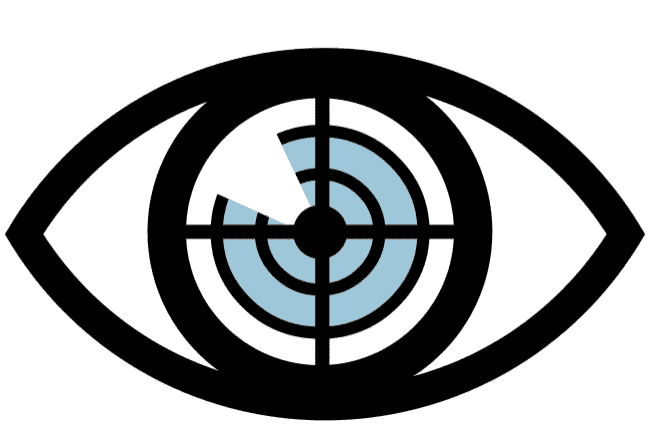
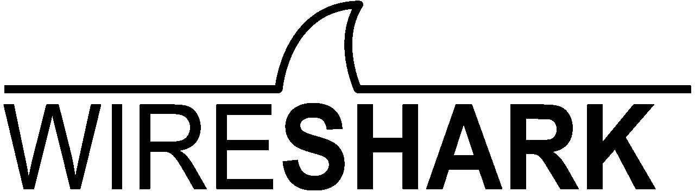
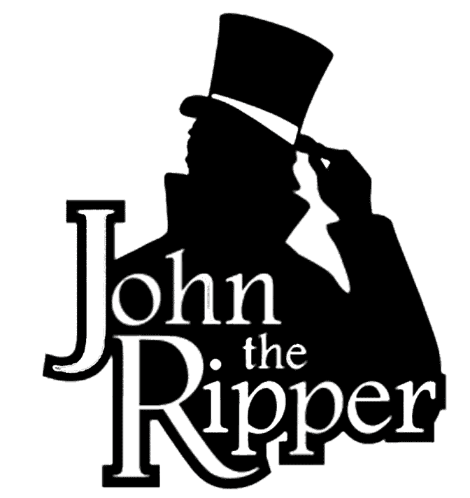
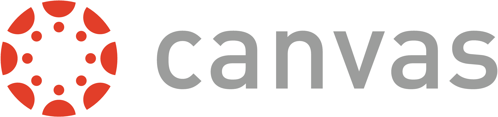

# 2023 年十大道德黑客工具

> 原文：<https://www.edureka.co/blog/ethical-hacking-tools/>

**道德黑客工具**

自动化给每个行业都留下了印记，道德黑客领域也不例外。随着道德黑客产业中各种工具的出现，它已经被改变了。道德黑客工具有助于信息收集、创建后门和有效载荷、破解密码和一系列其他活动。在本文中，我们将讨论 2021 年前十大道德黑客工具:

*   [Acunetix](#acunetix)
*   [Nmap](#nmap)
*   [Metasploit](#metasploit)
*   [Wireshark](#wireshark)
*   [Nikto](#nikto)
*   [开膛手约翰](#JohnTheRipper)
*   [命中注定](#kismet)
*   [SQLninja](#sqlninja)
*   [马鹿](#wapiti)
*   [画布](#canvas)

## **Acunetix**

Acunetix 是一款自动化的网络应用安全测试和道德黑客工具。它通过检查漏洞(如 SQL 注入、跨站点脚本和其他可利用的漏洞)来审计您的 web 应用程序。通常，Acunetix 会扫描任何可通过 web 浏览器访问的网站或 web 应用程序，并使用 HTTP/HTTPS 协议。

Acunetix 提供了一个强大而独特的解决方案，用于分析现成的和定制的 web 应用程序，包括那些利用JavaScript、【AJAX】和 Web 2.0 web 应用程序的应用程序。Acunetix 有一个先进的爬虫，几乎可以找到任何文件。这一点很重要，因为没有找到的东西是无法检查的。

## **Nmap**

Nmap 是*网络映射器*的缩写，是一种侦察工具，被有道德的黑客广泛用于收集目标系统的信息。这些信息是决定攻击目标系统的后续步骤的关键。Nmap 是跨平台的，可以在 Mac、Linux 和 Windows 上工作。由于其易用性和强大的搜索&扫描能力，它在黑客社区中获得了巨大的人气。

使用 Nmap 您可以:

*   审核设备安全性
*   检测远程主机上开放的端口
*   网络映射和枚举
*   查找任何网络内部的漏洞
*   启动针对域和子域的大量 DNS 查询

## **Metasploit**

Metasploit 是一个用 Ruby 编写的开源笔测试框架。 作为研究安全漏洞和开发代码的公共资源。这使得网络管理员可以闯入自己的网络来识别安全风险，并记录哪些漏洞需要首先解决。它也是初级黑客用来练习技能的少数几个合乎道德的黑客工具之一。它还允许您复制网站，用于网络钓鱼和其他社会工程目的。该框架包括一套安全工具，可用于:

*   躲避检测系统
*   运行安全漏洞扫描
*   执行远程攻击
*   枚举网络和主机

*支持的平台包括:*

*   麦克·OS X
*   Linux 操作系统
*   Windows 操作系统

## **Wireshark**

Wireshark 是一款免费的开源软件，允许您实时分析网络流量。由于其嗅探技术，Wireshark 因其检测任何网络中的安全问题的能力以及解决一般网络问题的有效性而广为人知。在嗅探网络时，您能够截取并读取人类可读格式的结果，这使得识别潜在问题(例如低延迟)、威胁和漏洞变得更加容易。

**主要特点:**

*   保存分析以供离线检查
*   数据包浏览器
*   强大的图形用户界面
*   丰富的 VoIP 分析
*   检查和解压缩 gzip 文件
*   读取其他捕获文件格式，包括 Sniffer Pro，Tcpdump，微软网络监视器，思科安全 IDS IPlog 等。
*   将结果导出为 XML、PostScript、CSV 或纯文本

Wireshark 支持多达 2000 种不同的网络协议，可用于所有主要的操作系统，包括:

*   Linux 操作系统
*   Windows 操作系统
*   麦克·OS X

## **Nikto**

Nikto 是另一个最爱，众所周知是 [卡莉 Linux 发行版](https://www.youtube.com/watch?v=J36yzsCLPNg) 的一部分。其他流行的 Linux 发行版，比如 Fedora，已经在他们的软件库中提供了 Nikto。该安全工具用于扫描 web 服务器，并对指定的远程主机执行不同类型的测试。其干净简单的命令行界面使得针对您的目标启动任何漏洞测试变得非常容易。

*Nikto 的主要功能包括:*

*   检测任何操作系统上的默认安装文件
*   检测过时的软件应用程序
*   与 Metasploit 框架集成
*   运行跨站点脚本漏洞测试
*   执行基于字典的暴力攻击
*   将结果导出为纯文本、CSV 或 HTML 文件

## **开膛手约翰**

开膛手约翰是有史以来最受欢迎的密码破解者之一。它也是测试操作系统中密码强度，或者远程审计密码强度的最佳安全工具之一。这个密码破解程序能够自动检测几乎任何密码中使用的加密类型，并相应地改变其密码测试算法，使其成为有史以来最智能的密码破解工具之一。

这个[道德黑客](https://www.edureka.co/blog/ethical-hacking-tutorial/)工具使用暴力破解技术来破解密码和算法，例如:

*   DES，MD5，河豚
*   Kerberos AFS
*   Hash LM (Lan Manager)，Windows NT / 2000 / XP / 2003 中使用的系统
*   MD4、LDAP、MySQL(使用第三方模块)

另一个好处是，JTR 是开源的，多平台的，完全适用于 Mac，Linux，Windows 和 Android。

## **命中注定**

**Kismet** 是使用最多的道德黑客工具之一。它为 802.11 无线局域网工作  网络检测器数据包嗅探器和入侵检测系统。Kismet 将与任何支持原始监控模式的无线网卡一起工作，并且可以嗅探 802.11a 、 802.11b 、 802.11g 和 802.11n 流量。程序运行在 Linux 、 FreeBSD 、 NetBSD 、 OpenBSD 和 Mac OS X 下。客户端也可以在微软视窗系统上运行。

## **SQLninja**

SQL inja 是 Kali Linux 发行版捆绑的另一个 SQL 漏洞扫描器。这个道德黑客工具专门针对和利用使用 MS SQL Server 作为后端数据库服务器的 web 应用程序。使用 SQLNInja，您可以:

*   测试数据库模式
*   指纹远程数据库
*   使用单词列表的暴力攻击
*   直接外壳和反向外壳

SQLNinja 可以在安装了 Perl 解释器的多个 Unix 发行版中获得，包括:

*   Linux 操作系统
*   Mac OS X 和 iOS
*   FreeBSD

## **马鹿**

Wapiti 是一款基于命令行的免费开源漏洞扫描器，用 [Python](https://www.edureka.co/blog/python-programming-language) 编写。虽然它不是这个领域最受欢迎的道德黑客工具，但它在发现许多 web 应用程序的安全缺陷方面做得很好。使用马鹿可以帮助你发现安全漏洞，包括:

*   XSS 袭击
*   SQL 注入
*   XPath 注入
*   二十.注射
*   CRLF 注射剂
*   服务器端请求伪造

## **画布**

Canvas 是 Metasploit 的一个很好的替代品，它提供了 800 多个用于测试远程网络的漏洞。豁免的帆布可用

*   数百次战功
*   自动化开发系统
*   面向全球渗透测试人员和安全专业人员的全面可靠的漏洞开发框架

Canvas 的主要功能包括:

*   获取远程系统的屏幕截图
*   下载密码
*   修改系统内部的文件
*   提升权限以获得管理员访问权限
*   远程网络开发

这个合乎道德的黑客工具还允许你使用它的平台来编写新的漏洞或使用它著名的外壳代码生成器。它还集成了一个名为 scanrand 的 nmap 替代方案，对于大中型网络上的端口扫描特别有用。报名参加[道德黑客课程](https://www.edureka.co/ceh-ethical-hacking-certification-course)，了解更多关于道德黑客工具的信息。

支持的平台包括:

*   Linux 操作系统
*   MacOSX
*   Windows 操作系统

这就把我们带到了这个“十大道德黑客工具”的结尾。关于网络安全的更多信息，你可以看看我的其他[博客](https://www.edureka.co/blog/?s=cybersecurity)。 如果您希望学习网络安全并在这一领域建立丰富多彩的职业生涯，那么请查看我们的 [***网络安全认证培训***](https://www.edureka.co/cybersecurity-certification-training) ，它附带有讲师指导的现场培训和真实项目经验。本培训将帮助您深入了解网络安全，并帮助您掌握该主题。

*你也可以看看我们新推出的 [**CompTIA Security+认证**](https://www.edureka.co/comptia-security-plus-certification-training) 培训这是 Edureka & CompTIA Security+之间首创的官方合作关系。它为您提供了一个获得全球认证的机会，该认证侧重于安全和网络管理员不可或缺的核心网络安全技能。*

<article class="maincontentblog">Got a question for us? Please mention it in the comments section of the “Top 10 Ethical Hacking Tools” blog and we will get back to you or join our [Cyber Security Training in Brisbane](https://www.edureka.co/cybersecurity-certification-training-brisbane) today.</article>