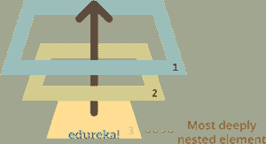
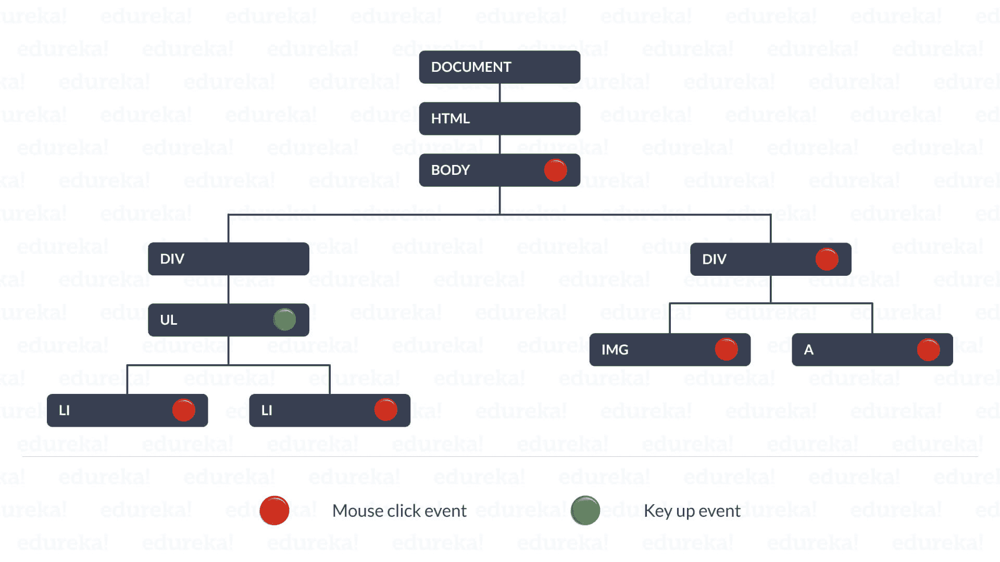
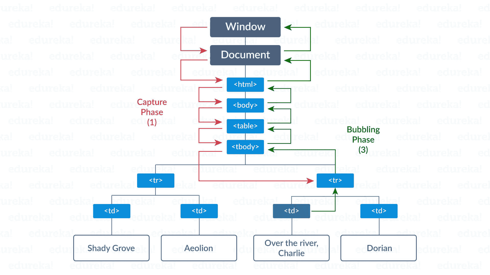
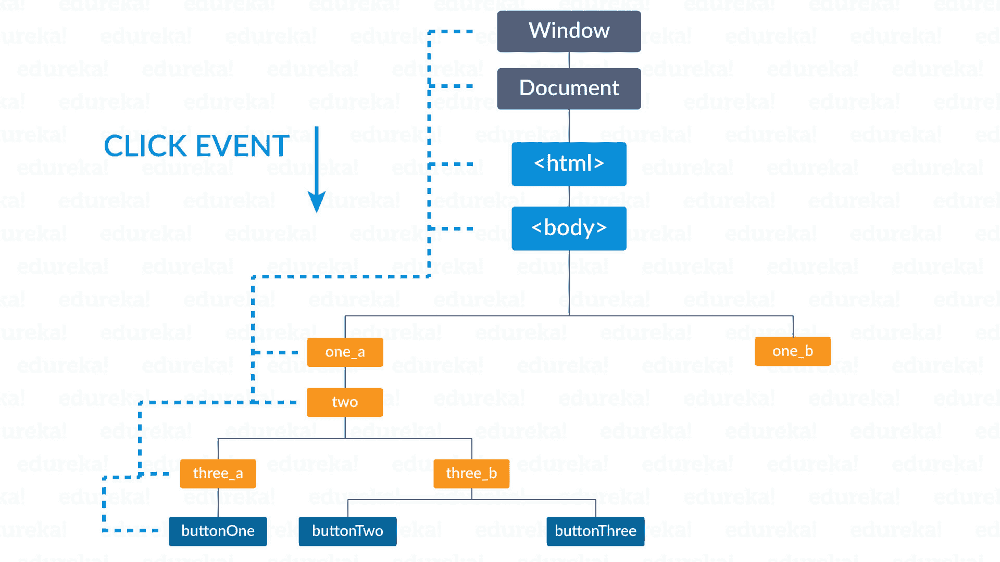
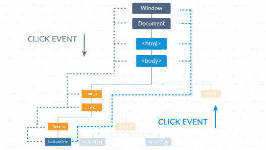

# JavaScript 中的事件冒泡和事件捕获:您需要知道的一切

> 原文：<https://www.edureka.co/blog/event-bubbling-and-event-capturing/>

事件冒泡和事件捕获是事件流时代 JavaScript 中使用最多的术语。这是 HTML DOM API 中事件传播的两种方式。这篇关于 JavaScript 中的事件冒泡和事件捕获的文章将按照以下顺序详细描述为什么我们在 [web 开发](https://www.edureka.co/masters-program/full-stack-developer-training)中需要这些:

## ****JavaScript 中什么是事件冒泡？****

事件冒泡是人们在使用 [JavaScript](https://www.edureka.co/blog/javascript-tutorial/) 开发 web 应用程序或网页时必然会遇到的术语。基本上，事件冒泡是一种技术，当一个项目嵌套在另一个项目上并且必须是同一事件时，调用事件处理程序。它类似于封装。



事件冒泡只是 JavaScript 中事件处理的一小部分。为了更好地理解它，我们必须了解事件传播以及它如何支持事件冒泡。

## ****什么是事件传播？****

事件传播可以被比作父术语，事件冒泡和捕获是它的子术语。 表示如下:

```

<ul>
    <li><a href="..."></a>
    <li><a href="..."></a>
    <li><a href="..."></a>
</ul>

```

如果你点击任何一张图片，那么它不仅会产生一个点击事件，而且会继续到父“a”和祖父“李”。通过这种方式，功能得以传播。这里，图像被视为子图像，它是生成单击的事件目标。图像和它的祖先一起形成了树术语中的分支。分支很重要，因为我们知道事件传播的路径。



每个监听器分别被一个收集事件信息的事件对象调用。这种传播非常重要，因为我们开始了解为给定事件调用所有侦听器的过程。从上图中我们可以注意到，分支确定是静态的。事件期间发生的任何树修改都将被忽略。这里的传播是双向的，即从窗口到事件目标，然后再返回。这里的传播大致分为三种主要类型。那些是:

1.  **捕获阶段:**从窗口进入事件目标阶段。
2.  **目标阶段:**是目标阶段。
3.  **气泡阶段:**从事件目标父窗口返回。

## ****什么是事件捕捉？****

在这个阶段，捕获器监听器被调用，其值被注册为“真”。它是这样写的:

```

el.addEventListener('click', listener, true)

```

这里监听器值已经注册为“true ”,所以这个事件被捕获。如果没有值，则缺省值为 false，事件不会被捕获。所以在这个阶段，值为 true 的事件只能从窗口中找到它们的路径，并被调用和捕获。

然后，在事件目标阶段，所有注册的侦听器都会被调用，不管它们的标志状态是真还是假。

## ****JavaScript 中事件冒泡和事件捕获的使用****

在冒泡阶段，只调用非捕获者，即标志值为“假”的事件。事件冒泡和事件捕获在 DOM(文档对象模型)术语中非常有用和重要。

```

el.addEventListener('click', listener, false) // listener doesn't capture
el.addEventListener('click', listener) // listener doesn't capture

```

上面这段代码展示了冒泡和捕获阶段的工作。并非所有事件都指向事件目标。有些不会冒泡。他们的行程在目标阶段后停止。三事件阶段流程如下图所示:



事件冒泡并不适用于所有类型的事件，但是，监听器必须具备 *。气泡* 事件对象的布尔属性。其他一些属性包括:

1.  **e.target:** 引用事件目标。
2.  **e.currentTarget:** 当前监听器注册的模式。这里的值是用 ***这个*** 关键字引用的。
3.  **e.eventPhase:** 是一个整数，是指 ***捕捉 _ 阶段、冒泡 _ 阶段、AT _ 目标*** 阶段等其他三个关键字。

## ****工序****


让我们仔细看看上图。让我们单击“buttonOne”元素，然后立即会触发一个事件。通常，一个事件从树的最顶端的根开始它的旅程。然后，它沿着树的目标事件“按钮一”。它是这样传播的:



如图所示，事件通过 DOM 术语最终到达目标事件。现在，一旦事件到达目标，它就不会结束。如下图所示，它在 DOM 术语中不断出现。



就像以前一样，事件路径上的每个元素在向上移动时都会收到关于其存在的通知。照这样下去，你一定在想我们是否能停止这个过程。这个问题的答案是肯定的，我们可以阻止事件的传播。这是通过调用事件对象的 ***【停止传播】*** 方法来完成的。

```

window.addEventListener('click', e => { e.stopPropagation(); }, true);
window.addEventListener('click', listener('c1'), true);
window.addEventListener('click', listener('c2'), true);
window.addEventListener('click', listener('b1'));
window.addEventListener('click', listener('b2'));

```

通过应用关键字，我们能够阻止传播。它是这样工作的，当我们应用关键字"***【stop propagation】***时，主事件下的所有事件都不会被调用，因此它们不会像上面这段代码中提到的那样被调用。还有另外一个关键字叫做“***”stopmimitepropagation。*** 顾名思义它立即停止了姐弟的诉讼。

说到这里，我们的文章就到此为止了。我希望您了解 JavaScript 中的事件冒泡和事件捕获是什么。

*既然你已经了解了 JavaScript 中的事件冒泡和事件捕获，那就来看看 Edureka 的 **[Web 开发认证培训](https://www.edureka.co/complete-web-developer)** 。* *Web 开发认证培训将帮助您学习如何使用 HTML5、CSS3、Twitter Bootstrap 3、jQuery 和 Google APIs 创建令人印象深刻的网站，并将其部署到亚马逊简单存储服务(S3)。*

*有问题吗？请在“JavaScript 中的事件冒泡和事件捕获”的评论部分提到它，我们会回复您。*