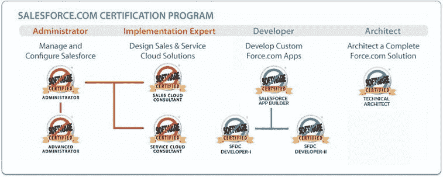
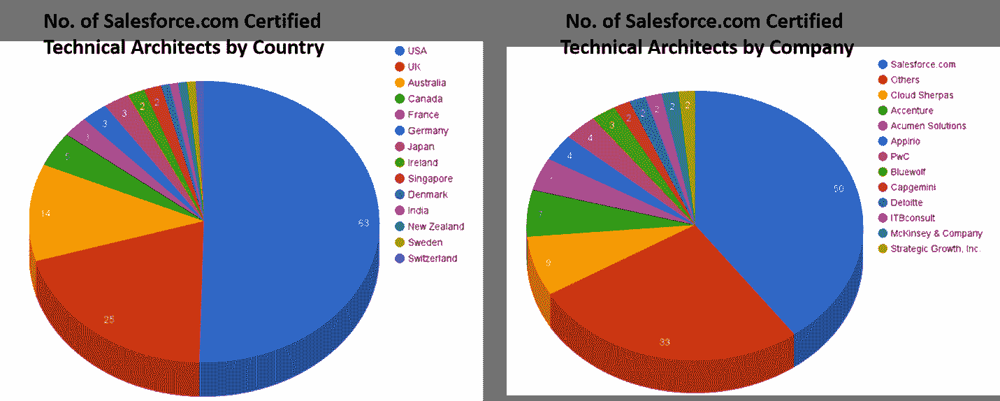
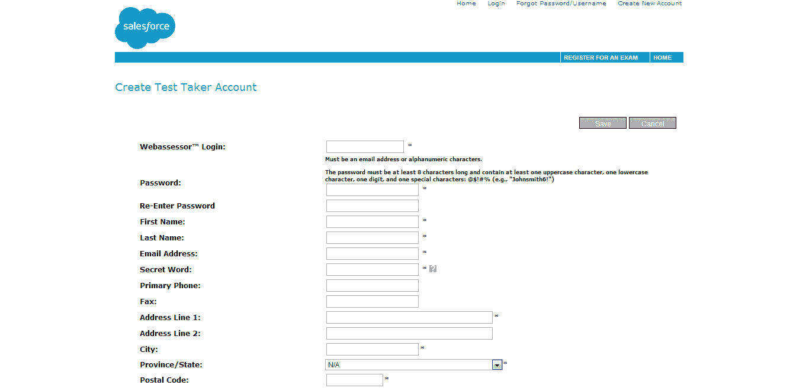
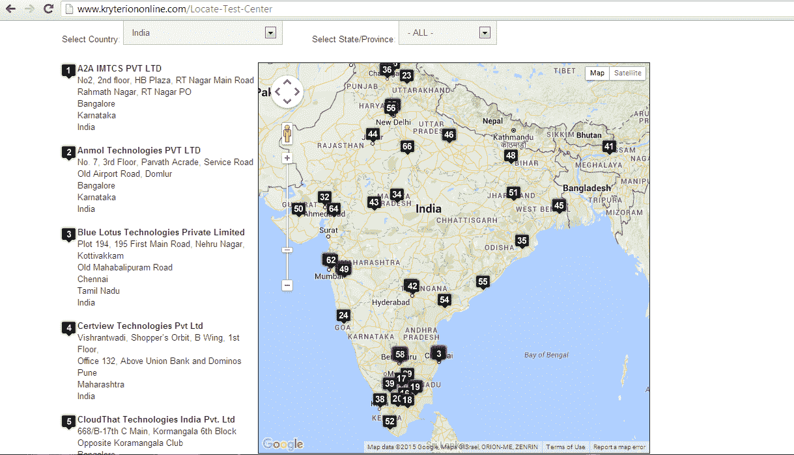
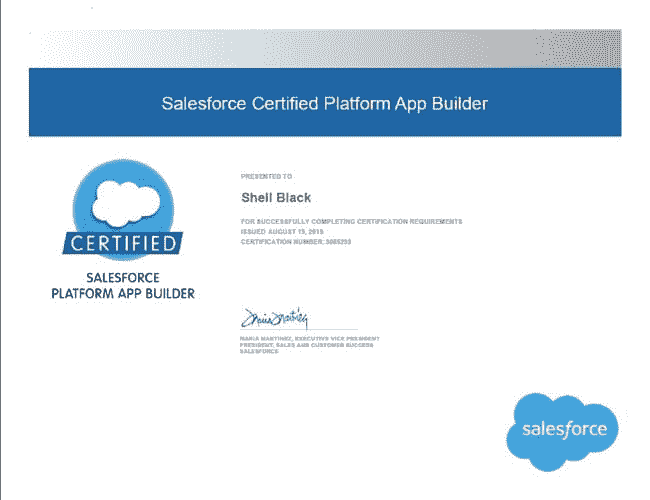
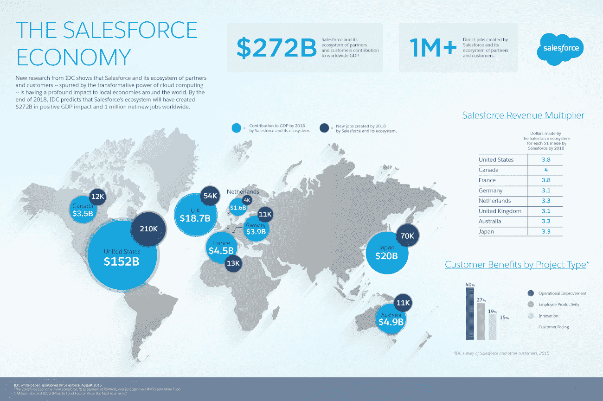

# 关于 Salesforce 认证您需要知道的一切

> 原文：<https://www.edureka.co/blog/everything-you-need-to-know-about-salesforce-certification>

困于基于过时技术的遗留工作，如 Java。NET 甚至更差的大型机和测试？你是一个找不到工作的新生吗？这是转向 Salesforce 并获得 Salesforce 认证的最佳时机，这是当今数字世界最热门的领域。

## **为什么选择 Salesforce？**

在当今技术驱动的世界中，业务随着客户需求的变化而不断变化。顾客与品牌互动的方式也在改变。Salesforce 在连接客户和企业方面发挥着重要作用。Salesforce 是云计算领域的头号平台，在云 CRM 领域拥有超过 40%的市场份额，在整体 CRM 领域拥有超过 15%的市场份额。截至 2015 年，其价值为 50 亿美元，预计到 2020 年将达到 200 亿美元。他们的最新产品 Salesforce1 提供移动支持、物联网(IoT)功能和 SMAC(社交、移动、分析和云)组件。

## **对考哪个 Salesforce 认证迷茫？**

Salesforce.com 提供各种各样的证书，其中有两个突出的类别:管理员和开发者。在管理员课程中，你可以作为一名**管理员(201)** 从基础水平开始，然后继续前进到**高级管理员(211)。或者，**可以尝试成为**职能顾问**，这允许你获得**销售云**认证和**服务云**认证。

以前，开发人员路线由两个认证组成，即**开发人员(开发 401)** 和**高级开发人员(开发 501)** 。最近，Salesforce 更新了课程并将认证分为 3 个部分: **App Builder、开发人员 1、开发人员 2。**

**技术架构师**认证是 Salesforce 可以获得的最高级别的认证。迄今为止，世界上只有大约 125 名技术建筑师，这是世界上薪酬最高的工作之一。

*   ## **销售力量管理员认证**

Salesforce 认证管理员负责管理 Salesforce 应用程序；更具体地说，可以管理任何组织或部门的 Salesforce 实施的个人。参加这项认证没有先决条件。但是，Salesforce 管理员认证是参加高级管理员考试的先决条件。

## **如何成为 Salesforce 管理员| Salesforce 管理员培训| Edureka**

[//www.youtube.com/embed/ACMpeK-RiGQ?rel=0&showinfo=0](//www.youtube.com/embed/ACMpeK-RiGQ?rel=0&showinfo=0)This “How to become a Salesforce Administrator” video by Edureka will help you understand who is a Salesforce Administrator and what are their roles and responsibilities. It will also talk about how to become a Salesforce Administrator.

**先决条件:**参加认证不需要额外费用。但是，建议参加 [Salesforce 管理员认证培训](https://www.edureka.co/salesforce-administrator-and-developer-training) 。

**谁该拿这个？**

*   MBA 毕业生
*   对管理员入门感兴趣的新生，他们可以选择将来转到职能部门或开发人员轨道。
*   具有 Siebel、PeopleSoft、SAP CRM 或任何其他领域经验的职能顾问
*   从事功能测试并寻求职业改变的侧边人员

*   ## [**销售力量开发者认证**](https://www.edureka.co/salesforce-platform-developer-1-certification-training)

通过使用 Salesforce 平台的声明性功能来构建和维护应用程序，Salesforce 认证开发人员拥有掌握软件开发管理的知识、技能和经验。管理员概念将构成开发人员跟踪的基础。然而，他们应该理解像构建数据模型、选择关系和确保定制应用程序的安全性这样的概念。

## **如何成为 Salesforce 开发者| Salesforce 初学者| Salesforce 培训| Edureka**

[//www.youtube.com/embed/SFpW5dtkoRg?rel=0&showinfo=0](//www.youtube.com/embed/SFpW5dtkoRg?rel=0&showinfo=0)This Edureka video on ‘How to become a Salesforce Developer’ will help you understand who is a Salesforce Developer and what are their roles and responsibilities. It will also talk about how to become a Salesforce Developer.

**先决条件**:参加该认证不需要额外条件。但是，建议参加 [Salesforce 开发人员培训](https://www.edureka.co/salesforce-administrator-and-developer-training)。

**谁该拿这个？**

*   持有 B.Tech、BE 或 MCA 学位的新生。
*   拥有 6 个月以上 Java、C#或 web 技术(如 HTML、JavaScript 和 CSS)经验的专业人士。
*   拥有大型机、AS400 等技术经验或测试背景的专业人士。

**考试结构**

考试可以在全球各地的考试中心现场进行。或者，您可以尝试在线监考。下面是几点考试的提示:

*   60 道选择题
*   完成考试需要 90 分钟
*   65%是及格分数
*   报名费为 200 美元
*   重考费用为 100 美元
*   考试期间不得参考硬拷贝或在线资料

从表面上看，考试可能看起来很容易，因为你只需要答对 60 道题中的 39 道，而且没有负分。但是当有多个选择选项的问题时，就变得很棘手了。例如，您可能会遇到这样的问题，要求您为一个问题选择三个正确答案。在这种情况下，没有部分标记，因此一个错误的答案选项会破坏其他两个可能正确的选项。

## **如何报名考试？**

第一步是在网上评估员处创建一个考生账户。不要忘记注册您的个人 ID，因为完成考试后，您是认证的所有者，而不是您的公司。

创建帐户后，您可以登录并注册参加考试。建议您提前 3 个月注册，以便获得您喜欢的时间和足够的时间来准备。

如果您想在任何一个考点参加考试，您可以访问 http://www.kryteriononline.com/Locate-Test-Center 的，选择离您最近的考点。

## **我如何得到我的结果？**

你一考完试就会知道结果。你会立刻知道你是通过了还是失败了。没有关于分数的更多细节被透露。您还将获得一份您注册的电子邮件 id 的可打印证书。此外，您将收到加入 Salesforce success 社区的 Salesforce 认证专家小组的邀请。

## **工作前景如何？**

销售力被认为是当今市场所需的 10 大技能之一。预计到 2018 年，Salesforce 生态系统及其客户和合作伙伴将在全球创造 100 万个就业岗位，并创造 2720 亿美元的 GDP。这些工作将带动另外 150 万个供应和分销链的间接工作。为了得到你梦想中的工作，今天就参加我们在 T2 雷德蒙的销售队伍培训。

*有问题吗？请在评论区提到它，我们会给你回复。*

**相关帖子:**

开始参加 [Salesforce 管理员认证](https://www.edureka.co/salesforce-administrator-and-developer-training)培训。

通过参加 [Salesforce CPQ 认证](https://www.edureka.co/masters-program/salesforce-architect-certification-course)培训掌握 salesforce。

[CRM sales force 和云计算简介](https://www.edureka.co/blog/introduction-to-crm-salesforce-and-cloud-computing?.com-certification-24dec15 "Introduction to CRM Salesforce and Cloud Computing")