# 什么是 MS Excel，如何使用？

> 原文：<https://www.edureka.co/blog/excel-tutorial/>

数据是每个时代过去、现在和将来都需要的最一致的原材料，而世界上几乎每个人用来管理数据的最流行的工具无疑是 Microsoft Excel。几乎每个组织都在使用 Excel，它如此受欢迎和重要，每个人肯定都有 Excel 的知识。如果您还没有接触到它，不要担心，因为这个 Excel 教程将指导您完成所有您需要知道的内容。

以下是这里讨论的所有话题的一瞥:

*   [什么是 Excel？](#Excel)
*   [如何启动 Excel？](#launchexcel)
*   [屏幕选项](#screenoptions)
*   [后台视图](#Backstage)
*   [练习册和工作表](#workbooksandworksheets)
*   [编辑工作表](#editingworksheets)
*   [格式化 MS Excel 工作表](#formattingworksheets)
*   [MS Excel 公式](#formulas)
*   [功能](#functions)

## **什么是 Excel？**

Microsoft Excel 是由微软开发的电子表格(允许以表格形式存储数据的计算机应用程序)。它可以在 Windows、macOS、IOS 和 Android 平台上使用。它的一些功能包括:

*   绘图工具
*   函数(计数、求和、文本、日期和时间、财务等)
*   数据分析(过滤器、图表、表格等)
*   Visual Basic for Application (VBA)
*   包含 300 个例子
*   工作簿和工作表
*   数据验证等

## **如何启动 Excel？**

按照以下步骤启动 Excel:

1.  从官网下载 MS Office
2.  在搜索栏中，键入 MS Office，然后从同一搜索栏中选择 MS Excel

完成后，您将看到以下屏幕:

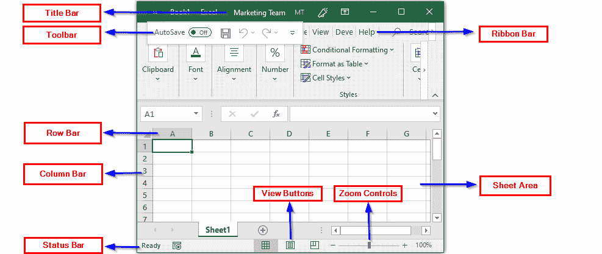

## **屏幕选项:**

### **标题栏:**

它显示工作表的标题，出现在 Excel 窗口顶部的正中间。

### **快速访问工具栏:**

该工具栏包含所有常用的 Excel 命令。如果您想将一些常用的命令添加到该工具栏中，可以通过自定义快速访问工具栏来轻松完成。为此，右键单击它并选择“自定义快速访问工具栏”选项。您将看到以下窗口，您可以从中选择想要添加的适当命令。

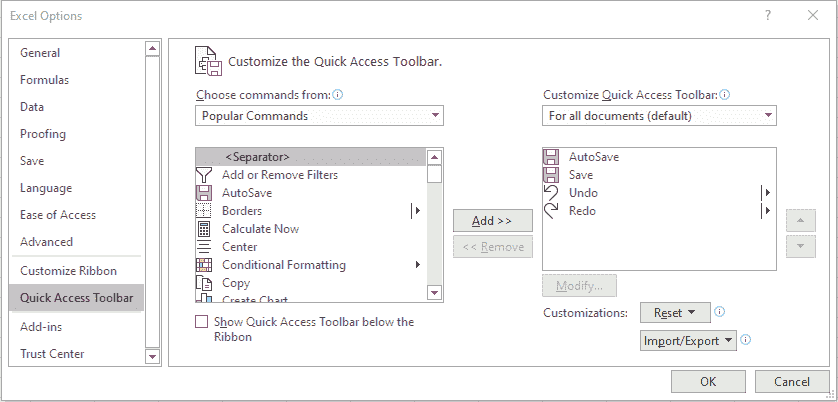

### **丝带:**

功能区选项卡由文件、主页、插入、页面布局、视图等选项卡组成。Excel 选择的默认选项卡是“主页”选项卡。就像快速访问工具栏一样，您也可以自定义功能区选项卡。

要自定义功能区选项卡，请右键单击选项卡上的任意位置，然后选择“自定义功能区”选项。您将看到以下对话框:

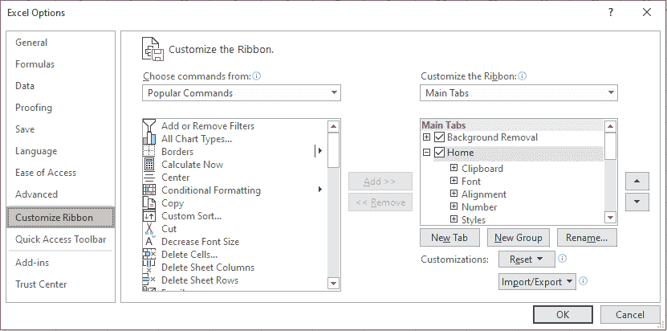

在这里，您可以根据自己的喜好选择要添加到功能区栏的任何选项卡。

功能区选项卡选项分为三个部分，即选项卡、组和命令。选项卡基本上出现在顶部，包括主页、插入、文件等。组由所有相关命令组成，如字体命令、插入命令等。命令单独出现。

### **缩放控制:**

它允许您根据需要放大和缩小工作表。为此，您只需向左或向右拖动滑块，分别放大和缩小。

### **查看按钮:**

包含三个选项，即普通布局视图、页面布局视图和分页符视图。普通布局视图在普通视图中显示工作表。页面布局视图允许您查看页面，就像从页面中打印出来一样。分页符视图基本上显示了打印时页面将在哪里断开。

### **纸张面积:**

这是将插入数据的区域。闪烁的竖线或插入点指示数据插入的位置。

### **横条:**

行栏显示行号。从 1 开始，上限是 1，048，576 行。

### **栏条:**

列栏按 A-Z 顺序显示列。它从 A 开始，一直持续到 Z，接着是 AA，AB 等等。列的上限是 16，384。

### **状态栏:**

它用于显示工作表中活动单元格的当前状态。有四种状态，即就绪、编辑、输入和指向。

**就绪**顾名思义，用来表示工作表可以接受用户的输入。

**编辑**状态表示单元格处于编辑模式。要编辑某个单元格的数据，只需双击该单元格并输入所需的数据。

**输入**模式在用户开始在选择编辑的单元格中输入数据时启用。

**点**模式在参照其他单元格中的数据将公式输入单元格时启用。

## **后台视图:**

Backstage 视图是所有 Excel 表格的中央管理位置。在这里，您可以创建、保存、打开打印或共享您的工作表。要进入后台，只需点击**文件**，您将看到一个列，其中有多个选项，如下表所示:

| [计]选项 | 描述 |
| 新的 | 用于打开新的 Excel 表格 |
| 信息 | 给出当前工作表的信息 |
| 打开 | 为了打开以前创建的一些工作表，可以使用 open |
| 关闭 | 关闭打开的工作表 |
| 最近的 | 显示所有最近打开的 Excel 表格 |
| 分享 | 允许您共享工作表 |
| 救援 | 要按原样保存当前工作表，请选择“保存” |
| 另存为 | 当您必须为工作表重命名并选择特定的文件位置时，可以使用“另存为” |
| 打印 | 用于打印工作表 |
| 出口 | 允许您为工作表创建 PDF 或 XPS 文档 |
| 账户 | 包含所有帐户持有人的详细信息 |
| 选择 | 显示所有 Excel 选项 |

## **工作簿和工作表:**

### **工作簿:**

是指您的 Excel 文件本身。打开 Excel 应用程序时，单击空白工作簿选项创建一个新工作簿。

### **工作表:**

指管理数据的单元格的集合。每个 Excel 工作簿可以有多个工作表。这些图纸将显示在窗口的底部，它们各自的名称如下图所示。

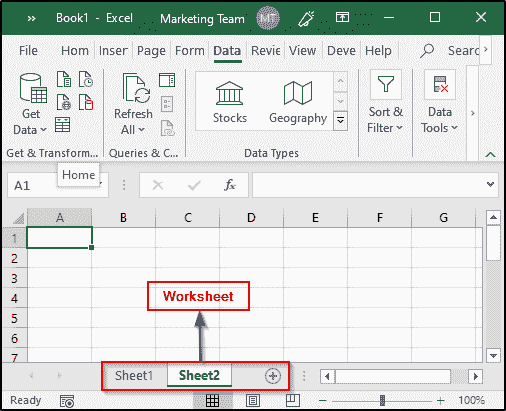

### **使用 Excel 工作表:**

#### **输入数据:**

如前所述，数据被输入到工作表区域，闪烁的竖线表示单元格以及数据将被输入到该单元格的位置。如果您希望选择某个特定的单元格，只需左键单击该单元格，然后双击它，使**进入**模式。你也可以使用键盘的箭头键在周围移动**。**

#### **保存新工作簿:**

要保存您的工作表，单击**文件**选项卡，然后选择**另存为**选项。选择要保存工作表的适当文件夹，并用适当的名称保存。Excel 文件的默认保存格式是**。xlsx** 格式。

如果您对现有文件进行了更改，您只需按下 **Ctrl+S** 或打开**文件**选项卡，选择**保存**选项。Excel 还在快速访问工具栏中提供了**软盘图标**，帮助您轻松保存工作表。

#### **创建新工作表:**

要创建新工作表，请单击当前工作表旁边的+图标，如下图所示:

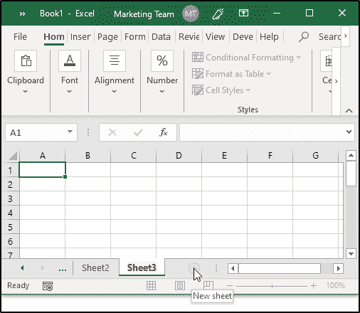

您也可以右键单击工作表并选择**插入**选项来创建一个新的工作表。Excel 还提供了创建新工作表的快捷方式，即使用 **Shift+F11。**

#### **移动和复制工作表:**

如果您有一个工作表，并且想要创建它的另一个副本，您可以执行以下操作:

1.  右键单击要复制的页面
2.  选择“移动或复制”选项

将出现一个对话框，您可以选择将纸张移动到所需位置，在该对话框的末尾，您将看到一个选项“创建副本”。通过选中该框，您将能够创建现有工作表的副本。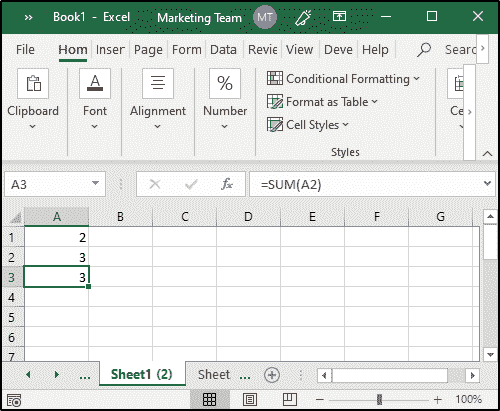

您也可以左键单击板材，并将其拖至所需位置，以移动板材。要重命名文件，请双击所需的文件并重命名。

#### **隐藏和删除工作表:**

为了隐藏工作表，右键单击该工作表的名称并选择**隐藏**选项。相反，如果你想撤销此操作，右击任意工作表名称并选择**取消隐藏**选项。您将看到一个包含所有隐藏工作表的对话框，选择要取消隐藏的工作表，然后单击确定。

要删除一个工作表，右击工作表名称并选择**删除**选项。如果工作表是空的，它将被删除，否则您将看到一个对话框，警告您可能会丢失存储在该特定工作表中的数据。

#### **打开和关闭工作表:**

要关闭工作簿，点击**文件**选项卡，然后选择**关闭**选项。您将看到一个对话框，要求您选择是否将对工作簿所做的更改保存到所需的目录中。

要打开之前创建的工作簿，点击**文件**选项卡并选择**打开**选项。当您选择“打开”时，您将看到以前创建的所有工作表。左键单击您想要打开的文件。

#### **Excel 上下文帮助:**

Excel 有一个非常特殊的功能，称为上下文帮助功能，它提供有关 Excel 命令的适当信息，以便让用户了解其工作方式，如下图所示:

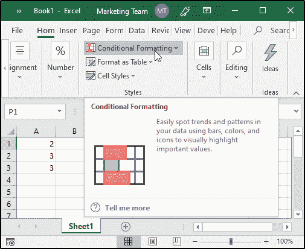

### **编辑工作表:**

excel 工作表中的单元格总数是 16，384 x 1，048，576。输入的数据类型可以是任何形式，如文本、数字或公式。

#### **插入、选择、移动和删除数据:**

##### **插入数据:**

要输入数据，只需选择要插入数据的单元格，并输入相同的内容。对于公式，您需要直接在单元格中输入，或者在顶部的公式栏中输入，如下图所示:

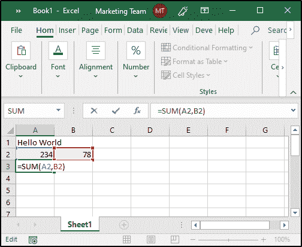

##### **选择数据:**

选择 Excel 数据有两种方式。第**个**也是最简单的方法就是利用**鼠标**。只需单击所需的 and 单元格，然后双击它。此外，如果您想要选择一个完整的数据条目部分，按住左键并向下拖动，直到您想要选择的单元格。您也可以按住 Ctrl 键并左键单击随机单元格来选择它们。

方法是使用“转到”对话框。要激活此框，您可以点击**主页**选项卡并选择**查找并选择**选项，或者只需点击 Ctrl+G。您会看到一个对话框出现，其中有一个“特殊”选项。单击该选项，您将看到另一个对话框，如下图所示:

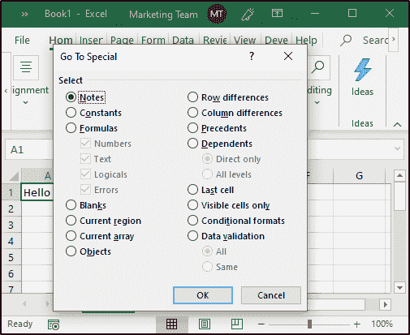

从这里，检查您想要选择的适当区域，然后单击确定。完成后，您将看到您选择的整个区域都已被选中。

##### **删除数据:**

为了删除一些数据，你可以使用以下技巧:

*   单击所需的单元格，并突出显示要删除的数据。然后按键盘上的删除键
*   选择要删除数据的一个或多个单元格，然后单击右键。然后选择删除选项
*   您也可以单击行号或列标题来删除整个行或列

##### **移动数据:**

Excel 还允许您轻松地将数据移动到所需的位置。只需两个简单的步骤就可以做到这一点:

1.  选择要移动的整个区域，然后单击右键
2.  点击“剪切”,选择您想要放置数据的第一个单元格，并使用“粘贴”选项将其粘贴

#### **复制、粘贴、查找和替换:**

##### **复制粘贴:**

如果要在 Excel 中复制和粘贴数据，可以通过以下方式来完成:

*   选择您想要拷贝的区域
*   右键单击并选择复制选项或按 Ctrl+C
*   选择要复制的第一个单元格
*   点击右键并点击粘贴选项或只需按 Ctrl+V

Excel 还提供了一个剪贴板，用于保存您复制的所有数据。如果您想要粘贴任何数据，只需从剪贴板中选择它，然后选择粘贴选项，如下所示:

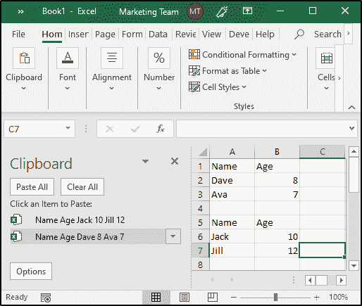

##### **查找并替换:**

要查找和替换数据，您可以从主页选项卡中选择查找和替换选项，或者只需按 Ctrl+F。您将看到一个对话框，其中包含查找和替换所需数据的所有相关选项。

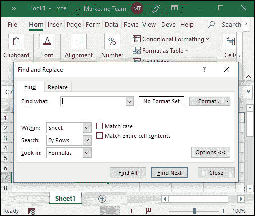

#### **特殊符号:**

如果您需要输入键盘上没有的符号，您可以使用 Excel 中提供的特殊符号，在这里您可以找到公式和符号。为了选择这些符号，点击**插入**选项卡并选择**符号**选项。您将有两个选项，即等式和符号，如下所示:

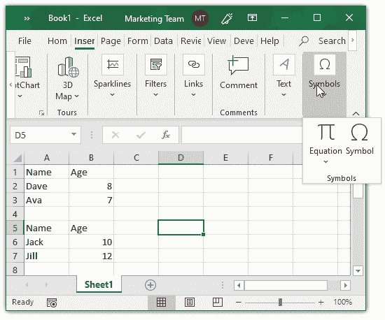

如果选择**方程**，会发现圆的面积、二项式定理、和的展开式等一系列方程。如果选择该符号，您将看到以下对话框:

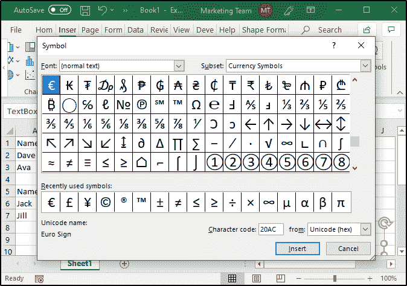

您可以选择您选择的任何符号，然后单击插入选项。

#### **对单元格进行注释:**

为了清楚地描述数据，添加注释是很重要的。Excel 允许您添加、修改和格式化注释。

**添加评论或注释:**

您可以添加注释和备注，如下所示:

*   右键单击需要添加注释的单元格，然后选择新建注释/新建注释
*   按 Shift+F2(新注释)
*   从功能区中选择“审阅”选项卡，然后选择“新建注释”选项

注释对话框将保存系统的用户名，该用户名可以由适当的注释替换。

##### **编辑评论和注释:**

要编辑注释，右键单击包含注释的单元格，选择“编辑注释”选项并相应地更新它。如果您不再需要该注释，请右键单击包含该注释的单元格，然后选择删除注释选项。

如果是注释，只需选择包含注释的单元格，它将打开注释对话框，您可以在其中编辑或删除注释。您也可以回复处理该工作表的其他用户指定的注释。

### **格式化单元格:**

Excel 工作表的单元格可以针对它们所能容纳的各种类型的数据进行格式化。有多种方法可以格式化单元格。

**设置单元格类型:**

Excel 表格的单元格可以设置为特定的类型，如常规、数字、货币、会计等。要做到这一点，右键单击您想要指定某种特定类型数据的单元格，然后选择格式单元格选项。您将看到如下图所示的对话框，其中有许多选项可供选择。

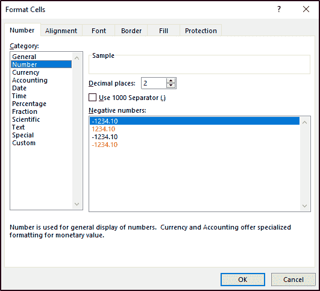

| 类型 | 描述 |
| 一般 | 没有特定的格式 |
| 数字 | 数字的一般显示 |
| 货币 | 单元格将显示为货币 |
| 会计 | 它类似于货币类型，但用于帐户 |
| 日期 | 允许各种类型的日期格式 |
| 时间 | 允许各种类型的时间格式 |
| 百分率 | 以百分比显示的单元格 |
| 分数 | 该单元格显示为分数 |
| 科学的 | 以指数形式显示单元格 |
| 文本 | 对于普通文本数据 |
| 特别的 | 您可以输入特殊类型的格式，如电话号码、邮政编码等 |
| 习俗 | 允许自定义格式 |

##### **选择字体和修饰数据:**

您可以修改 Excel 表格上的**字体**，如下所示:

*   单击主页选项卡，从字体组中选择所需的字体
*   右键单击单元格并选择单元格格式选项。然后，从对话框中选择字体选项，并相应地修改文本

如果您想修改数据的外观，可以使用各种选项，如粗体、斜体、下划线等，这些选项出现在如上图所示的同一对话框中，或者来自“主页”选项卡。您可以选择删除线、上标和下标等效果选项。

#### **旋转单元格:**

Excel 表格的单元格可以旋转任意角度。为此，单击主页中的方向组选项卡，并选择所需的方向类型。

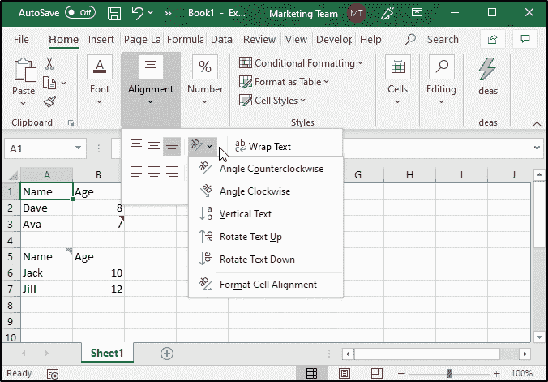

这也可以通过在单元格格式对话框中选择对齐选项来完成。您还可以选择以各种方式对齐数据，如顶部、居中、两端对齐等，您还可以使用上下文、从左到右和从右到左选项来更改方向。

#### **合并和缩小单元格:**

##### **合并:**

MS Excel 工作表的单元格可以根据需要进行合并和取消合并。合并 Excel 工作表的单元格时，请记住以下几点:

*   合并单元格时，实际上并没有合并数据，但是单元格被合并后表现为一个单元格
*   如果您尝试合并两个或更多包含数据的单元格，则只有左上角单元格中包含的数据会被保留，而其他单元格中的数据会被丢弃

要合并单元格，只需选择您希望合并的所有单元格，然后选择**主页**选项卡中的**合并和控制**选项，或检查**对准窗口**中的合并单元格选项。

##### **收缩/包装:**

如果单元格包含大量数据，并开始突出显示其他单元格，您可以使用**收缩以适应/环绕文本**选项，以减小尺寸或垂直对齐文本。

#### **添加边框和阴影:**

如果您想为工作表中的单元格添加边框和阴影，请选择该单元格，右键单击并选择“单元格格式”选项。

##### **边框:**

要添加边框，请从“单元格格式”窗口打开边框窗口，然后选择要添加到该单元格的边框类型。你也可以改变厚度、颜色等。

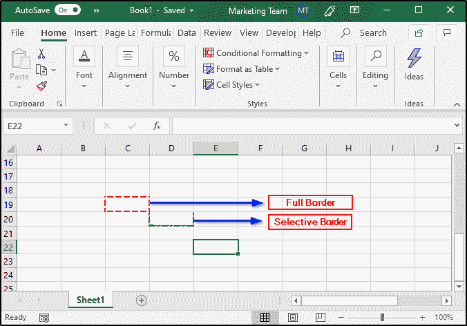

##### **阴影:**

如果您想要给单元格添加一些阴影，请选择该单元格，然后从“单元格格式”窗口中打开“填充”面板，然后选择合适的颜色。

### **格式化 MS Excel 工作表:**

#### **纸张选项:**

Excel 表格提供了许多选项，用于打印出适当的结果。使用这些选项，您可以有选择地以各种方式打印工作表。要打开“工作表选项”窗格，请从“主页”选项卡中选择“页面布局组”,然后打开页面设置。在这里，您将看到下表中列出的许多纸张选项:

| [计]选项 | 描述 |
| 打印区域 | 设置打印区域 |
| 打印标题 | 允许您将行标题和列标题分别设置为显示在顶部和左侧 |
| 网格线 | 网格线将被添加到打印输出中 |
| 黑色和白色 | 打印出来是黑白的还是单色的 |
| 草稿质量 | 使用打印机的草稿质量打印纸张 |
| 行和列标题 | 允许您打印行标题和列标题 |
| 向下，然后向上 | 先打印下页，然后打印右页 |
| 结束，然后向下 | 先打印右页，然后打印下页 |

#### **页边距和页面方向:**

##### **页边距:**

沿自上而下和左右两侧的未打印区域称为页边距。所有 MS Excel 页面都有边框，如果您为一个页面选择了边框，那么该边框将应用于所有页面，即每页不能有不同的页边距。您可以按如下方式添加页边距:

*   从“页面布局”选项卡中，选择“页面设置”对话框，在那里，您可以单击“页边距”下拉列表或通过最大化“页面设置”窗口来打开“页边距”窗口窗格
*   您也可以在打印页面时添加页边距。为此，选择文件选项卡并单击打印。在这里，您可以看到一个下拉列表，其中包含所有的利润选项

##### **页面方向:**

页面方向是指打印纸张的格式，即纵向和横向。默认情况下，纵向打印页面的高度大于宽度。另一方面，横向打印的纸张宽于高。

要选择特定类型的页面方向，请从页面设置组中选择下拉列表，或者最大化页面设置窗口并选择适当的方向。您还可以在打印 MS Excel 工作表时更改页面方向，就像您处理边距一样。

#### **页眉和页脚:**

页眉和页脚用于在页面的顶部和底部提供一些信息。新工作簿没有页眉或页脚。为了添加它，您可以打开**页面设置**窗口，然后打开**页眉/页脚**窗格。在这里，您将有许多选项来定制页眉和页脚。如果您想预览已经添加的页眉和页脚，请单击打印预览选项，您将能够看到您所做的更改。

#### **分页符:**

MS Excel 允许您精确控制要打印的内容和要省略的内容。使用分页符，您将能够控制页面的打印，例如禁止在页面的末尾打印表格的第一行，或者在上一页的末尾打印新页面的页眉。使用分页符可以让您按照自己喜欢的顺序打印工作表。您可以同时使用水平**和垂直**分页符。要包含此选项，请选择要包含分页符的行或列，然后从页面设置组中选择插入分页符选项。

**水平分页符:**

要引入一个**水平分页符，**选择您想要分页的行。请看下图，我引入了一个**水平分页符**，以便在下一页打印 A4 行。

**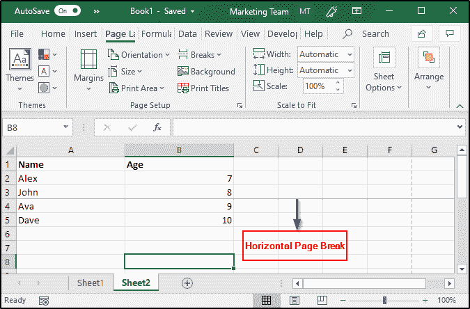**

**垂直分页符:**

要引入一个**垂直分页符，**选择您想要分页的列。请看下图，我在这里引入了一个**垂直分页符**。

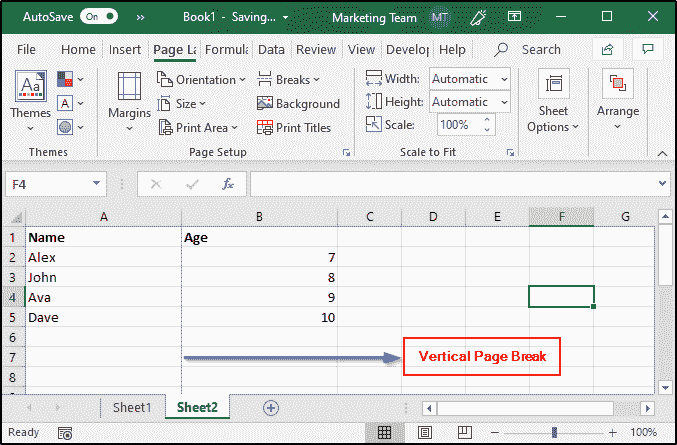

#### **释放窗格:**

MS Excel 提供了一个冻结窗格的选项，即使您一直向下滚动页面，也能看到行和列的标题。为了冻结窗格，您必须:

1.  选择要冻结的行和列
2.  打开视图选项卡并选择冻结窗格组
3.  在这里，您将有三个选项来冻结行和列

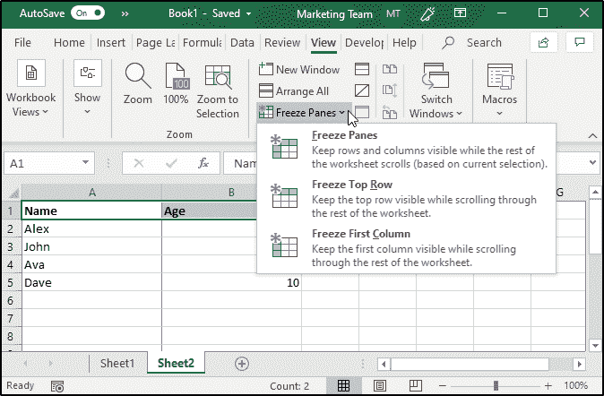

#### **条件格式:**

条件格式允许您有选择地设置一个节的格式，以保存某个指定范围内的值。超出这些范围的值将被自动格式化。下表列出了该功能的多个选项:

| [计]选项 | 描述 |
| 突出显示单元格规则 | 打开另一个列表，该列表定义所选单元格包含大于、等于、小于某个特定值的值、文本或日期 |
| 顶部/底部规则 | 突出显示上/下限值、百分比以及平均值的上限和下限 |
| 数据栏 | 打开带有不同颜色数据条的调色板 |
| 色阶 | 包含带有两种和三种色阶的调色板 |
| 图标集 | 包含不同的图标集 |
| 新规则 | 为自定义条件格式打开一个新的格式规则对话框 |
| 明确的规则 | 允许您删除条件格式规则 |
| 管理规则 | 打开条件格式规则管理器对话框，您可以根据自己的喜好添加、删除或格式化规则 |

### **MS Excel 公式:**

[公式](https://www.edureka.co/blog/basic-excel-formulas-functions/)是 Excel 表格最重要的特性之一。公式基本上是一个可以输入到单元格中的表达式，该特定表达式的输出在该单元格中显示为输出。MS Excel 表的公式可以是:

*   数学运算符(+、-、*等)
    *   例:= A1+B1；将 A1 和 B1 中的值相加并显示输出
*   值或文本
    *   例:100*0.5 的倍数 100 乘以 0.5；只取值并返回结果)
*   单元格引用
    *   例:= A1 = B1 比较 A1 和 B1 的值，并返回 TRUE 或 FALSE
*   工作表函数
    *   例:= SUM(A1:B1)；将 A1 和 B1 的值相加

MS Excel 允许您通过多种方式输入公式，例如:

*   创建公式
*   复制公式
*   公式引用
*   功能

#### **创建公式:**

要创建公式，您必须专门在工作表的公式栏中输入公式。公式应该总是以“=”号开始。您可以通过指定单元格地址或直接指向工作表中的单元格来手动构建公式。

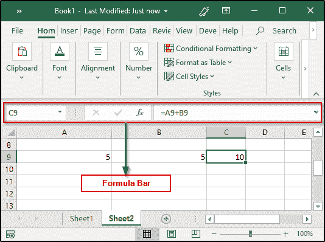

#### **复制公式:**

如果需要计算一些常见的结果，可以复制 Excel 表格公式。Excel 会自动处理在需要相似公式时复制公式的任务。

**相对单元地址:**

就像我之前提到的，Excel 会自动管理原始公式的单元格引用，以便匹配它被复制的位置。这个任务是通过一个叫做相对单元地址的系统来完成的。在这里，复制的公式将修改行和列地址，以适合它的新位置。

要拷贝公式，请选择包含原始公式的单元格，并将其拖到您想要计算公式的单元格。例如，在前面的例子中，我已经计算了 A9 和 B9 的和。现在，为了计算 A10 和 B10 的总和，我所要做的就是，选择 C9 并将其拖到 C10，如下图所示:

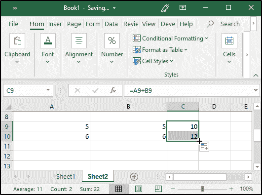

如您所见，公式是在我没有专门指定单元格地址的情况下复制的。

#### **公式引用:**

大多数 Excel 公式都引用了单元格或单元格地址范围，使您能够动态地处理数据。例如，如果我更改前面示例中任何单元格的值，结果将自动更新。

这种寻址可以有三种类型，即相对、绝对或混合。

**相对单元格地址:**

当您复制公式时，行和列引用会相应地更改。这是因为单元格引用实际上是当前列或行的偏移量。

**绝对单元格引用:**

复制时，行和列地址不会被修改，因为引用指向原始单元格本身。绝对引用是在列字母和行号前的地址中使用$符号创建的。例如，$A$9 是一个绝对地址。

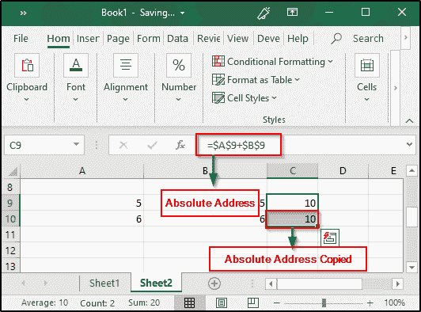

**混合单元格引用:**

这里，单元格或列是绝对的，另一个是相对的。看看下图: 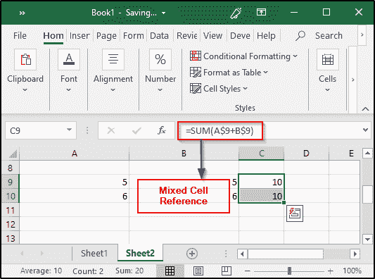

#### **功能:**

MS Excel 中可用的函数实际上处理你创建的许多公式。这些函数实际上定义了复杂的计算，仅使用操作符很难手工定义这些计算。Excel 提供了许多函数，如果您想要某个特定的函数，您只需在公式栏中键入该函数的第一个字母，Excel 就会显示一个下拉列表，其中包含以该字母开头的所有函数。不仅如此，当你将鼠标悬停在这些函数名上时，Excel 会给出精彩的描述。请看下图:

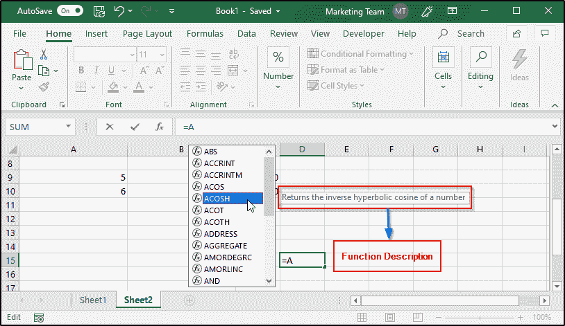

##### **内置函数:**

Excel 提供了大量内置函数，您可以在任何公式中使用这些函数。要查看所有函数，请点击 *fx* ，然后您将看到一个窗口打开，其中包含 Excel 的所有内置函数。在这里，您可以根据函数所属的类别选择任何函数。

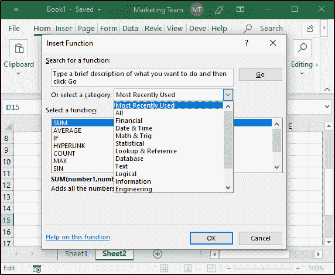

一些最重要的内置 Excel 函数包括 If 语句、SUMIF、COUNTIF、VLOOKUP、HLOOKUP、CONCATENATE、MAX、MIN 等。

#### **数据过滤:**

过滤数据基本上意味着从那些满足特定条件的行和列中提取数据。在这种情况下，其他行或列会被隐藏。例如，如果您有一个学生姓名及其年龄的列表，并且如果您只想筛选出那些 7 岁的学生，您所要做的就是选择一个特定范围的单元格，然后从“数据”选项卡中，单击“筛选”命令。完成后，您将能够看到一个下拉列表，如下图所示:

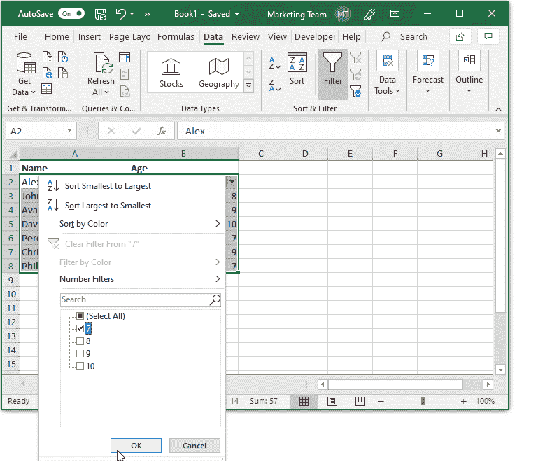

## **高级教程:**

高级 excel 教程包括所有帮助您学习使用 Excel 表管理实时数据的主题。包括使用复杂的 Excel 函数、创建图表、过滤数据、数据透视表和数据透视表、数据图表和表格等。

这就把我们带到了这篇关于 Excel 教程的文章的结尾。我希望你清楚已经与你分享的一切。 ***确保你尽可能多的练习，恢复你的经验。***

此外，如果你想提高自己的能力，学习更多关于数据可视化的知识，成为商业智能专家。现在，请浏览我们的 [Tableau 培训课程](https://www.edureka.co/tableau-certification-training)，获取您应该了解的关于这款强大软件的所有信息。