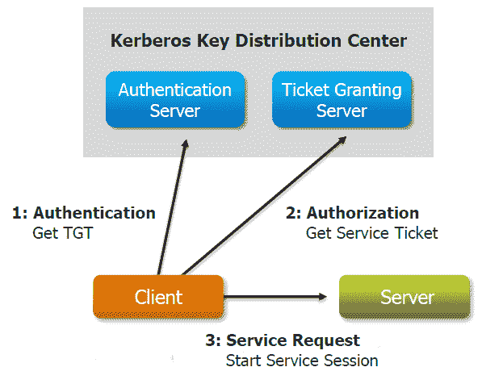

# 解释 Kerberos

> 原文：<https://www.edureka.co/blog/explaining-kerberos/>

[//www.youtube.com/embed/iRt7FoBnlk8](//www.youtube.com/embed/iRt7FoBnlk8)

Hadoop 框架对用户和服务执行的身份验证和授权不充分。这使得任何用户都可以冒充其他用户，绕过 NameNode 直接从 datanode 接收数据块，并窥探 datanode 发送到客户端的数据包。该框架不执行相互身份验证，并允许恶意网络用户模仿集群服务。这就是 Kerberos 的用武之地。让我们看看简单的安全流程是怎样的。

## **什么是 Kerberos？**

Kerberos 是一种网络身份验证协议，旨在通过密钥加密技术为客户端/服务器应用程序提供强身份验证。Kerberos 确保网络资源的最高安全级别。Kerberos 协议的名称是基于希腊神话中的三头狗 Kerberos。

## **Kerberos 的组件:**

Kerberos 由 3 个组件组成；密钥分发中心(KDC)、客户端用户和需要访问服务的服务器。KDC 执行 2 项服务功能:

*   认证服务(AS)
*   售票服务(TGS)

如上图所示，客户端访问服务器时会发生三次交换:

*   作为交换
*   TGS 交易所
*   客户/服务器(CS)交换

## **使用 Kerberos 的 Hadoop 安全设计:**

新的 Hadoop 安全设计利用了 Kerberos 中的委托令牌、作业令牌和块访问令牌。这些令牌中的每一个在结构上都是相似的。

*   委托令牌——用于客户端与 NameNode 通信以访问 HDFS 数据。
*   块访问令牌—用于保护 NameNode 和 DataNodes 之间的通信，以实现 HDFS 文件系统权限。
*   作业令牌-用于保护 MapReduce 引擎、任务跟踪器和单个任务之间的通信。

## **Kerberos 是如何工作的？**

代替客户端向应用服务器发送密码，从认证服务器放置请求票，并且将票连同加密的请求一起发送到应用服务器(由 [杰夫](http://www.dresshead.com/dresshead-staff-profile-jeff-maurer/) 在 [dresshead 网站](http://www.dresshead.com) )。现在，如何在不重复发送凭证的情况下请求门票？这是通过票证授予票证(TGT)完成的。

有问题要问我们吗？在评论区提到它们，我们会给你回复。

**相关帖子:**

[Hadoop 管理培训](https://www.edureka.co/hadoop-admin)

[Hadoop 管理员的工作职责](https://www.edureka.co/blog/hadoop-admin-responsibilities/ "Hadoop Admin Responsibilities")

[如何成为一名 Hadoop 管理员。](https://www.edureka.co/blog/how-to-become-a-hadoop-administrator/ "How to become a Hadoop Administrator?")