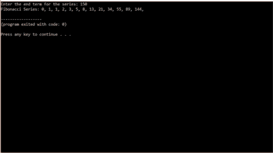
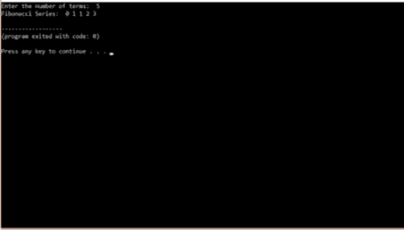

# 如何在 C++中显示斐波那契数列？

> 原文：<https://www.edureka.co/blog/fibonacci-series-in-cpp/>

斐波那契数列是一个奇特的数列，以意大利数学家斐波那契命名。从 0 和 1 开始，斐波纳契数列中的每个新数字都是前面两个数字的和。例如，从 0 和 1 开始，序列中的前 5 个数字是 0、1、1、2、3 等等。在这篇文章中，让我们学习如何用 C++编写斐波那契数列。

本文将涉及以下几点，

*   [什么是斐波那契数列？](#FibonacciSeries)
*   [C++程序生成斐波那契数列，直到用户输入一个数字](#FibonacciSeriestillauserenterednumber)
*   [C++程序利用递归生成斐波那契数列](#FibonacciSeriesusingrecursion)

我们开始吧！

## **什么是斐波那契数列？**

斐波那契数列 是数列中前两个数相加形成的一系列 数。前两项分别为 0 和 1。这之后的项是通过简单地将前两项相加而生成的。

**下面是斐波那契数列的一个例子**:0，1，1，2，3，5，8，13…等等

在上面的例子中，0 和 1 是数列的前两项。这两个术语是直接打印的。第三项是由前两项相加而成的。在这种情况下是 0 和 1。所以，我们得到 0+1=1。因此，1 被打印为第三项。通过使用第二和第三项而不使用第一项来生成下一项。这样做，直到用户请求的项数。在上面的例子中，我们使用了八个术语。

## 这里有一个 C++程序:

```
#include<iostream>
using namespace std;
int main()
{
      int first=0, second=1, i, n, sum=0;
      cout<<"Enter the number of terms: "; cin>>n;
      //accepting the terms
      cout<<"Fibonacci Series: ";

      for(i=0 ; i<n ; i++)
     {  
               if(i <= 1)
	  {
		   sum=i;
                }
                    // to print 0 and 1
                else
                {
                      sum=first + second;
	         first=second;
                      second=sum;  
                       //to calculate the remaining terms.
                      //value of first and second changes as new term is printed.
                }
	 cout<<sum<<" ";
      }	 

   return 0;
}

```

## 输出:

在上面的程序中，我们首先声明所有的变量。首先，我们设置 First 和 second 的值，这些将是我们用来生成更多项的变量。接下来，我们声明 n 项，它将保存项数。我们有一个术语来表示两位数的和，叫做 sum。最后一项是 I，用于 for 循环中的迭代。

我们接受来自用户的术语数，并将其存储在 n 中。然后我们有一个 for 循环，从 0 运行到用户请求的术语数，即 n。

在 for 循环中，我们首先有一个 if 语句，条件是检查 I 的值是否小于 1。如果是零，则打印一个，这取决于术语的数量。当有两个以上的术语时，它用于打印首字母 0 和 1。

如果项数大于 1，则执行循环的 else 部分。在这部分中，变量 first 和 second 的相加被赋给变量 sum。下一项是和变量。例如，将值为 0 和 1 的 first 和 second 相加，得到的和值为 1。

在下一部分中，我们将第二项的值赋给第一项，然后将 sum 的值赋给第二项。这样做是因为对于下一个术语，随着新值的打印，前面的两个值被改变。这是总值。如果我们考虑将 0 和 1 分配给第一个和第二个，在这个步骤之后，第一个的值将是 1，第二个的值也将是 1，因为 sum 的值是 1。

退出 else 部分后，我们打印 sum 值。这一直执行到 I 的值等于 n，循环中断，我们退出程序。

继续这篇关于 C++中斐波那契数列的文章

## **C++程序生成斐波那契数列，直到用户输入一个数字**

**代码:**

```
#include<iostream>
using namespace std;
int main()
{
    int first = 0, second = 1, sum = 0, n;
    cout<<"Enter the end term for the series: "; cin>>n;
     cout<<"Fibonacci Series: "<<first<<" "<<second;

    sum = first + second;
    while(sum <= n)
    {
        cout<<sum<<" ";
        first = second;
        second = sum;
        sum = first + second;
    }

    return 0;
}

```

**输出:**



在这个程序中，我们从用户那里得到最终术语。我们必须显示一个斐波纳契数列直到这个数字。这是通过使用 while 循环来完成的。

我们从用户那里获取输入，这是最后一个术语。然后打印第一项和第二项。在此之后，将第一个和第二个相加，存储在 sum 中。

然后，有一个 while 循环。它一直运行到总和的值小于用户输入的数字的值。在 while 循环中，首先打印出总和。

在下一部分中，我们将第二项的值赋给第一项，然后将 sum 的值赋给第二项。我们再次执行加法，将第一项和第二项相加，并将其赋值为总和。

循环运行，直到总值大于用户输入的数字。

继续这篇关于 C++中的斐波那契数列的文章，让我们写一个 C++程序来使用递归打印斐波那契数列。

## **C++程序使用递归生成斐波那契数列**

另一种编程斐波那契数列生成的方法是使用递归。

## **代码:**

```
#include<iostream>
using namespace std;

int fibonacci(int);

int main()
{
  int n, m= 0, i;
   cout<<"Enter the number of terms: "; cin>>n;
      //accepting the terms
      cout<<"Fibonacci Series: ";
  for (i = 1; i <= n; i++)
  {
    cout<<" "<<fibonacci(m);
    m++;
  }

  return 0;
}

int fibonacci(int n)
{
  if (n == 0 || n == 1)
    return n;
  else
    return (fibonacci(n-1) + fibonacci(n-2));
}

```

**输出:**



在这个程序中，我们使用递归来生成斐波那契数列。函数 Fibonacci 被递归调用，直到我们得到输出。

在函数中，我们首先检查数字 n 是零还是一。如果是，我们返回 n 的值。如果不是，我们用值 n-1 和 n-2 递归调用 Fibonacci。

这些是生成斐波那契数列的方法。就这样，我们来到了这篇文章的结尾。

有问题要问我们吗？请在这篇“C++中的斐波那契数列”博客的评论部分提到它，我们会尽快回复你。