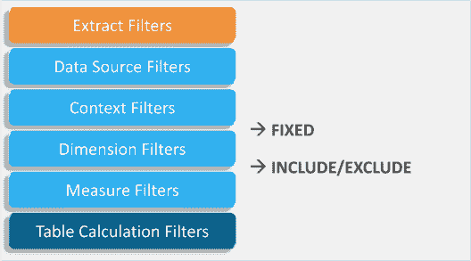

# 你应该如何过滤 Tableau 中的数据？

> 原文：<https://www.edureka.co/blog/filters-in-tableau/>

[***Tableau***](https://www.edureka.co/blog/what-is-tableau/)提供了在维度、度量或集合上过滤单个视图甚至整个数据源的能力。此外，这些过滤器中的大部分都可以交由您和您的最终用户进行更改，这是在数据中寻找故事的一种强大策略。

现在，因为它在任何给定组织的数据周期中服务于如此重要的目的，所以它成为大多数 [***Tableau 课程***](https://www.edureka.co/tableau-certification-training) 课程中非常重要的模块。

本博客介绍了 Tableau 中的过滤器，我们将讨论以下主题。

*   [**为什么 Tableau 中需要滤镜？**](#whydoyouneedfiltersintableau)
*   [**画面中的滤镜是什么意思？**](#whatdoyoumeanbyfiltersintableau)
*   [**滤镜类型和操作顺序**](#typesoffiltersandorderofoperation)
*   [**如何在 Tableau 中实现滤镜？**](#howtoimplementfiltersintableau)

## **Tableau 中为什么需要滤镜？【T2**

BI 工具中的过滤功能可用于多种目的，包括为提高效率而最小化数据大小、清理底层数据、删除不相关的维度成员，以及为您想要分析的内容设置度量或日期范围。在通过这些过滤器进行实际的下钻和聚合功能之前，还可以对数据进行组织和简化。

## **Tableau 中的滤镜是什么意思？**

过滤是一种从结果集中排除某些优点或质量范围的方法。场景过滤突出显示允许利用场元素的基本情况，也允许基于通道的推进计数或设置。

## **滤镜的类型和操作顺序** 

基本上有 6 种类型的过滤器，按照操作顺序，它们是:

1.  **提取过滤**
2.  **数据源过滤**
3.  **上下文过滤**
4.  **维度过滤**
5.  **测量过滤器**
6.  **表格计算过滤**

**提取过滤**

当你加载数据时，你可以选择提取数据，保存数据在工作簿中的快照，最终减少 Tableau 查询数据源的次数。为了进一步减少进入 Tableau 的数据的大小，您可以对提取应用过滤器，过滤器可以是特定的维度或度量。

*【♠】可以用来提高性能的一个技巧是，当你完成你的仪表板时，提取并**隐藏所有未使用的字段**，这将过滤掉工作簿中未使用的所有列。*

**数据源过滤**

数据源过滤器减少了输入 Tableau 的数据量，并限制了查看者看到的数据。通过某些访问权限，查看者可以查看所有基础数据，因此，如果没有在数据源中完成，数据源筛选器可用于控制敏感数据。需要注意的一点是，提取过滤器和数据源过滤器没有关联。因此，如果您改回实时连接，您的数据源过滤器仍将保持不变。

**上下文过滤**

[https://www.youtube.com/embed/vd96MJn8DJE](https://www.youtube.com/embed/vd96MJn8DJE)

Tableau 中的所有过滤器都应用于数据的所有行，而不考虑其他过滤器。 例如，如果您需要在应用其他过滤器之前应用一个过滤器，无论是出于性能原因(过滤掉某个类别以显示前 X 名)，还是如果您的视图中有一个**固定的**函数需要过滤，使其成为上下文过滤器将确保它首先被处理。上下文过滤器仅限于视图，但可以应用于选定的工作表，全部使用相同的数据源或全部使用相关的数据源。虽然上下文过滤器可以提高性能，但如果它们不能减少足够的数据(规则是减少 1/10 或更多)，计算它们的成本太高，没有好处。

**维度过滤**

非聚集过滤器(蓝色药丸)的另一个名称，如维度、组、箱、集等。通过在过滤器面板上拖动它们或者右键单击特定尺寸并选择**显示过滤器**来应用它们。

您可以选择只显示高亮显示的内容，或者通过勾选**排除**来过滤掉所选的尺寸。这将通过删除线显示。如果你有很多尺寸，你可以搜索它，但是确保点击**全部**或**无**来选择/取消选择所有尺寸，这取决于你想要做什么。

在弹出的过滤对话框中，有**通配符**、**条件**和**顶端**三个标签页。在这里，您可以选择是否要通过特定的度量或特定的条件来显示前 10 名(或通过参数)。通过右击药丸和**编辑过滤器**，可以随时编辑过滤器。

**测量过滤器**

聚合过滤器在非聚合过滤器之后应用，无论它们在过滤器窗格上显示的顺序如何。当拖动它时，Tableau 会问你*你想如何*过滤——换句话说，使用什么聚合(**总和**、**平均值**、**中值**、**标准差**等等。)第二步会给你四个选项:**取值范围**，**最少**，**最多**，**特殊**。您可以选择拖动或键入要筛选的数字。**特殊**是是否要包含**空值**。

**表格计算过滤器**

表格计算是最后应用的过滤器，它在视图生成后应用过滤器。因此，如果您想在不过滤底层数据的情况下过滤视图，表计算过滤器是一个不错的选择。例如，如果您正在显示一条参考线，并且不想在使用快速过滤器时更改该参考线。

**了解我们在顶级城市的 Tableau 培训课程**

| 印度 | 美国 | 其他热门城市 |
| [班加罗尔的 Tableau 培训](https://www.edureka.co/tableau-certification-training-bangalore) | [达拉斯的 Tableau 球场](https://www.edureka.co/tableau-certification-training-dallas) | [华盛顿的 Tableau 课程](https://www.edureka.co/tableau-certification-training-washington) |
| [海德拉巴的 Tableau 培训](https://www.edureka.co/tableau-certification-training-hyderabad) | [夏洛特的 Tableau 课程](https://www.edureka.co/tableau-certification-training-charlotte) | [奥斯汀的 Tableau 课程](https://www.edureka.co/tableau-certification-training-austin) |
| [金奈的 Tableau 培训](https://www.edureka.co/tableau-certification-training-chennai) | [纽约的 Tableau 课程](https://www.edureka.co/tableau-certification-training-new-york-city) | [西雅图的 Tableau 课程](https://www.edureka.co/tableau-certification-training-seattle) |

## **如何在 Tableau 中实现滤镜？**T3

### **1。通过在您的视图中选择** 来保留或排除数据点

您可以从视图中过滤单个数据点(标记)或数据点的选择。例如，如果您有一个包含异常值的散点图，您可以将它们从视图中排除，以便更好地关注其余的数据。

要从视图中过滤标记，选择单个标记(数据点)或在视图中点击并拖动以选择多个标记。在出现的工具提示上，您可以:

*   选择仅保留，仅保留视图中选中的标记。
*   选择排除从视图中移除选中的标记。

*【♠】如果已经为同一个字段指定了**通配符匹配**过滤器，则这些过滤选项不可用。*

### **2。使用标题**过滤数据

您也可以选择标题，将其从您的视图中过滤掉。若要从视图中筛选整行或整列数据，请选择视图中的标题。在出现的工具提示上，选择排除或只保留选中的数据。

当您选择一个属于层次结构的表头时，所有下一级的表头也会被选择。

### **3。通过将字段直接拖动到过滤器架**上进行过滤

另一种创建过滤器的方法是将字段直接从数据窗格拖到过滤器架上。

在 Tableau Desktop 中，当您将字段添加到“过滤器”工具架时,“过滤器”对话框会打开，您可以在其中定义过滤器。根据筛选的是分类数据(维度)、定量数据(度量)还是日期字段，筛选对话框会有所不同。

### **4。快速过滤器/过滤卡**

您可以通过选择过滤卡模式来控制视图中过滤卡的外观和交互。要选择过滤卡模式，请在视图中单击过滤卡上的下拉菜单，然后从列表中选择一种模式。

您在选项列表中看到的过滤卡模式类型取决于您的过滤器是在维度上还是在测量上。

#### 对于尺寸，您可以选择以下过滤模式:

*   **【单值列表】**
*   **【单值(下拉)**
*   **【单值滑块】**
*   **【多个值(列表)**
*   **【多值(下拉)**
*   **【多个值(自定义列表)**
*   **通配符匹配**

#### 对于测量，您可以选择以下过滤模式:

*   **数值/日期范围**
*   **至少/起始日期**
*   **/最多结束日期**
*   **相对现在的**
*   **浏览时段**

*♠除了一般的筛选选项和筛选模式，您还可以控制筛选在工作表、仪表板中的显示方式，或者在 Tableau Desktop 中发布到 web 时的显示方式。*

*我希望你们所有人，现在，从这篇博客中对画面中的**滤镜有一个公平的想法。为了从整体上更好地了解 Tableau，你可以浏览列表中各种信息丰富的博客。***