# 2018 年国际足联世界杯最佳 XI:使用 Python 分析国际足联数据集

> 原文：<https://www.edureka.co/blog/football-world-cup-best-xi-analysis-using-python/>

每四年一次，全世界都会庆祝一个叫做“的节日。随着这个节日的到来，一切似乎都改变了。优先级切换到足球，预测切换到将在锦标赛中表现的球队和球员。通过这个博客的媒介，我将预测 2018 年***世界最佳** **est 对阵 Xi***，我将使用 Python 进行分析实现。

***分析国际足联数据集预测 2018 年******世界最佳打法 XI！！T15***T17


在我寻求完成上述任务的过程中，我在 [Kaggle 上偶然发现了一个有趣的数据集。](https://www.kaggle.com/artimous/complete-fifa-2017-player-dataset-global/data)我会坚持下去，用它来预测参加 2018 年世界杯的最强 11 名球员。基于球员的可用性，最好的阵容可能是 4-3-3。 使用这个数据集，我会给你一步一步的方法来分析各种特征，这将有助于我们推断 2018 年世界杯的最佳球员。

那么，我们开始吧:-)

让我们从**用 Python 导入**数据集和所需的库开始。

```

import pandas as pd
import seaborn as sns
import matplotlib.pyplot as plt
import numpy as np
% matplotlib inline
df = pd.read_csv("FullData.csv")
df.head(7)

```

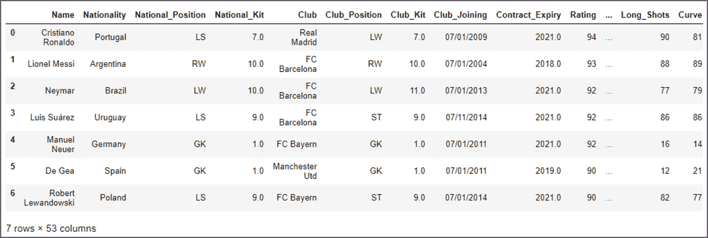

从上面的截图可以明显看出，有 53 列包含以下属性:

姓名，国籍，国家队位置，国家队队服，俱乐部，俱乐部位置，俱乐部队服，俱乐部加入，合同到期，等级，身高，体重，长传球，加速，速度，耐力，力量，平衡，敏捷，跳跃 分析这个庞大的数据集是一项繁琐的任务，因为它涉及到相当多的预处理步骤。可能会有很多多余和不需要的列，可以删除。因此，如果需要，您可以通过编写下面的代码来删除某些列:

```

del df['National_Kit'] #deletes the column National_Kit
df.head()

```

一旦你简化了这些数据，你就可以开始分析了。让我们从最简单的情节开始。这张图表显示了代表某个国家的运动员人数。现在，这些图表最好用于获得统计洞察。

```
plt.figure(figsize=(15,32))

sns.countplot(y = df.Nationality,palette="Set2") #Plot all the nations on Y Axis

```

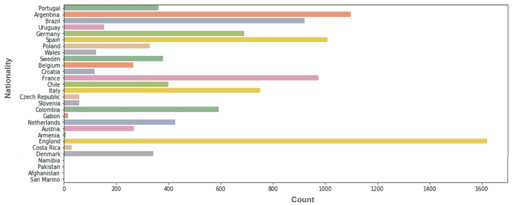

***注意:**从上面的代码生成的情节将显示所有踢足球的国家，但为了简单起见，我只显示了能给我想要的结果的前 28 个国家。*

利用这张图，我们得出结论，大部分球员来自 ***英、阿、西、法、巴西*** 。在这种情况下，该图不会增加很多价值，因为我们将选择最佳 XI，结果可能会有所不同。

继续分析，你可以用玩家的年龄、偏好位置、等级、俱乐部等尝试不同的可视化效果。让我向你展示一个这样的形象，然后我们将切换到我们对世界杯最佳球员 XI 的分析。

```
plt.figure(figsize=(15,6))
sns.countplot(x="Age",data=df)  

```

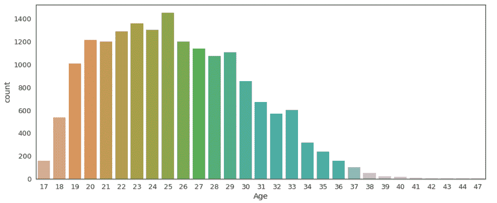

从上面的截图可以明显看出，大部分玩家年龄在 20-29 岁之间，最大的巅峰 ***25 年*** 。

现在是我们尝试找到问题陈述中提出的问题的答案的时候了: ***谁将是世界上最好的 XI？***

让我们开始分析。我们先来考虑下面的打法阵型，4-3-3。所以在这里，我们需要找到 4 个最好的防守者，3 个最好的中场和 3 个最好的进攻者。让我们先找一个守门员来开始我们的探索。

## **世界最佳踢球 XI:寻找最佳门将**

为了获得最佳门将，我将分析以下参数的数据:

1.  **射门阻挡者** : 能强力阻挡对手射门的守门员。
2.  **清道夫** : 脚法和传球都很强的门将。

```
#weights
a = 0.5
b = 1
c= 2
d = 3

#GoalKeeping Characterstics
df['gk_Shot_Stopper'] = (b*df.Reactions + b*df.Composure + a*df.Speed + a*df.Strength + c*df.Jumping + b*df.GK_Positioning + c*df.GK_Diving + d*df.GK_Reflexes + b*df.GK_Handling)/(2*a + 4*b + 2*c + 1*d)
df['gk_Sweeper'] = (b*df.Reactions + b*df.Composure + b*df.Speed + a*df.Short_Pass + a*df.Long_Pass + b*df.Jumping + b*df.GK_Positioning + b*df.GK_Diving + d*df.GK_Reflexes + b*df.GK_Handling + d*df.GK_Kicking + c*df.Vision)/(2*a + 4*b + 3*c + 2*d)

```

基于以上参数，我将根据数据集预测我的最佳门将。现在让我们绘制这些参数:

```

plt.figure(figsize=(15,6))

# Generate sequential data and plot
sd = df.sort_values('gk_Shot_Stopper', ascending=False)[:5]
x1 = np.array(list(sd['Name']))
y1 = np.array(list(sd['gk_Shot_Stopper']))
sns.barplot(x1, y1, palette= "colorblind")
plt.ylabel("Shot Stopping Score")

```

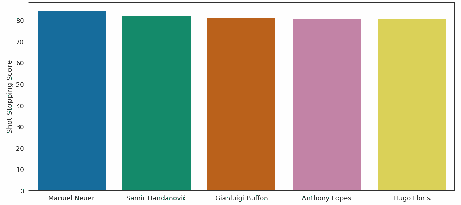 Based on the shot-stopper characteristics, it can be inferred that ***Manuel Neuer is the best goalkeeper*** as you can see he tops the above list. Let us now plot the other parameter(Sweeper) as well.

```
plt.figure(figsize=(15,6))
sd = df.sort_values('gk_Sweeper', ascending=False)[:5]
x2 = np.array(list(sd['Name']))
y2 = np.array(list(sd['gk_Sweeper']))
sns.barplot(x2, y2, palette= "colorblind")
plt.ylabel("Sweeping Score")

```

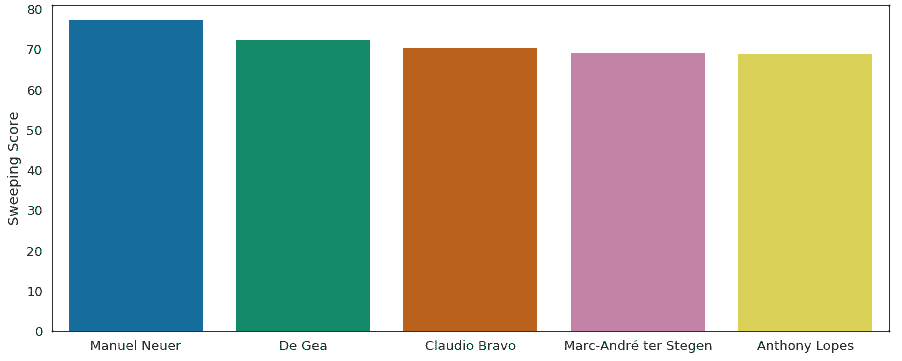Manuel Neuer tops the chart here as well. Based on the two parameters we used, we can conclude that ***Manuel Neuer would be the best choice goalkeeper*** for the World Cup 2018.

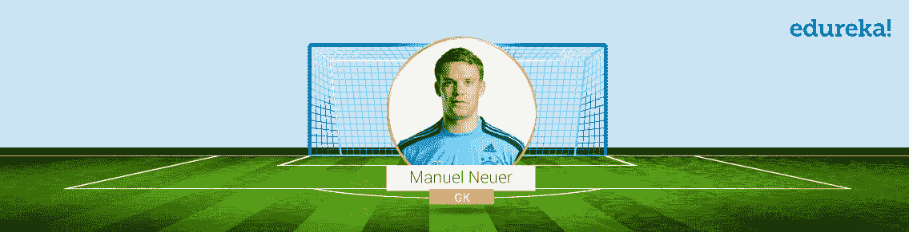

Next in our quest to find the World’s Best Playing XI, it’s time we choose some defenders.

## **世界最佳打法 XI:寻找最佳防守者**

In order to find the best defenders, I’ll be using following attributes to fetch the best defenders:

1.  **中后卫:** 我们需要两名中后卫。一个扮演 LCB，另一个扮演 RCB。
2.  **边后卫:** 我们又需要两名边后卫了。一个打左边，一个打右边。

```

#Choosing Defenders
df['df_centre_backs'] = ( d*df.Reactions + c*df.Interceptions + d*df.Sliding_Tackle + d*df.Standing_Tackle + b*df.Vision+ b*df.Composure + b*df.Crossing +a*df.Short_Pass + b*df.Long_Pass+ c*df.Acceleration + b*df.Speed
+ d*df.Stamina + d*df.Jumping + d*df.Heading + b*df.Long_Shots + d*df.Marking + c*df.Aggression)/(6*b + 3*c + 7*d)
df['df_wb_Wing_Backs'] = (b*df.Ball_Control + a*df.Dribbling + a*df.Marking + d*df.Sliding_Tackle + d*df.Standing_Tackle + a*df.Attacking_Position + c*df.Vision + c*df.Crossing + b*df.Short_Pass + c*df.Long_Pass + d*df.Acceleration +d*df.Speed + c*df.Stamina + a*df.Finishing)/(4*a + 2*b + 4*c + 4*d)

```

Based on the above parameters, I’ll be predicting 4 best defenders: 2 Centre backs and 2 wing backs. Let us first plot left centre back and right centre back.**LEFT CENTRAL DEFENDER:**

```
plt.figure(figsize=(15,6))
sd = df[(df['Club_Position'] == 'LCB')].sort_values('df_centre_backs', ascending=False)[:5]
x2 = np.array(list(sd['Name']))
y2 = np.array(list(sd['df_centre_backs']))
sns.barplot(x2, y2, palette=sns.color_palette("Blues_d"))
plt.ylabel("LCB Score")

```

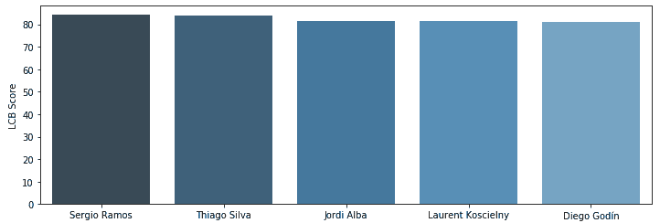Based on the left centre back characteristics, it can be inferred that ***Sergio Ramos**** is the Best Left Central Defender***. Let us now plot the RCB as well.

### **右前卫:**

```

plt.figure(figsize=(15,6))

sd = df[(df['Club_Position'] == 'RCB')].sort_values('df_centre_backs', ascending=False)[:5]
x2 = np.array(list(sd['Name']))
y2 = np.array(list(sd['df_centre_backs']))
sns.barplot(x2, y2, palette=sns.color_palette("Blues_d"))
plt.ylabel("RCB Score")

```

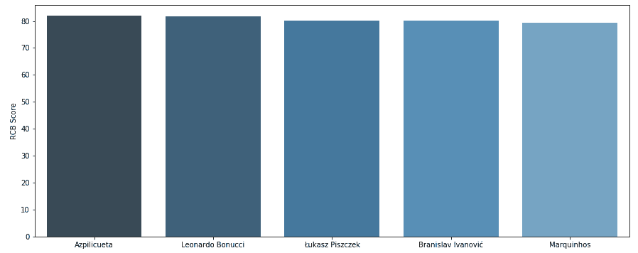Based on the right centre back characteristics, it can be inferred that ***Azpilicueta**** is the Best Right Central Defender***. Next, let us pick the World’s best left wing back/ left back.

### **左翼反击:**

```

plt.figure(figsize=(15,6))

sd = df[(df['Club_Position'] == 'LWB') | (df['Club_Position'] == 'LB')].sort_values('df_wb_Wing_Backs', ascending=False)[:5]
x4 = np.array(list(sd['Name']))
y4 = np.array(list(sd['df_wb_Wing_Backs']))
sns.barplot(x4, y4, palette=sns.color_palette("Blues_d"))
plt.ylabel("Left Back Score")

```

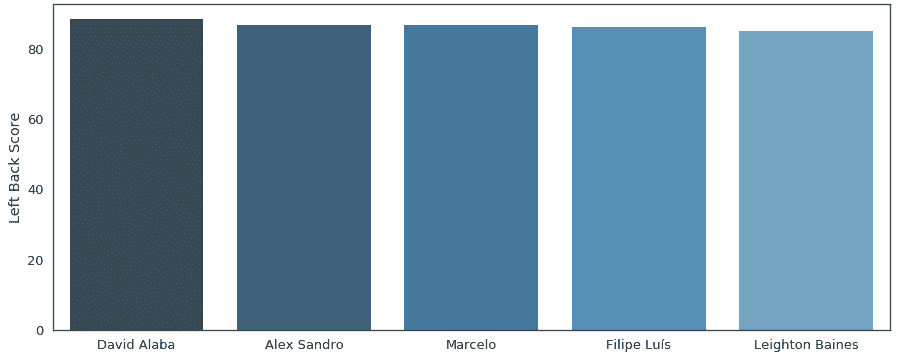

由于戴维·阿拉巴的球队没有资格参加 2018 年世界杯，我将选择阿历克斯桑德罗作为 LWB/LB 的最佳后卫。

Next, let us now find out who is the best right wing back/ right back.

### **右翼后卫:**

```
plt.figure(figsize=(15,6))
sd = df[(df['Club_Position'] == 'RWB') | (df['Club_Position'] == 'RB')].sort_values('df_wb_Wing_Backs', ascending=False)[:5]
x5 = np.array(list(sd['Name']))
y5 = np.array(list(sd['df_wb_Wing_Backs']))
sns.barplot(x5, y5, palette=sns.color_palette("Blues_d"))
plt.ylabel("Right Back Score")

```

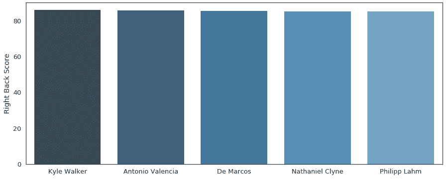As per the above analysis, it is evident that ***Kyle Walker is the best RWB/RB for World Cup 2018***.Having said that, below is the list of the best defenders for this World Cup 2018: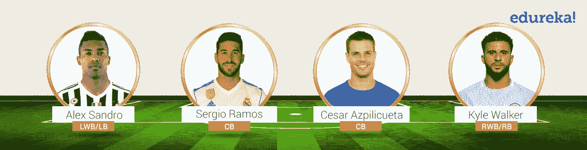

随着世界上最好的球员 XI 的到来，是时候选择一些中场球员了。

## **世界最佳球员 XI:寻找最佳中场**

As per my game formation 4-3-3, I have to choose 3 midfielders. In order to find these, I’ll be analyzing the data for the below mentioned parameters:

1.  ***组织核心*** : 组织核心是将球从防守或中场移到进攻三号位的人。
2.  ***野兽*** : 野兽是一个典型的充满活力、能够掌控中场的盒子型球员。
3.  ***控制者*** : 控制者是根据动态需求，通过坐稳或前进来指挥你的中场引擎的人。

```

#Midfielding Indices
df['mf_playmaker'] = (d*df.Ball_Control + d*df.Dribbling + a*df.Marking + d*df.Reactions + d*df.Vision + c*df.Attacking_Position + c*df.Crossing + d*df.Short_Pass + c*df.Long_Pass + c*df.Curve + b*df.Long_Shots + c*df.Freekick_Accuracy)/(1*a + 1*b + 4*c + 4*d)
df['mf_beast'] = (d*df.Agility + c*df.Balance + b*df.Jumping + c*df.Strength + d*df.Stamina + a*df.Speed + c*df.Acceleration + d*df.Short_Pass + c*df.Aggression + d*df.Reactions + b*df.Marking + b*df.Standing_Tackle + b*df.Sliding_Tackle + b*df.Interceptions)/(1*a + 5*b + 4*c + 4*d)
df['mf_controller'] = (b*df.Weak_foot + d*df.Ball_Control + a*df.Dribbling + a*df.Marking + a*df.Reactions + c*df.Vision + c*df.Composure + d*df.Short_Pass + d*df.Long_Pass)/(2*c + 3*d + 4*a)

```

让我们逐一描绘出来。

### **组织核心:**

```
plt.figure(figsize=(15,6))

ss = df[(df['Club_Position'] == 'CAM') | (df['Club_Position'] == 'LAM') | (df['Club_Position'] == 'RAM')].sort_values('mf_playmaker', ascending=False)[:5]
x3 = np.array(list(ss['Name']))
y3 = np.array(list(ss['mf_playmaker']))
sns.barplot(x3, y3, palette=sns.diverging_palette(145, 280, s=85, l=25, n=5))
plt.ylabel("PlayMaker Score")

```

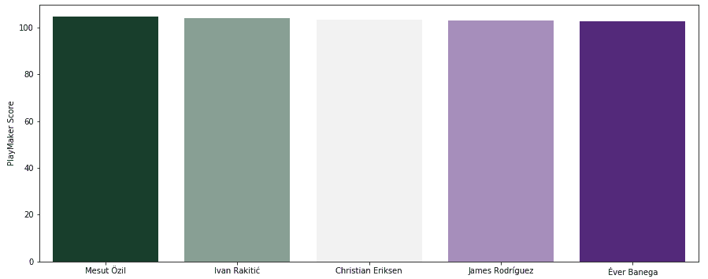As per the above analysis, I’ll pick ***Mesut Ozil as the best Playmaker for World Cup 2018***.Next, let me pick the World’s best Beast or Centre midfielder.

### **野兽:**

```
plt.figure(figsize=(15,6))

ss = df[(df['Club_Position'] == 'RCM') | (df['Club_Position'] == 'RM')].sort_values('mf_beast', ascending=False)[:5]
x2 = np.array(list(ss['Name']))
y2 = np.array(list(ss['mf_beast']))
sns.barplot(x2, y2, palette=sns.diverging_palette(145, 280, s=85, l=25, n=5))
plt.ylabel("Beast Score")

```

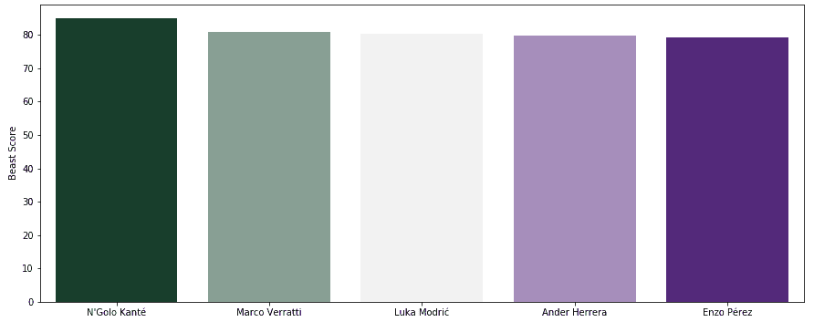As per the above analysis, I’ll pick ***N’ Golo Kante ******as the best Beast/ Right Central Midfielder***. Next, let us pick the World’s best controller.

### **控制器:**

```
plt.figure(figsize=(15,6))

# Generate some sequential data
ss = df[(df['Club_Position'] == 'LCM') | (df['Club_Position'] == 'LM')].sort_values('mf_controller', ascending=False)[:5]
x1 = np.array(list(ss['Name']))
y1 = np.array(list(ss['mf_controller']))
sns.barplot(x1, y1, palette=sns.diverging_palette(145, 280, s=85, l=25, n=5))
plt.ylabel("Controller Score")

```

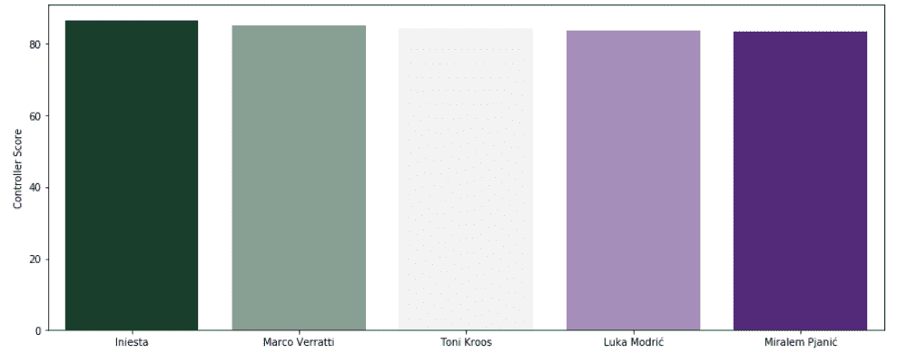

根据以上分析，我会选择 ***伊涅斯塔作为最佳控卫/左中场。***

说到这里，下面是本届 2018 世界杯最佳中场球员名单:

***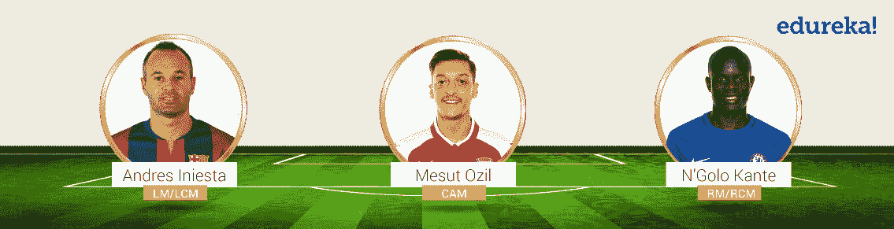***

与世界上最好的球员 XI 一起前进，是我们选择攻击手的时候了。**T2T4**

## **世界最佳打法 XI:寻找最佳攻击手**

In order to find the best attacker, I’ll be analyzing the below mentioned parameters:

1.  **进攻左路** **两翼:** 他是一名球员，从左路进攻。
2.  **进攻右翼:** 他是球员，从右翼进攻。
3.  **前锋:** 他是从中锋位置进攻的球员。

```
#Attackers
df['att_left_wing'] = (c*df.Weak_foot + c*df.Ball_Control + c*df.Dribbling + c*df.Speed + d*df.Acceleration + b*df.Vision + c*df.Crossing + b*df.Short_Pass + b*df.Long_Pass + b*df.Aggression + b*df.Agility + a*df.Curve + c*df.Long_Shots + b*df.Freekick_Accuracy + d*df.Finishing)/(a + 6*b + 6*c + 2*d)
df['att_right_wing'] = (c*df.Weak_foot + c*df.Ball_Control + c*df.Dribbling + c*df.Speed + d*df.Acceleration + b*df.Vision + c*df.Crossing + b*df.Short_Pass + b*df.Long_Pass + b*df.Aggression + b*df.Agility + a*df.Curve + c*df.Long_Shots + b*df.Freekick_Accuracy + d*df.Finishing)/(a + 6*b + 6*c + 2*d)
df['att_striker'] = (b*df.Weak_foot + b*df.Ball_Control + a*df.Vision + b*df.Aggression + b*df.Agility + a*df.Curve + a*df.Long_Shots + d*df.Balance + d*df.Finishing + d*df.Heading + c*df.Jumping + c*df.Dribbling)/(3*a + 4*b + 2*c + 3*d)

```

让我们把它们都画出来，为我们最好的 XI 找到世界上最好的攻击者。

```

plt.figure(figsize=(15,6))

ss = df[(df['Club_Position'] == 'LW') | (df['Club_Position'] == 'LM') | (df['Club_Position'] == 'LS')].sort_values('att_left_wing', ascending=False)[:5]
x1 = np.array(list(ss['Name']))
y1 = np.array(list(ss['att_left_wing']))
sns.barplot(x1, y1, palette=sns.diverging_palette(255, 133, l=60, n=5, center="dark"))
plt.ylabel("Left Wing")

```

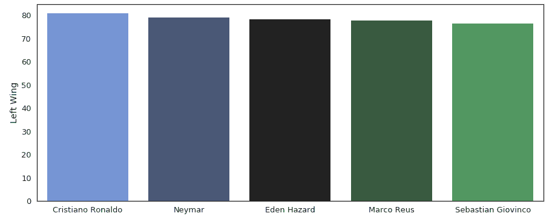

从上面的剧情可以很明显的看出***c 罗是 2018 世界杯最佳左路攻击手。***

接下来，让我们策划右翼攻击者。

```

plt.figure(figsize=(15,6))

ss = df[(df['Club_Position'] == 'RW') | (df['Club_Position'] == 'RM') | (df['Club_Position'] == 'RS')].sort_values('att_right_wing', ascending=False)[:5]
x2 = np.array(list(ss['Name']))
y2 = np.array(list(ss['att_right_wing']))
sns.barplot(x2, y2, palette=sns.diverging_palette(255, 133, l=60, n=5, center="dark"))
plt.ylabel("Right Wing")

```

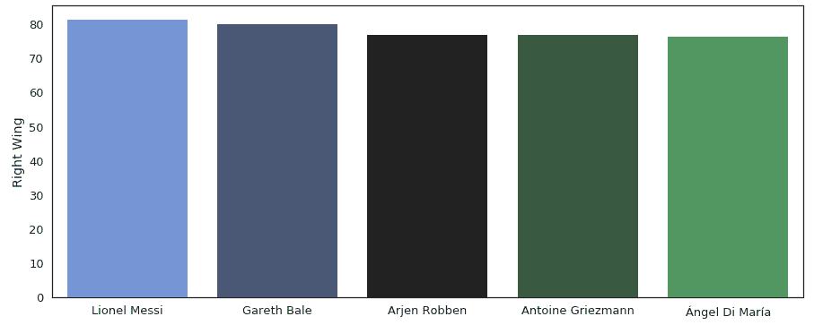

根据以上分析，我将挑选 ***莱昂内尔·梅西******作为 2018 年世界杯 的右翼攻击手。*** 随着世界上最好的前锋 XI 的到来，是时候选择我们的前锋了。

### **前锋:**

```

plt.figure(figsize=(15,6))
ss = df[(df['Club_Position'] == 'ST') | (df['Club_Position'] == 'LS') | (df['Club_Position'] == 'RS') | (df['Club_Position'] == 'CF')].sort_values('att_striker', ascending=False)[:5]
x3 = np.array(list(ss['Name']))
y3 = np.array(list(ss['att_striker']))
sns.barplot(x3, y3, palette=sns.diverging_palette(255, 133, l=60, n=5, center="dark"))
plt.ylabel("Striker")

```

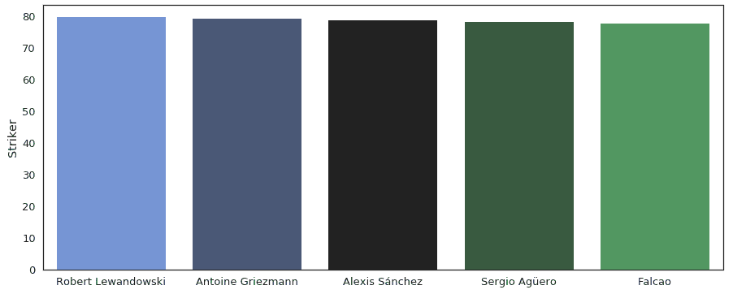

As per the above analysis, the best striker for World Cup 2018 would be ***Robert Lewandowski***.Having said that, below is the list of the best attackers in the world: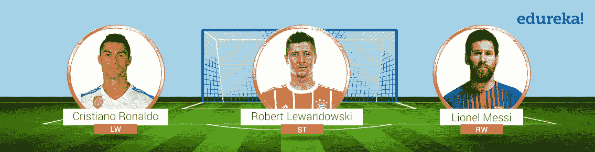So this brings us to the end of this blog. To conclude our analysis, the below image represents the World’s Best Playing XI for the World Cup 2018 in the 4-3-3 lineup.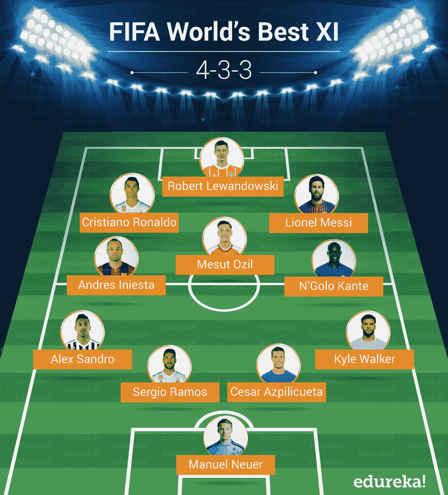I hope you like the results! :-) Here is a video also on analyzing FIFA dataset using python to find out World Best XI for World Cup 2018.

## **FIFA 用 Python |寻找 FIFA 最佳 XI 用 Python | Python 训练| edu reka**


[https://www.youtube.com/embed/hy-8Tc1h-1s?rel=0&showinfo=0](https://www.youtube.com/embed/hy-8Tc1h-1s?rel=0&showinfo=0)*This Edureka video analyzes FIFA Dataset using python to find out World’s Best XI for FIFA World Cup 2018.*Also, note that the list of players and the formation is based on my opinion only and you are entitled to have a completely different opinion. So, if you do have a different opinion, do ***let me know about your best XI in the comment section below.***If you know any other applications or trending technologies in FIFA or sports, in general, do let us know by writing to us in the comments section below. Be sure to subscribe to our blog and stay tuned for more blogs by Edureka. Happy Learning!!