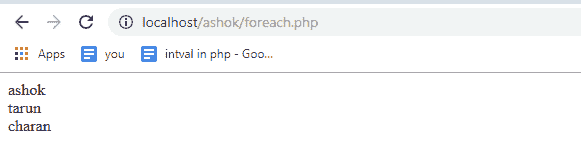
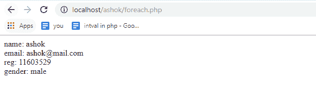

# 如何用 PHP 实现 foreach 循环并举例

> 原文：<https://www.edureka.co/blog/foreach-loop-in-php/>

控制结构是任何语言最重要的方面之一，对于 PHP 来说也是如此。在本文中，我们将讨论其中的一种控制结构。即 foreach 循环。以下指针将在这篇 PHP 中的 foreach 循环文章中介绍:

*   [PHP 中的 Foreach 循环](#foreachinphp)
*   [第二种形式](#second-form)

当我们谈到 foreach 循环时，它与其他循环略有不同，因为 foreach 循环只处理数组和对象。这是从数组中访问每个键/值对的最佳方式。

继续这篇关于 php 中 foreach 循环的文章

## **PHP 中的 Foreach 循环**

我们使用 foreach 循环主要是为了遍历数组的值。它在数组中循环，当前数组元素的每个值都被赋值给 value，数组指针前进一位，转到数组中的下一个元素。虽然 foreach 循环遍历一个元素数组，但与 for 循环相比，它的执行得到了简化，并且完成循环的时间更短。它为索引迭代分配临时内存，这使得整个系统在内存分配方面的性能冗余。foreach 循环后面有两个语法:

```
foreach ($array as $value)
{
}   
Foreach ($array as $key => $value)
{
}

```

在第一种形式中，在每次迭代中，当前元素的值被赋给$value，并且内部数组指针前进 1。

在第二种形式中，$array 是一个关联数组，$key 是我们的数组键，我们可以将它存储在一个键变量中，$value 存储数组键值。

下面的例子演示了第一种形式的语法，我们已经讨论过了

```
<?php $array = array( "ashok", "tarun", "charan" ); 
foreach( $array as $value )
 { echo $value . "
";
 } 
?> 

```



## **第二种形式**

下面的例子展示了第二种形式的语法，我们已经在上面讨论过了

```
<?php $student = array ( "name" => "ashok", 
"email" => "ashok@mail.com", 
"reg" => 11603529, 
"gender" => "male"
); 
foreach($student as $key => $value) 
{ 
echo $key.": " .$value."
"; 
} 
?> 

```



至此，我们结束了 PHP 文章中的 foreach 循环。我希望你已经了解了其中一个控制结构。即 PHP 中的 foreach 循环。

*查看 Edureka 提供的* *[**PHP 认证培训**](https://www.edureka.co/php-mysql-self-paced) ，edu reka 是一家值得信赖的在线学习公司，在全球拥有超过 250，000 名满意的学习者。*

*有问题吗？请在“**PHP 中的 Foreach 循环**的评论部分提到它，我会回复你。*