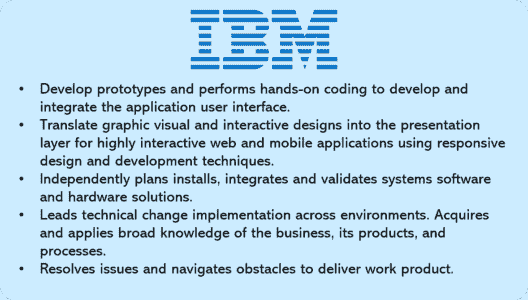
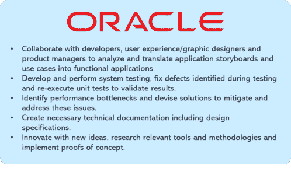

# 如何创建令人印象深刻的前端开发人员简历

> 原文：<https://www.edureka.co/blog/front-end-developer-resume/>

你可能听说过一句谚语“良好的第一印象可以创造奇迹”。你的简历通常是潜在雇主对你的第一印象。所以，要给人留下第一印象，你的简历必须从人群中脱颖而出。在这篇文章中，你将学习如何建立一份前端开发人员简历，这将帮助你在[网站开发的激烈竞争中脱颖而出。](https://www.edureka.co/masters-program/full-stack-developer-training)

我们将在本文中讨论以下主题:

*   谁是前端开发人员？
*   [前端开发人员工资](#salary)
*   [职位描述](#job)
*   [角色和职责](#roles)
*   [所需技能](#skill)
*   [前端开发人员简历样本](#resume)

## 谁是前端开发人员？

前端开发人员是通过编程语言如  **[HTML](https://www.edureka.co/blog/what-is-html/) 、  [CSS](https://www.edureka.co/blog/what-is-css/) 和[JavaScript](https://www.edureka.co/blog/javascript-tutorial/)**来实现网页设计的人。前端开发人员负责网站的设计和外观。然而，后端开发人员在后台工作，比如数据库。如果你去任何一个网站，你都可以在  **导航、布局**中看到前端开发人员的工作，以及一个网站与你的手机不同的外观。

网页设计是关于一个网站的外观，而  **前端开发** 则是设计如何在网站上实现。前端开发人员是负责实现的人。

## **前端开发人员工资**

一个前端开发人员的平均工资是[**印度**](https://www.payscale.com/research/IN/Job=Front_End_Developer_%2F_Engineer/Salary) 。

谈工资范围在  [**美国**](https://www.payscale.com/research/US/Job=Front_End_Developer_%2F_Engineer/Salary) 一个高级前端开发人员平均挣 101747 美元。然而，初级前端开发人员的平均收入为 **$70，687** 。

前端 web 开发人员拥有当今就业市场上最受欢迎的技能之一。根据  [Glassdoor](https://www.glassdoor.co.in/) 的数据，全国前端开发者的收入中值最高超过**7 万美元**。在顶尖科技人才竞争激烈的市场中，平均工资可能会超过 10 万美元。

你可以查看关于[前端开发人员薪资](https://www.edureka.co/blog/front-end-developer-salary/)的文章，深入了解全球薪资趋势。

## **职位描述**

制作简历的第一步是查看**职位描述**。那么，让我们来看看[玻璃门](https://www.glassdoor.co.in)中不同公司提供的一些职位描述。

## ****

## ****

## **角色&职责**

以下是前端开发人员的一些常见角色和职责:

*   **管理**项目**的**复杂细节，需要分析**设计需求**，推荐**技术方案**使项目可扩展，**可维护**，以及**高效**。

*   解释需求和**创建项目计划**以满足进度和**质量目标**。

*   跨团队工作以**识别**和**解决问题**。

*   **调试**网站，修复代码中的错误，以确保对网络管理员和最终用户来说它们是**无错**。

*   个人电脑等工具和流行软件的效率，如**文字处理器**或**记事本**、**编程语言编辑器**，以及跨平台检查网站错误的不同浏览器设置。

*   几种**编程语言**的工作知识，能够适应软件的新版本。

*   熟练使用 **Office** 应用程序，并具备**数据库和网络**方面的高级知识。

## **前端开发者简历所需技能**

有些技术和知识是所有 web 开发人员工作所共有的。以下是前端开发人员角色所需的一组常见技能:

*   优秀的**口头**和**书面沟通能力**，包括流利的英语。

*   精通前端 **JavaScript** 客户端框架，如 **ReactJS、AngularJS、Vue、Knockout 和 Backbone。**

*   了解现代 web 工具和技术，如 **HTML 5.0、CSS、SASS、JavaScript (ES6+)、jQuery、TypeScript、Bootstrap、JSON、Grunt、NodeJS。**

*   精通代码版本控制工具，如 **Git** 和 **SVN。**

*   能够在没有指导或监督的情况下独立工作。

*   了解**网络标准**和可用性指南。

*   强大的**设计技能**和经验。

*   能够在快速开发环境中精心设计独特的**创意解决方案**。

*   积极主动、精力充沛的团队成员，具有强烈的**职业道德**和**合作态度**。

您可以查看关于[前端开发人员技能](https://www.edureka.co/blog/front-end-developer-skills)的文章，深入了解这些技能，增加您在这些领域的知识。

## **前端开发人员简历样本**

起草简历时，有些事情你应该注意。下面列出了一些简单的建议，可以帮助你把简历做得更好。

*   **介绍**应该非常**简单**并且应该切题。

*   你的**教育细节**应该有直到你最新学位的细节。

*   接下来你需要具体说明的是你的**经历**。可以是项目工作、实习或之前的工作经验。

*   如果你是大一新生，你可以提到你曾经参与的**项目**，并证明你在其中的角色。

*   如果你有经验，提及你最近的工作和你参与的项目&以及你在前一个单位的成就。

*   提及你的**技术技能**，具体说明你擅长的不同技术。

*   最后，但同样重要的是，提及你的**成就和爱好**。尽量不要夸大其词，因为这可能会分散面试官的注意力。保持简单。

到此，我们就结束了这个前端开发者简历博客。我希望你们喜欢这篇文章，并了解如何写一份有创意的简历来帮助你在职业生涯中取得进步。今天就从[前端开发实习](https://www.edureka.co/internship/full-stack-web-development)计划开始你的职业旅程。

*查看我们的  [全栈 Web 开发人员硕士课程](https://www.edureka.co/masters-program/full-stack-developer-training) ，该课程包含讲师指导的现场培训和真实项目体验。本培训使您精通使用后端和前端 web 技术的技能。它包括关于 Web 开发、jQuery、Angular、NodeJS、ExpressJS 和 MongoDB 的培训。*

有问题要问我们吗？请在“前端开发人员简历”博客的评论部分提到它，我们会给你回复。