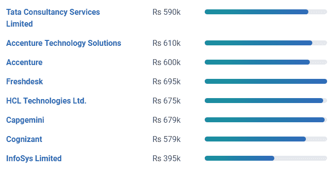
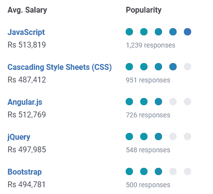

# 一个前端开发人员的平均工资是多少？

> 原文：<https://www.edureka.co/blog/front-end-developer-salary/>

Web 开发包括两个重要的部分，每个部分都需要不同的技能和技术知识。前端开发人员处理用户交互的内容，后端则是幕后的一切，并使其发生。据 [TechRepublic](https://www.techrepublic.com/) 报道，网页开发是 2021 年最热门的 10 项技术技能之一。 在本文中，我们将按以下顺序讨论前端开发人员工资:

*   谁是前端开发人员？
*   [前端开发人员工作趋势](#jobtrend)
*   [前端开发人员薪资趋势](#salarytrend)
*   [各州前端开发人员工资](#state)
*   [前端开发人员的公司工资](#company)
*   [前端开发人员常用技能](#skill)
*   [前端开发人员经验工资](#experience)

## 谁是前端开发人员？

前端开发人员是通过编程语言如  **[HTML](https://www.edureka.co/blog/what-is-html/) 、 [CSS](https://www.edureka.co/blog/what-is-css/) 和 [JavaScript](https://www.edureka.co/blog/javascript-tutorial/)** 来实现网页设计的人。前端开发人员负责网站的设计和外观。然而，后端开发人员在后台编程，如数据库。如果你去任何一个网站，你都可以在  **导航、布局**中看到前端开发人员的工作，以及一个网站与你的手机不同的外观。

网页设计是关于一个网站的外观，而  **前端开发** 则是设计如何在网站上实现。前端开发人员是负责实现的人。

## **前端开发人员工作趋势**

下表根据列出了美国不同地区的工作岗位数量。

| **地点** | **作业数量** |
| New York, NY | One thousand and forty-six |
| 华盛顿州西雅图 | Six hundred and ninety-eight |
| 加利福尼亚州旧金山 | Six hundred and fifty-nine |
| 伊利诺伊州芝加哥 | Five hundred and thirty-two |
| DC 华盛顿州 | Four hundred and seventy-eight |

美国劳工统计局最近的统计数据预测，到  **2026** ，网络开发职位的数量将比 2016 的 **增长  **15%** 。**

前端开发人员的一些关键角色包括:

*   **前端工程师**
*   **初级前端开发人员**
*   **前端软件工程师**
*   **前端开发者**

这些是前端开发人员的工作趋势。现在，让我们来看看不同的工资趋势。

## **前端开发人员薪资趋势**

一个前端开发人员的平均工资是[**印度**](https://www.payscale.com/research/IN/Job=Front_End_Developer_%2F_Engineer/Salary) 。

谈工资范围在  [**美国**](https://www.payscale.com/research/US/Job=Front_End_Developer_%2F_Engineer/Salary) 一个高级前端开发人员平均挣 101747 美元。然而，初级前端开发人员的平均收入为 **$70，687** 。

前端网站开发人员拥有当今就业市场上最受欢迎的技能之一。据 [Glassdoor](https://www.glassdoor.co.in/) 报道，全国前端开发者的收入中值超过 7 万美元。在对顶尖科技人才竞争激烈的市场中，平均工资可能会超过 10 万美元。

## **各州前端开发人员工资**

这里列出了美国不同州的前端开发人员的工资，这些州都有科技中心或高比例的网络开发职位空缺。

| **地点** | **平均工资** |
| 加利福尼亚 | $119,222 |
| 纽约 | $114,041 |
| 华盛顿 | $107,845 |
| 马萨诸塞州 | $107,533 |
| 格鲁吉亚 | $91,418 |
| 科罗拉多州 | $89,884 |

印度各邦前端开发人员的平均收入为:

| **地点** | **平均工资** |
| 哈里亚纳邦古尔冈 | ₹626,419 |
| 孟买，马哈拉施特拉邦 | ₹586,238 |
| 卡纳塔克邦班加罗尔 | ₹519,817 |
| 安得拉邦海得拉巴 | ₹506,279 |
| 马哈拉施特拉邦浦那 | ₹481,394 |
| 泰米尔纳德邦钦奈 | ₹471,114 |

## **前端开发人员公司工资**

跨国公司前端开发人员的雇佣比例有了巨大的增长。以下是**家顶级公司**的列表，以及他们对于前端开发人员这一职位的平均薪资:

*Source – [Payscale](https://www.payscale.com)*

**前端开发人员常用技能**

前端开发人员的平均收入根据你拥有的不同的[技能](https://www.edureka.co/blog/front-end-developer-skills)而有所不同。JavaScript、Angular.js 和 jQuery 技能与高于平均水平的薪酬相关。然而，像层叠样式表(CSS)和 HTML5 这样的技能的工资低于市场水平。

*Source- [Payscale](https://www.payscale.com)*

## **前端开发人员经验工资**

这里列出了不同级别的前端开发人员，基于他们多年的经验和平均收入。

| **经验等级** | **平均工资** |
| 入门级前端开发人员(不到 1 年) | ₹305,498 |
| 早期职业前端开发人员(1 至 4 年) | ₹427,532 |
| 职业中期前端开发人员(5 至 9 年) | ₹806,231 |
| 经验丰富的前端开发人员(10 至 19 年) | ₹1,300,000 |

如果你想进入一个有趣的职业，现在是提升技能和利用你面前的职业发展机会的时候了。今天就从[前端开发实习](https://www.edureka.co/internship/full-stack-web-development)计划开始你的职业旅程。

*查看网上**[edu reka 的 Web 开发者培训](https://www.edureka.co/complete-web-developer)** 。* *Web 开发认证培训将帮助您学习如何使用 HTML5、CSS3、Twitter Bootstrap 3、jQuery 和 Google APIs 创建令人印象深刻的网站，并将其部署到亚马逊简单存储服务(S3)。*

*有问题吗？请在这个博客的评论部分提到它，我们会给你回复。*