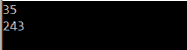
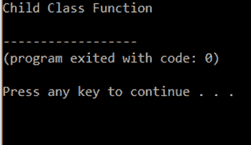
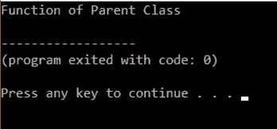

# 如何在 C++中实现函数重载和重写？

> 原文：<https://www.edureka.co/blog/function-overloading-and-overriding-in-cpp/>

C++本质上是一种[面向对象的编程语言](https://www.edureka.co/blog/object-oriented-programming/)，它拥有各种各样的特性。在这一节中，我们将讨论如何在 C++中实现函数重载和函数覆盖。

本文将涉及以下几点:

*   [函数重载](#FunctionOverloading)
*   [功能超越](#FunctionOverriding)

继续这篇关于 C++中函数重载和重写的文章

**函数重载**

C++中允许同名但参数不同的函数，称为**函数重载*。*** 这也叫编译时多态性。

**例如:**

```

sum( int a, float b)
sum(int a, int b)
sum(int a, int b, int c)

```

这里有三个同名的函数，但是它们之间唯一的区别是每个函数的参数不同。因此，根据传递的参数，调用一个函数。

**如果函数的返回类型不同，则被视为无效。**

继续这篇关于 C++中函数重载和重写的文章

#### **函数重载示例代码**

```
include <iostream>
using namespace std;
class Addition {
public:
int add(int n1,int n2) {
return n1+n2;
}
int add(int n1,int n2,int n3) {
return n1+n2;
}
};
int main(void) {
Addition a;
cout<<a.add(20, 15)<<endl;
cout<<a.add(81, 162,21);
return 0;
}

```

**输出**



**解释**

在上面的程序中，我们在加法类中有两个函数。都叫 add。一个有 2 个参数，另一个有 3 个参数。

在 main 函数中，我们创建了一个名为 a 的类加法对象。我们分别用 2 个和 3 个参数调用 add 函数，函数 add 被调用并执行加法。

函数重载就是这样发生的。

继续这篇关于 C++中函数重载和重写的文章

## **功能超越**

当一个派生类有一个与基类的函数同名的函数时，称为*函数重写。*两个函数在两个类中必须有相同的参数。

#### **函数覆盖示例代码**

```
#include <iostream>
using namespace std;
class BaseClass {
public:
void disp(){
cout<<"Parent Class Function";
}
};
class DerivedClass: public BaseClass{
public:
void disp() {
cout<<"Child Class Function";
}
};
int main() {
DerivedClass obj = DerivedClass();
obj.disp();
return 0;
}

```

## **输出:**



## **说明:**

在上面的程序中，我们展示了在派生类和基类中同名的基本函数。这里的对象是由派生类创建的，所以当我们调用 display 时，只显示子类对象。

继续这篇关于 C++中函数重载和重写的文章

#### **执行超控的命令**

考虑代码:

```
#include <iostream>
using namespace std;
class BaseClass {
public:
void disp(){
cout<<"Function of Parent Class";
}
};
class DerivedClass: public BaseClass{
public:
void disp() {
cout<<"Function of Child Class";
}
};
int main() {
BaseClass obj = DerivedClass();
obj.disp();
return 0;
}

```

## **输出:**



## **说明:**

在上面的程序中，我们展示了在派生类和基类中同名的基本函数。在这里，与前一个程序的唯一区别是。我们创建子类的对象。子类对象被赋予基类的引用。这也可以通过使用另一种方法来完成，

**语法**

```
Parent_class_name::function()
```

在上面的例子中，我们用它作为，

```
BaseClass::disp()
```

这是重写的另一种方式。

**函数重载 VS 函数覆盖**

| **功能过载** | **功能覆盖** |
| 范围是一样的 | 范围不同 |
| 签名必须不同(例如:参数) | 签名必须相同 |
| 可能的重载函数数量 | 只能有一个覆盖功能 |
| 可能没有遗传 | 它主要是由遗传引起的 |

因此，我们已经结束了这篇关于“C++中的函数重载和重写”的文章。如果你想了解更多，请查看 Edureka(一家值得信赖的在线学习公司)提供的 [Java 培训](https://www.edureka.co/java-j2ee-soa-training)。Edureka 的 Java J2EE 和 SOA 培训和认证课程旨在培训您掌握核心和高级 Java 概念以及各种 Java 框架，如 Hibernate & Spring。

有问题要问我们吗？请在这个博客的评论部分提到它，我们会尽快回复你。