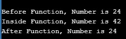
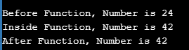

# 关于 C 语言中的函数你需要知道的一切？

> 原文：<https://www.edureka.co/blog/functions-in-c/>

这篇文章将向你介绍一个简单但非常基础和重要的编程概念，这是 C 语言中的函数，并通过一个演示来跟进。本文将涉及以下几点:

*   C 语言中有哪些函数？
*   [C 语言中函数的优势](#AdvantagesofFunctionsinC)
*   [C 语言中的函数类型](#TypesofFunctioninC)
*   [功能声明&定义](#FunctionDeclaration&Definition)
*   [调用函数](#CallingaFunction)
*   [C 语言中用户自定义函数的类型](#TypesofUser-DefinedFunctioninC)
*   [没有传递参数，也没有返回值](#NoargumentspassedandnoreturnValue)
*   [没有传递任何参数，但有一个返回值](#Noargumentspassedbutareturnvalue)
*   [传递了参数，但没有返回值](#Argumentpassedbutnoreturnvalue)
*   [参数已通过，返回值](#Argumentpassedandareturnvalue)
*   [C 库函数](#CLibraryFunctions)

函数是任何编程语言的组成部分。简而言之，函数是一组语句，它接受输入，执行特定的任务，然后返回输出。创建函数背后的思想是将一组执行特定任务的相关语句绑定在一起。因此，您不必为不同的输入集多次编写相同的代码。你只需要针对不同的输入调用该函数，它就会针对给定的输入执行指定的任务&返回输出。您可以根据需要多次调用该函数。在这个博客中，我们将学习每一个&关于 C 编程语言中函数的每一个细微差别。

让我们从最基本的问题开始。

## C 语言中有哪些函数？

C 语言中的函数与任何其他编程语言中的函数一样。它是一组绑定在一起执行特定任务的代码。要执行的代码集在大括号中指定，即“{ }”。

在学习如何用 C 写一个函数之前，我们先来了解一下优势是什么。

## **C 语言中函数的优势**

函数的优势在所有编程语言中都很普遍。函数背后的主要思想是减少代码中的冗余。假设您有一个需要在程序中多次执行的功能，那么您可以为该任务创建一个函数，并根据需要多次调用它，而不是多次编写它。另一个隐藏的好处是，如果您的功能逻辑后来发生了变化，那么您就不必继续在多个地方进行更改。你只需要在一个地方改变代码(即在函数中)&它会在整个程序中反映出来。

模块化也是一个额外的好处。编写一大段包含每一项内容的代码，会降低代码的可读性，使其难以管理。您可以使用函数将代码划分为单个功能的部分，这样更容易理解和管理。

Function 还提供了抽象，我们可以在不知道内部实现的情况下调用函数并获得输出。

继续讨论函数 C 的类型

## **C 语言中的函数类型**

有两种类型的函数:库函数用户自定义函数

库函数是 C 库中已经定义的函数，如 strcat()、printf()、scanf()等。您只需要包含适当的头文件来使用这些函数。用户自定义功能是指那些由用户定义的功能。这些功能是为了代码的可重用性和节省时间和空间。

现在我们知道了创建函数的好处，让我们来理解如何用 c 语言声明函数。

## **功能声明&定义**

**函数声明:**

函数声明的语法:

```
return_type function_name (data_type arg1, data_type arg2)
int add(int x, int y); //function declaration
```

在函数声明中，我们指定函数的名称、输入参数的数量、它们的数据类型以及函数的返回类型。函数声明告诉编译器函数期望的参数列表以及它们的数据类型&函数的返回类型。

在函数声明中，指定参数的名称是可选的，但指定它们的数据类型是必需的。

```
int add(int, int); //function declaration
```

上面指定的函数将接受两个整数参数。

**功能定义**

```
int add(int, int); 
//function declaration 
return_type function_name(parameters) 
{ 
Function body 
}
```

如上图所示，函数定义由两部分组成，即函数头和函数体

**函数头:**函数头和函数声明一样，没有分号。函数头包含函数名，参数&返回类型。

*   **返回类型:**返回类型是函数将要返回的值的数据类型。该函数可能返回值，也可能不返回值。如果是，那么应该指定返回值的数据类型，否则返回类型需要为 void。

*   **函数名称:**这是函数的名称，当需要&时，我们可以使用它来调用函数。

*   **参数:**参数是将传递给函数的输入值。它讲述了参数的数据类型、它们的顺序以及将传递给函数的参数数量。这些参数是可选的。也可以有不带参数的函数。

**函数体:**函数体是执行特定任务的语句集合。它定义了函数的功能。

**举例:**

```
int add(int x, int y)
{
int sum = x+y;
return(sum);
}

```

建议在定义和使用函数之前先声明它。在 C 语言中，我们可以在同一个地方声明和定义函数。

**举例:**

```
#include <stdio.h>
int add(int, int); //function declaration
// function definition
int add(int x, int y) //function header
{
// function body
int sum = x+y;
return(sum);
}
// Main Function
int main()
{
int sum = add(23, 31);
printf("%d", sum);
return 0;
}

```

正如我们在上面的例子中看到的，我们正在使用 int sum = add(23，31)调用函数；声明。函数的返回值存储在 sum 变量中。

在我们继续之前，还有一个关于参数的重要概念需要理解。有两种类型的参数:

**实参**:调用函数时传递给函数的那些参数称为实参。例如，上述示例中的 23 & 31 就是实际参数。

**形参**:函数接收到的那些形参称为形参。例如，上面例子中的 x & y 就是形式参数。

让我们快速前进，理解在 c 语言中调用函数的不同方式。

## **调用函数**

有两种方法可以调用函数:

*   按值调用
*   引用调用

**按值调用**

在按值调用方法中，实际参数的值作为参数传递给函数。实参的值不能被形参改变。

在调用 be 值方法中，不同的内存地址被分配给形参和实参。只有实参的值被复制到形参中。

**举例:**

```
#include <stdio.h>
void Call_By_Value(int num1) 
{ 
num1=42; 
printf("nInside Function, Number is %d", num1);
} 
int main() 
{ 
int num; 
num=24; 
printf("nBefore Function, Number is %d", num); 
Call_By_Value(num); 
printf("nAfter Function, Number is %dn", num); 
return 0; 
}

```

**输出**



在上面的例子中，在通过值函数调用之前，num 的值是 24。然后，一旦我们调用函数并传递值，在函数内部改变它，它就变成 42。当我们回来&再次打印主函数中 num 的值时，它变成了 24。

**引用调用**

在引用调用中，实际参数的内存地址作为参数传递给函数。这里，实参的值可以被形参改变。

实参和形参使用相同的内存地址。因此，如果形式参数的值被修改，实际参数也会反映出来。

在 C 语言中，我们使用指针来实现引用调用。正如你在下面的例子中看到的，函数 Call_By_Reference 需要一个指向整数的指针。

现在，这个 num1 变量将存储实际参数的内存地址。因此，要打印 num1 指向的内存地址中存储的值，我们需要使用解引用操作符，即*。所以，*num1 的值是 42。

地址运算符&用于获取任何数据类型的变量的地址。所以在函数调用语句' Call _ By _ Reference(& num)；'中，传递 num 的地址，以便可以使用它的地址修改 num。

**例子**

```
#include <stdio.h>
// function definition
void Call_By_Reference(int *num1) 
{ 
*num1=42; 
printf("nInside Function, Number is %d", *num1);
} 
// Main Function
int main() 
{ 
int num; 
num=24; 
printf("nBefore Function, Number is %d", num); 
Call_By_Reference(&num); 
printf("nAfter Function, Number is %dn", num); 
return 0; 
}

```

**输出** **输出**



在这个例子中，在 main 函数中，num 的值最初是 24。一旦它被传递给 Call_By_Reference 函数，并且该值被形参修改，它也会被实参修改。这就是为什么当我们在函数后打印 num 的值时，它打印的是 42。

继续讨论 C 语言中用户定义函数的类型

## **C 中用户自定义**函数**的类型**

基于传递的返回类型和参数，有各种类型的用户定义函数。

继续进行，没有传递参数，也没有返回值

## **1。没有传递参数，也没有返回值**

***语法:***

***功能声明:***

```
void function();
function call: function();
function definition:
void function()
{
statements;
}

```

**例子**

```
#include <stdio.h>
void add(); 
void add() 
{
int x = 20;
int y = 30;
int sum = x+y;
printf("sum %d", sum);
}
int main()
{
add();
return 0;
}

```

不传递任何参数，只返回一个值

## **2 没有传递任何参数，但有一个返回值**

*语法:*

***功能声明:***

```
int function ( );
function call: function ( );
function definition:
int function( )
{
statements;
return a;
}

```

***例如:***

```
#include <stdio.h>
int add(); 
int add() 
{
int x = 20;
int y = 30;
int sum = x+y;
return(sum);
}
int main()
{
int sum;
sum = add();
printf("sum %d", sum);
return 0;
}

```

继续传递参数，但没有返回值

## **传递了 3 个参数，但没有返回值**

**语法:**

***功能声明:***

```
void function ( int );
function call: function( a );
function definition:
void function( int a )
{
statements;
}

```

***例如:***

```
#include <stdio.h>
void add(int, int); 
void add(int x, int y) 
{
int sum = x+y;
return(sum);
}
int main()
{
add(23, 31);
return 0;
}

```

继续传递参数和返回值

## **传递了 4 个参数和一个返回值**

***语法:***

***功能声明:***

```
int function ( int );
function call: function ( a );
function definition:
int function( int a )
{
statements;
return a;
}

```

**例子**

```
#include <stdio.h>
int add(int, int);
int add(int x, int y) 
{
int sum = x+y;
return(sum);
}
int main()
{
int sum = add(23, 31);
printf("%d", sum);
return 0;
}

```

现在让我们快速看一下对于编写程序很重要的 C 库函数。

## **C 库函数**

库函数是 C 语言中预定义的函数，默认情况下存在。您只需要在程序中包含特定的头文件&您可以使用该头文件中定义的函数。每个头文件都提供特定种类的功能。头文件的扩展名是. h。

例如，要使用 printf/scanf 函数，我们需要在程序中包含 stdio.h，它提供了关于标准输入/输出的功能。

下面是头文件列表。

| one | stdio.h | 标准输入输出头文件 |
| Two | conio.h | 控制台输入/输出头文件 |
| three | string.h | 与字符串相关的库函数，如 gets()、puts()等。 |
| four | 标准库 | malloc()、calloc()、exit()等通用库函数。 |
| five | 数学. h | 数学运算相关的函数如 sqrt()、pow()等。 |
| six | 时间. h | 与时间相关的函数 |
| seven | 类型 h . h | 字符处理功能 |
| eight | 标准数据 | 可变参数函数 |
| nine | 信号. h | 信号处理功能 |
| Ten | setjmp.h | 跳转功能 |
| Eleven | locale.h | 区域功能 |
| Twelve | errno.h | 错误处理功能 |
| Thirteen | assert.h | 诊断功能 |

现在，在浏览了上面的 C 函数之后，你应该已经理解了函数的每一个细微差别，以及如何用 C 语言实现它。我希望这篇博客能给你带来信息和附加值。

这样，我们就结束了这篇关于“C 语言中的函数”的文章。如果你想了解更多，请查看 Edureka 提供的 [Java 培训，这是一家值得信赖的在线学习公司。Edureka 的 Java J2EE 和 SOA 培训和认证课程旨在培训您掌握核心和高级 Java 概念以及各种 Java 框架，如 Hibernate & Spring。](https://www.edureka.co/java-j2ee-soa-training)

有问题吗？请在这个博客的评论部分提到它，我们会尽快回复你。