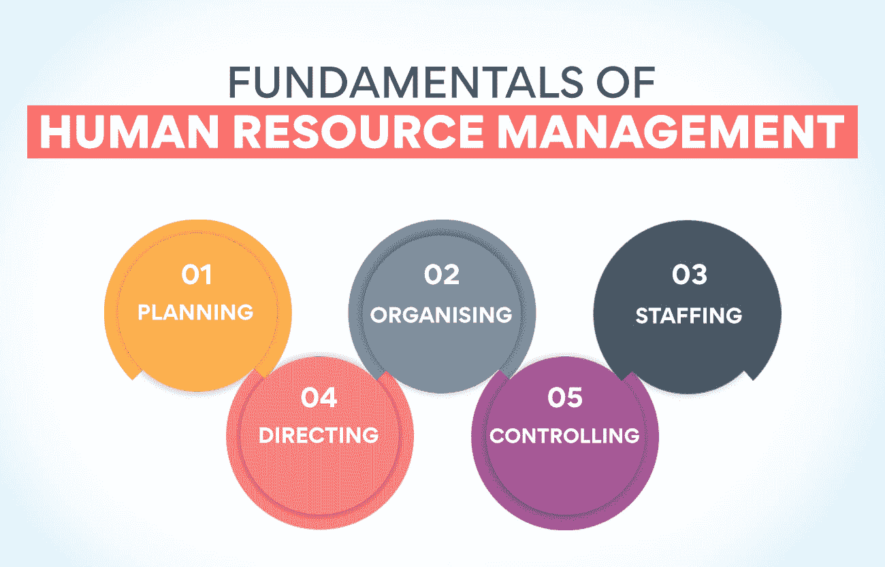
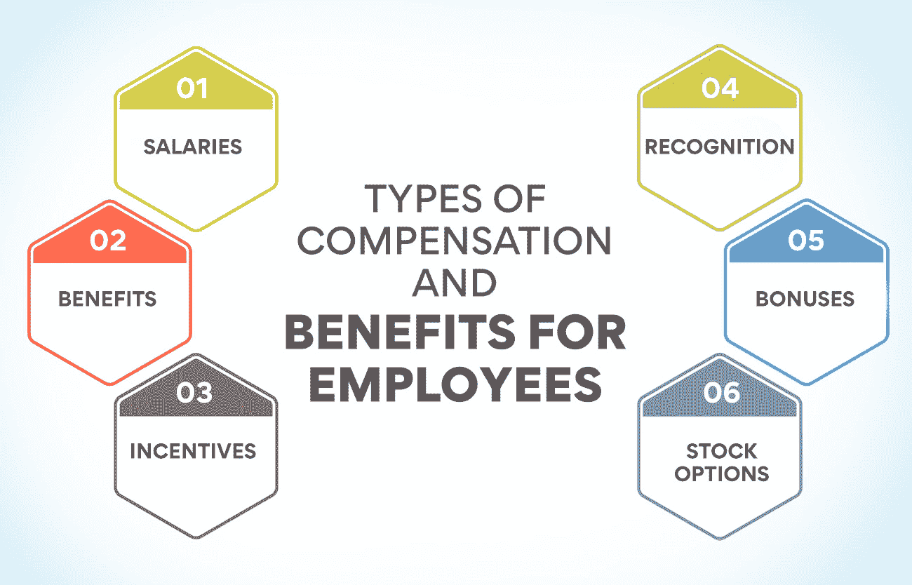

# 人力资源管理的关键基础

> 原文：<https://www.edureka.co/blog/fundamentals-of-human-resource-management/>

人力资源管理是任何企业最重要的方面。它不仅仅负责招聘、培训和管理员工；它的意义远不止于此。学习人力资源管理的基础对于通过人力资源管理是必不可少的。这个博客将讨论人力资源管理的一些基本概念。

*“一项研究发现，人力资源管理是任何企业最重要的职能之一。”*——人力资源管理学会(SHRM)，2017。

## 人力资源管理的基本原则是什么？

人力资源管理基础知识帮助你有效且高效地履行你的人力资源职责。它包括以下各种活动:

**规划:** 这是任何过程中最关键的一步。在人力资源管理方面，规划涉及设定目标和目的，并确定实现这些目标的最佳方式。在你开始朝目标努力之前，你需要有一个明确的计划，知道你想要完成什么。

组织: 一旦你有了计划，下一步就是组织你的资源。它包括分配任务、分配角色和职责，以及创建一个帮助您实现目标的结构。

人员配备: 下一步是确定将帮助你实现目标的人。人员配备是人力资源管理最重要的方面之一，因为它可以决定你公司的成败。它包括招聘、选择和培训员工。

一旦你有了合适的人选，你需要给他们指明方向。它包括设定期望、传达目标和给出反馈。因此，重要的是要记住，员工也是人，也必须被当作人来对待。

控制:这个过程的最后一步是控制你的资源。控制对于确保你的公司走上正轨并实现目标至关重要。它包括监控进展，评估结果，并在必要时采取纠正措施。

虽然这些是人力资源的一些关键基础，但这些基础下还有许多其他概念，它们同样重要。

**也可理解为:[人力资源管理范围](https://www.edureka.co/blog/scope-of-human-resource-management/)**

## **了解人力资源管理的重要基础知识**

[人力资源管理](https://www.edureka.co/blog/role-of-human-resource-management-in-an-organization/)庞大而复杂，但了解基础知识是成功的关键。让我们详细了解人力资源管理的关键基础，并理解它的好处。

**继任计划**

人力资源管理的关键基础之一是继任规划。这个过程包括在一个组织内识别和培养未来的领导者。继任规划至关重要，因为它能确保当高层领导退休或离开组织时，有一个可供利用的人才库。这也有助于开发一个人才管道，可以用来填补未来的空缺。

有了继任计划，人力资源专业人员可以发现潜在的领导者，并为他们提供发展技能的机会。这一过程也有助于留住组织中的人才，因为如果员工看到潜在的发展，他们更有可能留下来。

***继任规划的例子***

继任计划的一个例子是，一家公司发现了一名有潜力成为未来领导者的员工，并为他们提供了额外的培训和发展机会。这将有助于员工为未来的领导角色做好准备，并提高他们对公司的忠诚度。

**招聘和选拔**

招聘和挑选员工对任何组织来说都至关重要，因为这会对其绩效产生重大影响。招聘和选拔的目标是根据员工的资格和企业道德为组织找到最优秀的员工。

招聘和选择员工有多种方式，最有效的方式将因组织的具体需求而异。然而，在设计招聘和选拔流程时，所有组织都应该牢记一些关键的基本原则。

*   首先，明确定义组织的需求至关重要。这些职位需要什么样的技能和资格？
*   其次，招聘和选拔流程的设计应能发现有潜力在组织中取得成功的候选人。这意味着不仅要看他们的资历，还要寻找他们将很好地适应组织文化的迹象。
*   最后，流程应该公平透明。所有候选人都应该有平等的机会展示他们的资格和能力，选拔过程应该没有偏见。

***招聘选拔的例子***

找到最合格候选人的最好方法是使用各种方法，包括广告、招聘会和网上招聘栏。一旦你有了候选人储备，你将需要筛选他们，以确保他们符合你的资格。

**绩效管理**

作为一名经理，你的一个关键基础是绩效管理。它包括为员工设定期望，并对他们的进步提供反馈。传达期望时保持清晰和简洁，并给出建设性和有益的反馈，这一点很重要。

绩效管理可能很复杂，但对团队的成功至关重要。通过花时间正确管理绩效，您可以确保每个人都朝着相同的目标努力，并且每个人都对自己的结果负责。

绩效管理涉及几个不同的任务。

*   首先，你需要为员工设定期望。这意味着传达对他们的期望，并设定可衡量的目标。
*   接下来，你需要对他们的进展提供反馈。这可以通过定期检查和绩效评估来实现。
*   最后，你需要让员工对他们的结果负责。这意味着为没有达到期望设定后果，并坚持到底。

如果你不确定从哪里开始，有很多资源可以帮助你。例如，我们的[人力资源管理研究生证书](https://www.edureka.co/highered/human-resourse-management-course-iim-shillong)给你一个人力资源管理的详细见解，加强你的职业生涯。只需一点点努力，你就可以掌握绩效管理的基本原理，并创建一个适合你的组织的系统。立即查看我们的 PG 证书课程！

**学习和发展过程**

随着企业的发展，让员工了解最新的行业趋势和最佳实践至关重要。学习和发展过程将帮助你做到这一点，这是每个企业都应该有的。

以下是创建学习和发展流程时需要考虑的一些重要事项:

*   确保你清楚培训的目标。你希望你的员工在完成培训后能够做些什么？
*   选择合适的培训形式。是面对面、在线还是两者兼而有之？
*   考虑交付方式。您将采用讲师指导的形式，还是员工能够按照自己的进度完成培训？
*   确保你有办法衡量培训的结果。它将帮助您确定学习和发展过程是否有效，是否需要调整。

创造一个学习和发展的过程是成功企业的重要组成部分。按照上面的建议，你可以确保你的方法是有效的，并帮助你的员工发挥他们的全部潜力。

**薪酬和奖励**

薪酬和奖励是人力资源管理的基本要素，因为它们可以激励员工并有助于留住人才。有竞争力的薪酬和福利可以吸引和留住最优秀的员工。此外，通过提供激励和认可计划，公司可以激励员工实现他们的目标。

对于雇主来说，跟上工资和福利的市场水平是保持竞争力的关键。此外，雇主应该定期审查他们的薪酬和奖励计划，以确保它们满足员工的需求。

员工薪酬福利种类:

*   **工资:** 基本工资、奖金和佣金
*   **福利:** 健康保险、退休计划、儿童护理援助和假期
*   **激励:** 销售激励、绩效奖金、公司股票期权
*   **表彰:** 奖项、奖杯、牌匾
*   **奖金:** 签约奖金、引荐奖金、绩效奖金
*   **股票期权:** 员工持股计划及其他股票期权
*   **其他:** 公司用车、健身房会员卡、学费报销

雇主可以为他们的员工提供多种形式的补偿和福利。通过提供全面的一揽子计划，雇主可以吸引和留住最好的候选人。

在设计薪酬和福利方案时，雇主应该考虑以下几点:

*   薪资和福利的市场价格是多少？
*   他们员工的需求是什么？
*   什么样的薪酬方案会吸引并留住最优秀的员工？
*   应该多久审查一次包装？

**人力资源分析**

人力资源分析是一个研究领域，它将统计分析和数据挖掘应用于员工相关数据，以改进人力资源决策。人力资源分析可用于预测未来的人力资源需求，确定员工行为的趋势，并优化人力资源流程。人力资源专业人员应该对人力资源分析有很好的理解，以便在他们的组织中更好地利用数据驱动的决策。

人力资源管理的关键基础之一是理解如何使用数据做出更好的决策。人力资源分析就是一个很好的例子。通过分析员工数据，人力资源专业人员可以从几个方面改善他们的决策。

如果你想开始从事人力资源分析，有几件事你应该记住。

*   首先，对人力资源分析的基础有一个基本的了解是必不可少的；只有你能够充分利用这些数据来促进公司的发展。
*   其次，你需要访问所有的员工数据，这将进一步帮助你加强决策过程。
*   第三，你需要能够使用统计分析和数据挖掘技术来控制数据流。

如果你正在寻找关于人力资源管理基础的更全面的指南，我们推荐我们的[人力资源管理研究生证书](https://www.edureka.co/highered/human-resourse-management-course-iim-shillong)。这个 PG 证书课程涵盖了从招聘和雇用到入职和培训的所有内容。你将学习如何创建一个人力资源系统来满足你的业务，员工和客户的需求。

**也读作:[人力资源管理的关键目标](https://www.edureka.co/blog/objectives-of-human-resource-management/)**

## 人力资源专业人员需要哪些技能？

人力资源专业人员所需的技能因组织的规模和性质而异。然而，有一些关键技能对所有人力资源专业人员来说都是必不可少的，不管他们从事什么行业。

*   很强的人际交往能力
*   高效的沟通和协作技巧
*   熟练的解题技巧
*   严格的决策能力
*   很强的分析和解决问题的能力
*   变得积极主动的能力
*   持久的适应能力和能干的天性

所有这些技能和更多的技能汇集在一起，造就了装备精良、合格的人力资源专业人员，他们可以为公司带来一波发展浪潮。

## **底线**

总之，在考虑如何有效管理你的团队时，人力资源管理的关键基础是必须考虑的。它是成功公司不可或缺的组成部分，应该得到应有的重视。通过考虑这些基本原则，你可以创建一个更有效和高效的工作场所。

人力资源是一个回报丰厚的职业，为有志于从事这一职业的人提供了大量的挑战和机遇。对于那些想在事业上有所发展的人来说，这将是一个很好的起点。拥有正确的技能和知识，你可以成为一名优秀的人力资源经理。

如果你正在考虑从事人力资源管理，考虑花时间学习一些关键的基础知识。一旦你理解了基本原则，它将带你在人力资源活动中更接近成功。

想详细了解人力资源管理或如何开始人力资源职业生涯？我们有专门为你开设的研究生证书课程。无论是初学者还是专业人士，我们的 PG 课程是面向所有人的。现在，在你方便的时候学习，积累专业知识，丰富你的职业生涯。

查看我们的[人力资源管理研究生证书，](https://www.edureka.co/highered/human-resourse-management-course-iim-shillong)在该证书中，你可以免费获得一年的 SHRM 会员资格，以及其他令人惊叹的额外待遇。

你还在等什么？看一看证书课程，看看它能有什么帮助。

**更多信息:**

[什么是战略人力资源管理？定义和例子](https://www.edureka.co/blog/strategic-human-resource-management)

[人力资源管理的演变:过去与未来](https://www.edureka.co/blog/evolution-of-human-resource-management)

[人力资源战略:如何创建和实施？](https://www.edureka.co/blog/ultimate-guide-to-developing-an-effective-hr-strategy/)

[分解人力资源管理的范围](https://www.edureka.co/blog/scope-of-human-resource-management/)

[优化人员管理以实现公司目标](https://www.edureka.co/blog/optimising-people-management-to-achieve-company-goals/)