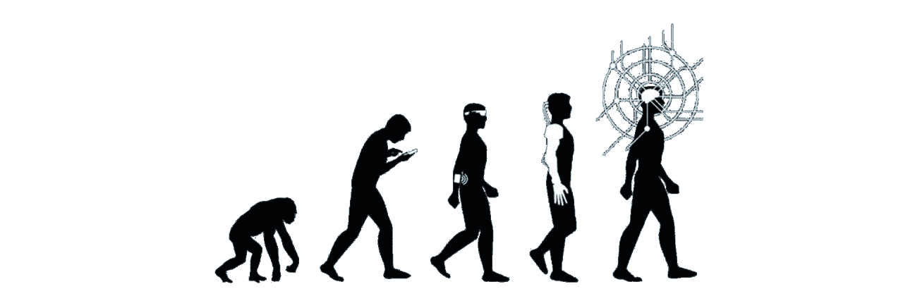
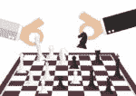
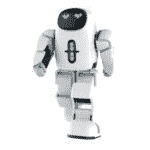
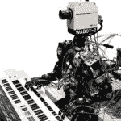
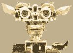
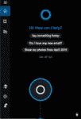
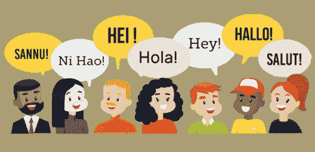
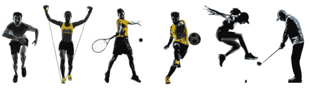
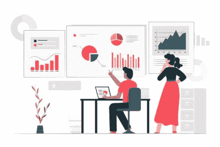
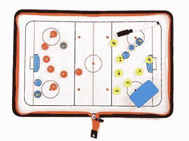

# AI 的未来是怎样的？了解范围和想法

> 原文：<https://www.edureka.co/blog/future-of-ai/>

这个世界经历了四次重大变革，改变了它的整个面貌。第一次革命发生在 1784 年，当时第一台蒸汽机问世。1870 年，第二次革命，发明了电。第三次是在 1969 年，当时信息技术一词被引入世界。第四个是我们正在经历的人工智能革命。人工智能的未来拥有更多的发明，将使我们更接近一个无与伦比的未来。

在本文中，我们将讨论以下主题:

*   [AI 的进化](#evolution)
*   [人工智能革命的开始](#revolution)
*   [最近的人工智能发明](#invention)
*   [AI 的未来](#future)

## **AI 的进化**

人工智能(AI)使机器能够从经验中学习，适应新的输入，并执行类似人类的任务。对思维机器的最早研究受到了 20 世纪 30 年代末、40 年代和 50 年代初盛行的各种观点的启发。因此，让我们来看看这项改变生活的技术从 50 年代初至今的发展历程:

*   1950 年，艾伦·图灵设计了**图灵测试**。如果一台机器可以进行与人对话一样的对话，那么可以合理地说这台机器在思考。
*   1956 年到 1974 年被称为艾的**黄金时代**。1967 年的 **Wabot 项目**制造了一个机器人，它可以使用外部感受器、人造眼睛和耳朵来测量物体的距离和方向。它的对话系统允许它用日语和一个有人造嘴巴的人交流。

*   在 20 世纪 80 年代，一种叫做 T2 专家系统的人工智能程序被世界各地的公司采用，知识成为主流人工智能研究的焦点。

*   在 20 世纪 90 年代的期间，一种被称为**智能代理**的新范式被广泛接受。这是一个感知环境并采取行动以最大化成功机会的系统。

*   在 21 世纪的最初几十年里，大量数据、更快的计算机和先进的机器学习技术被成功地应用于整个经济中的许多问题。

*   到 2016 年，与**人工智能相关的产品**，硬件和软件的市场达到了 80 多亿美元。此外，纽约时报报道说，对人工智能的兴趣已经达到了一个混乱。

*   2019 年全球人工智能系统支出预计将达到 358 亿美元，比 2018 年增长 **44%。到 2022 年翻一番到**792 亿美元****

AI 的成长和进化是一个持续的过程。现在，在我们开始谈论人工智能的未来之前，让我们看看过去涉及人工智能的创造性发明。

## **人工智能革命的开始**

从 20 世纪 50 年代开始，许多科学家、程序员、逻辑学家和理论家开始巩固对人工智能整体的现代理解。随着每个新的十年，都有新的创新和发现改变了人们对人工智能领域的基础知识。此外，它还展示了历史的进步如何让人工智能从一个遥不可及的幻想变成了当代和后代的现实。人工智能历史上的一些重要进步包括:

### **20 世纪 50 年代**

信息论之父克劳德·香农(Claude Shannon)发表了《**为下棋的计算机编程**》，这是第一篇讨论下棋计算机程序开发的文章。

****

20 世纪 50 年代**的乔治·德沃尔发明的**工业机器人**Unimate**成为第一个在新泽西通用汽车装配线上工作的机器人。它专注于从装配线上运输压铸件，并将零件焊接到汽车上，这项任务被认为对人类有危险。

### **20 世纪 60 年代**

*   1965 年，计算机科学家约瑟夫·韦岑鲍姆和教授开发了**伊莱扎**，这是一个交互式计算机程序，可以用英语与人进行交流。它使用编程脚本脱口而出某些关键字的固定行。

### **20 世纪 70 年代**

这一阶段见证了进步，特别是集中在机器人和自动化。第一个拟人机器人 WABOT-1 是日本早稻田大学制造的。它的特征包括可移动的肢体，能够看东西，能够交谈。

### **20 世纪 80 年代**

*   人工智能的快速发展持续了整个 20 世纪 80 年代。 **WABOT-2** 在早稻田大学建造。这种 WABOT 的出现使人形机器人能够与人交流，以及阅读乐谱和用电子琴演奏音乐。

### **20 世纪 90 年代**

*   在 **1995** 年，计算机科学家理查德·华莱士开发了[聊天机器人](https://www.edureka.co/blog/how-to-make-a-chatbot-in-python/) **A.L.I.C.E** (人工语言互联网计算机实体)，其灵感来自韦森鲍姆的伊莱扎。A.L.I.C.E 与 ELIZA 的区别在于增加了自然语言样本数据收集。

*   1997 年，由 **IBM** 开发的国际象棋计算机【深蓝】成为第一个赢得国际象棋比赛并与卫冕世界冠军比赛的系统。

### 2000 年代

在 2000 年的时候，辛西娅·布莱泽尔教授开发了一个名为**的机器人 Kismet** ，它可以用面部识别和模拟情感。它的结构类似于人的脸，有眼睛、嘴唇、眼睑和眉毛。

2009 年的**年，谷歌秘密研发了一辆**无人驾驶汽车**。到 2014 年，它通过了内华达州的自动驾驶测试。**

这些是人工智能在过去的一些进步和成就。当前的十年对人工智能创新非常重要。所以让我们看看 AI 在当前十年是如何改变我们的生活的。

## **最近的人工智能发明**

当前的十年对人工智能创新非常重要。近年来，人工智能已经融入到我们的日常生活中。我们使用有语音助手的智能手机和有智能功能的电脑。人工智能不再是白日梦，它在这十年中取得的一些成就包括:

### **2010 年**

*   ImageNet 推出了他们一年一度的人工智能物体识别竞赛 (ILSVRC)。

*   微软为 **Xbox 360** 推出了 **Kinect** ，这是第一款使用 3D 摄像头和红外探测追踪人体运动的游戏设备。

### **2011 年**

苹果发布了 **Siri** ，一个在**苹果 iOS** 操作系统上的虚拟助手。Siri 依靠自然语言用户界面来推断、观察、回答和向人类用户推荐事物。它调整语音命令，并为用户提供个性化的体验。

### **2012 年**

*   两名谷歌研究人员训练了一个由 16，000 个处理器组成的大型 [**神经网络**](https://www.edureka.co/blog/what-is-a-neural-network/) ，通过向其显示来自 YouTube 视频的 1000 万张未标记图像来识别猫的图像。

### **2014 年**

微软发布了 **Cortana** ，这是他们版本的虚拟助手，类似于 iOS 上的 Siri。此外，亚马逊创造了**亚马逊 Alexa** ，这是一个家庭助理，发展成为智能扬声器，作为个人助理。

### **2015-2017**

谷歌 DeepMind 的 **AlphaGo** ，一个玩围棋的计算机程序，打败了各种(人类)冠军。

2016 年，汉森机器人公司制造了一个名为**索菲亚**的**人形机器人**。她是第一个**机器人公民**。凭借她的视觉(图像识别)、面部表情和通过人工智能进行交流的能力，与其他类人机器人相比，索菲亚拥有更多类似人类的特征。

### **2018**

*   谷歌开发了第一个双向、无监督的语言表示，可以通过迁移学习用于各种自然语言任务。

*   三星推出了**比克斯比**，一个**虚拟助手**。它的功能包括语音，用户可以对其说话并提出问题、建议和意见。

人工智能正以前所未有的速度发展。因此，我们可以预计，过去十年的趋势将在未来几年继续向上摆动。现在，让我们继续关注人工智能的未来，并了解它如何继续作为技术创新者。

## **AI 的未来**

*“AI is going to change the world more than anything in the history of mankind. More than electricity.”— AI oracle and venture capitalist Dr. Kai-Fu Lee”*

**在过去的十年里，人工智能以微妙但全面的方式改变了世界。每部智能手机上的语音识别是一个简单的概念证明。在接下来的 10 年里，人工智能取得的进步将超过之前 50 年的总和。随着无数的应用迅速进入商业、政府和个人生活，它的影响将很快触及我们生活的方方面面。**

### ****医疗诊断****

****

**用人工智能的精确性和完整性来补充医生的人类直觉，可能是医疗保健领域最伟大的革命之一。一个简单的事实是，人类对人类健康的理解已经超出了任何一个人脑所能有效容纳的范围。因此，人工智能可以开始超越甚至最好的人类医生。**

### ****金融服务****

****

**看着银行家自动失业很有趣，但真正的胜利是当人工智能接管时。眼下，金融服务业与富人变得更富的原因有很大关系。他们可以雇佣更多更好的财务顾问来管理他们的资金。有了人工智能，尤其是开源的金融科技解决方案，就有可能改变个人理财，让它变得更加公平。**

### ****翻译和语言学****

****

**在某种程度上，实时机器翻译已经存在于 Skype 和微软等主要科技公司。但其他研究机构，如谷歌，甚至 DARPA，正在寻求将这一想法向前推进。目前，机器只能尝试翻译世界上 7000 多种语言中的大约 100 种。无论是军方或国际公司，还是普通的老学术界，有人将使用人工智能推动实时翻译的发展，以便我们可以更好地交流。**

### ****体育训练****

****

**人工智能可能会设计出完美的进攻阵型，但是执行这个计划的人类玩家必须拥有必要的技能。在这里，现代机器学习算法可以提供帮助。从某种程度上来说，这只是通过智能高尔夫球杆、篮球和棒球棒在越来越广泛的背景下收集数据的问题。此外，人工智能可以通过观察你的挥杆提供更积极的反馈，以提供纠正。**

### ****买东西付款****

****

**这项技术可以节省大量的时间。先进的人工智能人脸识别算法很快就会足够快，足够便宜，足以支持每天数百万次的交易，但机器学习可以教会计算机识别更多的人脸。例如，富国银行(Wells Fargo)和其他公司计划通过对用户声音进行同样先进的生物识别分析来保护一些金融交易。**

### ****购物****

****

**亚马逊正致力于让实体购物比网上购物更便捷。这只有在人工技术的帮助下才有可能。如今网上购物的算法多如牛毛，但是 Pinterest 的一个有趣的项目可以将这个想法扩展到现实世界。预测也将发挥比以往更大的作用，因为这些公司使用人工智能向购物者建议完美的产品，并确保产品在仓库里有存货。**

### ****成为购买对象的照片****

****

**你有没有点击过一个产品的图片，以便在商店里寻找类似的东西？巨型电子商务平台亚马逊已经在其移动应用程序中加入了视觉搜索选项。只要给你想要的物品拍张照片，它就会给你看一些非常相似或相同的东西。你只需要一张照片就可以马上买到它。**

### ****经营企业****

****

**未来几十年，世界上最好的首席执行官可能只是机器人。如果管理是注意和适当分配人才的过程，那么人工智能可能更有能力做到这一点。还有一种理论认为，人工智能可能会让人们变得非常有能力自己组织起来，经理将变得不那么重要，人们可以只用技术来经营他们的业务。**

### ****政治分析****

****

**人工智能的优势在于它能够预测未来，而不仅仅是政治上的胜利和失败，人工智能更大的意义在于决策和政策制定。随着人工智能初创公司的崛起和围绕政策制定的对话增加，人工智能政治家的到来并不令人惊讶。虽然世界各地的宪法和法律禁止非人类参加选举，但严重缺乏法律来定义在政治和公共空间使用人工智能的道德和伦理影响。**

### ****体育运筹帷幄****

****

**考虑到人类行为和创造力在球场和溜冰场上几乎无限的可变性，人工智能似乎可以很快为甚至是世界上研究得最好的运动设计全新的策略。这个美丽的游戏已经被一个机器学习算法成功地分解并理解了它的基本原理，根据该算法的发明者，它应该可以很好地应用于篮球和曲棍球等其他运动。**

**这些只是未来几年将被人工智能接管的众多领域中的几个。到这里，我们就到了这篇《人工智能的未来》的结尾。我希望你理解人工智能多年来的贡献，以及它将如何统治每个领域。**

***要获得深入的知识，请查看我们的互动在线直播* Edureka *[**Python 数据科学认证培训**](https://www.edureka.co/data-science-python-certification-course) 在这里，我们提供 24*7 全天候支持，在整个学习期间为您提供指导。***

**请查看 Edureka 的 NLP 课程,将您的人工智能技能提升到一个新的水平**

***有问题吗？请在这篇“人工智能的未来”文章的评论部分提到它，我们会尽快回复你。***