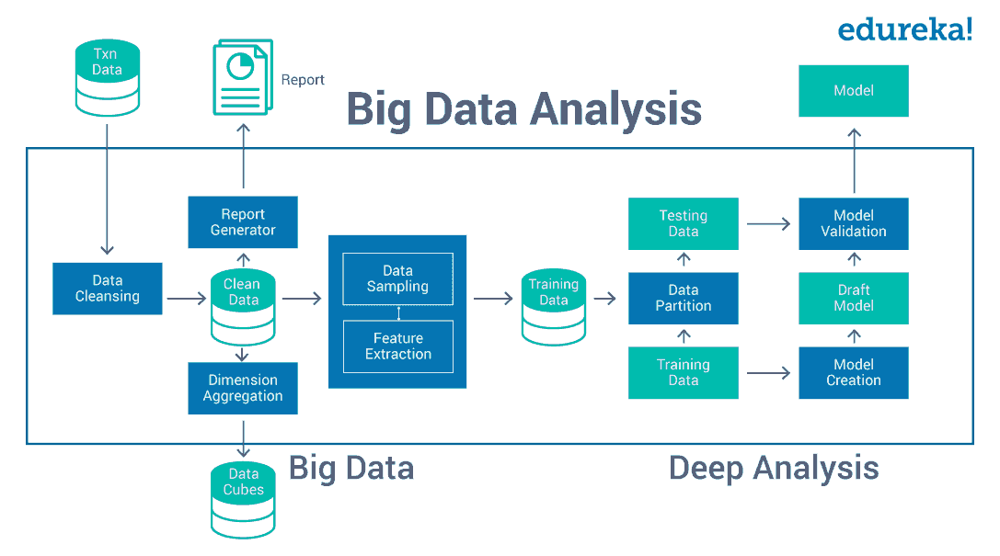
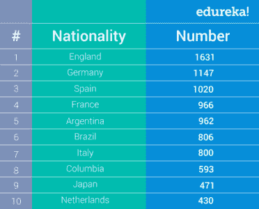
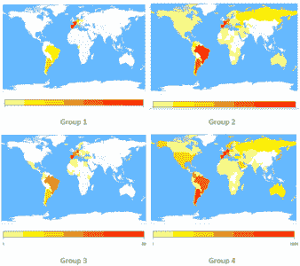
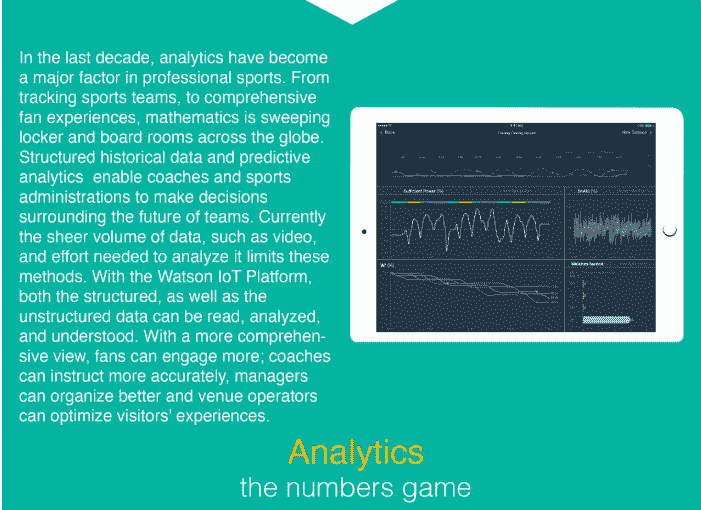
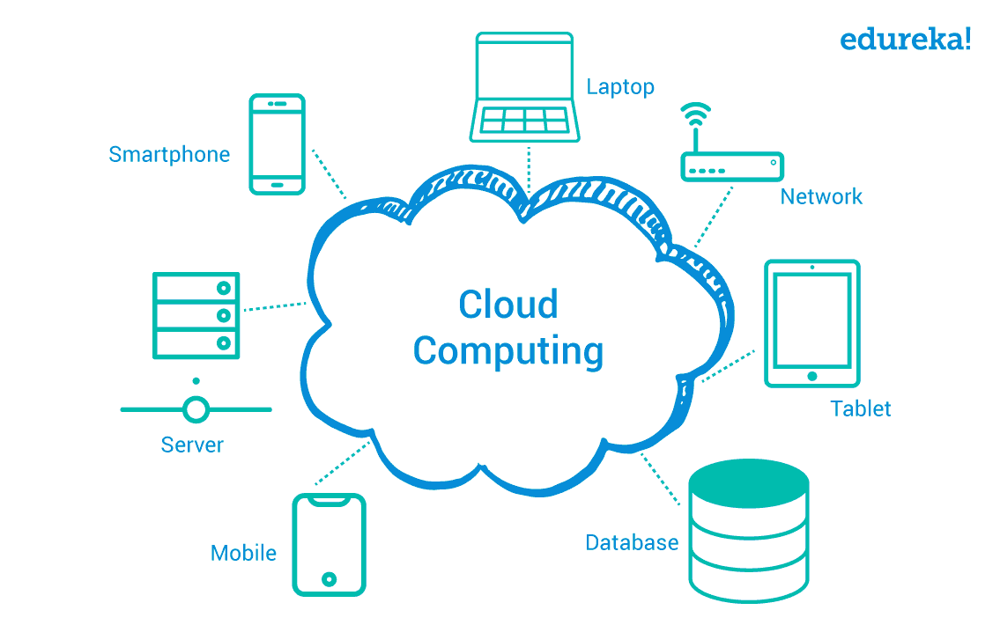
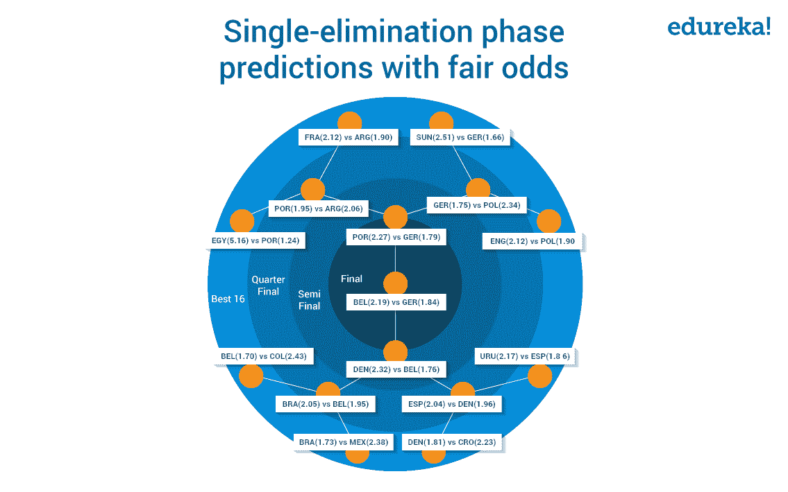

# 2018 年世界杯:改变足球比赛的 5 项技术

> 原文：<https://www.edureka.co/blog/game-changing-technologies-in-the-world-cup-2018/>

足球可以说是世界上最受欢迎的运动。据 FIFA.com 统计，共有 32 亿人收看了 2014 年足球世界杯。但是，你知道科技在足球发展到今天起着至关重要的作用吗？事实上，现代足球可以被认为是一个独立的 IT 部门，因为在这项运动中大量应用了新技术和传统技术。

世界杯使用的技术包括图像识别和模式分析等传统技术，以及人工智能和云计算等新时代技术。事实上，对于任何拥有必要技能并对这项运动充满热情的人来说，足球领域的技术工作可能是梦想成真。

在这篇博客中，我们将讨论定义我们所知的足球享受方式的五大技术。

## **大数据与分析**

体育领域涉及大量数据，尤其是像国际足联这样的全球性赛事。例如，为了全面分析和设计预测算法，我们需要整整 185 个字段的数据——这只是每个参与者的最低要求。

今天，并非所有生成并用于分析的数据都是结构化的。如今的数据由视频、图像、社交媒体帖子等非结构化组件组成。这就叫大数据。显然，使用文本和数字数据可以实现简单的分析，但当涉及到复杂的算法，如团队表现分析、球员健康统计预测等，简单的数学和传统工具如 Microsoft Excel 就不够好了。由于数据的性质，现代足球中的许多分析都涉及到 Apache Hadoop、Apache Spark 和 Apache Kafka 等工具。

如果你是一个足球迷，你可能知道德国通过摧毁对手赢得了 2014 年世界杯。但是，您知道这个国家团队是通过使用复杂的大数据分析系统得出其见解的吗？该工具名为 Match Insights，于 2012 年推出，由德国国家队总经理奥利弗·比埃尔霍夫领导开发。当德意志体育学校(Deutsche Sporthochschule Koeln)的大约 50 名学生开始创建一个包含所有参加即将到来的锦标赛的球员的统计数据的综合数据库时，这个广泛的项目开始形成。不出所料，这些数据的主要来源是球场周围八个不同的现场摄像机拍摄的视频。据这些工具的创造者称，球场被数据库视为一个网格。在每个场景中，每个玩家都被分配了一个唯一的标识符。这使得他们的移动和动作能够被数字跟踪，从而允许任何人测量关键性能指标，包括触摸次数、移动速度和平均占有时间。

利用这些数据，学生们设计了一种算法，该算法设计了一个最终模型。这种模式成为德国队对付所有对手的防呆策略的基础。

如果您有兴趣了解更多关于数据分析的事实，[这是一个很好的起点](https://learn.g2crowd.com/structured-vs-unstructured-data)。

## **【商务智能】和**

这是一个在几乎所有运动中都很明显的技术领域，因为它走在观众的前列。自 21 世纪初以来，衍生表格、图表、图形和热图、数据可视化和商业智能一直是定义现代体育的领域。每个人都熟悉显示球员得分的条形图、显示球队分布的饼图和排名表。所有这些不过是使用数据智能的综合描述。

为了理解数据可视化带来的不同，让我们举一个简单的例子，看看目前在国际足联注册的每个国家每个球队的球员人数。这是数据，首先是表格形式，然后是世界地图热图形式。

现在只有两个问题:

1.  哪一个视觉上更赏心悦目？
2.  这两者中哪一个能激发更多的洞察力？

到目前为止，这两个问题的答案都是地图。数据的可视化不仅使其看起来更有吸引力，而且还使其更容易理解并从中获得洞察力。当涉及到 FIFA 中的数据可视化时，像 IBM Cognos、Tableau 和 QlikView 这样的工具是最常用的。

在前两节中，我们讨论了数据的分析和报告。现在让我们看看如何收集这些数据。

目前的大部分数据收集都是使用传统方法完成的，如在球场上对球员和球的位置进行 X-Y 平面或网格分析，使用外部跟踪设备来检测运动和速度等。但是，随着智能可穿戴设备和物联网席卷全球，已经有很多关于这些技术在体育运动中的应用的研究和开发。

为了更好地理解这一点，让我们以我们之前讨论的德国足球队的 Match Insights 工具为例。为最终模型收集的所有数据都来自外部。事实上，如前所述，分析球员的位置和移动需要团队致力于一系列复杂的代码。然后这个程序分析了来自八个不同摄像机的视频，然后得出一个结果。老实说，这是一项非常忙碌和耗时的任务。

简化这一过程就像在每个玩家的手臂上戴上智能追踪器一样容易。事实上，这些智能追踪器不仅可以用来确定玩家的位置，还可以用来记录其他数据，如行进距离、运动速度、心率等等。基于同样的想法，足球中引入了球跟踪、线跟踪和其他新时代的创新。

**

*图片来源:IBM*

物联网是一个如此广阔的领域，以至于 IBM 有一个专门的团队正在使用他们所谓的认知物联网开展一个广泛的项目。该团队设计了几个基于 IBM 著名的人工智能 IBM Watson 的硬件和软件解决方案。

## **云计算**

*   数据收集–检查
*   数据分析–检查
*   数据报告–检查

我们已经介绍了三个与数据相关的主要活动，但是还缺少另一个重要的支柱——数据存储。

如果这是 2003 年，只有几个选择——本地机器或远程实例。但是正如我们已经知道的，今天为任何一个游戏收集的数据量对于一台小型计算机来说都太大了。而且，它不是简单的结构化数据。将此类数据存储在云中的最佳解决方案。云不仅是一个易于安装的系统，而且在存储大量非结构化数据时也很经济。

云计算允许远程存储数据。此外，当今的大多数云解决方案都提供了集成的工具，可以帮助进行分析和报告。使用云系统而不是本地机器的另一大优势是云计算解决的安全和隐私问题。大多数云实例都是用私钥加密的，因此很难被黑客攻击或非法访问。此外，由于存储可以是弹性的，因此永远不需要删除旧数据来为新数据腾出空间。这将确保历史分析的高质量和更大价值。最后，存储在云上的数据可以从任何设备和任何位置访问。这种灵活性也使得云计算成为体育数据存储的理想选择。

今天使用的流行云解决方案包括亚马逊网络服务、微软 Azure、IBM Bluemix 和谷歌云平台。

## **【人工智能(AI)和机器学习(ML)**

当谈到趋势技术时，很少有人能与人工智能和机器学习相媲美。有了产生的数据量，设计出可以字面预测未来的机器智能就没那么难了。几年前，国际足联炒作的对象是章鱼保罗，他能预测每场比赛的冠军。当然，有机生物的成功率只有 85%多一点，但是我们现在正在进入一个数字世界，而占卜并不是其中的一部分。

为了弥补这种非凡生物的损失，一组谷歌数据分析师研究了一个机器学习系统，该系统从一代人的足球比赛中获得历史洞察力，并预测了 2014 年国际足联世界杯的每场比赛的结果。该系统成功地预测了 16 场比赛中的 14 场，比之前使用的海洋生物高出近 3%。此外，据其创造者称，这两次失误是因为数据中的错误和不一致。

完全诚实地说，人工智能或机器学习算法并不能真正预测赢家，它只是将偏好按顺序排列，给我们每个队赢得比赛的概率。

使用一种简单而优雅的机器学习算法，我们可以得出今年 FIFA 世界杯的如下结果:**剧透**

**

*算法来源:*

***附注:数字越低，该队胜算越大。***

人工智能和机器学习不仅可以用于这些类型的分析，还可以用于提高玩家的表现，自动化日常驱动的商业智能解决方案等等。

2018 足球世界杯来了！虽然我们都热爱这项运动，但我们希望了解这项运动背后的技术能帮助我们更好地欣赏它。

众所周知，这是国际足联正在改变比赛的五大流行技术。每一个都提供了公平的优势，使这项运动比以前更好——对球员和球迷都一样。更重要的是，如果你有必要的技能，你甚至可以在体育领域找到一份与 IT 相关的工作。

我们希望您喜欢我们对国际足联技术的报道，如果您知道更多国际足联或体育领域的趋势技术应用，请在下面的评论区给我们写信。请务必订阅我们的博客，获取更多国际足联和技术相关的报道。