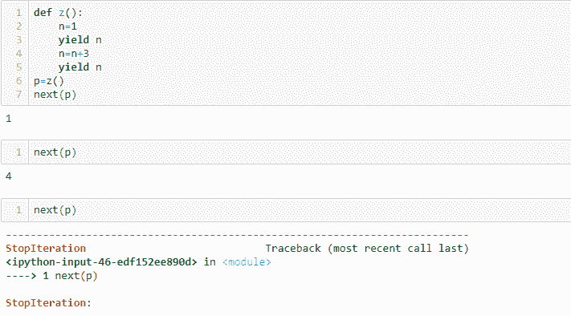

# Python 中的生成器是什么，如何使用？

> 原文：<https://www.edureka.co/blog/generators-in-python/>

生成可重复项或允许跳过它们的对象被认为是一项繁重的任务。但是，在 [Python](https://www.edureka.co/blog/python-programming-language) 中，这个痛苦任务的实现变得非常顺利。因此，让我们继续深入了解 Python 中的生成器。

这里列出了本文涉及的所有主题:

*   [什么是发电机？](#whataregenerators)
*   [使用发电机的优点](#advantages)
*   [正常功能 vs 发电机功能](#normalfunctionsvsgenerators)
*   [使用发电机功能](#usinggenerators)
*   [带回路的发电机](#generatorswithloops)
*   [生成器表达式](#generatorexpressions)
*   [用例](#usecases)
    *   [生成斐波那契数列](#fibonacci)
    *   [生成数字](#numbers)

那么让我们开始吧。:)

## **Python 中有哪些生成器？**

生成器基本上是返回可遍历对象或项目的函数。这些函数不会一次生成所有项目，而是一次生成一个项目，并且只在需要时生成。每当包含语句的[来迭代一组项目时，就会运行一个生成器函数。发电机也有许多优点。](https://www.edureka.co/blog/loops-in-python/#Whatisforloopandwhileloop?)

## **使用发电机的优势**

*   没有 Python 中的生成器，生成 iterables 是极其困难和冗长的。

*   生成器易于实现，因为它们自动实现 __iter__()、__next__()和 StopIteration，否则需要显式指定。

*   与普通的 [Python 函数](https://www.edureka.co/blog/python-main-function/)不同，在需要时生成项目，从而节省了内存。当您需要创建大量迭代器时，这个事实变得非常重要。这也被认为是发电机最大的优势。

*   可以用来生产无限数量的物品。

*   它们也可用于流水线操作

**正常功能与发电机功能:**

Python 中的生成器就像你使用“def”关键字创建普通函数一样。但是，生成器函数使用 yield 关键字而不是 return。这样做是为了通知解释器这是一个迭代器。不仅如此，生成器函数在调用 next()函数时运行，而不是像普通函数那样按其名称运行。考虑下面的例子来更好地理解它:

**举例:**

```
def func(a):
    yield a
a=[1,2,3]

b=func(a)
next(b)
```

**输出:**【1，2，3】

如你所见，在上面的输出中，func()使用 yield 关键字和 next 函数来执行。但是，对于正常功能，您将需要以下代码:

**举例:**

```
def func(a):
    return a
a=[1,2,3]
func(a)

```

**输出:**【1，2，3】

如果你看上面的例子，你可能想知道为什么使用一个生成器函数，而普通函数也返回相同的输出。所以让我们继续，看看如何在 Python 中使用生成器。

## **使用发电机功能:**

如前所述，Python 中的生成器一次生成一个可迭代对象。看看下面这个例子:

**举例:**

```
def myfunc(a):
    while a>=3:
        yield a
        a=a+1
b =  myfunc(a)
print(b)
next(b)
```

当您执行下面的函数时，您将看到下面的输出:

**输出:** 4

这里，返回了一个满足 while 条件的 iterable 对象。执行后，控制权将转移给调用者。如果需要更多项，需要通过调用 next()函数再次执行相同的函数。

```

next(b)

```

**输出:** 5

在进一步执行时，该函数将返回 6，7 等。Python 中的生成器函数自动实现 __iter__()和 __next__()方法。因此，只需使用 next()方法就可以遍历对象。当项目生成应该终止时，生成器函数在内部实现 **StopIteration** ，而不必担心调用者。这是另一个例子:

**举例:**

```
a=2
def myfunc(a):
    while a >= 0:
        yield a
        a -= 1
b =  myfunc(a)
print(b)
next(b)
```

**输出:**

上图显示了执行我们的程序所需的次数。如果再次尝试调用下一个函数，它会返回一条消息，描述 *** StopIteration *** 已经实现。如果您尝试用普通函数来做这件事，返回的值将不会改变或迭代。看看下面的例子:

**举例:**

```
def z():
    n=1
    yield n
    n=n+3
    yield n
p=z()
next(p)
```

**输出:**



## **带回路的发电机:**

如果你想立刻执行相同的功能，你可以使用‘for’循环。这个循环帮助迭代对象，在所有实现之后，它执行 StopIteration。

**举例:**

```
def z():
    n=1
    yield n
    n=n+3
    yield n
for x in z():
    print(x)
```

**输出:**

144

你也可以指定表达式来生成可迭代的对象。

**生成器表达式:**

你也可以在 for 循环中使用表达式来产生迭代器。这通常会使生成可迭代对象变得容易得多。生成器表达式类似于列表理解，且像[λ函数](https://www.edureka.co/blog/python-lambda/)，生成器表达式创建匿名生成器函数。

看看下面的例子:

**举例:**

```
a=range(6)
print("List Comprehension", end=':')
b=[x+2 for x in a] 
print(b)
print("Generator expression", end=':n')
c=(x+2 for x in a) 
print(c)
for y in c:
    print(y)
```

**输出:**

```
列表理解:【2，3，4，5，6，7】

生成器表达式:

<生成器对象<gene xpr>at 0x 0000016362944480>

23456
```

正如您所看到的，在上面的输出中，第一个表达式是一个在[]括号中指定的列表理解。列表理解一次产生完整的项目列表。下一个是生成器表达式，它返回相同的项，但一次只返回一项。它是用()括号指定的。

发生器功能也可以在其他功能内使用。例如:

**举例:**

```
a=range(6)
print("Generator expression", end=':n')
c=(x+2 for x in a) 
print(c)
print(min(c))
```

**输出:**

生成器表达式 2

当上述表达式应用于 a 的值时，上述程序打印最小值。

## **用例:**

让我们使用 Python 中的生成器来:

*   生成斐波那契数列
*   生成数字

### **生成斐波那契数列:**

众所周知，斐波那契数列是一系列数字，其中每个数字都是前面两个数字的和。前两个数字是 0 和 1。下面是一个生成斐波那契数列的生成器程序:

**例如:**

```
def fibo():
    first,second=0,1
    while True:
        yield first
        first,second=second,first+second
for x in fibo():
    if x>50:
        break
    print(x, end=" ")
```

**输出:**

```
0 1 1 2 3 5 8 13 21 34
```

上面的输出显示了值小于 50 的斐波那契数列。现在让我们来看看如何生成一个数字列表。

### **生成数字:**

如果您想要生成指定的列表编号，您可以使用生成器函数来实现。看一看下面的例子:

**举例:**

```
a=range(10)
b=(x for x in a) 
print(b)
for y in b:
    print(y)
```

**输出:**

<generator object="">at 0x 000001 CB 1602 de 0 ></generator>

0123456789

**举例:**

```
a=range(2,10,2)
b=(x for x in a) 
print(b)
for y in b:
    print(y)
```

**输出:**

<generator object="">at 0x 000001 CBE 1623138 >2468</generator>

上面的程序已经返回了从 2 到 10 的偶数。这就把我们带到了这篇关于 Python 中的生成器的文章的结尾。我希望你已经理解了所有的主题。

***Make sure you practice as much as possible and revert your experience.*  **

*有问题吗？请在“Python 中的生成器”博客的评论部分提到它，我们会尽快回复您。*

*要深入了解 Python 及其各种应用，您可以注册参加现场 **[Python 认证培训](https://www.edureka.co/python)** ，全天候支持，终身访问。*