# ggplot2 教程:使用 ggplot2 包进行数据可视化

> 原文：<https://www.edureka.co/blog/ggplot2-tutorial/>

数据可视化是数据科学家技能集的重要组成部分，你需要在 ***[成为数据科学家](https://www.edureka.co/data-science)*** 的旅程中掌握。统计和设计以一种有意义的方式结合在一起，用图形和图表解释数据。在本 ggplot2 教程中，我们将了解如何使用 R. 提供的 gglot2 包来可视化数据

## **数据，数据无处不在……我怎么理解？**

*   假设印度储备银行想要找出发生在不同银行部门的欺诈案件的信息。
*   John 是 RBI 的一名数据科学家，他被指派负责完成这项任务。
*   他必须处理由银行名称、所属部门、欺诈案件数量、欺诈案件造成的损失金额和其他类似属性组成的数据集。
*   尽管约翰不得不处理一个问题，但他无法通过查看表格直接理解数据。他想比较国有银行发生的欺诈案件的百分比和私营银行发生的欺诈案件的百分比。
*   John 想到了一个绝妙的主意，他决定借助数据可视化工具将数据可视化，并轻松探索不同银行部门和欺诈案件之间的关系。

我们看到数据可视化工具有助于探索数据，以及解释数据。

本博客将涵盖以下主题:

*   [可视化类型](#types)
*   [数据可视化工具](#tools)
*   [图形的语法](#grammar)
*   [可视化使用 gg plot 2](#visual)

让我们先来看看视觉化的类型。

## **GGPLOT2 教程:可视化类型**

在统计学中，我们一般有两种可视化:

*   **探索性数据可视化:**可视化地探索数据，以发现数据实体之间的模式。

*   **解释性数据可视化**:用简单的图形展示识别出的模式。

## **GGPLOT2 教程:数据可视化我有哪些工具？**

我们有许多可视化工具来制作美观的图形。让我们来看看其中的一些:T3

**付费工具:** 这些工具最初可能会很贵，但它们提供的解决方案绝对物有所值。

*   ***Tableau*:**Tableau 是一个数据可视化怪物，它为庞大且快速移动的数据集提供交互式可视化。

*   ***Qlikview*:**类似于 Tableau，它提供了强大的可视化和 BI 报告功能。它为整个 BI 解决方案提供单一产品。

**开源工具:** 虽然没有付费工具那么有效，但这些确实有助于照顾所有的必需品。

*   Python 中的可视化包:
    *   Matplotlib
    *   Seaborn
*   Visualization Packages in R:
    *   ggplot2
    *   鸡蛋

## **GGPLOT2 教程:图形的语法**

任何语言都要牢记语法规则来构造有意义的句子，比如:

>“我是约翰”有道理，因为它遵循适当的语法。

>“我是约翰一世”没有意义，因为它不符合语法规则。

类似地，我们有“图形语法”,需要遵循它来创建完美的图形。

### **图形的语法元素**

| **分量** | **描述** |
| 数据 | 正在绘制的数据集 |
| 美学 | 我们绘制数据的尺度 |
| 几何形状 | 用于我们数据的视觉元素 |
| 男人 | 我们用来划分数据的组 |


## **GGPLOT2 教程:使用 ggplot2** 进行可视化 

gg plot 2 包是 Hadley Wickham 为 r .编写的图形语法的简化实现。

它处理了许多使绘图变得麻烦的繁琐细节(如绘制图例),并提供了一个强大的图形模型，使制作复杂的多层图形变得容易。

*那么，让我们潜入 R 代码:*

*   让我们通过调用*install . packages(" ggplot2 ")*来开始安装 gg plot 2 包

```
`install.packages("ggplot2")`
```

*   现在我们需要使用 *library()* 函数来加载这个包。

```
library(ggplot2)
```

*   我们将使用“出生体重”数据集，这是“统计建模”软件包的一部分。因此，我们也必须安装并加载这个包。

```
install.packages("statisticalModeling")
```

```
library(statisticalModeling)
```

*   我们通过调用 head()函数来看看“出生 _ 体重”数据集的前六行。

```
`head(Birth_weight)` 
```

```
##   baby_wt  income mother_age     smoke gestation mother_wt
  ## 1     120 level_1         27 nonsmoker       284       100
  ## 2     113 level_4         33 nonsmoker       282       135
  ## 3     128 level_2         28    smoker       279       115
  ## 4     108 level_1         23    smoker       282       125
  ## 5     132 level_2         23 nonsmoker       245       140
  ## 6     120 level_2         25 nonsmoker       289       125
```

```
`str(Birth_weight)` 
```

这将为我们提供数据集的结构

```
## 'data.frame':    884 obs. of  6 variables:
  ##  $ baby_wt   : int  120 113 128 108 132 120 143 144 141 110 ...
  ##  $ income    : chr  "level_1" "level_4" "level_2" "level_1" ...
  ##  $ mother_age: int  27 33 28 23 23 25 30 32 23 36 ...
  ##  $ smoke     : chr  "nonsmoker" "nonsmoker" "smoker" "smoker" ...
  ##  $ gestation : int  284 282 279 282 245 289 299 282 279 281 ...
  ##  $ mother_wt : int  100 135 115 125 140 125 136 124 128 99 ...
```

现在，让我们开始策划吧！！！！

#### **图 1:简单条形图(*显示宝宝体重分布* )**

```
`ggplot(data = Birth_weight,aes(x=baby_wt))+geom_bar()`
```

上面的代码有三个部分:

*   **数据**:我们提供数据集的名称
*   **aes** :这是我们提供美学的地方，即“x 标尺”将显示“婴儿 _ 体重”(婴儿体重)的分布
*   **几何图形**:我们使用的几何图形是条形图，可以通过 geom_bar()函数调用。

<u>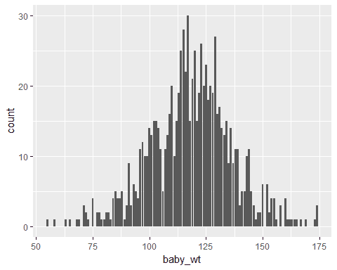</u>

ggplot2 教程:条形图

仅仅看这个柱状图，我们就可以很容易地说体重在 55-175 的范围内。

#### **Plot2: 简单条形图(*显示母亲年龄分布* )**

```
ggplot(data = Birth_weight,aes(x=mother_age))+geom_bar()
```

*   我们使用相同的组件，但这次我们在 x 轴上绘制母亲的年龄(母亲年龄)。

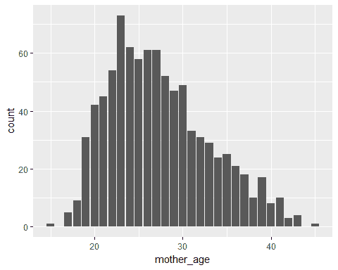

ggplot2 教程:条形图

这张图表显示母亲的年龄在 15-45 岁之间。

#### **图 3:彩色条形图**

```
ggplot(data = Birth_weight,aes(x=mother_age))+geom_bar(fill="aquamarine4")
```

*   在上面的代码中，我们使用了 geom_bar()函数中的 fill 属性来给柱状图赋予颜色。

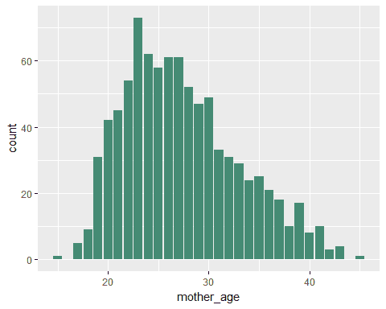

ggplot2 教程:条形图

和上面一样的情节，但是看起来更漂亮，不是吗？

#### **Plot4:条形图(*颜色变化 w.r.t 收入水平* )**

```
ggplot(data = Birth_weight,aes(x=mother_age,fill=income))+geom_bar()
```

*   在这种情况下，我们将“填充”作为一种审美，并将变量“收入”赋予这种审美。


ggplot2 教程:条形图

我们看到了母亲年龄分布中收入水平的变化，也就是说，在每一个条形中，我们也描绘了收入水平的变化。

#### **图 5:倒条形图** 图

```
ggplot(data = Birth_weight,aes(x=mother_age,fill=income))+geom_bar()+coord_flip()
```

*   为了好玩，让我们用 coord_flip() 来翻转坐标轴


ggplot2 教程:条形图

我们观察到了什么？老实说没什么……

我们还将使用“mtcars”数据集。因此，让我们观察这个数据集的前六行。

```
`head(mtcars)`
```

```
##                          mpg     cyl  disp   hp  drat    wt  qsec vs am gear carb
  ## Mazda RX4             21.0   6  160  110  3.90 2.620 16.46  0  1    4    4
  ## Mazda RX4 Wag      21.0   6  160  110  3.90 2.875 17.02  0  1    4    4
  ## Datsun 710            22.8   4  108   93   3.85 2.320 18.61  1  1    4    1
  ## Hornet 4 Drive        21.4   6  258  110  3.08 3.215 19.44  1  0    3    1
  ## Hornet Sportabout  18.7   8  360  175  3.15 3.440 17.02  0  0    3    2
  ## Valiant                   18.1   6  225  105  2.76 3.460 20.22  1  0    3    1
```

#### **Plot6: Bar-plot**

```
`ggplot(data = mtcars,aes(x=cyl,fill=factor(gear)))+geom_bar()`
```

*   我们将 cyl(气缸数量)分配给 x 轴。
*   因素(档位)，即档位数量，这是一个分类变量，将决定条形的颜色

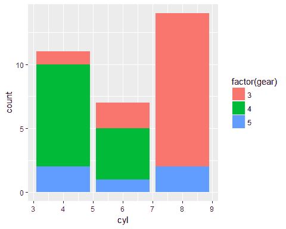

ggplot2 教程:条形图

我们看到:

*   如果是一辆四缸车，它很可能有四个前进档。
*   大多数 6 缸汽车都有 4 个前进档，然后是 3 档和 5 档。
*   没有一辆 8 缸汽车有 4 个前进档。这些车大多有三档前进档。

#### **Plot7:条形图()**)

```
`ggplot(data = mtcars,aes(x=cyl,fill=factor(gear)))+geom_bar(position = "fill")`
```

*   属性“位置”被给定为“填充”，即我们将根据比例得到条形图。

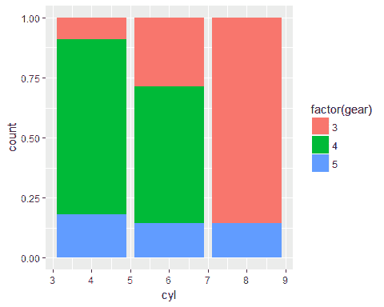

ggplot2 教程:条形图

相同的条形图，显示比例而不是计数。

#### **Plot8:条形-plot( *躲闪比较* )**

```
`ggplot(data = mtcars,aes(x=cyl,fill=factor(gear)))+geom_bar(position = "dodge")`
```

*   geom _ bar()函数中的位置属性为“道奇”。

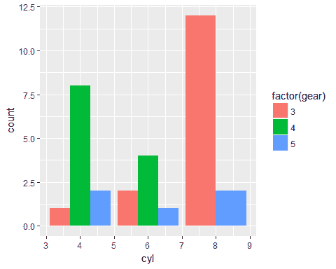

ggplot2 教程:条形图

我们可以看到代表档位数量的单个条形。

可以得出同样的推论，但从这张图表中可以看得更清楚。

#### **Plot9:条形图(*刻面划分* )**

```
`ggplot(data = Birth_weight,aes(x=mother_age,fill=smoke))+geom_bar()+facet_grid(. ~smoke)`
```

*   X 轴显示母亲年龄分布
*   颜色是由一个人是否吸烟决定的。
*   我们在这里添加了一个新的图形组件，这就是面网格。可以通过使用 facet_grid(.~变量名)。

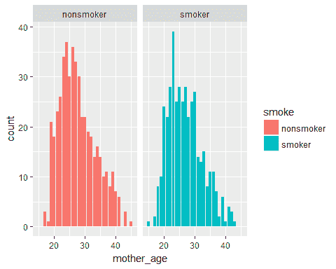

ggplot2 教程:barplot

*   左面是给不吸烟者的
*   右切面是给吸烟者的

#### **情节 10:散点图**

```
`ggplot(data = mtcars,aes(x=mpg,y=hp,col=factor(cyl)))+geom_point()`
```

*   mpg(英里/加仑)被分配给 x 轴
*   hp(马力)被分配给 y 轴
*   因子(气缸){气缸数}决定颜色
*   使用的几何图形是散点图。我们可以使用 geom_point()函数创建一个散点图。

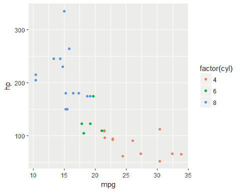

ggplot2 教程:散点图

我们可以推断:

*   随着 mpg(英里/加仑)的增加，hp(马力)减少。
*   四缸汽车马力最大，每加仑汽油跑的最低。
*   6 缸车马力范围 100-175，mpg 范围 17.5-22.5
*   8 缸车马力最低，mpg 最高。

#### **图 11:散点图(*大小变化* )**

```
`ggplot(data = mtcars,aes(x=mpg,y=hp,col=factor(cyl),size=factor(gear)))+geom_point()+labs(size="gear",col="cyl")`
```

*   因子(档位){前进档的数量}被分配给尺寸美感。即它将决定点的大小。
*   labs()函数用于给美学赋予自定义标签。

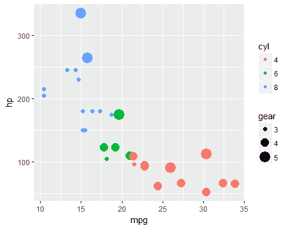

ggplot2 教程:散点图

我们可以推断:

*   如果一辆车有 3 个前进档，它的 mpg 将在 10-17.5 的范围内
*   如果一辆车有 4 个前进档，它的马力会低于 150。

#### **图 12:箱形图**

```
`ggplot(data = Birth_weight,aes(x=smoke,y=baby_wt,fill=income))+geom_boxplot()`
```

*   使用的几何图形是箱线图。可使用 geom_boxplot()创建盒状图。

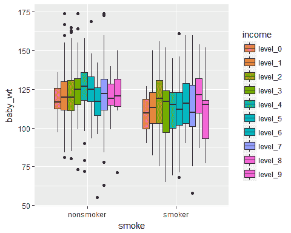

ggplot2 教程:方块图

*   这张图表显示了不同收入水平的婴儿体重分布情况。
*   位于外面的点将被视为异常值。箱线图是异常值检查的常用工具，因为它清楚地显示了所有的异常值。

#### **Plot13:线状图**

```
`ggplot(data = Birth_weight,aes(x=mother_wt,y=baby_wt))+geom_smooth()`
```

*   母亲的体重(mother_wt)被赋给了 x 审美。
*   婴儿的体重(baby_wt)被分配给 y 美学。
*   使用的几何图形是线形图。可以使用 geom_smooth()函数创建线图。

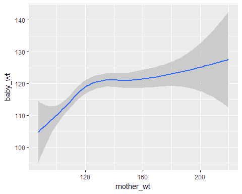

ggplot2 教程:线条图

我们看到，随着母亲体重(mother_wt)的增加，婴儿体重(baby_wt)也在增加。

#### **Plot14:线图(*两条曲线的比较* )**

```
`ggplot(data = Birth_weight,aes(x=mother_wt,y=baby_wt,col=smoke))+geom_smooth()`
```

*   烟被赋予了色彩美感。由于我们正在创建一个线图，这将创建两条不同颜色的线。


ggplot2 教程:线条图

我们发现，如果母亲不吸烟，那么婴儿的体重会更高。

#### **剧情 15:抖动-剧情**

```
`ggplot(data = Birth_weight,aes(x=smoke,y=baby_wt,col=smoke))+geom_jitter()`
```

*   使用的几何图形是抖动图。我们可以使用 geom_jitter()创建抖动图。
*   抖动是分配给点的一个随机值，用来分隔它们，这样它们就不会直接绘制在彼此之上。

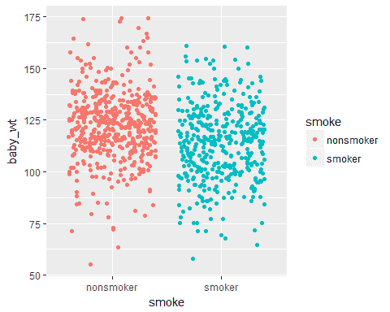

ggplot2 教程:抖动图

在统计分析和建模之前，直观观察不同数据元素之间的关系至关重要。这有助于我们从数据中获得有意义的见解，以构建更好的模型。r 的 ggplot2 软件包就是这样一个数据可视化工具，它帮助我们理解数据。

*查看 Edureka 提供的* **[*R 认证培训*](https://www.edureka.co/data-analytics-with-r-certification-training)** *，edu reka 是一家值得信赖的在线学习公司，在全球拥有超过 250，000 名满意的学习者。Edureka 的数据分析与 R 培训将帮助您获得 R 编程、数据操作、探索性数据分析、数据可视化、数据挖掘、回归、情感分析方面的专业知识，并使用 RStudio 进行零售、社交媒体方面的真实案例研究。*