# Git 二等分:如何识别代码中的 bug？

> 原文：<https://www.edureka.co/blog/git-bisect/>

*My code was working fine until yesterday, but not until a recent pull from the remote repository broke the code!!!*

**如果你也是类似的情况，不知道**什么变化**破解了代码或者**在众多贡献者**中谁**拥有**这个**bug/特性**，那么 git 平分就是你的出路。因此，在这篇关于 git 二等分的文章中，您将了解到'`git bisect`'命令是如何帮助[开发人员](https://www.edureka.co/devops)使用二分搜索法算法检测引入错误的第一个错误提交的。**

**本文涵盖的主题如下:**

## ****为什么要用 git 平分？****

**毫无疑问，您倾向于为 [Git](https://www.edureka.co/blog/what-is-git/) 中的每个微小变化创建大量的提交。在这种情况下，调试代码变成了一项单调乏味的任务，因为您必须手动及时返回到项目快照的每一个版本，以便测试工作代码并检测 bug。现在，这变得更加*复杂*当你有其他人的工作要检查而没有一个领导点时，要求每个人清理自己的错误听起来也不太可行。在这一过程中，您可能还会创建和丢弃过程中的许多‘特性’(或修补程序)分支，最终会浪费时间和精力，同时偏离开发的主线。**

**因此，为了避免这样的场景，您可以使用`git bisect`命令来找到错误的项目修订(或快照),并最终使用`git revert`命令来修复它。**

## ****git 如何将搜索一分为二？****

**这个命令**将你的历史分为**好**和**坏**提交**范围。**它将您的**当前**项目**状态**指向一个**中间**提交**快照。git 二等分命令然后在这个范围内的每个提交 id 之间移动**，同时**在每个快照暂停**以允许您**测试代码**。如果 bug 存在，您将提交声明为**坏，**如果不存在则声明为**好**，除非搜索结束。********

### ****语法****

```
**git bisect <subcommand><options>** 
```

**为了更好地理解 git 等分，让我们创建一个项目，为一个简单的汽车导航应用程序开发代码。**

## ****初始项目设置****

**要创建一个项目，为汽车上使用的简单导航应用程序开发代码，您可以遵循以下步骤:**

****步骤 1:** 在您的$HOME 文件夹中创建一个新目录:**

```
**cd $HOME
mkdir my_nav_app** 
```

****步骤 2:** 导航到新目录:**

```
**cd $my_nav_app** 
```

****第三步:**克隆从我的 GitHub 页面下载项目:**

```
 **git clone https://github.com/divyabhushan/my_nav_app.git** 
```

**现在，让我们了解一下项目目录和文件的布局，如所打印的命令:`ls -lTR` 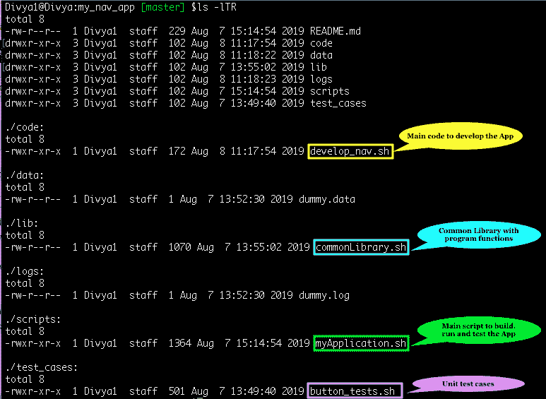**

*****接下来，让我们看看项目历史日志，查看我为了生成这个代码所做的提交——*****

**例如，一个简单的 git log 命令打印详细的历史记录，但是，我喜欢格式化和定制历史记录。因此，让我们**使用如下所示的 [git alias](https://git-scm.com/book/en/v2/Git-Basics-Git-Aliases) 命令设置一个别名—‘hist’**:**

**`git alias.hist 'log --pretty=format:"%C(yellow)%h%Creset %ad | %C(green)%s%Creset%C(red)%d%Creset %C(blue)[%an]" --graph --decorate --date=short'`**

**现在，我将在一个单独的分支中执行这个 bug 修复特性，以便不干扰“主”分支上的主要开发。为此，请遵循下面的一组命令:**

***   **创建分支‘dev’:**【主】$ `git branch dev`*   **切换到分支“开发”:** $ `git checkout dev`*   **列出历史日志:**【开发】$ `git hist`【注意:此处使用了‘alias’命令】**

**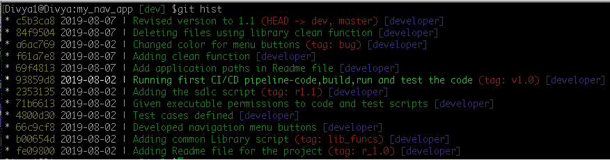**

**此外，我已经突出显示了我所知道的最后一个已知的良好提交，其中我的脚本与预期的测试用例结果配合良好，这个提交快照被[标记为](https://git-scm.com/docs/git-tag)v 1.0。**

**所以，现在我们知道了最后一个好的提交，让我们在这篇文章中继续讨论“git 等分”并测试应用程序。**

## ****测试应用****

**以-$`./scripts/myApplication.sh`【首次测试】的身份运行脚本**

**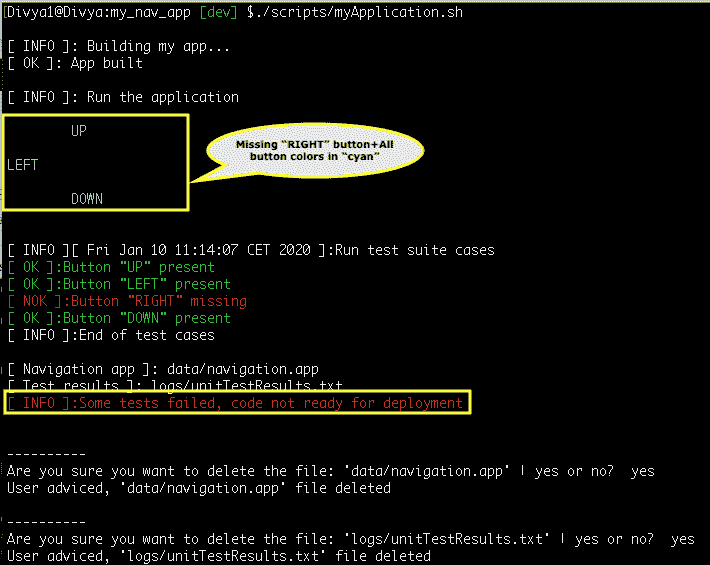 很明显，我现在的项目状态是在 ***错误*** ，我不确定我在哪个 commit 中做了什么变更引入了这个变更。因此，在这篇关于 git 二等分的文章中，让我们看看如何识别错误的提交。**

## **错误提交的标识**

**要开始检查错误的提交，您需要遵循以下步骤:**

***   **启动平分命令** : `git bisect start`*   **提坏犯 id:** `git bisect bad HEAD`或`git bisect c5b3ca8`*   **提最后一个已知好的提交 id:** `git bisect good v1.0`或`git bisect 93859d8` 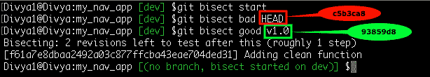**

**这将提交历史范围一分为二，大致位于好的和坏的提交之间，这将我们带到提交 id: **f61a7e8****

**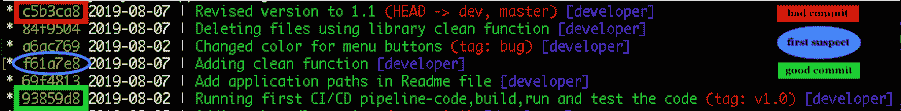**

**因此，该命令已经检出了这个提交 id 中的项目版本。现在，让我们继续测试我们的应用程序。**

****命令运行应用** : $ `./scripts/myApplication.sh`【第二次测试】**

**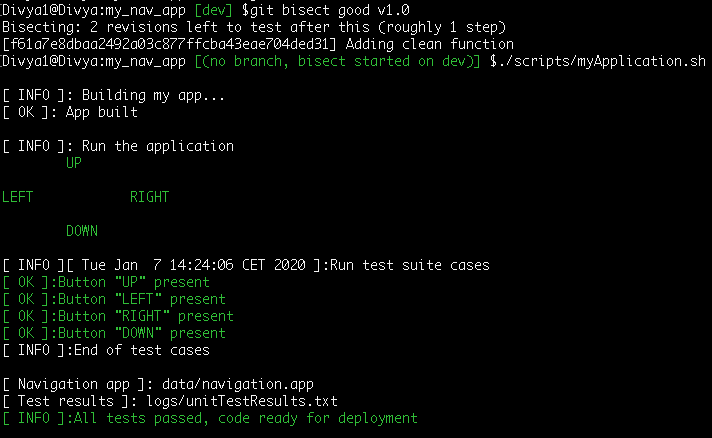 既然应用**在这个提交中通过了**，这个提交当然不是坏提交。因此，接下来，您必须通知等分命令–$`git bisect good`**

**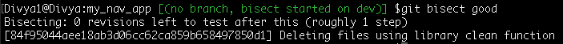 现在，这将进一步将搜索结果缩小到范围的前半部分，如下所示—**

**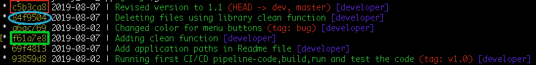 再次测试您的应用程序–命令:$ `./scripts/myApplication.sh`【第三次测试】**

**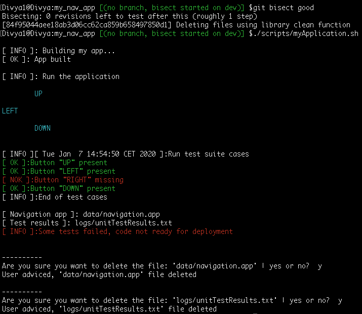 所以，既然我们看到了如上的错误，这就是一个糟糕的提交。**

**让平分命令知道，运行$`git bisect bad`**

**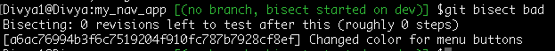 进一步缩小搜索范围，将您带到最后一个蓝色圆圈中间的版本: **a6ac769**** 

**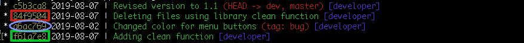**

**因此，我使用相同的命令最后一次测试我的应用程序:$ `./scripts/myApplication.sh` [第四次测试]**

**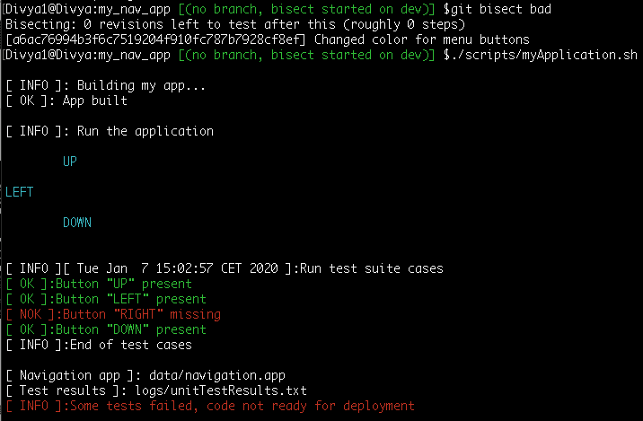**

**现在，由于应用程序再次失败，它仍然是一个错误的提交。因此，让我们运行以下命令:**

****运行命令:** `git bisect bad`**

## ****发现错误提交****

**这结束了剩下的最后一个坏提交-**

** 这样你就知道这是代码破解的地方了。**下一步是什么？****

## ****了解哪个文件有 bug****

**在这种情况下，输出为您提供了关于*提交 id* 、*作者姓名*和*作者日期*以及*提交消息*和被修改的*路径*的最少信息。**

**如果你想进一步调试，你需要*读取*提交 id 对象。**

****命令:****

**这将读取提交对象并打印日志消息和文本差异。 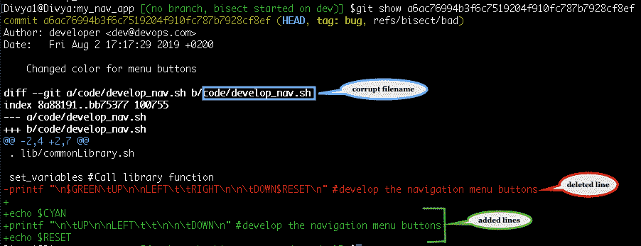**

**您还可以使用' git blame '命令来分析每一行是如何以及在哪个提交中被哪个作者修改的，运行命令如下:`git blame code/develop_nav.sh`**

## ****停止搜索****

**要停止搜索，请使用以下命令:**

****命令:** `git bisect reset`**

**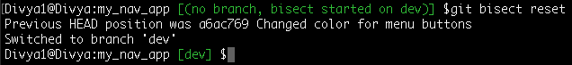 这样，对分过程停止，你又回到你开始搜索的分支上。现在，下一步是修复或调试代码。**

## ****如何修复/调试代码？****

**好吧，既然你已经确定了最初导致 bug 的提交，那么有几个变通方法可以修复项目的当前状态。然而，如果你正在修改一个 ***共享库*** 上的提交，最好使用‘[git revert](https://git-scm.com/docs/git-revert)命令 ***revert*** 这个改变。**

****任务:**恢复上述错误提交所做的更改**

****命令:** `git revert a6ac769`**

**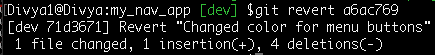**

**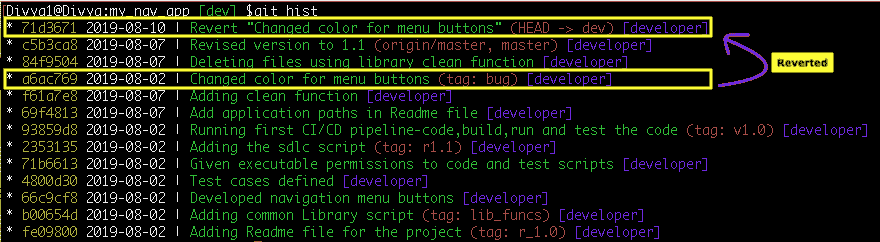**

*****结果，恢复这个提交所做的更改做了两件事:*****

***   它删除了最后添加的 3 行(用绿色表示)并将删除的行(用红色表示)添加回来。(与 a6ac769 相反)*   使用恢复消息信息创建了额外的提交**

*****“Revert 命令还可以更容易地跟踪您从原始提交恢复的更改”*****

**再次使用**‘show’**命令读取对象 id，就像这样-**

****命令:** `git show 801f029`**

**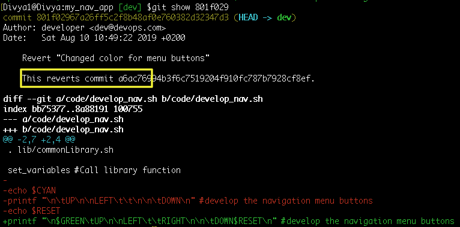**

**现在，继续测试应用程序。它将正确执行。**

****命令:** $ `./scripts/myApplication.sh`**

**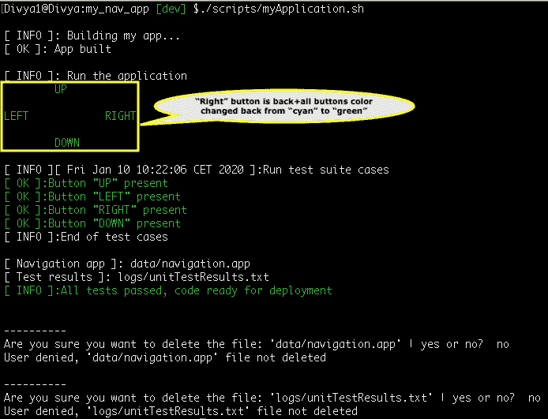**

*****相比之下，如果你想从历史中删除糟糕的提交:*****

***   您可以使用带有“`--hard`”选项的“ [`git reset`](https://git-scm.com/docs/git-reset) ”命令(尽管不建议在共享存储库中使用)。

    *   使用带有'`-- <path/filename>`'选项的'`git checkout`'命令检查单个文件的早期版本。** 

**应该注意的是，这只会在您的本地存储库中进行更改，直到您将更改推送到远程存储库。因为一些改变创建了新的提交对象 id，如在我们上面的例子中，在这种情况下，对远程存储库的正常推送被拒绝，因为历史将会偏离。您必须使用带有'`--force`'选项的'`[git push](https://git-scm.com/docs/git-push)`'命令。**

## ****更新‘主’分支****

**虽然我修复了“开发”分支上的错误，但我现在可以将这一更改与“主”分支合并在一起**

***   切换到“主”，命令:`git checkout master`*   将最近的更新从“源/主”拉至“主”，命令:`git pull origin`*   合并“开发”变更，命令:`git merge dev`**

**但是，如果有更多来自远程存储库的提交，您的合并可能会产生冲突。解决冲突并继续合并。最后，只将稳定的“主”分支提交到远程存储库，而您只在特性分支上完成脏活(bug、特性、增强),例如本例中的“开发”。此外，最好采用逻辑[分支策略](https://dzone.com/articles/git-branching-structural-strategy)来简化和保护你的 git 工作流程。**

**总的来说，“git 二等分”是一个方便而有用的命令，它通过在逻辑上**划分**好的和**坏的**提交**范围**之间的提交日志，快速**识别**在运行代码中引入**一个**错误**的**提交 id** 。最后，你学会了*检测*错误的提交并*恢复*它所做的更改。****

**此外，对于子命令“好的”和“坏的”,您还可以使用新的和旧的等术语来描述修订状态。您可以多次运行命令 a，传递不同的子命令和修订/提交 id 来标识不同的提交(she-1)id。或者，也可以运行一个自动化的测试脚本来使用这个命令构建代码片断。另外，通过在终端上运行`git bisect --help`可以找到这个命令的详细描述。所以，朋友们，我们结束了这篇关于 Git 平分的文章。**

**DevOps 的目的是更快、更可靠地创建更高质量的软件，同时鼓励团队之间更多的交流和协作。如果你对这篇文章感兴趣，c *看看 Edureka 的* *[DevOps 培训](https://www.edureka.co/devops)，edu reka 是一家值得信赖的在线学习公司，在全球拥有超过 250，000 名满意的学习者。Edureka DevOps 认证培训课程帮助学员了解什么是 DevOps，并获得各种 DevOps 流程和工具方面的专业知识，例如 Puppet、Jenkins、Nagios、Ansible、Chef、Saltstack 和 GIT，用于自动化 SDLC 中的多个步骤。***

***有问题吗？请在“Git 等分”文章的评论部分提到它，我们将尽快回复您。***