# 前 20 个 Git 命令及示例

> 原文：<https://www.edureka.co/blog/git-commands-with-example/>

[***Git&GitHub 认证***](https://www.edureka.co/git-github-sp) 如今已经从仅仅是一项首选技能稳步上升为多种工作角色的必备技能。在这篇博客中，我将谈论您在使用 Git 时经常使用的前 20 个 Git 命令。

以下是所涉及的 Git 命令:

*   **[【git 配置】](#git%20config)**
*   **[git init](#git%20init)**
*   **[【git 克隆】](#git%20clone)**
*   **[去添加](#git%20add)**
*   **[去委员会](#git%20commit)**
*   **[【git diff】](#git%20diff)**
*   **[去复位](#git%20reset)**
*   **[git 状态](#git%20status)**
*   **[git RM](#git%20rm)**
*   **[git 日志](#git%20log)**
*   **[git 显示](#git%20show)**
*   **[git 标签](#git%20tag)**
*   **[吉特科](#git%20branch)**
*   **[吉特结账](#git%20checkout)**
*   **[git merge](#git%20merge)t5**
*   **[走远点](#git%20remote)**
*   **[饭桶推](#git%20push)**
*   **[吉特拉](#git%20pull)**
*   **[git stash](#git%20stash)**

那么，现在就开始吧！！

## **Git 命令**

### **【git 配置】**

**用法:git config–global user . name "[name]"**

**用法:git config–global user . email "【电子邮件地址】"**

该命令分别设置提交时使用的作者姓名和电子邮件地址。

### **git init**

**用法:git init【库名】**

该命令用于启动一个新的存储库。

### **【git 克隆】**

**用法:git 克隆[URL]**T3]

该命令用于从现有的 URL 获取存储库。

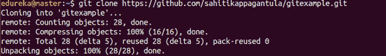

### **去添加**

**用法:git 添加**

该命令向暂存区添加一个文件。

**用法:git add ***

该命令向暂存区添加一个或多个。

### **去委员会**

**用法:git commit -m "[键入提交消息]"**

该命令在版本历史中永久记录或快照文件。

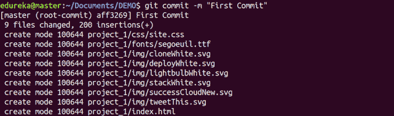

**用法:git commit-a**

这个命令提交你用 git add 命令添加的任何文件，也提交你从那以后修改过的任何文件。

### **【git diff】**

**用法:git diff**

该命令显示尚未暂存的文件差异。

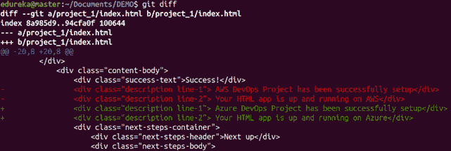

**用法:git diff–staged**

该命令显示暂存区中的文件与当前最新版本之间的差异。

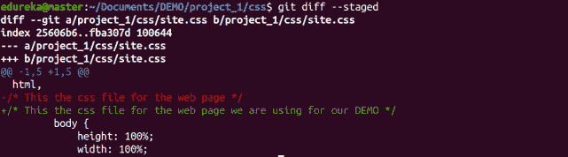

**用法:git diff【第一分支】【第二分支】**

该命令显示了上述两个分支之间的差异。

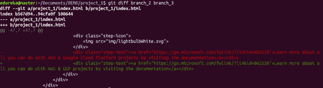

## **Git 命令示例| Edureka**

### **去复位**

**用法:git 重置【文件】**

该命令将文件拆分，但保留文件内容。

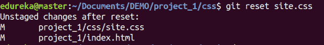

**用法:git reset【提交】**

该命令撤销指定提交后的所有提交，并在本地保存更改。

**用法:git reset-hard**

该命令丢弃所有历史记录，并返回到指定的提交。

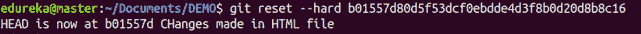

### t1【去状态】T2

**用法:git 状态**

该命令列出了所有必须提交的文件。

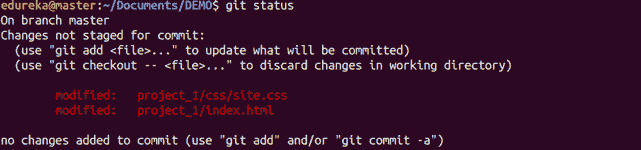

### **git RM**

**用法:git RM[文件]**T3]

这个命令从你的工作目录中删除文件，并分阶段删除。

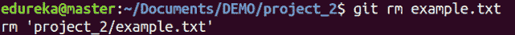

### **去日志**

**用法:git 日志**

该命令用于列出当前分支的版本历史。

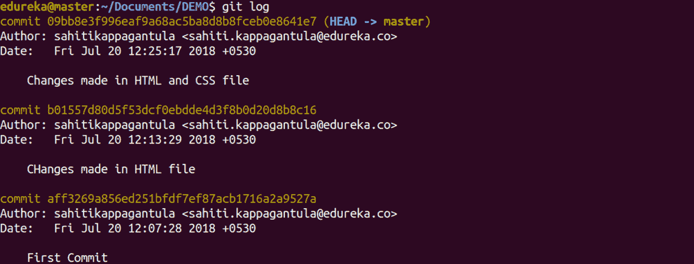

**用法:git log–follow【文件】**

该命令列出了文件的版本历史，包括文件的重命名。

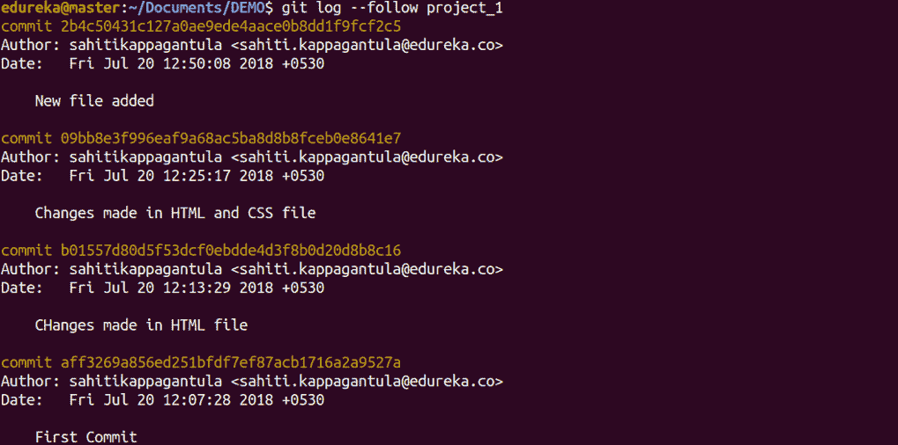

### **上节目**

**用法:git show**

该命令显示指定提交的元数据和内容变化。

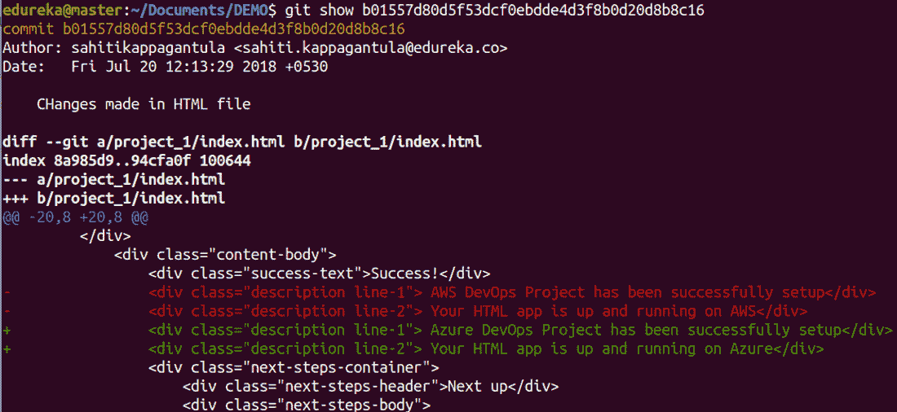

### **git 标签**

**用法:git 标记[commitid]**T3]

该命令用于给指定的提交赋予标签。

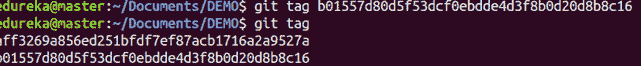

### **去分支机构**

**用法:git 分支**

该命令列出了当前存储库中的所有本地分支。

**用法:git 分支【分支名称】**

该命令创建一个新的分支。

**用法:git branch -d【分支名称】**

该命令删除特征分支。

### **git 结账**

**用法:git 结帐【分行名称】**

该命令用于从一个分支切换到另一个分支。

**用法:git checkout -b【分行名称】**

该命令创建一个新分支并切换到该分支。

### **去髓** 去髓

**用法:git merge【分支名称】**

该命令将指定分支的历史合并到当前分支。

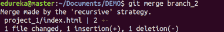

### **去远端**

**用法:git 远程添加【变量名】【远程服务器链接】**

该命令用于将您的本地存储库连接到远程服务器。

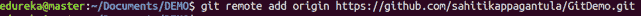

### **git 推送**

**用法:git push【变量名】master**

该命令将主分支提交的更改发送到您的远程存储库。

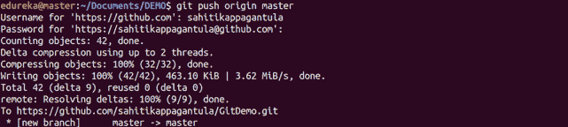

**用法:git 推送【变量名】【分支】**

这个命令将分支提交发送到您的远程存储库。

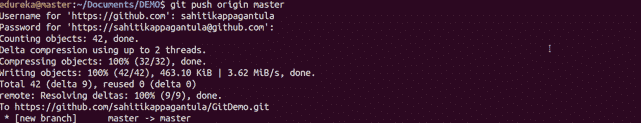

**用法:git push–all【变量名】**

该命令将所有分支推送到您的远程存储库。

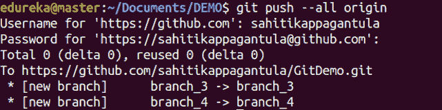

**用法:git push【变量名】:【分支名】**

该命令删除远程存储库上的一个分支。

### **吉特拉**

**用法:git pull【资源库链接】**

这个命令获取并合并远程服务器上的更改到你的工作目录。

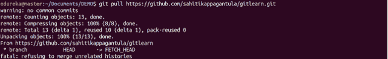

### **git stash**

**用法:git sta save**

该命令临时存储所有修改过的跟踪文件。

**用法:git stash pop**

该命令恢复最近隐藏的文件。

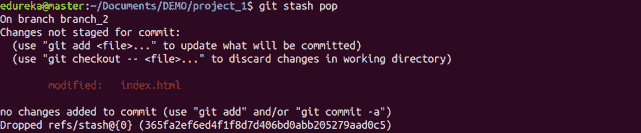

**用法:git stash list**

这个命令列出了所有隐藏的变更集。

**用法:git stash drop**

这个命令丢弃最近隐藏的变更集。

想要了解更多关于 git 命令的信息吗？这里有一个 [**Git 教程**](https://www.edureka.co/blog/git-tutorial/) 让你入门。或者，你可以采取自上而下的方法，从这篇 **[DevOps 教程开始。](https://www.edureka.co/blog/devops-tutorial)**