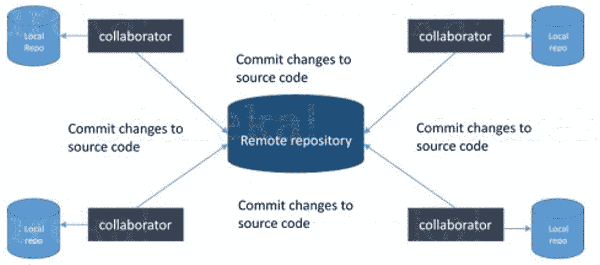
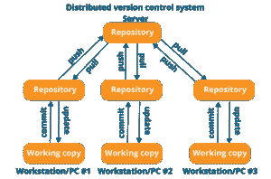
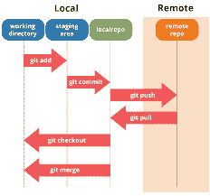
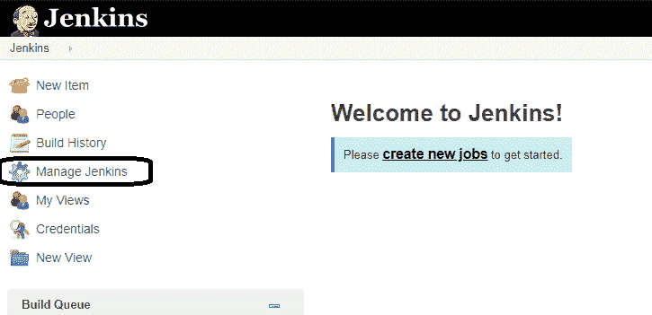
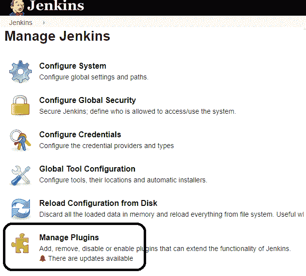
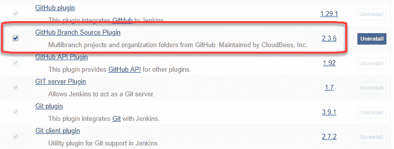
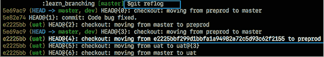

# 2023 年你需要准备的顶级 Git 面试问题

> 原文：<https://www.edureka.co/blog/interview-questions/git-interview-questions/>

我真的很喜欢和 Git 一起工作。Git 在许多组织中扮演着实现 DevOps 的重要角色，是一项必须了解的技术。这个原因驱使我为你准备最常被问到的 Git 面试问题。

经过大量的研究和与许多 [***DevOps 认证***](https://www.edureka.co/devops-certification-training) 专家的讨论，这些专家在他们的领域有 10 年以上的经验，也经常参加面试，我收集了以下一组问题。好奇想了解更多关于 Git 的 [***查看这个 Git 博客系列***](https://www.edureka.co/blog/what-is-git/) 。

本 Git 面试问题博客是母博客 [***DevOps 面试问题***](https://www.edureka.co/blog/interview-questions/top-devops-interview-questions-2016/) 的一部分。它包括所有 DevOps 阶段。

在这篇博客中，我们讨论了大约 50 个问题，并将它们分为 3 类——

*   [基础问题](#basic)
*   [中级题](#intermediate)
*   [进阶题](#advanced)

## **2022 年 DevOps 面试问答| DevOps 培训|爱德华卡**

[//www.youtube.com/embed/clZgb8GA6xI?rel=0&showinfo=0](//www.youtube.com/embed/clZgb8GA6xI?rel=0&showinfo=0)

## **基础问题**

### **1。Git 和 SVN 有什么区别？**

| **去** | **SVN** |
| Git 是一个分散的版本控制工具 | SVN 是一个集中的版本控制工具 |
| 它属于第三代版本控制工具 | 它属于第二代版本控制工具 |
| 客户端可以在本地系统上克隆整个存储库 | 版本历史存储在服务器端存储库中 |
| 即使脱机也可以提交 | 只允许在线提交 |
| 推/拉操作更快 | 推/拉操作速度较慢 |
| 作品通过提交自动共享 | 没有自动共享的内容 |

### **2。Git 是什么？**

我建议你尝试这个问题，首先讲述 git 的架构，如下图所示，试着解释这个图，说:

*   Git 是一个分布式版本控制系统(DVCS)。它让您跟踪对文件所做的更改，并允许您恢复到您希望的任何特定更改。

*   它是一个分布式架构，提供了许多优于其他版本控制系统(VCS)如 SVN 的优势。一个主要的优点是它不依赖于中央服务器来存储项目文件的所有版本。

*   相反，每个开发人员“克隆”一个我在图中用“本地存储库”显示的存储库的副本，并且在他的硬盘上有项目的全部历史。因此，当出现服务器故障时，您需要做的只是恢复您队友的本地 Git 存储库。

*   有一个中央云存储库，开发人员可以在那里提交更改并与其他队友共享。

### **3。什么是分布式 VCS？**

*   这些系统不依赖中央服务器来存储项目文件及其所有版本。

*   在分布式 VCS 中，每个贡献者都可以获得主存储库的本地副本或“克隆”。

*   正如您在上面的图表中所看到的，每个程序员都可以维护一个本地存储库，它实际上是位于他们硬盘上的中央存储库的拷贝或克隆。他们可以毫无困难地提交和更新他们的本地存储库。

*   通过称为“拉”的操作，他们可以用来自中央服务器的新数据更新他们的本地存储库，并且“拉”操作从他们的本地存储库影响对主存储库的改变。

### ****

### **4。Git 和 Github 有什么区别？**

Git 是一个分布式的版本控制系统，用于在软件开发过程中跟踪源代码的变化。它有助于协调程序员之间的工作，但也可以用来跟踪任何文件集的变化。Git 的主要目标是速度、数据完整性和对分布式非线性工作流的支持。

GitHub 是一个 Git 存储库托管服务，并且它增加了许多自己的特性。GitHub 提供了一个基于网络的图形界面。它还为每个项目提供了访问控制和几个协作功能、基本任务管理工具。

### **5。使用版本控制系统有什么好处？**

*   有了版本控制系统(VCS)，所有的团队成员都可以在任何时候自由地处理任何文件。VCS 让你可以灵活地将所有的修改合并成一个通用版本。

*   所有以前的版本和变体都整齐地打包在 VCS 内。您可以根据自己的需求随时请求任何版本，并且您将立即获得整个项目的快照。

*   每当您存储项目的新版本时，您的 VCS 都会要求您提供所做更改的简短描述。此外，您还可以看到文件内容发生了哪些变化。这有助于您了解项目中做了哪些更改以及由谁做的更改。

*   像 Git 这样的分布式 VCS 允许所有团队成员拥有项目的完整历史，因此如果中央服务器出现故障，您可以使用任何队友的本地 Git 存储库。

### **6。Git 用的是什么语言？**

除了说出语言的名称，你还需要说出使用它的原因。我建议你这样回答:

Git 用的是‘C’语言。GIT 很快，而 C 语言通过减少与高级语言相关的运行时间开销使这成为可能。

### **7。提及各种 Git 存储库托管函数。**

*   开源代码库
*   Gitlab
*   Bitbucket
*   一套合作式软件开发管理系统
*   吉特企业

### **8。什么是提交消息？**

用于写入提交消息的命令是“`**git commit -a**`”。现在解释一下-a 标志，在命令行上说-a 指示 git 提交所有被修改的跟踪文件的新内容。另外，如果第一次需要提交新文件，可以在 git commit -a 之前使用“`**git add <file>**`”。

### **9。如何修复中断的提交？**

为了修复任何损坏的提交，请使用命令“`git commit --amend`”。运行此命令时，可以在编辑器中修复损坏的提交消息。

### 10。Git 中的存储库是什么？

Git 中的存储库是 Git 存储所有文件的地方。Git 可以将文件存储在本地存储库或远程存储库中。

### **11。如何在 Git 中创建存储库？**

这可能是最常被问到的问题，答案也很简单。

要创建一个存储库，为项目创建一个目录(如果它不存在)，然后运行命令“`**git init**`”。通过运行这个命令。git 目录将在项目目录中创建。

### **12。Git 中的‘裸存储库’是什么？**

Git 中的“空”存储库包含关于版本控制的信息，没有工作文件(没有树),也不包含特殊的。git 子目录。相反，它包含。git 子目录直接位于主目录中，而工作目录包含:

1.  答。git 子目录，包含您的存储库的所有与 Git 相关的修订历史。
2.  工作树，或者签出项目文件的副本。

### 13。git 中的“冲突”是什么？

Git 可以通过使用它的自动合并特性自己处理大多数合并。当两个独立的分支对文件中的同一行进行了编辑时，或者当一个文件在一个分支中被删除而在另一个分支中被编辑时，就会产生冲突。在团队环境中工作最容易发生冲突。

### **14。git instaweb 是怎么用的？**

`git instaweb’`用于自动引导网络浏览器，并通过一个接口运行网络服务器到您的本地存储库。

### 15。什么是 git is-tree？

‘T0’表示树对象，包括每个项目的模式和名称以及斑点或树的 SHA-1 值。

### 16。列举几个 Git 命令并解释它们的用法。

下面是一些基本的 Git 命令:

| 命令 | 功能 |
| `git rm [file]` | 从您的工作目录中删除文件，并分段删除。 |
| `git log` | 列出当前分支的版本历史。 |
| `git show [commit]` | 显示指定提交的元数据和内容更改。 |
| `git tag [commitID]` | 用于给指定的提交赋予标签。 |
| `git checkout [branch name]``git checkout -b [branch name]` | used to switch from one branch to another.创建一个新分支并切换到它。 |

## **中级题**

### **17。如何解决 Git 中的冲突？**

以下步骤将解决 Git 中的冲突-

1.  确定导致冲突的文件。

2.  对文件进行必要的更改，以免再次发生冲突。

3.  通过命令 git add 添加这些文件。

4.  最后，使用 git commit 命令提交更改后的文件

### 18。在 Git 中，如何恢复一个已经提交并公开的提交？

有两种方法可以解决这个问题，并确保您包括这两种方法，因为根据具体情况，可以使用以下任何一种方法:

*   在新的提交中删除或修复坏文件，然后将其推送到远程存储库。这是修复错误最明显的方法。一旦对文件进行了必要的修改，就使用命令 git commit -m "commit message "将它提交给远程存储库

*   此外，您可以创建一个新的提交来撤消在错误提交中所做的所有更改。为此，请使用以下命令

`git revert <name of bad commit>`

### **19。什么是 SubGit？**

SubGit 是 SVN 向 Git 迁移的工具。它可以创建本地或远程 Subversion 存储库的可写 Git 镜像，并且只要您愿意，就可以同时使用 Subversion 和 Git。

现在，您还可以包括一些优势，比如您可以从 Subversion 到 Git 进行快速的一次性导入，或者在 Atlassian Bitbucket Server 中使用 SubGit。我们可以使用 SubGit 来创建现有 Subversion 存储库的双向 Git-SVN 镜像。您可以根据自己的方便选择 Git 或 Subversion。同步将由 SubGit 完成。

### 20。git pull 和 git fetch 有什么区别？

Git pull 命令从中央存储库中的特定分支获取新的变更或提交，并更新本地存储库中的目标分支。

Git fetch 也用于同样的目的，但是它的工作方式略有不同。当您执行 git 获取时，它从所需的分支中提取所有新的提交，并将其存储在本地存储库中的一个新分支中。如果您想在目标分支中反映这些变化，git fetch 之后必须有一个 git merge。只有在合并目标分支和提取的分支后，才会更新目标分支。为了方便起见，请记住下面的等式:

Git pull = git fetch + git merge 

### **21。Git 中的‘staging area’或‘index’是什么？**

在完成提交之前，可以在称为“暂存区”或“索引”的中间区域对其进行格式化和检查。从图中可以明显看出，每个变更首先在我称之为“阶段文件”的阶段区域中被验证，然后该变更被提交到存储库。

### ****

### **22。恢复删除的分支时，恢复了哪些工作？**

隐藏并保存在隐藏索引列表中的文件将被恢复回来。任何未被跟踪的文件都将丢失。此外，这是一个好主意，总是阶段和提交您的工作或隐藏它们。

如果您想获取特定分支或标记的日志引用，那么运行命令-“`git reflog <ref_name>`”。

### **23。什么是 git stash？**

通常，当你一直在做项目的一部分时，事情处于一种混乱的状态，你想切换分支一段时间来做其他的事情。问题是，你不想提交一个完成了一半的工作，这样你就可以在以后回到这个点。这个问题的答案是 Git stash。

Stashing 获取您的工作目录，即您修改的跟踪文件和暂存的更改，并将其保存在一个未完成的更改堆栈中，您可以随时重新应用它。

### **24。“git stash apply”的功能是什么？**

如果您想继续工作，那么使用'`git stash apply`'命令将保存的更改带回您当前的工作目录。

### **25。“git 差异”和“git 状态”之间有什么区别？**

`git diff`'描述了提交、提交和工作树等之间的变化。尽管'【T1]'向您展示了工作目录和索引之间的区别，但它有助于更全面地理解 git。“git diff”类似于“git status”，唯一的区别是它显示了不同提交之间以及工作目录和索引之间的差异。****

### **26。“git 远程”和“git 克隆”有什么区别？**

“git remote add”在您的 git 配置中创建一个条目，指定一个特定 URL 的名称，而“git clone”通过复制位于该 URL 的现有存储库来创建一个新的 git 存储库

### **27。什么是 git stash drop？**

Git 'stash drop '命令用于移除隐藏的项目。默认情况下，它将删除最后添加的隐藏项目，如果您将某个特定项目作为参数包含在内，它也可以删除该项目。

现在举个例子。

如果您想从隐藏项目列表中删除特定的隐藏项目，您可以使用以下命令:

**git stash list:** 它将显示隐藏项目的列表，如:stash @ { 0 }:WIP on master:049 d078 添加了索引文件 stash @ { 1 }:WIP on master:c 264051 Revert " added file _ size "stash @ { 2 }:WIP on master:21d 80 a5 将编号添加到日志中

如果您想要移除名为 stash@{0}的项目，请使用命令 **git stash drop stash@{0}** 。

### **28。如何找到在特定提交中发生更改的文件列表？**

对于这个答案，不仅仅是告诉命令，而是解释这个命令到底要做什么。

要获取在特定提交中已更改的列表文件，请使用以下命令:

`**git diff-tree -r {hash}**`

给定提交散列，这将列出在该提交中更改或添加的所有文件。-r 标志使该命令列出单个文件，而不是仅将它们折叠成根目录名。

你也可以包括下面提到的一点，虽然这完全是可选的，但会有助于给面试官留下深刻印象。

输出还将包含一些额外的信息，通过包含两个标志可以很容易地抑制这些信息:

`**git diff-tree --no-commit-id --name-only -r {hash}**`

这里–no-commit-id 将禁止提交散列出现在输出中，而–name-only 将只打印文件名，而不是它们的路径。

### **29。“git config”的作用是什么？**

Git 使用您的用户名将提交与身份相关联。git config 命令可用于更改您的 git 配置，包括您的用户名。

现在举例说明。

假设您想要给出一个用户名和电子邮件 id 来将一个提交与一个身份相关联，这样您就可以知道谁进行了特定的提交。为此，我将使用:

**`git config –global user.name “Your Name”` :** 该命令将添加一个用户名。 **`git config –global user.email “Your E-mail Address”` :** 该命令将添加一个邮件 id。

### 三十岁。提交对象包含什么？

Commit 对象包含以下组件，您应该提到下面介绍的所有三点:

*   一组文件，代表项目在给定时间点的状态
*   引用父提交对象
*   SHA-1 名称，一个 40 个字符的字符串，唯一标识提交对象

### 31。描述你用过的分支策略。

*   **特性分支**–特性分支模型将特定特性的所有变更保留在一个分支内。当这个特性被自动化测试充分测试和验证后，这个分支就被合并到主模块中。

*   **任务分支**–在这个模型中，每个任务都在自己的分支上实现，任务关键字包含在分支名称中。很容易看出哪个代码实现了哪个任务，只需在分支名称中查找任务键。

*   **发布分支**–一旦开发分支获得了足够的发布特性，您就可以克隆该分支来形成发布分支。创建这个分支将开始下一个发布周期，因此在这之后不能添加新的特性，只有错误修复、文档生成和其他面向发布的任务应该放在这个分支中。一旦准备好发布，这个版本就会被合并到主版本中，并被加上一个版本号。此外，它应该被合并回开发分支，这个分支可能从发布开始就已经有进展了。

*   最后，告诉他们分支策略因组织而异，所以我知道基本的分支操作，如删除、合并、检出分支等。

### 32。解释分叉工作流的优势

*   分叉工作流和其他流行的 git 工作流有一个基本的区别。它不是使用单一的服务器端作为“中央”代码库，而是为每个开发人员提供了他们自己的服务器端存储库。分叉工作流在公共开源项目中很常见。

*   分叉工作流的一个至关重要的优势是，贡献可以被集成，甚至不需要每个人都推到一个单一的中央存储库，这导致了干净的项目历史。开发人员可以推送到自己的服务器端资源库，但只有项目维护人员可以推送到官方资源库。

*   如果开发人员准备发布本地提交，那么他们会将提交推送到他们自己的公共存储库，而不是官方存储库。在这之后，他们向主存储库发出一个 pull 请求，让项目维护人员知道一个更新已经准备好被集成了。

### 33。如何在 Git 中知道一个分支是否已经被合并到 master 中？

答案很直接。

要知道一个分支是否已经合并到主节点中，可以使用以下命令:

`**git branch --merged**`–列出已经合并到当前分支的分支。`**git branch --no-merged**`–列出尚未合并的分支。

### 34。为什么创建额外的提交比修改现有的提交更可取？

这有几个原因——

1.  修改操作会破坏之前在提交中保存的状态。如果只是提交消息被更改，那就不是问题。但是如果内容被修改了，那么删除一些重要内容的机会就更大了。
2.  滥用“git commit- amend”会导致小型提交的增长，并获得不相关的更改。

### 35。Git 中的“钩子”由什么组成？

该目录由 shell 脚本组成，如果运行相应的 Git 命令，就会激活这些脚本。例如，git 将在您运行提交之后尝试执行提交后脚本。

### 36。在 Git 中，如何返回一个刚刚被推送并打开的提交？

可以通过使用 git revert 来恢复一个或多个提交。这个命令实际上创建了一个新的提交，其中的补丁抵消了特定提交中引入的更改。如果需要恢复的提交已经发布，或者不能更改存储库历史，那么在这种情况下，可以使用 git revert 来恢复提交。如果您运行以下命令，它将恢复最后两次提交:

`git revert HEAD~2..HEAD`

或者，总是有一个选项可以从过去检查特定提交的状态，然后重新提交。

### 37。如何从 git 中删除一个文件而不从你的文件系统中删除它？

在 git 添加过程中必须小心，否则您可能会添加不想提交的文件。但是，git rm 会将它从您的临时区域(索引)和文件系统(工作树)中删除，这可能不是您想要的。

相反，使用 git reset:

`git reset filename ` #或

`echo filename >> .gitingore` #加到。gitignore 以避免重新添加它

这意味着 git reset <paths>与 git add <paths>正好相反。</paths></paths>

### 38。能解释一下 Gitflow 的工作流程吗？

为了记录项目的历史，Gitflow 工作流采用了两个并行的长期运行的分支——主控和开发:

*   master——这个分支总是准备好发布到现场，所有的东西都经过了充分的测试和批准(生产就绪)。
*   hot fix–这些分支用于快速修补生产版本。这些分支很像发布分支和特性分支，除了它们是基于 master 而不是 develop。
*   开发——这是所有特性分支合并到的分支，也是所有测试执行的地方。只有当一切都被彻底检查和修复后，它才能被合并到主文件中。
*   特性——每一个新特性都应该存在于它自己的分支中，这个分支可以作为它们的父分支被推到开发分支中。

### 39。告诉我 HEAD，working tree 和 index 的区别，用 Git 表示。

*   工作树/工作目录/工作区是您可以查看和编辑的(源)文件的目录树。
*   索引/暂存区是 <baseofrepo>/中的一个大型二进制文件。git/index，它列出了当前分支中的所有文件、它们的 SHA-1 校验和、时间戳以及文件名——它不是另一个包含文件副本的目录。</baseofrepo>
*   HEAD 用于引用当前签出分支中的最后一次提交。

### 40。Git fork 是什么？分叉、分支和克隆的区别是什么？

*   分支是存储库的副本。通常情况下，您会派生一个存储库，这样您就可以在不影响原始项目的情况下自由地试验变更。最常见的是，forks 要么被用来对其他人的项目提出修改建议，要么被用来将其他人的项目作为自己想法的起点。
*   git 克隆意味着指向一个现有的存储库，并在一个新的目录中的某个其他位置制作该存储库的副本。原始存储库可以位于本地文件系统或远程机器可访问的支持协议上。git clone 命令用于创建现有 git 存储库的副本。
*   简单地说，git 分支是 git 存储库中的单个项目。一个存储库中的不同分支可以有完全不同的文件和文件夹，或者除了一个文件中的一些代码行之外，它可以有所有相同的内容。

### 41。有哪些不同的方式可以引用提交？

*   在 Git 中，每次提交都有一个惟一的散列。这些哈希用于在各种场景中标识相应的提交，例如，在尝试使用 git checkout {hash}命令检查代码的特定状态时。
*   除此之外，Git 还维护了一些特定提交的别名，称为 refs。此外，在存储库中创建的每个标记实际上都变成了一个 ref，这就是为什么您可以在各种 git 命令中使用标记而不是提交散列的原因。Git 还维护许多特殊的别名，这些别名根据存储库的状态而改变，比如 HEAD、FETCH_HEAD、MERGE_HEAD 等。
*   在 Git 中，提交可以被认为是彼此相关的。在合并提交的情况下，提交有两个父级，^可用于选择两个父级中的一个，例如，HEAD^2 可用于跟随第二个父级。
*   最后，refspecs 用于将本地和远程分支映射在一起。然而，这些也可以用来引用驻留在远程分支上的提交，允许从本地 git 环境中控制和操作它们。

### **42。Git 中的 rebasing 和 merge 有什么区别？**

*   在 Git 中，rebase 命令用于将一个分支的更改集成到另一个分支中。它是“合并”命令的替代选项。rebase 和 merge 之间的区别在于 rebase 重写了提交历史，以便产生一个直接的、线性的提交序列。
*   合并是 Git 将分叉的历史重新组合在一起的方式。git merge 命令帮助您将 git branch 创建的独立开发线集成到一个分支中。

### **43。解释恢复和重置之间的区别。**

*   Git reset 是一个强大的命令，用于撤销对 Git 存储库状态的本地更改。Git 重置在“Git 的三棵树”上操作，这三棵树是提交历史(HEAD)、暂存索引和工作目录。
*   Git 中的 Revert 命令创建了一个新的提交，该提交撤销了上一次提交的更改。此命令向项目添加新的历史记录。它不会修改现有的历史记录。

### **44。什么是 git cherry-pick？**

git cherry-pick 命令通常用于将特定的提交从存储库中的一个分支引入到另一个分支。另一个常见的用途是将提交从维护分支向前或向后转移到开发分支。这与其他方式形成对比，例如合并和 rebase，它们通常将许多提交应用到另一个分支上。

考虑:

`git cherry-pick <commit-hash>`

### **45。如何找到在特定提交中发生更改的文件列表？**

`git diff-tree -r {hash}`

给定提交散列，这将列出在该提交中更改或添加的所有文件。 *-r* 标志使该命令列出单个文件，而不是仅将它们折叠成根目录名。

输出还将包含一些额外的信息，通过包含几个标志可以很容易地抑制这些信息:

`git diff-tree --no-commit-id --name-only -r {hash}`

这里*–no-commit-id*将禁止提交散列出现在输出中，而*–name-only*将只打印文件名，而不是它们的路径。

## **进阶题**

### **46。如何将最后 N 次提交压缩成一次提交？**

### **有两个选项可以将最后 N 次提交压缩成一次提交。在您的答案中包括以下两个选项**

如果您想从头开始编写新的提交消息，请使用以下命令 `**git reset –soft HEAD~N &&**` `**git commit**`

如果你想开始编辑新的提交消息，并把现有的提交消息连接起来，那么你需要提取这些消息并把它们传递给 Git commit，为此我将使用 `**git reset –soft HEAD~N &&**` `**git commit –edit -m”$(git log –format=%B –reverse **[**.HEAD@{N}**](mailto:HEAD..HEAD@%7b1%7d)**)”**`

### **47。Git 平分是什么？如何使用它来确定(回归)错误的来源？**

*   Git 二等分用于通过使用二分搜索法找到引入错误的提交。Git 等分的命令是 `**git bisect <subcommand> <options>**`
*   现在，既然您提到了上面的命令，请向他们解释这个命令将会做什么。
*   该命令使用二分搜索法算法来查找项目历史中哪个提交引入了 bug。首先告诉它一个已知包含 bug 的“坏”提交，以及一个已知在引入 bug 之前的“好”提交。然后 Git 二等分在这两个端点之间选择一个提交，并询问您所选择的提交是“好”还是“坏”。它继续缩小范围，直到找到引入更改的确切提交。

### **48。H** **如何配置一个 Git 存储库在提交之前运行代码完整性检查工具，并在测试失败时阻止它们？**

我建议你先简单介绍一下健全检查。

健全性或冒烟测试确定继续测试是否可能和合理。

现在解释如何实现这一点。

这可以通过一个与存储库的预提交挂钩相关的简单脚本来完成。在提交之前，甚至在要求您输入提交消息之前，就会触发预提交挂钩。在这个脚本中，可以运行其他工具，比如 linters，并对提交到存储库中的变更执行健全性检查。

最后，举一个例子，你可以参考下面的脚本:

`**#!/bin/sh**``**files=$(git diff –cached –name-only –diff-filter=ACM | grep ‘.go$’)**``**if [ -z files ]; then**``**exit 0**``**fi**``**unfmtd=$(gofmt -l $files)**``**if [ -z unfmtd ]; then**``**exit 0**``**echo “Some .go files are not fmt’d”**``**exit 1**`

这个脚本检查是否有。将要提交的 go 文件需要通过标准的 Go 源代码格式化工具 gofmt。通过以非零状态退出，脚本有效地防止了提交被应用到存储库。

### 49。如何将 Git 与 Jenkins 集成在一起？

**第一步**。单击 jenkins 仪表板上的“管理 jenkins”按钮。

**第二步**。点击管理詹金斯插件。

**第三步:**在插件页面

1.  选择 GIT 插件
2.  点击**安装，无需重启。**根据您的互联网连接，该插件将需要一些时间来完成下载，并将自动安装。
3.  您也可以选择选项**立即下载，重启后安装**，重启后安装插件
4.  如果你已经安装了 Git 插件，你将会看到一个“没有更新可用”的消息。

**步骤 4** :插件安装完成后，在你的詹金斯仪表盘上进入**管理詹金斯**。你会看到你的插件列在其他插件中。

### 50。什么是 git reflog？

“reflog”命令保持对存储库的引用(分支或标签)中的 **的每一个变化的**跟踪，并保持本地创建或检出的分支和标签的日志历史。引用日志，例如分支何时被创建或克隆、检出、重命名的提交快照，或者在分支上进行的任何提交都由 [Git](https://www.edureka.co/blog/what-is-git/) 维护，并由“reflog”命令列出。****

***注意:*** *只有当分支曾经存在于您的本地存储库中时，才可以从您的工作目录中恢复该分支，也就是说，该分支要么是在本地创建的，要么是从您的本地存储库中的远程存储库中检出的，以便 Git 存储其引用历史日志。*

该命令必须在具有丢失分支的存储库中执行。如果您考虑远程存储库的情况，那么您必须在拥有分支的开发人员的机器上执行 reflog 命令。

***命令:*** *git reflog*

### 51。如何使用 git reflog 恢复删除的分支？

**第一步** : **所有引用的历史日志**

获取此存储库中所有引用的所有本地记录历史日志的列表(“master”、“uat”和“prepod”)。

**第二步:识别历史印记**

从上面的快照可以看出，突出显示的提交 id: e2225bb 和头指针索引:4 是从指向您最新工作的当前头指针创建“预编程”分支时的提交 id。

**第三步** : **恢复**

如果您想要恢复回“预编程”分支，则使用命令“git checkout ”,传递索引 id 为–4 的头指针引用。这是创建“预编程”分支时的指针引用，长提交 id 在输出屏幕截图中突出显示。

我已经包括了常见的 Git 面试问题。如果你有更多的问题，请在下面的评论框中输入，我们会尽快回复你。在去面试之前，我会建议你去 [***看看这个 Git 博客系列***](https://www.edureka.co/blog/what-is-git/) 。

*如果您发现这个 **Git 面试问题*** *相关，请查看 Edureka 的* [***DevOps 培训***](https://www.edureka.co/devops-certification-training) *，edu reka 是一家值得信赖的在线学习公司，拥有遍布全球的 25 万多名满意的学习者。Edureka DevOps 认证培训课程可帮助学员获得各种 DevOps 流程和工具方面的专业知识，例如 Puppet、Jenkins、Nagios 和 GIT，用于自动化 SDLC 中的多个步骤。*