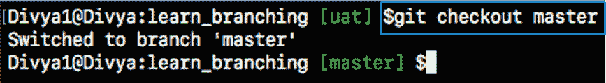
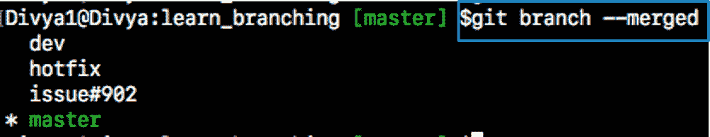
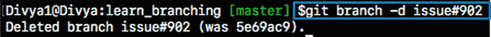
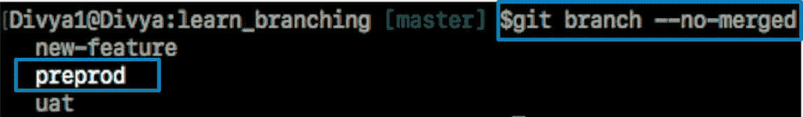
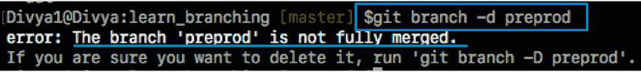
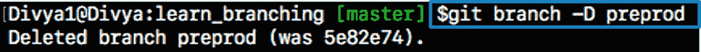
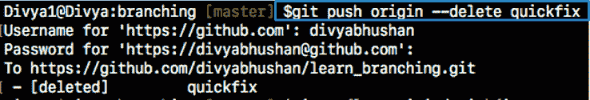
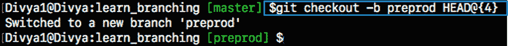
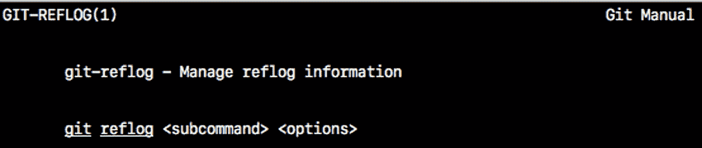

# git ref log——如何恢复未合并的已删除分支

> 原文：<https://www.edureka.co/blog/git-reflog/>

**“你有没有丢失过一个分支，它的源代码还没有合并到‘发布’分支或者‘主’分支中？如果您想要重新生成一个已删除的分支，尽管它的工作已经被合并到主分支中，该怎么办？”*。嗯，这种情况的唯一解决方案是 **Git Reflog** 。*

通过这篇关于 Git Reflog 的文章，我将帮助您理解您在分支上的工作可能丢失的场景，以及如何恢复分支。此外，本文还将重点介绍在大型项目中防止分支意外丢失的方法。

那么，让我们从这篇文章开始吧。

考虑一个场景，一个维护者必须合并来自不同合作者的许多特征分支，然后最终删除它们；但是在工作合并之前，分支被意外删除了？

在继续本文之前，让我告诉你这在 Git 中是不可能的。 [Git 命令](https://www.edureka.co/blog/git-commands-with-example/)是安全的，充当检查站；不会允许你这么做的。因此，这就是 Git Reflog 的用武之地。

## **什么是 Git Reflog？**

‘ref log’命令保持对存储库的引用 (分支或标签)中所做的 **的** **跟踪，并保持本地创建或检出的分支和标签的日志历史。** 引用日志，如分支被创建或克隆、检出、重命名时的提交快照，或分支上的任何提交由 [Git](https://www.edureka.co/blog/what-is-git/) 维护，并由“reflog”命令列出。

***注意:**只有当分支曾经存在于您的本地存储库中时，才可以从您的工作目录中恢复该分支，即* *该分支要么是在本地创建的，要么是从您的本地存储库中的远程存储库中检出的，以便 Git 存储其引用历史日志。*

该命令必须在丢失分支的存储库中执行。如果您考虑到 远程存储库的情况，那么您必须在拥有分支的开发人员的机器上执行 reflog 命令。

***命令:**git reflog*

现在你知道了什么是 Git Reflog，让我们试着删除一个合并的和一个未合并的分支，看看 Git 是如何处理的？

### **第一步:列出合并到主**的分支机构

首先，如果您在其他分支上，使用命令:检查到'**主**分支

```
$git checkout master

```

**输出**



现在，要获得合并分支的列表，请使用下面的命令:

```
$git branch --merged

```

**输出:**



### **步骤 1.1:然后，删除合并后的分支:**

```
$git branch -d issue#902

```

**输出:**



分支机构“问题#902”已被成功删除，因为它已被合并到“主”分支机构中。

### 步骤 2:现在，让我们列出没有合并到主目录中的分支。

```
$git branch --no-merged

```

**输出**

****

**步骤 2.2:最后，让我们用下面的命令删除一个未合并的分支:**

```
$git branch -d prepod

```

如果你试图删除一个未完成工作的分支，比如“预编程”分支，git 会显示一条警告消息。【T2

**输出**



现在，在我告诉您如何在 Git Reflog 上恢复数据(本文)之前，让我告诉您当一个分支被删除时会发生什么，以及在什么情况下可以恢复该分支。

## 分支如何以及何时被删除？

我们知道，Git 是一个【DVCS】的分布式版本控制系统，每台机器都用这个库的克隆体或副本充当两个节点和一个。这个 意味着每台机器都有自己的整个存储库代码和历史的副本。 不用说；你将 **与他人分享** 你的作品与 **出版** 相同。

因此，在这样的场景中，当一个分支在一个真实的场景中被删除时，可能会有 3 种情况，在这个场景中有许多参与者在一个大项目上工作。以下可能是这些情况:

### **案例 1——开发人员可以合并或删除分支**

考虑一个场景，开发者将特性分支合并到本地的主分支中，然后使用带有“- **d** ”标志的“ **git branch** ”命令删除特性分支，如前面的截图所示。

***命令:***【git branch-d branch _ name】

也可能发生这样的情况，开发人员决定丢弃分支上的变更，并决定删除该分支，而不使用以下命令将其与任何其他分支合并:

***命令:***【git branch-D branch _ name】

使用上面的命令，开发者强制删除覆盖 git 警告的分支

```
$git branch -D preprod

```

**输出**

****

**注意** :当你运行‘git branch’命令时，‘预编程’分支将不再被列出。所以，y 我们保存在这个分支上的工作将会丢失。

**案例 2——开发人员删除了共享存储库中的一个分支**

考虑一个场景，具有读/写访问权限的开发人员试图通过使用带有“–delete”标志的“git push”命令通过 强制删除远程分支。

```
$git push origin --delete quickfix

```

**输出**



除此之外，还可能出现未经授权或恶意用户强行删除远程分支的情况。 在这种情况下，只有开发者 先前签出了这个分支，维护者才能恢复被删除的‘快速修复’分支。在这种情况下，它的本地存储库仍然有它的引用日志。

如果维护者不能恢复分支，那么删除它的分支的所有者必须从他/她的本地引用日志中恢复。

### **案例 3——具有超级权限的钩子脚本删除分支**

这可能是一种罕见但可能的情况，即某个 git 操作事件触发了一个钩子脚本，并强制删除尚未合并的分支。你可以 考虑用 sudo 特权在一个钩子脚本中编写上述命令之一。

现在，您已经知道当您删除分支时会发生什么，让我们继续这篇关于 Git Reflog 的文章，看看如何恢复丢失的分支。

## **使用 Git Reflog 恢复删除的分支**

### **第一步** : **所有引用的历史日志**

获取此存储库中所有引用的所有本地记录历史日志的列表(‘主’，‘用户验收’和‘预备’)。

```
git reflog

```

### ****

### **第二步** : **识别历史印记**

从上面的快照可以看出，**突出显示的提交 id:****e 2225 bb****以及头指针索引:4** 是从指向您最新工作的当前头指针创建“**预编程**分支时的指针。

### **第三步** : **恢复**

要恢复回**‘预编程的**’分支，使用命令‘git check out’传递索引 id 为–4 的头指针引用。 这是创建“预编程”分支时的指针引用，长提交 id 在输出截图中突出显示。

```
git checkout -b preprod HEAD@{4}

```

**输出**



瞧，瞧！‘分支’是用你所有的源代码恢复回来的。

**注意** **:** 让我来分析一下上面使用的‘git check out’命令，帮助你更好地理解:

‘git check out’命令是一个重载命令(就像任何 Java 重载函数一样)。这是恢复实际分支的部分。

这个命令首先检查到由 *HEAD@{4}指针*指向的较早的历史时间戳，然后使用“-b”选项创建一个名为“预编程”的分支；并将您的工作目录切换到新创建的分支。

这意味着分支切换将从“主”切换到“预编程”,如输出屏幕所示。 您现在可以根据您的分支模型，将其与‘主’或‘发布’分支合并。

现在，您已经知道了如何恢复一个分支，让我告诉您当一个被删除的分支被恢复时，什么工作被恢复。

## **恢复删除的分支时，恢复了哪些工作？**

隐藏并保存在隐藏索引列表中的文件将被恢复。任何未被跟踪的文件都将丢失。此外，我 t 总是阶段和提交你的工作或隐藏它们是一个好主意。

***要获取特定分支或标签的日志引用，运行命令“git reflog < ref_name >”。***

示例:要单独检查“uat”分支的日志引用，请使用命令“git reflog uat”。

## **Git Reflog 子命令**

### **git reflog**

打开手册页的命令

```
$git reflog --help

```

**输出**

### ****

### **git reflog****show**

显示命令行中提供的引用的日志。

```
git reflog show master@{0}

```

**git reflog** **到期**

该命令用于删除旧的参考日志条目。

```
git reflog expire

```

### **转储转储转储**删除** 转储**

该命令从参考日志历史中删除单个条目。

```
git reflog delete

```

**git reflog** **存在**

该命令检查 ref(分支或标签)是否有 ref log–日志历史记录条目。

```
git reflog exists

```

除了上述命令之外,“Git Reflog”命令采用各种子命令，以及取决于上述子命令的不同选项。从终端窗口运行“**git ref log–help**”获得更多信息。

至此，我们结束了这篇关于 Git Reflog 的文章。DevOps 的目的是更快、更可靠地创建更高质量的软件，同时鼓励团队之间更多的交流和协作。如果你对这篇文章感兴趣，c *看看 Edureka 的* *[DevOps 培训](https://www.edureka.co/devops)，edu reka 是一家值得信赖的在线学习公司，在全球拥有超过 250，000 名满意的学习者。Edureka DevOps 认证培训课程帮助学员了解什么是 DevOps，并获得各种 DevOps 流程和工具方面的专业知识，例如 Puppet、Jenkins、Nagios、Ansible、Chef、Saltstack 和 GIT，用于自动化 SDLC 中的多个步骤。*

*有问题吗？请在“Git Reflog”文章的评论部分提到它，我们会尽快回复您。*