# Git'ting Ahead:破解 Git 和 GitHub 第 1 部分

> 原文：<https://www.edureka.co/blog/git-ting-ahead-hacking-git-and-github-part-1>

还记得你不得不通过电子邮件分享代码的日子吗？我真的希望 Git 和 GitHub 在我的大学时代就在身边，那时我们通过共享代码，通过电子邮件或笔式驱动器进行合作。

我在 Git 和 GitHub 上创建了一系列博客，旨在带您了解 Git 和 GitHub 的各种功能和能力。在该系列的第一篇博客中，让我们了解一下基本知识。

**Git 是什么？**

Git 是一个免费的开源版本控制系统，它使得跟踪文件和协作构建代码变得容易。

要开始，你必须从 https://git-scm.com/downloads 的 [为你的机器下载 Git](https://git-scm.com/downloads "git scm")

[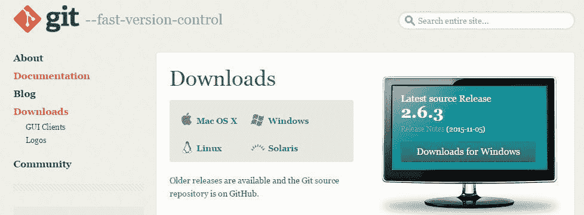](https://www.edureka.co/blog/wp-content/uploads/2015/11/download.jpg)

**入门:**

太好了。您已经在机器上安装了 Git。为了用 Git 跟踪文件/目录，您创建一个存储库并将文件/目录放入其中。我将 jQuery 工作放在 jQueryUI 目录中，为了将所有文件/目录置于 Git 版本控制之下，我需要将该目录初始化为 Git 存储库。

[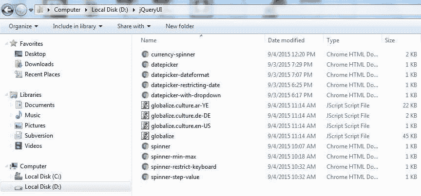](https://www.edureka.co/blog/wp-content/uploads/2015/11/folder.jpg)

**初始化 Git 储存库:**

[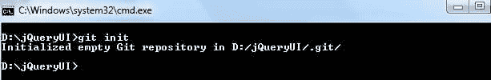](https://www.edureka.co/blog/wp-content/uploads/2015/11/git-init.jpg)

现在，我们已经使用 **git init 将 jQueryUI 目录初始化为 Git 存储库。**

**检查状态:**

可以看到 jQueryUI 目录下的文件仍然没有被 Git 跟踪。您需要使用 **git status** 来检查该操作的状态。

[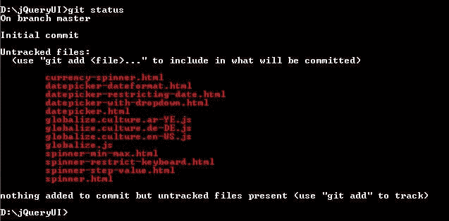](https://www.edureka.co/blog/wp-content/uploads/2015/11/untracked-files.jpg)

**暂存文件:**

现在我们要通过使用 **git add** 命令**将所有未被跟踪的文件置于 Git 的版本控制之下。** 由于有13 个未跟踪的文件，我们将使用选项**-一个带有 git add 命令的**在一个命令中把所有未跟踪的文件放在 git 版本控制下。

[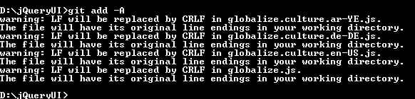](https://www.edureka.co/blog/wp-content/uploads/2015/11/git-add.jpg)

上面我们已经添加了 Git 版本控制下的所有文件，我们可以用 **git status** 命令来检查。

[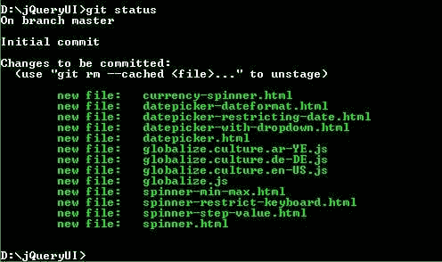](https://www.edureka.co/blog/wp-content/uploads/2015/11/tracked.jpg)

**提交文件:**

接下来，我们将使用 **git commit** 命令提交更改，在提交更改时，您应该在 **-m** 选项后提供一个有意义的提交消息。**注意，在提交变更时，必须提供提交消息。**

[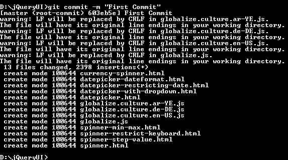](https://www.edureka.co/blog/wp-content/uploads/2015/11/git-commit.jpg)

**创建 GitHub 存储库:**

一旦我们提交了我们的更改，我们就准备将代码推送到远程 GitHub 存储库。要创建 GitHub 存储库，我们需要在 https://github.com/的创建一个帐户。

[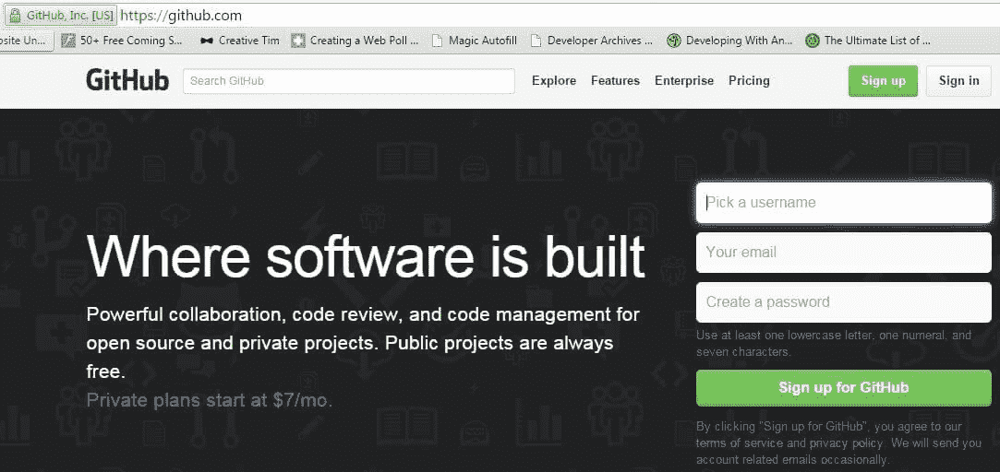](https://www.edureka.co/blog/wp-content/uploads/2015/11/github.jpg)

创建 GitHub 账户后，登录 GitHub，点击**新建库菜单，如下图:**

[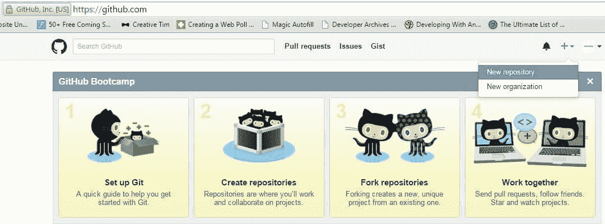](https://www.edureka.co/blog/wp-content/uploads/2015/11/new-repo.jpg)

下面我们将 GitHub 存储库命名为 jQueryProject，并提供了一个简短的描述。

[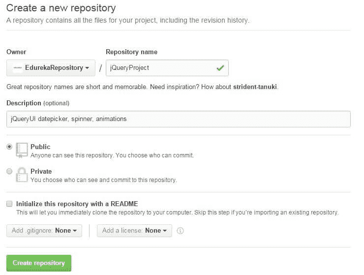](https://www.edureka.co/blog/wp-content/uploads/2015/11/create-repo.jpg)

**公共存储库与私有存储库:**

默认情况下，GitHub 存储库是公开的，这意味着任何人都可以看到存储库的内容。私有库是 GitHub 的付费选项。公共存储库最适合开源项目。如果你不想让任何人看到你的库的内容，你可以在这里查看 GitHub 对私有库的定价:[【https://github.com/pricing】T2](https://github.com/pricing "GitHub pricing")

**将更改推送到 GitHub 存储库:**

要将更改推送到 GitHub 存储库，请复制 GitHub 存储库的地址，并使用 **git push** 命令推送更改。在我们的例子中，远程 GitHub 存储库的地址是 https://github.com/EdurekaRepository/jQueryProject.git 的

[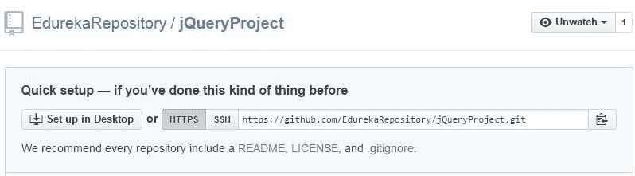](https://www.edureka.co/blog/wp-content/uploads/2015/11/repo-address.jpg)

注意，默认情况下，每个 GitHub 存储库都有一个主分支。因此，我们将把我们的代码推送到知识库的主分支。

[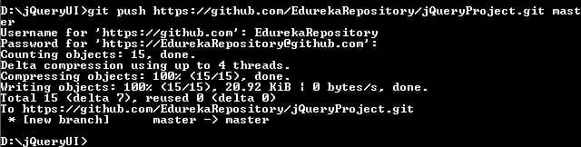](https://www.edureka.co/blog/wp-content/uploads/2015/11/push.jpg)

这里，我们将代码推送到远程 GitHub 存储库 jQueryProject

**访问 GitHub 库:**

将代码或任何其他文件推送到 GitHub 存储库后，您可以从 GitHub 存储库中访问所有推送的数据，如下所示。

**编辑文件、暂存、提交和推送:**

我们已经做出了第一次承诺。现在让我们编辑代码，并将最新的代码提交给 GitHub。

[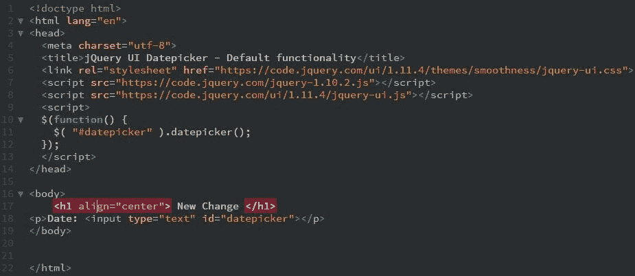](https://www.edureka.co/blog/wp-content/uploads/2015/11/change.jpg)

这里，我们编辑了 datepicker.html 文件(添加了一个 h1 头)。现在让我们用 **git status** 命令来检查状态。

[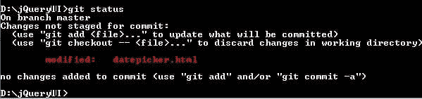](https://www.edureka.co/blog/wp-content/uploads/2015/11/modified.jpg)

**git status** 命令显示我们有一个修改过的文件——date picker . html——并且没有提交新的更改。要提交新的更改，我们必须首先添加已更改的文件，然后提交它。我们可以只用一个命令提交新的更改，而不是键入两个单独的 git 命令，先添加然后提交。

[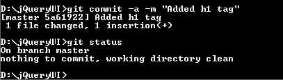](https://www.edureka.co/blog/wp-content/uploads/2015/11/two-in-one.jpg)

这里，我们使用了**-git commit 的一个选项来添加所有更改的文件**。

一旦我们提交了更改，我们就准备好将更改推送到 GitHub 存储库。这一次，在将代码推送到 GitHub 存储库时，我们将为我们的存储库创建一个短句柄。这使得引用我们的 GitHub 库变得很容易。

[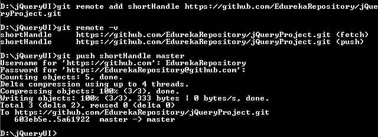](https://www.edureka.co/blog/wp-content/uploads/2015/11/remote-handle.jpg)

在这里，我们为 GitHub 库创建了一个句柄( **shortHandle** ),并使用 **shortHandle** 将更改推送到 GitHub 库。

**提交历史:**

我们可以看到使用 **git log** 命令提交的历史，如下所示。最新提交将显示在顶部。

[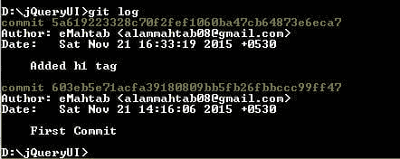](https://www.edureka.co/blog/wp-content/uploads/2015/11/git-log.jpg)

暂时就这样了。使用 Git 和 GitHub 可以做很多事情。在下一篇文章中，让我们学习如何克隆一个库，派生一个库，git 分支，github markdown，README 和 gitignore 文件，github gist 和一些使用 Git 的很酷的技巧。再见了。

有问题要问我们吗？请在评论区提到它，我们会给你回复。

**相关帖子:**

[入门掌握 Git 和 Github](https://www.edureka.co/git-github "get started with mastering git and github")