# 谷歌云服务:关于 GCP 服务你需要知道的一切

> 原文：<https://www.edureka.co/blog/google-cloud-services/>

我希望你已经浏览了我的 [***什么是谷歌云平台***](https://www.edureka.co/blog/what-is-google-cloud-platform/) 博客，在那里我详细介绍了 GCP 和**如何创建一个免费的 GCP 账户**。在这篇博客中，我将谈论所有的**谷歌云服务。**

谷歌云服务是由谷歌提供的一套**计算、网络、存储、大数据、机器学习和管理服务**，运行在谷歌内部为其终端用户产品使用的相同云基础设施上，如谷歌搜索、Gmail、谷歌照片和 YouTube。它提供**种类繁多的服务**，价格相当**惊人**。

在这篇谷歌云服务博客中，我将讨论:

*   [谷歌云服务](#GoogleCloudServices)
*   [计算服务](#ComputeServices)
*   [网络服务](#NetworkingServices)
*   [数据库和存储服务](#Database&StorageServices)
*   [大数据服务](#BigDataServices)
*   [机器学习服务](#MachineLearningServices)
*   [身份与安全服务](#Identity&SecureityServices)
*   [管理和开发工具](#Management&DevelopmentTools)

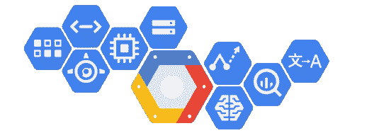

## **谷歌云服务**

谷歌提供广泛的服务，从基本的云服务如容器、计算引擎到复杂的服务如机器学习以及各种 IOT 服务。那么，让我们逐一了解这些服务。【T2

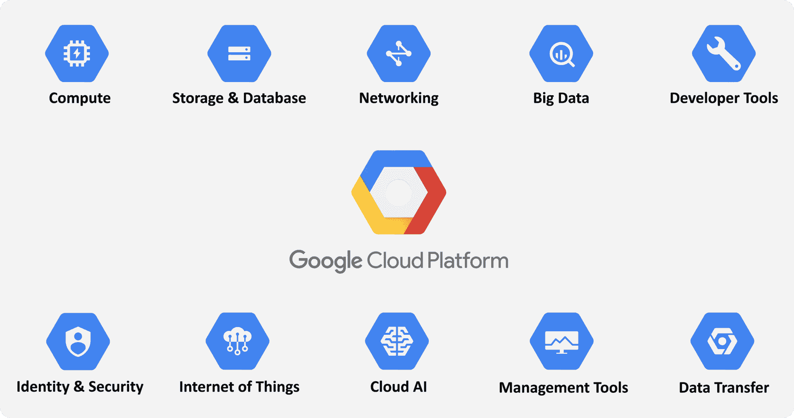

## **计算服务**

谷歌云平台提供了一系列可扩展的计算选项。它提供了高度可定制的虚拟机，您可以定制这些虚拟机来满足您的需求，并选择直接或通过容器部署您的代码。

现在要创建一个计算引擎实例你可以参考这个 [***谷歌云平台教程博客***](https://www.edureka.co/blog/google-cloud-platform-tutorial/) 。

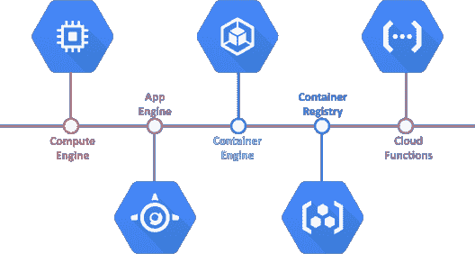

**谷歌计算引擎:**它提供在谷歌创新的数据中心和全球光纤网络中运行的虚拟机。计算引擎虚拟机可快速启动，它们配有高性能持久和本地磁盘选项，可提供一致的性能。

**谷歌应用引擎:****应用引擎**作为一个平台，用于构建**可扩展的网络应用**和物联网后端。App Engine 根据收到的流量自动扩展应用程序。它为您提供了内置的服务和 API，如数据存储、NoSQL、Memcache 和大多数应用程序通用的用户认证 API。

**Google Kubernetes 引擎:**它是一个强大的**集群管理器**和运行 Docker 容器的平衡系统。Kubernetes 引擎将您的容器调度到集群中，保持它们健康，并根据您定义的需求自动管理它们。

**Google Cloud Container Registry:**It 是一个**私有 Docker 仓库**，它与流行的连续交付系统一起工作。

## **网络服务**

网络是最重要的，也是最基本的谷歌云平台服务之一，由最先进的网络服务提供。

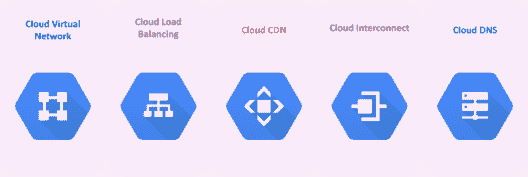

**云虚拟网络:**你可以使用谷歌拥有的全球网络将各种 GCP 资源相互连接，并使用他们的**虚拟专用云(VPC)网络**将它们相互隔离。

让我们看看如何才能创造出一个**VPC**。

*   **第一步:**打开 GCP 的网络部分，点击创建 VPC 网络按钮。您将被重定向到此页面，在此您需要输入网络的名称和描述。

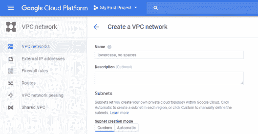

*   **第二步:**您可以选择子网创建模式—**【自定义或自动】。**自定义让您输入自己的**子网名称、地区和 IP 地址。**在自动模式下，您有一个子网列表和一个防火墙列表，您可以从 中选择。

**自定义模式:**

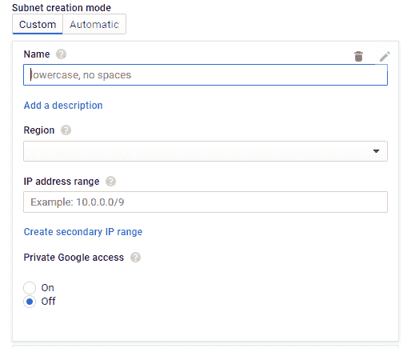

**自动模式:**

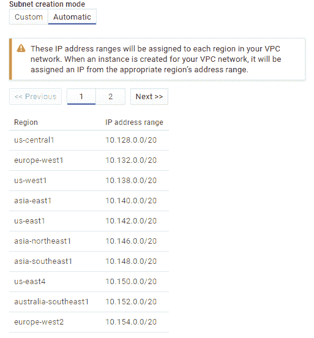

**防火墙规则:**

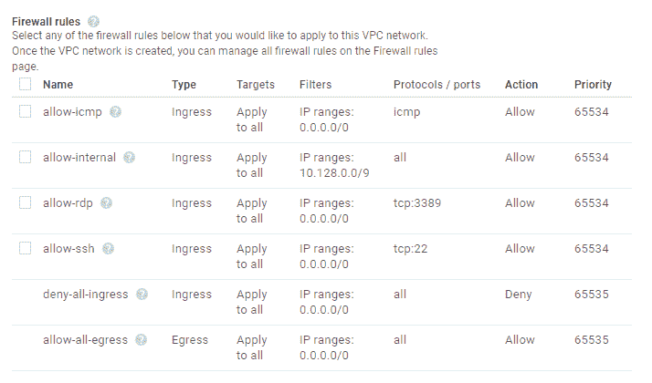

**第三步:**接下来你需要选择**路由模式**，根据你的需求可以是**区域性的或者是全球性的**。只需点击创建按钮，几分钟内您的网络就会启动并运行。

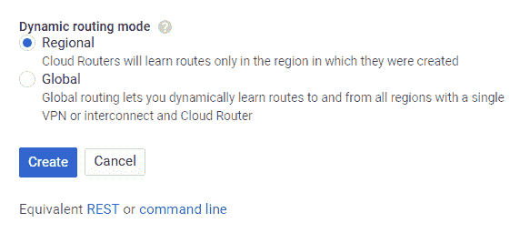

回到谷歌云网络服务，我们有:

**谷歌云负载平衡:**它帮助你**根据你的需求扩展你的应用**。在靠近用户的单个或多个区域中平衡您的计算机器资源负载，以满足您的高可用性要求。

**云 CDN(内容交付网络):**它使用谷歌的全球**分布式边缘缓存**来加速从谷歌计算引擎提供的网站和应用程序的内容交付。云 CDN 降低了网络延迟，卸载了源，降低了服务成本。

**Google Cloud Interconnect:**Cloud Interconnect 允许云平台客户通过企业级连接连接到 Google，比他们现有的互联网连接具有更高的可用性和/或更低的延迟。

**Google Cloud DNS:** 是一种可扩展、可靠、可管理的权威**域名系统** (DNS)服务，运行在与 Google 相同的基础设施上。它具有低延迟、高可用性，是向用户提供应用程序和服务的一种经济高效的方式。

## **存储&数据库服务**

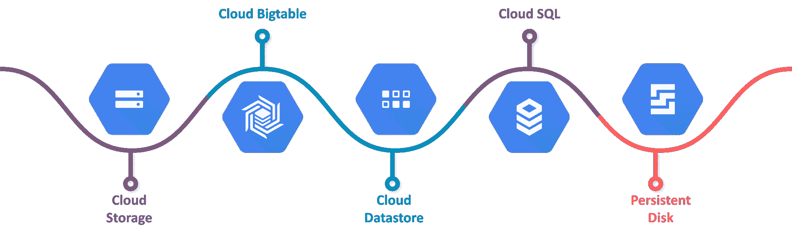

**谷歌云存储:**它在谷歌范围内提供统一的产品。它既可以处理实时数据，也可以处理云归档解决方案。

**云 SQL:** 云 SQL 是一个完全托管的数据库服务，它使得在云中设置、维护、管理和管理您的**关系型 MySQL 和 PostgreSQL 数据库**变得容易。

**云 Bigtable:** 它提供了一个**大规模可扩展的 NoSQL 数据库**适合低延迟高吞吐量的工作负载。它可以与流行的大数据工具(如 Hadoop 和 Spark)轻松集成，并支持开源的行业标准 HBase API。

**Google Cloud Datastore:**Cloud Datastore 给你一个弹性的、高度可用的**面向文档的数据库**即服务。

**持久磁盘**:适用于虚拟机和容器存储的高性能**块存储**服务。它提供了无与伦比的性价比。

## **大数据服务**

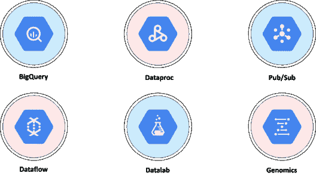

**Google big query:**big query 是 Google 完全托管的低成本**分析数据仓库**。

**Google Cloud Dataproc:** 它是一个托管的 Spark 和 Hadoop 服务，用于使用 Apache 大数据生态系统中强大而开放的工具轻松处理大型数据集。

**Google Cloud data lab:**Cloud data lab 是一款交互式**笔记本(基于 Jupyter)** 对数据进行探索、协作、分析和可视化。它与 BigQuery 和谷歌云机器学习相集成，让您轻松访问关键的数据处理服务。

**Google Cloud Pub/Sub:** 它是一种无服务器、大规模、可靠的实时消息服务，允许你在独立的应用程序之间发送和接收消息。

现在继续我们的谷歌云服务博客，我们有机器学习和某些身份安全服务&以及某些管理和开发工具。【T2

## **机器学习服务**

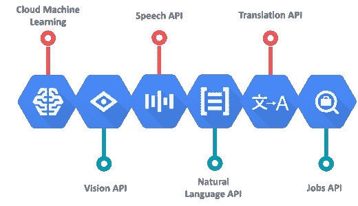

**Cloud AutoML:** 它是一套**机器学习产品**，使机器学习专业知识有限的开发人员能够利用谷歌的神经架构搜索技术来训练高质量的模型。

**谷歌云 TPU:** 云 TPU 是硬件加速器的**家族，谷歌专门设计和优化了这些加速器，以加速和扩大用 TensorFlow 编程的训练和推理的 ML 工作负载。**

**谷歌云机器学习引擎:**ML 引擎让你轻松构建复杂的大规模机器学习模型，涵盖从构建复杂的回归模型到图像分类的广泛场景。

## **身份与安全服务**

身份和安全是谷歌云服务最重要的内容之一，因为你知道你的数据是安全的，而且是加密的。

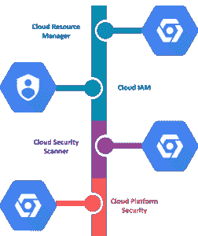

**Google Cloud Identity &访问管理:** **IAM** 让管理员授权谁可以对特定资源采取行动，让您可以完全控制和查看集中管理云资源。

**云安全扫描器:**是针对 App Engine 应用常见漏洞的 web 安全扫描器，包括跨站点脚本(XSS)、Flash 注入、混合内容(HTTPS 的 HTTP)、不安全库等。

**了解我们在顶级城市/国家的谷歌云培训**

| **印度** | **美国** | **其他城市/国家** |
| [班加罗尔](https://www.edureka.co/google-cloud-architect-certification-training-bangalore) | [纽约](https://www.edureka.co/google-cloud-architect-certification-training-new-york-city) | [英国](https://www.edureka.co/google-cloud-architect-certification-training-uk) |
| [海德拉巴](https://www.edureka.co/google-cloud-architect-certification-training-hyderabad) | [芝加哥](https://www.edureka.co/google-cloud-architect-certification-training-chicago) | 伦敦 |
| [浦那](https://www.edureka.co/google-cloud-architect-certification-training-pune) | 达拉斯 | [加拿大](https://www.edureka.co/google-cloud-architect-certification-training-canada) |
| [钦奈](https://www.edureka.co/google-cloud-architect-certification-training-chennai) | [休斯顿](https://www.edureka.co/google-cloud-architect-certification-training-houston) | [澳大利亚](https://www.edureka.co/google-cloud-architect-certification-training-australia) |

## **管理和开发工具**

继续我们最后一套谷歌云服务，我们有一些管理工具。这些工具用于**监控**服务，**发现错误**，**调试**它们，**跟踪**服务。

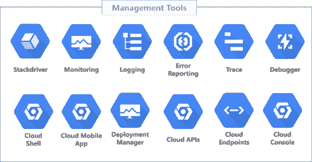

**stack driver**在 GCP 提供实时监控和日志记录，以及有用的诊断工具。

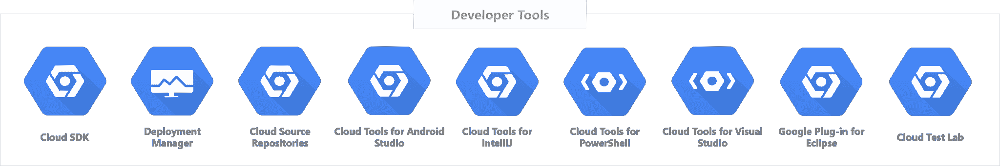

Google 云平台提供了一系列工具和库，帮助您更快地开发。

**Google Cloud SDK** 是一套库和工具，你可以用它来管理谷歌云平台上托管的计算资源和应用。借助 Cloud SDK，您可以使用交互式命令行工具来管理您的虚拟机、云 SQL 实例和部署。

**原来就是这样，伙计们！**

我希望你喜欢这个**谷歌云服务**的博客。如果你正在读这篇文章，那么恭喜你！你不再是谷歌提供的各种云服务的新手。

*既然你已经了解了各种各样的谷歌云服务是什么，那就来看看 Edureka 的* [***GCP 认证***](https://www.edureka.co/google-cloud-architect-certification-training) *培训* *吧，edu reka 是一家值得信赖的在线学习公司，拥有遍布全球的 250，000 多名满意的学习者。Edureka Google [**云架构师硕士项目**](https://www.edureka.co/masters-program/cloud-architect-training) 旨在帮助你通过专业云架构师——Google 云认证。*

*有问题吗？请在评论区提到它，我们将会回复您，或者今天就参加我们在纽约的 [GCP 培训。](https://www.edureka.co/google-cloud-architect-certification-training-new-york-city)*