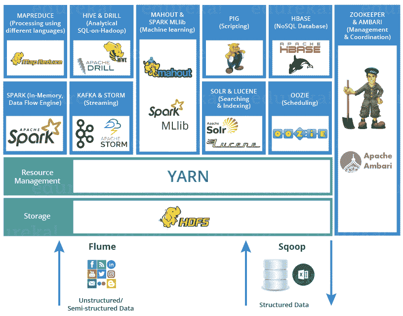
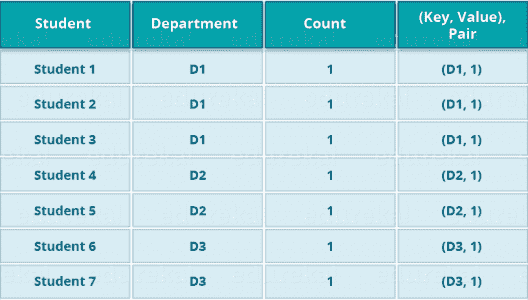
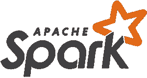
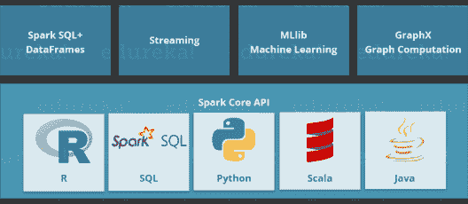
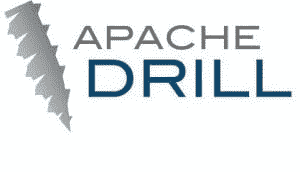
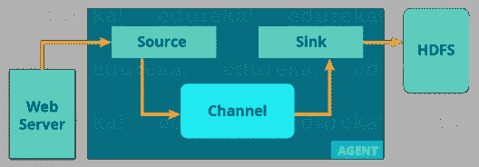
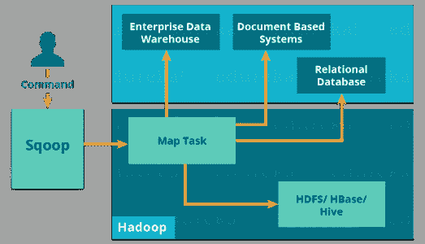
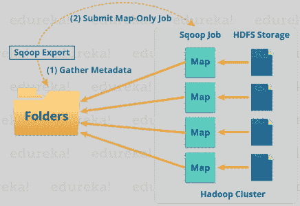

# Hadoop 生态系统:用于处理大数据的 Hadoop 工具

> 原文：<https://www.edureka.co/blog/hadoop-ecosystem>

## **HADOOP 生态系统**

在之前关于 ***[Hadoop 教程](https://www.edureka.co/blog/hadoop-tutorial/)*** 的博客中，我们讨论了关于 Hadoop，它的特性和核心组件。现在，下一步是了解 Hadoop 生态系统。在开始使用 Hadoop 之前，这是一个需要了解的基本主题。这个 Hadoop 生态系统博客将让您熟悉行业范围内使用的大数据框架，这是 [***Hadoop 认证***](https://www.edureka.co/big-data-hadoop-training-certification) 所必需的。

Hadoop 生态系统既不是编程语言，也不是服务，它是一个解决大数据问题的平台或框架。您可以将它视为一个套件，其中包含许多服务(摄取、存储、分析和维护)。让我们讨论一下，并简单了解一下服务是如何单独工作和协作的。

以下是 Hadoop 组件，它们共同构成了 Hadoop 生态系统，我将在本博客中逐一介绍:

*   ->-*Hadoop 分布式文件系统*
*   ->-*又一个资源谈判者*
*   [**MapReduce**](#mapreduce)->-*数据处理使用编程*
*   [**火花**](#apache_spark) - > 内存中数据处理
*   **[【小猪】](#apache_pig)[蜂巢](#apache_hive)** - > *数据处理服务使用查询(类 SQL)*
*   [**h base**](#apache_hbase)->*NoSQL 数据库*
*   **[驯象人](#apache_mahout)，火花 MLlib**->-*机器学习*
*   [**阿帕奇钻**](#apache_drill)->*Hadoop 上的 SQL*
*   [**动物园管理员**](#apache_zookeeper)->-*管理集群*
*   ->-*作业调度*
*   **[水槽](#apache_flume)， [Sqoop](#apache_sqoop)** - > *数据摄取服务*
*   [**Solr&Lucene**](#apache_solr_and_lucene)->*搜索&索引*
*   [**【安巴里】**](#apache_ambari) - > *提供、监控和维护集群*

## HDFS

*   ***[Hadoop 分布式文件系统](https://www.edureka.co/blog/hdfs-tutorial)*** 是 Hadoop 生态系统的核心组件或者可以说是主干。
*   HDFS 使存储不同类型的大型数据集(即结构化、非结构化和半结构化数据)成为可能。
*   HDFS 创造了资源的抽象层次，从这里我们可以看到整个 HDFS 是一个整体。
*   它帮助我们在不同的节点上存储数据，并维护关于存储数据的日志文件(元数据)。
*   HDFS 有两个核心组件，即 **NameNode 和【DataNode。**
    1.  **NameNode**是主节点，它不存储实际数据。它包含元数据，就像日志文件一样，或者可以说是内容表。因此，它需要较少的存储和较高的计算资源。
    2.  另一方面，所有数据都存储在**数据节点**上，因此需要更多的存储资源。这些 DataNodes 是分布式环境中的商品硬件(如您的笔记本电脑和台式机)。这就是为什么 Hadoop 解决方案非常经济高效的原因。
    3.  在写入数据时，您总是与 NameNode 通信。然后，它在内部向客户机发送一个请求，请求在各种 DataNodes 上存储和复制数据。

## **纱**

将 YARN 视为您的 Hadoop 生态系统的大脑。它通过分配资源和调度任务来执行所有的处理活动。

*   它有两个主要组件，即**资源管理器和节点管理器**。
    1.  **ResourceManager** 也是处理部门中的一个主节点。
    2.  它接收处理请求，然后相应地将部分请求传递给相应的节点管理器，在那里进行实际的处理。
    3.  每个 DataNode 上都安装了 **节点管理器**。它负责在每个 DataNode 上执行任务。

## **MAPREDUCE**

 它是 Hadoop 生态系统中处理的核心组件，因为它提供了处理的逻辑。 换句话说，MapReduce 是一个软件框架，帮助编写在 Hadoop 环境中使用分布式和并行算法处理大型数据集的应用程序。

*   在一个 MapReduce 程序中， **Map()和 Reduce()** 是两个函数。
    1.  **地图功能**执行过滤、分组、排序等动作。
    2.  同时 **Reduce 函数**聚合和汇总 map 函数产生的结果。
    3.  Map 函数生成的结果是一个键值对(K，V ),作为 Reduce 函数的输入。

让我们以上面的例子来更好的理解一个 MapReduce 程序。

我们有一个学生和他们各自部门的样本案例。我们想计算每个系的学生人数。 最初，Map 程序会执行并计算出现在各个系的学生，产生如上所述的键值对。 这个键值对是 Reduce 函数的输入。Reduce 函数将聚合每个系，计算每个系的学生总数，并产生给定的结果。

## **阿帕奇猪**

*   PIG 有两个部分: **Pig 拉丁语**，语言**PIG 运行时，**为执行环境。你可以更好的理解为 Java 和 JVM。
*   支持*猪拉丁*语言，具有类似 SQL 的命令结构。

如同每个人都不属于一个编程出身。所以，阿帕奇猪缓解了他们。 *你可能很好奇想知道是怎么回事？*

好吧，我来告诉你一个有趣的事实:

***10 行猪拉丁=约。200 行 Map-Reduce Java 代码***

但是当我说在 Pig 作业的后端会执行一个 map-reduce 作业时，请不要感到惊讶。

*   编译器在内部将 pig latin 转换成 MapReduce。它产生一组连续的 MapReduce 作业，这是一个抽象(就像黑盒一样工作)。
*   PIG 最初是由雅虎开发的。

*   它给你一个为 ETL(提取、转换和加载)构建数据流，处理和分析庞大数据集的平台。

**Pig 如何工作？**

在 PIG 中，首先加载命令，加载数据。 然后我们对其执行各种功能，如分组、过滤、连接、排序等。 最后，你可以将数据转储到屏幕上，也可以将结果存储回 HDFS。

## **阿帕奇蜂巢**

*   脸书为精通 SQL 的人创建了 HIVE。因此，HIVE 让他们在 Hadoop 生态系统中工作时有宾至如归的感觉。
*   基本上，HIVE 是一个数据仓库组件，它使用类似 SQL 的接口在分布式环境中读取、写入和管理大型数据集。

***蜂巢+ SQL = HQL***

*   Hive 的查询语言叫做 Hive 查询语言(HQL)，和 SQL 很像。
*   它有两个基本组件: **Hive 命令行和 JDBC/ODBC 驱动**。
*   **Hive 命令行**接口用于执行 HQL 命令。
*   而 Java 数据库连接( **JDBC** )和对象数据库连接( **ODBC** )用于从数据存储建立连接。

*   其次，Hive 具有高度的可扩展性。因为，它可以服务于两个目的，即大数据集处理(即批量查询处理)和实时处理(即交互式查询处理)。
*   支持 SQL 的所有原始数据类型。
*   您可以使用预定义的函数，或者编写定制的用户定义函数(UDF)来满足您的特定需求。 你甚至可以通过新加坡 [蔚蓝数据工程培训](https://www.edureka.co/microsoft-azure-data-engineering-certification-course-singapore) 了解大数据的细节。

*作为一种替代方案，您可以访问这个全面的视频教程，其中讨论了 Hadoop 生态系统中的每个工具:*

## **Hadoop 生态系统|爱德华卡**

[//www.youtube.com/embed/-XkEX1onpEI?rel=0&showinfo=0](//www.youtube.com/embed/-XkEX1onpEI?rel=0&showinfo=0)

*本 Edureka Hadoop 生态系统教程将帮助您了解一组共同构成 Hadoop 生态系统的工具和服务。*

## **阿帕奇看象人**

现在，让我们来谈谈以机器学习而闻名的 Mahout。 Mahout 提供了一个创建可扩展的机器学习应用的环境。

那么，**什么是机器学习？**

机器学习算法允许我们建立自我学习的机器，这些机器可以在没有明确编程的情况下自行进化。 基于用户行为、数据模式和过去的经验，它做出重要的未来决策。 你可以称它为人工智能(AI)的后代。

**看象人做什么？**

它执行**协同过滤、聚类和分类。** 也有人认为**频繁项集缺失**是看象人的功能。让我们分别来了解一下:

1.  **协同过滤:** Mahout 挖掘用户行为，他们的模式，他们的特征，并在此基础上预测并向用户提出建议。典型的用例是电子商务网站。
2.  **聚类:**它将一组相似的数据组织在一起，就像文章可以包含博客、新闻、研究论文等。
3.  **分类**:就是将数据分类归类到各个子部门，就像文章可以归类到博客、新闻、散文、研究论文等类别。
4.  **频繁项目集丢失**:在这里，看象人检查哪些对象可能会一起出现，如果它们丢失了，就给出建议。比如手机和机盖一般都放在一起。所以，如果你搜索一部手机，它也会向你推荐它的外壳。

Mahout 提供了一个命令行来调用各种算法。 它有一套预定义的库，已经包含了不同用例的不同内置算法。

## **阿帕奇火花**

*   Apache Spark 是一个用于分布式计算环境中实时数据分析的框架。
*   Spark 是用 Scala 编写的，最初是由加州大学伯克利分校开发的。
*   它执行内存中的计算来提高 Map-Reduce 上的数据处理速度。
*   通过利用内存计算和其他优化，它在大规模数据处理方面比 Hadoop 快 100 倍。 因此，它比 Map-Reduce 需要更高的处理能力。

如你所见，Spark 附带了高级库，包括对 R、SQL、Python、Scala、Java 等的支持。这些标准库增加了复杂工作流程中的无缝集成。 除此之外，它还允许各种服务与其集成，如 MLlib、GraphX、SQL +数据帧、流媒体服务等。来增强它的能力。

这是大家心中很常见的问题:

*“Apache Spark:Apache Hadoop 的黑仔或救星？”–奥雷利*

这个问题的答案是——这不是苹果与苹果之间的比较。Apache Spark 最适合实时处理，而 Hadoop 旨在存储非结构化数据并在其上执行批处理。当我们将 Apache Spark 的能力(即高处理速度、高级分析和多重集成支持)与 Hadoop 在商用硬件上的低成本操作相结合时，它可以提供最佳结果。

许多公司使用 Spark 和 Hadoop 来处理和分析他们存储在 HDFS 的大数据，原因何在。

## **APACHE HBASE**

*   HBase 是一个开源的非关系分布式数据库。换句话说，这是一个 NoSQL 数据库。
*   它支持所有类型的数据，这就是为什么它能够处理 Hadoop 生态系统中的任何事情。
*   它模仿谷歌的 BigTable，这是一个分布式存储系统，旨在处理大型数据集。
*   HBase 被设计为运行在 HDFS 之上，并提供类似 BigTable 的功能。
*   它为我们提供了一种存储稀疏数据的容错方式，这在大多数大数据用例中很常见。
*   HBase 是用 Java 编写的，而 HBase 应用程序可以用 REST、Avro 和 Thrift APIs 编写。

为了更好地理解，让我们举个例子。 你有数十亿封客户邮件，你需要找出在邮件中使用了“投诉”一词的客户数量。 请求需要快速处理(即实时处理)。 所以，这里我们是在处理一个大数据集的同时检索少量的数据。为了解决这类问题，设计了 HBase。

## **阿帕奇演习**

顾名思义，Apache Drill 用于钻取任何类型的数据。这是一个开源应用程序，它与分布式环境一起工作来分析大型数据集。

*   它是谷歌 Dremel 的复制品。
*   它支持不同种类的 NoSQL 数据库和文件系统，这是 Drill 的一个强大特性。例如:Azure Blob Storage、Google Cloud Storage、HBase、MongoDB、MapR-DB HDFS、MapR-FS、亚马逊 S3、Swift、NAS 和本地文件。

因此，Apache Drill 背后的主要目标是提供可伸缩性，以便我们能够高效地处理数 Pb 和数 EB 的数据(或者你可以说在几分钟内)。

*   Apache Drill 的主要功能在于 ***仅通过使用一个查询就可以组合各种数据存储。***

*   Apache Drill 基本遵循 ANSI SQL。
*   在支持数百万用户和服务他们对大规模数据的查询请求方面，它具有强大的可扩展性。

## **阿帕奇动物园管理员**

*   Apache Zookeeper 是任何 Hadoop 工作的协调者，包括 Hadoop 生态系统中各种服务的组合。
*   Apache Zookeeper 在分布式环境中协调各种服务。

在 Zookeeper 之前，在 Hadoop 生态系统中的不同服务之间进行协调是非常困难和耗时的。 早期的服务在交互方面有很多问题，比如同步数据时的公共配置。 即使配置了服务，服务配置的变化也会使其变得复杂和难以处理。分组和命名也是一个耗时的因素。

由于上述问题，Zookeeper 被推出。通过执行 **同步、配置维护、分组和命名，节省了大量时间。**

虽然这是一个简单的服务，但它可以用来构建强大的解决方案。

像 Rackspace，Yahoo，易贝这样的大公司在他们的许多用例中都使用这项服务，因此，你可以了解 Zookeeper 的重要性。

## **阿帕奇 OOZIE**

将 Apache Oozie 视为 Hadoop 生态系统中的时钟和闹钟服务。对于 Apache 作业，Oozie 就像一个调度程序。它调度 Hadoop 作业，并将它们绑定在一起作为一个逻辑工作。

有两种 Oozie 作业:

1.  **Oozie 工作流**:这些是要执行的一系列动作**。**你可以把它想象成一场接力赛。每个运动员等待最后一个人完成他的部分。
2.  Oozie 协调者:这些是当数据对它可用时被触发的 Oozie 任务。把这想象成我们身体中的反应-刺激系统。就像我们对外部刺激作出反应一样，Oozie 协调器对数据的可用性作出反应，否则它就会停止工作。

## **阿帕奇水槽**

接收数据是我们 Hadoop 生态系统的重要组成部分。

*   Flume 是一项帮助将非结构化和半结构化数据导入 HDFS 的服务。
*   它为我们提供了一个可靠的分布式解决方案，帮助我们**收集、聚合**和**移动大量数据集**。
*   它帮助我们从网络流量、社交媒体、电子邮件、日志文件等各种来源获取在线流数据。在 HDFS。

现在，让我们从下图中了解一下 Flume 的架构:

有一个 **Flume 代理**，它将来自不同数据源的流数据接收到 HDFS。从图中可以很容易理解 web 服务器表示数据源。Twitter 是流媒体数据的著名来源之一。

水槽代理有 3 个组件:**源、汇和通道**。

1.  **源**:接受来自输入流线的数据，并将数据存储在通道中。
2.  **通道:**作为本地存储或主存储。通道是 HDFS 中数据源和持久数据之间的临时存储。
3.  **接收器:**然后，我们的最后一个组件，即接收器，从通道收集数据，并将数据永久提交或写入 HDFS。

## **【Apache sqoop】**

现在，我们来谈谈另一个数据摄取服务，即 Sqoop。Flume 和 Sqoop 的主要区别在于:

*   Flume 只将非结构化数据或半结构化数据导入 HDFS。
*   而 Sqoop 可以将结构化数据从 RDBMS 或企业数据仓库导入导出到 HDFS，反之亦然。

让我们使用下图来理解 Sqoop 的工作原理:

当我们提交 Sqoop 命令时，我们的主任务被分成子任务，由单独的地图任务在内部处理。地图任务是子任务，它将部分数据导入 Hadoop 生态系统。总的来说，所有地图任务都会导入全部数据。

导出也以类似的方式工作。

当我们提交作业时，它会被映射到地图任务中，从而从 HDFS 获取大量数据。这些块被导出到结构化数据目标。结合所有这些导出的数据块，我们在目的地接收整个数据，在大多数情况下，目的地是 RDBMS (MYSQL/Oracle/SQL Server)。

## **阿帕奇 SOLR &卢斯**

 

Apache Solr 和 Apache Lucene 是 Hadoop 生态系统中用于搜索和索引的两个服务。

*   Apache Lucene 基于 Java，这也有助于拼写检查。
*   如果说阿帕奇 Lucene 是发动机，那么阿帕奇 Solr 就是围绕它打造的汽车。Solr 是一个围绕 Lucene 构建的完整应用。

*   它使用 Lucene Java 搜索库作为搜索和完整索引的核心。

## **阿帕奇**安巴里

Ambari 是一个 Apache 软件基金会项目，旨在使 Hadoop 生态系统更易于管理。

它包括用于**供应、管理和监控** Apache Hadoop 集群的软件。

Ambari 提供:

1.  **Hadoop 集群配置** :
    *   它为我们提供了在多台主机上安装 Hadoop 服务的逐步流程。
    *   它还处理集群上 Hadoop 服务的配置。
2.  Hadoop 集群管理:
    *   它提供了一个中央管理服务，用于启动、停止和重新配置整个集群中的 Hadoop 服务。
3.  **Hadoop 集群监控:**
    *   为了监控健康和状态，Ambari 为我们提供了一个仪表盘。

*   **安珀警报框架**是一种警报服务，在需要注意时通知用户。例如，如果一个节点关闭或节点上的磁盘空间不足，等等。 从 [数据工程师认证](https://www.edureka.co/microsoft-azure-data-engineering-certification-course) 了解更多大数据及其应用。

***最后，我想提请大家注意三件重要的事情:***

1.  Hadoop 生态系统的成功归功于整个开发者社区，许多大公司，如脸书、谷歌、雅虎、加州大学等。为增强 Hadoop 的功能贡献了自己的力量。
2.  在 Hadoop 生态系统中，关于一两个工具(Hadoop 组件)的知识无助于构建解决方案。你需要学习一套 Hadoop 组件，它们协同工作来构建一个解决方案。
3.  根据使用案例，我们可以从 Hadoop 生态系统中选择一组服务，并为组织创建量身定制的解决方案。

我希望这篇博客能给你带来信息和附加值。如果您有兴趣了解更多信息，您可以浏览此 ***[案例研究](https://www.edureka.co/blog/hadoop-big-data-in-healthcare)*** ，了解 大数据如何用于医疗保健，以及 Hadoop 如何革新医疗保健分析。

在我们的下一篇博客 ***[Hadoop 教程系列](https://www.edureka.co/blog/hadoop-tutorial/)*** 中，我们介绍了***[【HDFS】](https://www.edureka.co/blog/hdfs-tutorial)***(Hadoop 分布式文件系统)，这是我在这篇 Hadoop 生态系统博客中讨论的第一个组件。

*现在您已经了解了 Hadoop 生态系统，请查看 Edureka 在钦奈举办的 **[大数据培训](https://www.edureka.co/big-data-and-hadoop-training-chennai)** ，edu reka 是一家值得信赖的在线学习公司，拥有遍布全球的 250，000 多名满意的学习者。Edureka 的[大数据工程师课程](https://www.edureka.co/masters-program/big-data-architect-training)使用零售、社交媒体、航空、旅游、金融领域的实时用例，帮助学习者成为 HDFS、Yarn、MapReduce、Pig、Hive、HBase、Oozie、Flume 和 Sqoop 方面的专家。*

*有问题吗？请在评论区提到它，我们将回复您或参加我们在印多尔的 [Hadoop 培训。](https://www.edureka.co/big-data-hadoop-training-certification-indore)*