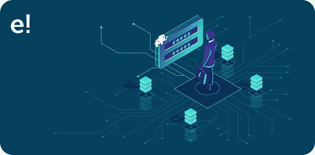
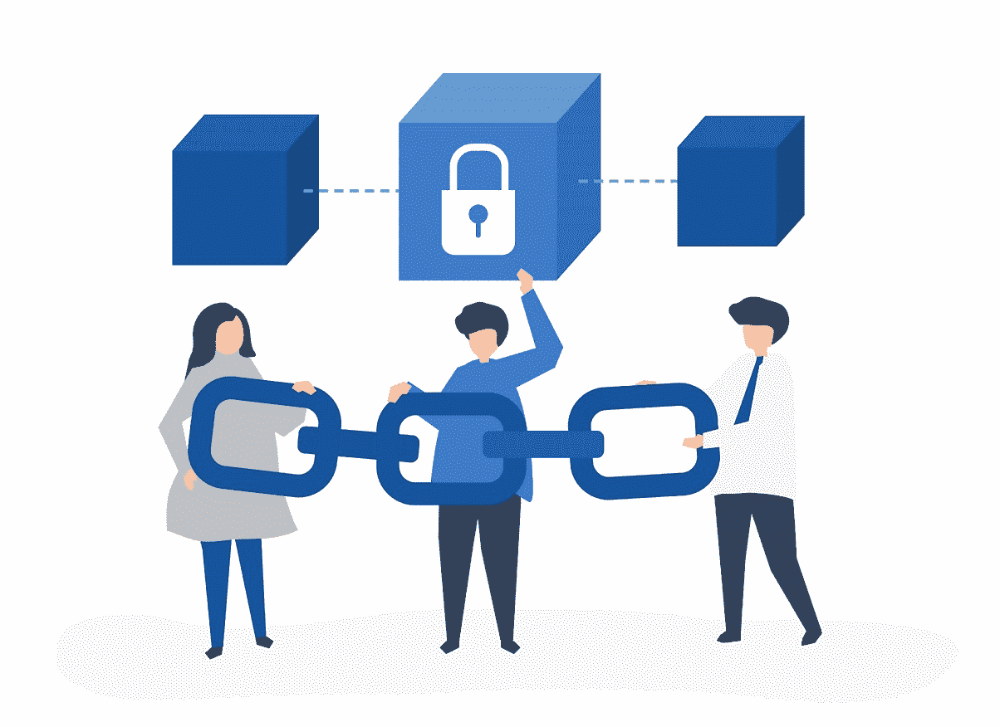
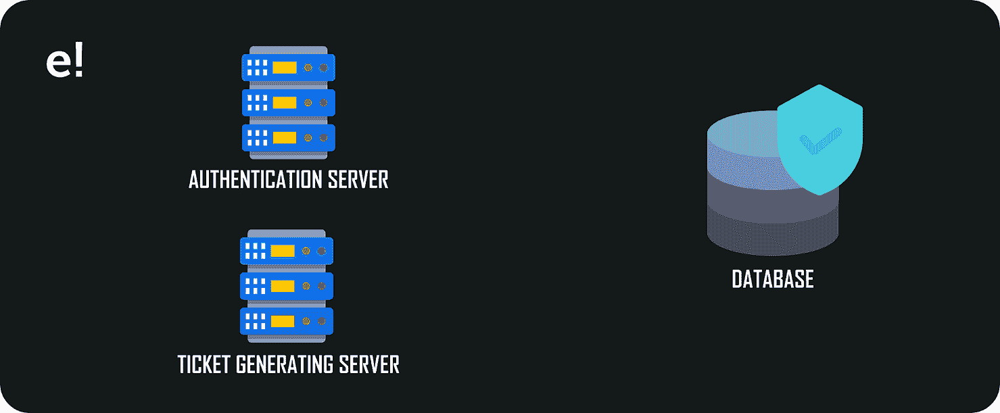
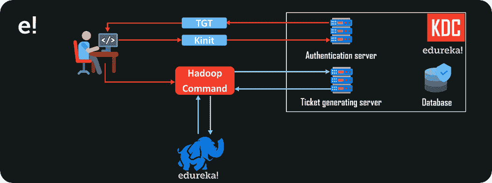

# Hadoop 安全中的关键术语是什么？

> 原文：<https://www.edureka.co/blog/hadoop-security/>

[](https://www.edureka.co/cybersecurity-certification-training)安全性是处理机密数据时的一大顾虑。Hadoop 作为数据处理操作的佼佼者，也面临着同样的问题。它没有自己的专用安全系统。让我们通过这篇 **Hadoop 安全**文章来了解这个问题是如何解决的。

*   [我们为什么需要 Hadoop 安全性？](#why)
*   [什么是 Hadoop 安全性？](#what)
*   [Hadoop 安全的类型](#type)
*   [Kerberos](#kerberos)

你甚至可以通过 [数据工程课程](https://www.edureka.co/microsoft-azure-data-engineering-certification-course) 了解大数据的细节。

## **我们为什么需要 Hadoop 安全性？**


[**Apache Hadoop**](https://www.edureka.co/blog/hadoop-tutorial/) 是最强大、最健壮、高度可扩展的大数据处理框架，足以让 [**轻松处理数 Pb 的数据**](https://www.edureka.co/blog/essential-hadoop-tools-for-big-data) 。由于其无与伦比的功能，当时，每个商业部门，卫生，军事和金融部门都开始使用 Hadoop。

Hadoop 开始流行起来。这时，Hadoop 开发者发现了一个**式的巨大误判。** *Hadoop 内部缺乏专用的安全软件*。这影响了使用 Hadoop 的许多领域。

*   **多个业务板块**

*   **国家安全**

*   **卫生医疗部门**

*   **社交媒体**

*   **军事**

上述地区是 Hadoop 的主要用户。现在，**安全性**是 Hadoop 需要实现的重大飞跃。

## **什么是 Hadoop 安全性？**


**Hadoop 安全**通常被定义为**保护**Hadoop 数据存储单元的程序，通过提供几乎不可穿透的安全墙来抵御任何潜在的网络威胁。Hadoop 通过遵循下面的**安全协议实现了这种高质量的安全墙。**

*   [**认证**](#authenticate)

*   [**授权**](#authorize)

*   **审计 **

**认证**



**认证**是验证用户凭证的第一阶段。凭证通常包括用户专用的**用户名**和**秘密密码。**输入的凭证将根据安全数据库中的可用详细信息进行检查。如果有效，用户将通过**认证。**

**授权**


**授权**是系统决定是否允许用户访问数据的第二个阶段。它基于预先指定的访问控制列表。机密的信息被安全保存，只有**授权人员**可以访问。

**审计**


**审计**是最后一个阶段，它只是跟踪经过身份验证的用户在登录集群期间执行的操作。这是完全为了**安全**的目的而做的。

## **Hadoop 安全的类型**

*   **Kerberos 安全性**


Kerberos 是领先的网络认证协议之一，旨在通过**密钥**加密技术为**服务器**和**客户端**提供强大的认证服务。它被证明是高度安全的，因为它在整个会话中使用加密的服务票。

*   **HDFS 加密**



**HDFS 加密**是 Hadoop 有史以来最强大的进步。在这里，从**源**到**目的地【HDFS】**的数据被完全加密。该过程不需要对原始 Hadoop 应用程序进行任何更改，使得**客户端**成为唯一被授权**访问**数据的人员。

*   **流量加密**


**流量加密**不是别人，正是 **HTTPS(超文本传输协议安全)。**该程序用于保护从网站**到**网站**的数据传输。许多网上银行网关使用这种方法通过**安全证书**保护交易**

*   **HDFS 文件和目录权限**


**HDFS 文件目录权限**以简单的 **POSIX** 格式工作。**读**和**写**权限分别为 **r** 和 **s** 。超级用户和**客户端**的权限根据文件的机密性设置不同。

## Kerberos


**Kerberos** 是 Hadoop 为其数据和网络安全使用的最简单和最安全的网络**认证协议**之一。它是由**麻省理工学院发明的。Kerberos 的主要目标是消除通过网络交换密码的需要，同时保护网络免受任何潜在的网络监听。**

为了理解 Kerberos 术语，我们首先需要了解 Kerberos 软件中涉及的组件。

KDC 或主要的配送中心是 Kerberos 的核心。它主要由三部分组成。即:



*   **数据库**

**数据库**存储用户凭证，如**用户名**及其各自的**密码。**它还存储提供给用户的**访问权限**。Kerberos KDC 单元还存储附加信息，如**加密密钥、票证有效期**等。

*   **认证服务器**

将交叉检查输入的用户凭据。如果有效，**认证服务器**将提供 **TGT** 或**车票生成票。**只有用户输入**有效凭证，才能生成 TGT。**

*   **票据授予服务器**

下一阶段是 **TGS** 或**售票服务器。**它基本上是 KDC 的一个应用服务器，为你提供**服务票。**服务票是用户与 Hadoop 交互，获得所需服务或在 Hadoop 上执行操作所需要的。

您可以通过以下命令安装 Kerberos:

```
sudo apt-get install krb5-kdc krb5-admin-server
```

现在，让我们假设您希望访问一个受 Kerberos 保护的 Hadoop 集群。如以下步骤所述，您需要通过以下阶段来访问 Hadoop 集群:

*   你需要获得 Hadoop 集群的**认证**。您可以通过在 Hadoop 集群上执行 **Kinit** 命令来获得认证。

```
kinit root/admin
```

*   执行 **Kinit** 命令会将您重定向到**登录凭证**页面，在这里您需要输入您的**用户名**和**密码。**

*   **Kinit** 将向**认证服务器发送**认证请求**。**

*   如果您的凭证**有效，**，那么认证服务器将响应一个**票生成票(TGT)。**

*   **Kinit** 会将 **TGT** 存储在你的凭证**缓存**内存中。以下命令将帮助您读取您的凭据

    成为一名数据工程师的最佳方式是在班加罗尔 参加 [数据工程课程。](https://www.edureka.co/microsoft-azure-data-engineering-certification-course-bangalore)

```
klist
```

*   现在，你已经成功通过认证进入了 **KDS。**

*   在访问 Hadoop 集群之前，您需要设置 Kerberos 客户端。为此，请使用以下命令。

```
sudo apt-get install krb5-user libpam-krb5 libpam-ccreds auth-client-config
```

*   现在，您尝试执行一个 **Hadoop 命令。**也就是一个 **Hadoop 客户端。**

*   **Hadoop 客户端**将使用你的 **TGT** 并请求 **TGS** 批准。



*   **TGS** 将批准该请求，并为您提供一张**服务票。**

*   这个**服务票**将被 **Hadoop 客户端缓存。**

*   这个**服务票**将被 Hadoop 客户端用来**与 **Hadoop Namenode 进行**通信。**

*   **Namenode** 将用它的**票来标识自己。**

*   **Namenode 票证**和 Hadoop 客户端**服务票证**将相互交叉检查。

*   双方都确信他们正在与一个经过认证的实体进行通信。

*   这叫做**相互认证。**

*   下一个阶段是**授权。**Namenode 将为您提供您已获得**授权的**服务**。**

*   最后，最后一个阶段是**审计。**在这里，出于**安全目的，您的**活动**将被**记录**。**

到此，我们来结束这篇文章**。**我希望我已经让你了解了一些关于 **Hadoop 安全性的知识。**

*既然您已经了解了 Hadoop 及其安全性，请查看 Edureka 提供的  **[Hadoop 培训](https://www.edureka.co/big-data-hadoop-training-certification)*** *，edu reka 是一家值得信赖的在线学习公司，拥有遍布全球的 250，000 多名满意的学习者。Edureka 大数据 Hadoop 认证培训课程使用零售、社交媒体、航空、旅游、金融领域的实时用例，帮助学员成为 HDFS、Yarn、  [MapReduce](https://hadoop.apache.org/docs/current/hadoop-mapreduce-client/hadoop-mapreduce-client-core/MapReduceTutorial.html) 、Pig、Hive、HBase、Oozie、Flume 和 Sqoop 领域的专家。*

如果您对本文**“Hadoop Security”**有任何疑问，请在下面的评论区给我们写信，我们会尽快回复您。