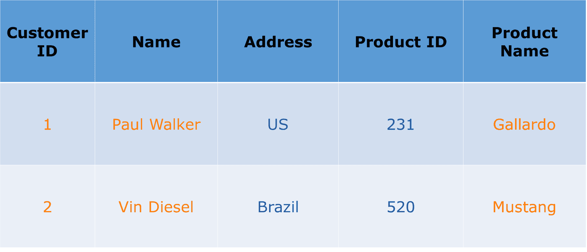
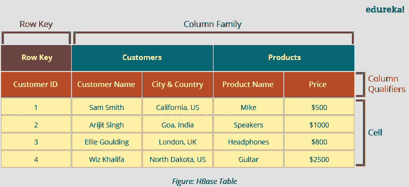
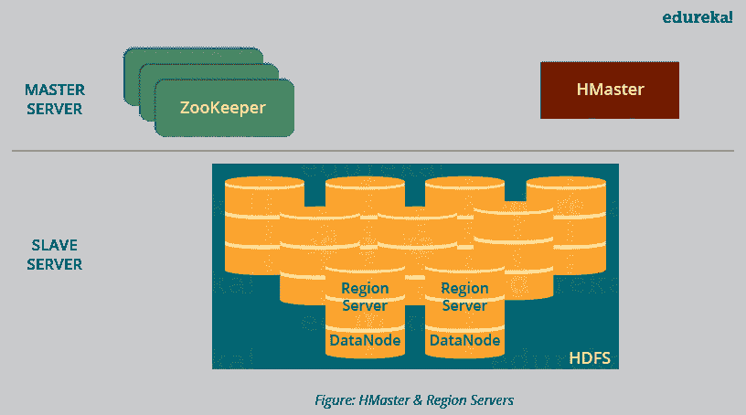
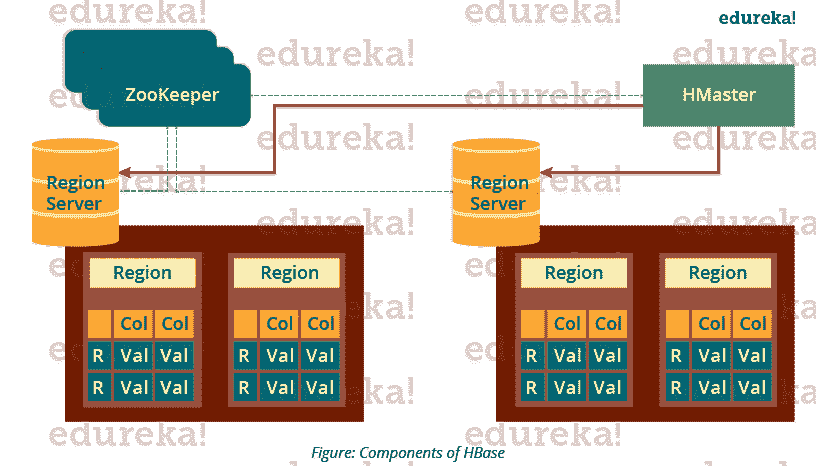
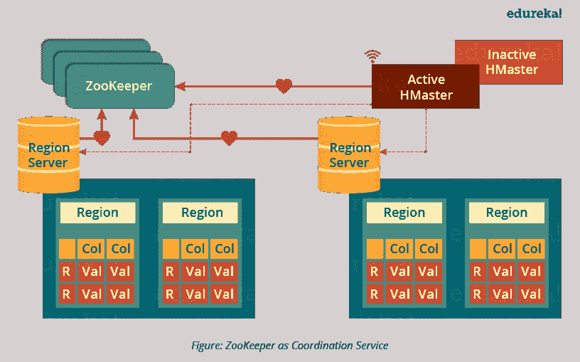
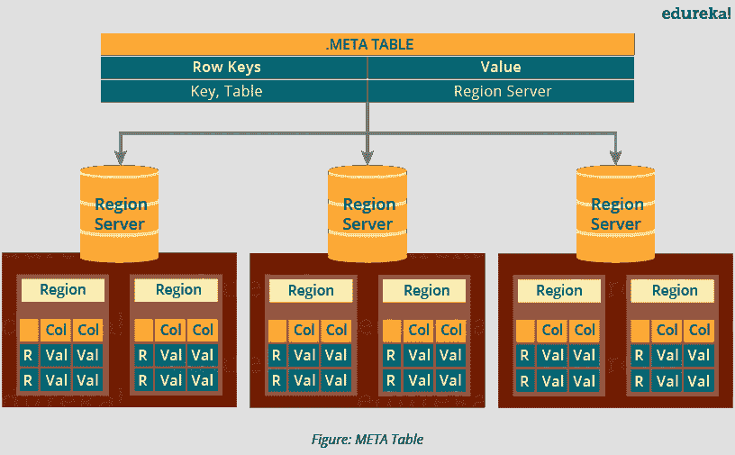
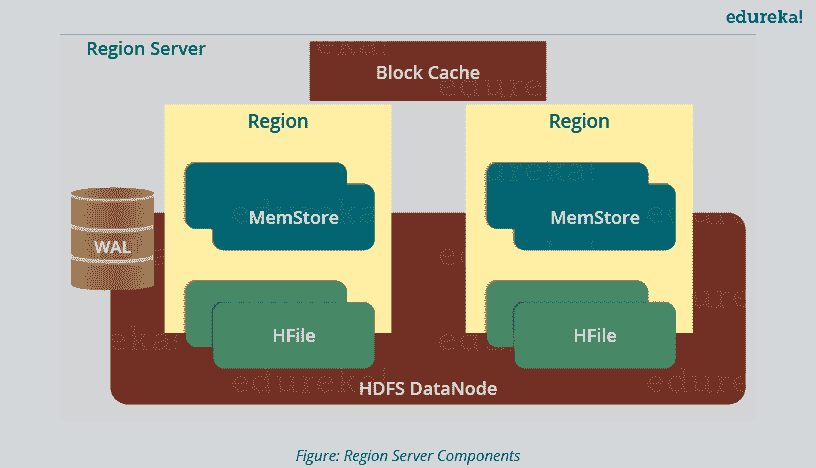
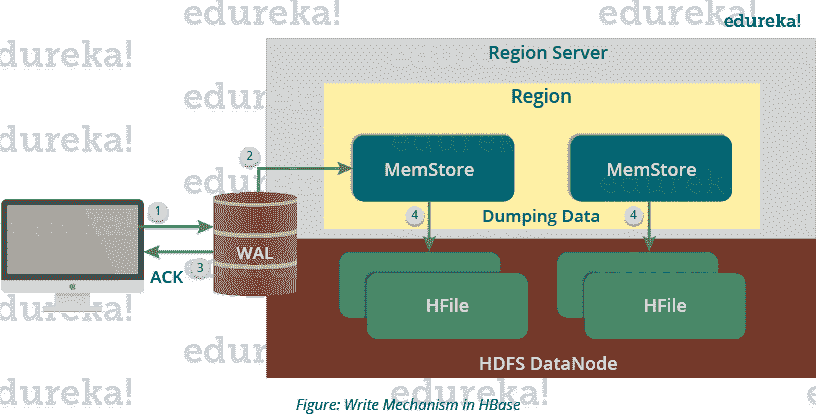
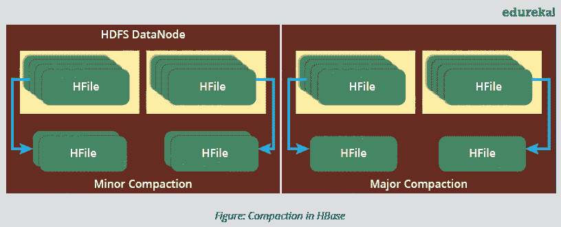
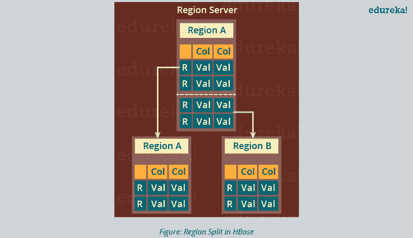

# HBase 架构:HBase 数据模型和 HBase 读/写机制

> 原文：<https://www.edureka.co/blog/hbase-architecture/>

## **HBase 架构**

在我之前关于 ***[HBase 教程](https://www.edureka.co/blog/hbase-tutorial)*** 的博客中，我解释了什么是 HBase 及其特性。我还提到了脸书信使的案例研究，以帮助您更好地沟通。现在，我将解释 HBase 和 HBase 架构的数据模型。在继续之前，您还应该知道 HBase 是一个重要的概念，它是[大数据 Hadoop 认证](https://www.edureka.co/big-data-hadoop-training-certification)课程中不可或缺的一部分。

在这篇 HBase 架构博客中，我将带您了解的重要主题有:

*   [HBase 数据模型](#hbase_data_model)
*   [HBase 架构及其组成](#components_of_hbase_architecture)
*   [HBase 写机制](#hbase_write_mechanism)
*   [HBase 读取机制](#read_mechanism)
*   [HBase 性能优化机制](#compaction)

我们先来了解一下 HBase 的数据模型。它帮助 HBase 进行更快的读/写和搜索。

## **HBase 架构:HBase 数据模型**

众所周知，HBase 是一个面向列的 NoSQL 数据库。虽然它看起来类似于包含行和列的关系数据库，但它不是关系数据库。关系数据库是面向行的，而 HBase 是面向列的。所以，让我们首先了解面向列和面向行的数据库之间的区别:

*面向行与面向列的数据库:*

*   面向行的数据库将表记录存储在一系列行中。而面向列的数据库 将表记录存储在一系列列中，即一列中的条目存储在磁盘上的连续位置。

为了更好地理解它，让我们举个例子，看看下表。

如果该表存储在面向行的数据库中。它将存储如下所示的记录:

**1保罗·沃克美国231盖拉多**

**2、 范·迪塞尔、巴西、 520 、野马**

在面向行的数据库中，数据是基于行或元组存储的，如上所示。

而面向列的数据库将这些数据存储为:

**1 ， 2 ，** **保罗·沃克，范·迪塞尔，** **美国，巴西，** **231 ， 520 ，** **加拉多，野马**

在面向列的数据库中，所有列值都存储在一起，例如第一列值将存储在一起，然后第二列值将存储在一起，其他列中的数据以类似的方式存储。

*   当数据量非常大时，比如数 Pb 或数 EB，我们使用面向列的方法，因为单个列的数据存储在一起，可以更快地访问。
*   虽然面向行的方法相对高效地处理较少数量的行和列，但是面向行的数据库存储的数据是结构化的格式。
*   当我们需要处理和分析大量的半结构化或非结构化数据时，我们使用面向列的方法。例如处理**在线分析处理**的应用，如数据挖掘、数据仓库、包括分析在内的应用等。
*   然而，**在线事务处理**如处理结构化数据并需要事务属性(ACID 属性)的银行和金融领域使用面向行的方法。

HBase 表具有以下组件，如下图所示:

*   **表格**:数据以表格格式存储在 HBase 中。但是这里的表是面向列的格式。
*   **行** **键**:行键用于查找记录，查找速度快。你很想知道是怎么做到的？我将在这篇博客的架构部分解释它。
*   **列** **族**:各列组合成一个列族。这些列族存储在一起，这使得搜索过程更快，因为属于同一列族的数据可以在单次查找中一起访问。
*   **列** **限定符**:每一列的名称就是它的列限定符。
*   **单元格**:数据存储在单元格中。数据被转储到由行键和列限定符专门标识的单元格中。
*   **时间戳**:时间戳是日期和时间的组合。无论何时存储数据，都会存储其时间戳。这使得搜索特定版本的数据变得容易。

用一种更简单易懂的方式，我们可以说 HBase 包括:

*   组表
*   具有列族和行的每个表
*   行键在 HBase 中充当主键。
*   对 HBase 表的任何访问都使用该主键
*   出现在 HBase 中的每个列限定符表示对应于驻留在单元中的对象的属性。

现在，您已经了解了 HBase 数据模型，让我们看看该数据模型如何符合 HBase 架构，并使其适合大容量存储和更快的处理。

## **HBase 架构:HBase 架构的组件**

HBase 有三大组成部分，即 **HMaster Server** 、 **HBase Region Server、Regions** 和 **Zookeeper** 。

下图解释了 HBase 架构的层次结构。我们将逐一讨论它们。

现在，在进入 HMaster 之前，我们将了解区域，因为所有这些服务器(HMaster、Region Server、Zookeeper)被放置来协调和管理区域，并在区域内执行各种操作。所以你会很好奇什么是区域，为什么它们如此重要？

成为一名数据工程师的最佳途径是在印度参加 [Azure 数据工程课程](https://www.edureka.co/microsoft-azure-data-engineering-certification-course-india) 。

## **HBase 架构:** **地区**

一个区域包含分配给该区域的开始键和结束键之间的所有行。HBase 表可以划分为多个区域，一个列族的所有列都存储在一个区域中。每个区域都包含按排序顺序排列的行。

许多区域被分配给一个**区域服务器**，该服务器负责处理、管理、执行对该组区域的读写操作。

所以，用一种更简单的方式总结:

*   一张表可以分成多个区域。区域是存储开始键和结束键之间的数据的行的排序范围。
*   一个区域的默认大小为 256MB，可以根据需要进行配置。
*   一组区域由区域服务器提供给客户端。
*   一个区域服务器可以为大约 1000 个区域的客户端提供服务。

现在从层次结构的顶部开始，我首先要向您解释 HMaster Server，它在***[【HDFS】](https://www.edureka.co/blog/hdfs-tutorial)***中类似于 NameNode。然后，在层次结构中向下移动，我将带您通过 ZooKeeper 和区域服务器。

## **HBase 架构:****h master**

如下图所示，您可以看到 HMaster 处理驻留在 DataNode 上的区域服务器集合。让我们了解一下 HMaster 是如何做到这一点的。

*   如上图所示，HBase HMaster 执行 DDL 操作(创建和删除表)并将区域分配给区域服务器。
*   它协调和管理区域服务器(类似于 HDFS 的 NameNode 管理 DataNode)。
*   它在启动时将区域分配给区域服务器，并在恢复和负载平衡期间将区域重新分配给区域服务器。
*   它监控集群中所有区域服务器的实例(在 Zookeeper 的帮助下),并在任何区域服务器关闭时执行恢复活动。
*   它提供了创建、删除和更新表格的接口。

HBase 拥有一个庞大的分布式环境，仅靠 HMaster 不足以管理一切。所以，你可能想知道是什么帮助 HMaster 管理这个庞大的环境？这就是动物园管理员出现的原因。在我们了解 HMaster 如何管理 HBase 环境之后，我们将了解 Zookeeper 如何帮助 HMaster 管理环境。

## **HBase 架构:****ZooKeeper——协调人**

下图解释了动物园管理员的协调机制。

*   Zookeeper 在 HBase 分布式环境中扮演着协调者的角色。它通过会话通信来帮助维护集群内部的服务器状态。
*   每个区域服务器和 HMaster 服务器定期向 Zookeeper 发送连续的心跳，并检查哪个服务器是活动的和可用的，如上图所示。它还提供服务器故障通知，以便可以执行恢复措施。
*   从上图中可以看到，有一台非活动服务器，作为活动服务器的备份。如果主动服务器出现故障，它会前来救援。
*   活动的 HMaster 向 Zookeeper 发送心跳，而不活动的 HMaster 监听由活动的 HMaster 发送的通知。如果活动的 HMaster 无法发送心跳，会话将被删除，非活动的 HMaster 将变为活动的。
*   而如果区域服务器未能发送心跳，则会话会过期，所有监听器都会得到通知。然后，HMaster 执行适当的恢复操作，我们将在本博客的后面讨论。
*   动物园管理员还维护着。元服务器的路径，帮助任何客户端搜索任何地区。客户端首先需要检查。一个区域属于哪个区域服务器的元服务器，它获取那个区域服务器的路径。

正如我谈到的。元服务器，我先给你解释一下什么是。元服务器？所以，你很容易把动物园管理员的工作和。元服务器在一起。稍后，当我在这篇博客中向你解释 HBase 搜索机制时，我将解释这两者是如何协同工作的。 有了 [蔚蓝数据工程认证](https://www.edureka.co/microsoft-azure-data-engineering-certification-course) 可以更好的理解。

## **HBase 架构:** **元表**

*   元表是一种特殊的 HBase 目录表。它维护了 HBase 存储系统中所有区域服务器  的列表，如上图所示。
*   看图可以看到，**。META** 文件以键和值的形式维护表。Key 表示区域的开始键及其 id，而值包含区域服务器的路径。

正如我在解释区域时已经讨论过的，区域服务器及其功能，现在我们将向下移动层次结构，我将重点介绍区域服务器的组件及其功能。稍后我将讨论搜索、阅读、写作的机制，并理解所有这些部分是如何协同工作的。

## **HBase 架构:** **区域服务器的组件**

下图显示了区域服务器的组件。现在，我将分别讨论它们。

一个区域服务器维护运行在**上面的各个区域。区域服务器的组件有:

*   **WAL:** 从上图可以得出结论，预写日志(WAL)是一个附着在分布式环境内部每个区域服务器上的文件。WAL 存储尚未持久化或提交到永久存储器的新数据。它用于恢复数据集失败的情况。
*   **块缓存:**从上图可以清楚的看到，块缓存驻留在区域服务器的顶层。它将经常读取的数据存储在存储器中。如果块缓存中的数据最近最少使用，则该数据将从块缓存中删除。
*   **MemStore:** 就是写缓存。它在将所有传入的数据提交到磁盘或永久内存之前存储这些数据。区域中的每个列族都有一个 MemStore。如图所示，一个区域有多个 MemStores，因为每个区域都包含多个列族。在将数据提交到磁盘之前，将按字典顺序对数据进行排序。
*   **HFile:** 从上图可以看到 HFile 存储在 HDFS。因此，它在磁盘上存储实际的细胞。当 MemStore 的大小超过时，MemStore 将数据提交到 HFile。

现在我们已经了解了 HBase 架构的主要和次要组件，我将解释其中的机制和协作。不管是读还是写，首先我们需要搜索从哪里读或者从哪里写一个文件。那么，让我们来理解这个搜索过程，因为这是 HBase 非常受欢迎的机制之一。

## **HBase 架构:** **搜索如何在 HBase 中初始化？**

如你所知，Zookeeper 存储了元表的位置。每当客户端向 HBase 发出读取或写入请求时，都会发生以下操作:

1.  客户端从 ZooKeeper 中检索元表的位置。
2.  然后，客户端从元表中请求相应行键的区域服务器的位置以访问它。客户机用元表的位置缓存这些信息。
3.  然后，它将通过向相应的区域服务器请求来获得行的位置。

为了将来的引用，客户端使用其缓存来检索元表的位置和先前读取的行键的区域服务器。则客户端将不会参考元表，直到并且除非因为区域被移位或移动而存在未命中。然后，它将再次请求元服务器并更新缓存。

像每次一样，客户端不会浪费时间从元服务器检索区域服务器的位置，因此，这节省了时间并使搜索过程更快。现在，让我告诉你在 HBase 中写作是如何发生的。其中涉及哪些组件，它们是如何参与的？

## **HBase 架构:** **HBase 编写** **机制**

下图解释了 HBase 中的写入机制。

写入机制依次经历以下过程(参考上图):

*第一步:*每当客户端有写请求时，客户端将数据写入 WAL(预写日志)。

*   然后，编辑内容被附加到 WAL 文件的末尾。
*   这个 WAL 文件保存在每个区域服务器中，区域服务器用它来恢复未提交到磁盘的数据。

*第二步:*一旦数据被写入 WAL，那么它就被复制到 MemStore。

*第三步:*一旦数据被放入 MemStore，那么客户端就会收到确认。

*第四步:*当 MemStore 达到阈值时，它将数据转储或提交到 HFile 中。

现在让我们深入了解一下 MemStore 在编写过程中是如何贡献的，它的作用是什么？

## **HBase 写** **机制-** **MemStore**

*   MemStore 总是更新存储在其中的数据，按照字典的顺序(按字典的顺序)作为排序的键值。每个列族都有一个 MemStore，因此每个列族的更新都以排序的方式存储。
*   当 MemStore 达到阈值时，它将所有数据以排序的方式转储到一个新的 HFile 中。这个文件存放在 HDFS。HBase 包含每个列系列的多个 HFiles。
*   随着时间的推移，随着 MemStore 转储数据，HFile 的数量会增加。
*   MemStore 还保存最后写入的序列号，因此主服务器和 MemStore 都知道目前提交了什么以及从哪里开始。当片段启动时，读取最后一个序列号，并从该序列号开始新的编辑。

正如我多次讨论的那样，HFile 是 HBase 架构中的主要持久存储。最后，将所有数据提交到 HBase 的永久存储器 HFile 中。因此，让我们来看看 HFile 的属性，它使读写时的搜索速度更快。

## **HBase 架构:** **HBase 编写** **机制-** **HFile**

*   写入按顺序放置在磁盘上。所以磁盘读写头的移动是很少的。这使得写和搜索机制非常快。
*   每当打开一个 HFile 时，HFile 索引就被加载到内存中。这有助于在单次查找中找到记录。
*   预告片是一个指针，指向 HFile 的元块。它被写在提交文件的末尾。它包含有关时间戳和布隆过滤器的信息。
*   布隆过滤器帮助搜索键值对，它跳过不包含所需行键的文件。时间戳也有助于搜索文件的版本，它有助于跳过数据。

了解了写入机制和各种组件在加快写入和搜索速度中的作用后。我将向你解释 HBase 架构中的读取机制是如何工作的？然后，我们将讨论提高 HBase 性能的机制，如压缩、区域分割和恢复。

## **HBase 架构:** **读取机制**

正如在我们的搜索机制中所讨论的，首先客户端从。如果客户端的缓存中没有元服务器，则为元服务器。然后，它经历如下顺序步骤:

*   为了读取数据，扫描器首先在块缓存中寻找行单元。这里存储了所有最近读取的键值对。
*   如果扫描仪未能找到所需的结果，它会移动到 MemStore，因为我们知道这是写缓存。在那里，它搜索最近写入的文件，这些文件还没有被转储到 HFile 中。
*   最后，它将使用 bloom filters 和块缓存从 HFile 加载数据。

到目前为止，我已经讨论了 HBase 的搜索、读取和写入机制。现在我们来看看 HBase 机制，它使 HBase 中的搜索、读取和写入变得快速。首先，我们将了解*压缩*，这是其中的一种机制。

## **HBase 架构:** **压实**

**HBase** 结合 HFiles 减少存储，减少读取所需的磁盘寻道次数。这个过程叫做**压实**。压缩从一个区域中选择一些 HFiles 并组合它们。如上图所示，有两种类型的压缩。

1.  **次要压缩** : HBase 自动挑选较小的 hfile，重新提交给较大的 hfile，如上图所示。这称为小压实。它执行合并排序，将较小的 hfile 提交给较大的 hfile。这有助于存储空间的优化。
2.  **大压缩:**如上图所示，在大压缩中，HBase 将一个区域中较小的 HFile 合并并重新提交到一个新的 HFile 中。在此过程中，相同的柱族一起放置在新的 HFile 中。在此过程中，它会丢弃已删除和过期的单元。它提高了读取性能。

但是在这个过程中，输入输出磁盘和网络流量可能会变得拥挤。这就是所谓的**写放大**。因此，它通常被安排在低峰值负载时间。

现在，我将讨论的另一个性能优化过程是*区域分割*。这对负载平衡非常重要。

## **HBase 架构:** **区域拆分**

下图说明了区域分割机制。

每当一个区域变大，就会被分成两个子区域，如上图所示。每个区域恰好代表父区域的一半。然后将这种分割报告给 HMaster。这由同一个区域服务器处理，直到 HMaster 将它们分配给新的区域服务器进行负载平衡。

接下来，最后但同样重要的是，我将向您解释 HBase 如何在出现故障后恢复数据。我们知道**故障恢复**是 HBase 的一个非常重要的特性，因此让我们了解一下 HBase 如何在故障后恢复数据。

## **HBase 架构:** **HBase 崩溃和数据恢复**

*   每当一个区域服务器出现故障，ZooKeeper 就会通知管理员。
*   然后 HMaster 将崩溃区域服务器的区域分配给多个活跃区域服务器。为了恢复故障区域服务器的内存数据，HMaster 将 WAL 分配给所有区域服务器。
*   每个区域服务器重新执行 WAL，为失败区域的列族构建 MemStore。
*   数据按时间顺序(按时间顺序)写入 WAL。因此，重新执行 WAL 意味着对 MemStore 文件进行所有的修改。
*   因此，在所有区域服务器执行 WAL 之后，所有列族的 MemStore 数据都被恢复。

我希望这篇博客能帮助你理解 HBase 数据模型的架构。希望你喜欢。现在你可以将 HBase 的特性(我在之前的 [***HBase 教程***](https://www.edureka.co/blog/hbase-tutorial) 博客中解释过)与 HBase 架构联系起来，并理解它的内部工作原理。既然你已经知道了 HBase 的理论部分，那么你应该转到实践部分。记住这一点，我们的下一篇 ***[Hadoop 教程系列](https://www.edureka.co/blog/hadoop-tutorial/)*** 的博客将解释一个示例***[h base POC](https://www.edureka.co/blog/sample-hbase-poc/)**。*

*现在您已经了解了 HBase 架构，请查看 Edureka 在班加罗尔 举办的 **[Hadoop 培训，edu reka 是一家值得信赖的在线学习公司，拥有遍布全球的 250，000 多名满意的学习者。Edureka 大数据 Hadoop 认证培训课程使用零售、社交媒体、航空、旅游和金融领域的实时用例，帮助学员成为 HDFS、Yarn、MapReduce、Pig、Hive、HBase、Oozie、Flume 和 Sqoop 领域的专家。](https://www.edureka.co/big-data-and-hadoop-training-bangalore)***

*有问题吗？请在评论区提到它，我们会给你回复。*