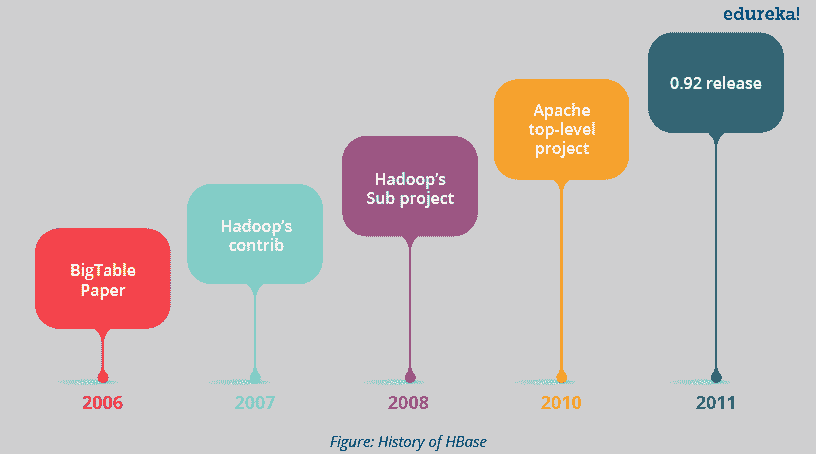
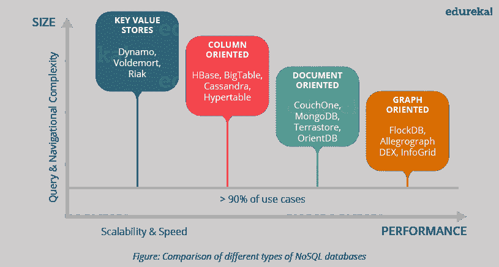
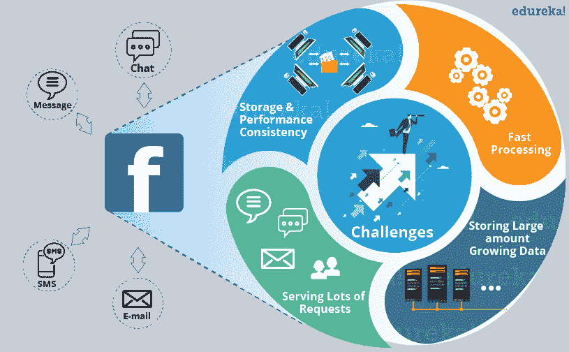
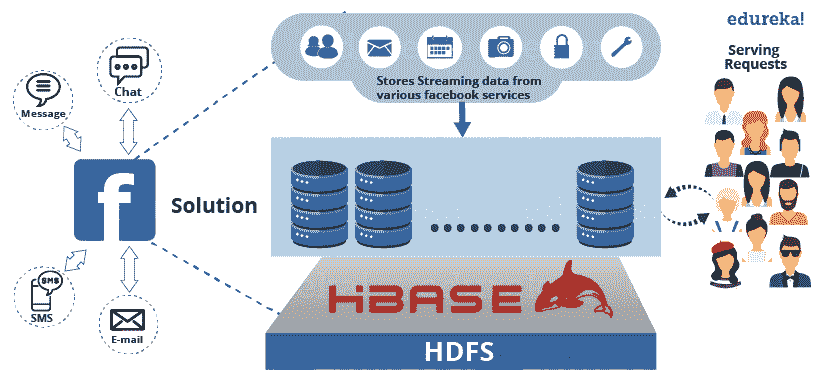

# HBase 教程:HBase 简介和脸书案例研究

> 原文：<https://www.edureka.co/blog/hbase-tutorial>

正如我们在 ***[Hadoop 生态系统](https://www.edureka.co/blog/hadoop-ecosystem)*** 博客中提到的，HBase 是我们 Hadoop 生态系统的重要组成部分。现在，我将带您浏览 HBase 教程，向您介绍 Apache HBase，然后，我们将浏览 Facebook Messenger 案例研究。我们将在这个 HBase 教程博客中讨论以下主题:

*   [历史阿帕奇 h base](#history)
*   [阿帕奇 HBase 介绍](#introduction)
*   [NoSQL 数据库及其类型](#nosql_databases)
*   [HBase vs 卡珊德拉](#hbase_vs_cassandra)
*   [Apache HBase 特性](#features_of_hbase)
*   [HBase vs HDFS](#hbase_vs_hdfs)
*   [Facebook Messenger 案例分析](#facebook_messenger_case_study)

## **Apache HBase 教程:历史**

让我们从 HBase 的历史开始，了解 HBase 在一段时间内是如何发展的。

*   Apache HBase 模仿 Google 的 BigTable，用于收集数据并为各种 Google 服务(如地图、金融、地球等)提供服务。
*   Apache HBase 最初是 Powerset 公司的一个自然语言搜索项目，用于处理大量稀疏的数据集。
*   Apache HBase 于 2007 年 2 月首次发布。2008 年 1 月，HBase 成为 Apache Hadoop 的一个子项目。
*   2010 年，HBase 成为 Apache 的顶级项目。

## **HBase 教程| NoSQL 数据库|爱德华卡**

[//www.youtube.com/embed/NOX6-nDtrFQ?rel=0&showinfo=0](//www.youtube.com/embed/NOX6-nDtrFQ?rel=0&showinfo=0)

了解了 Apache HBase 的历史之后，你会很好奇什么是 Apache HBase？让我们进一步看一看。

## **Apache HBase 教程:HBase 介绍**

HBase 是一个开源的、多维的、分布式的、可扩展的、用 Java 编写的 ***NoSQL 数据库*** 。HBase 运行在(Hadoop 分布式文件系统)之上，为 Hadoop 提供类似 BigTable 的功能。它旨在提供一种存储大量稀疏数据集的容错方式。

从那以后，HBase 通过对巨大数据集提供更快的读/写访问来实现高吞吐量和低延迟。因此，HBase 是需要快速&随机访问大量数据的应用的选择。

它提供了压缩、内存操作和布隆过滤器(数据结构，告知一个值是否存在于一个集合中),以满足快速和随机读写的要求。

*让我们通过一个例子来理解:*一个喷气发动机从不同的传感器产生各种类型的数据，如压力传感器、温度传感器、速度传感器等。这表明发动机的健康状况。这对于了解航班的问题和状态非常有用。持续的引擎运行会在每次飞行中产生 500 GB 的数据，每天大约有 30 万次飞行。因此，以近乎实时的方式应用于此类数据的引擎分析可用于主动诊断问题并减少计划外停机时间。这就需要一个分布式环境来存储大量数据，用 ***快速随机读写*** 进行实时处理。这里，HBase 来救援了。我会在下一篇关于 [***HBase 架构***](https://www.edureka.co/blog/hbase-architecture/) 的博客中详细讲 HBase 读写。

众所周知，HBase 是一个 NoSQL 数据库。因此，在了解 HBase 更多信息之前，让我们先讨论一下 NoSQL 数据库及其类型。

## **Apache HBase 教程:NoSQL 数据库**

NoSQL 的意思是*不仅仅是 SQL* 。NoSQL 数据库是以一种方式建模的，它可以表示除表格格式、非关键关系数据库之外的数据。它使用不同的格式来表示数据库中的数据，因此，基于它们的表示格式有不同类型的 NoSQL 数据库。大多数 NoSQL 数据库利用可用性和速度而不是一致性。现在，让我们继续前进，了解不同类型的 NoSQL 数据库及其表示格式。

它是一个无模式的数据库，包含键和值。每个键指向一个字节数组的值，可以是字符串、BLOB、XML 等。例如，兰博基尼是一个键，可以指向一个值 Gallardo、Aventador、Murciélago、Reventón、Diablo、Huracán、Veneno、Centenario 等。

键值存储数据库:Aerospike，Couchbase，Dynamo，FairCom c-treeACE，FoundationDB，HyperDex，MemcacheDB，腮腺炎，Oracle NoSQL 数据库，OrientDB，Redis，Riak，Berkeley DB。

### ***用例***

键值存储可以很好地处理大小，并且擅长处理低延迟的连续读/写操作流。这使得他们完美地为 的用户偏好和个人资料商店、 的产品推荐；在零售商网站上查看的最新商品，用于推动未来的客户产品推荐， 广告服务；顾客的购物习惯导致定制的广告、优惠券等。为每一位顾客提供实时服务。

### **面向文档的** :

它遵循相同的键值对，但它是半结构化的，如 XML、JSON、BSON。这些结构被视为文档。

基于文档的数据库:Apache CouchDB、Clusterpoint、Couchbase、DocumentDB、HyperDex、IBM Domino、MarkLogic、MongoDB、OrientDB、Qizx、RethinkDB。

### ***用例***

由于文档支持灵活的模式，快速读写和分区使其适用于在 twitter、电子商务网站等各种服务中创建用户数据库。

### **列导向:**

在这个数据库中，数据存储在按列而不是按行分组的单元格中。列在逻辑上被分组为列族，这些列族可以在模式定义期间创建，也可以在运行时创建。

这些类型的数据库将对应于一列的所有单元格存储为连续的磁盘条目，从而使访问和搜索更快。

基于列的数据库:HBase、Accumulo、Cassandra、Druid、Vertica。

### ***用例***

它支持巨大的存储空间并允许更快的读写访问。这使得面向列的数据库适用于存储电子商务网站、金融系统(如谷歌金融和股票市场数据、谷歌地图等)中的客户行为。

### **面向图形:**

这是一个完美灵活的图形表示，使用起来不像 SQL。这些类型的数据库很容易解决地址可伸缩性问题，因为它包含可以根据需求扩展的边和节点。

基于图形的数据库:AllegroGraph、ArangoDB、InfiniteGraph、Apache Giraph、MarkLogic、Neo4J、OrientDB、Virtuoso、Stardog。

### ***用例***

这基本上用于欺诈检测、实时推荐引擎(大多数情况下是电子商务)、主数据管理(MDM)、网络和 IT 运营、身份和访问管理(IAM)等。

HBase 和 Cassandra 是两个著名的面向列的数据库。因此，现在让我们更进一步，比较并理解 HBase 和 Cassandra 在架构和工作上的差异。

## **HBase 教程:HBase VS 卡珊德拉**

*   HBase 是以谷歌的 BigTable 为模型，而 Cassandra 是以脸书最初开发的 DynamoDB(亚马逊)为基础。
*   HBase 利用了 Hadoop 基础设施(HDFS，动物园管理员),而 Cassandra 是单独发展的，但你可以根据需要将 Hadoop 和 Cassandra 结合起来。
*   HBase 有几个相互通信的组件，如 HBase HMaster、ZooKeeper、NameNode、Region Severs。而 Cassandra 是单节点类型，其中所有节点都是平等的，并且执行所有功能。任何节点都可以是协调器；这消除了单点故障。
*   HBase 针对读取进行了优化，并支持单次写入，从而实现严格的一致性。HBase 支持基于范围的扫描，这使得扫描过程更快。而 Cassandra 支持单行读取，这保持了最终的一致性。
*   与 HBase 相比，Cassandra 不支持基于范围的行扫描，这会减慢扫描过程。
*   HBase 支持有序分区，在这种分区中，一个列族的行按行键顺序存储，而在 Casandra 中，有序分区是一个挑战。由于行键分区，HBase 的扫描过程比 Cassandra 更快。
*   HBase 不支持读取负载平衡，一个区域服务器服务于读取请求，副本仅在出现故障时使用。而 Cassandra 支持读取负载均衡，可以从各个节点读取相同的数据。这可能会损害一致性。
*   在 CAP(一致性、可用性&分区容错)定理中，HBase 维护一致性和可用性，而 Cassandra 关注可用性和分区容错。

现在让我们深入了解一下 Apache HBase 的特性是什么让它如此受欢迎。

## **Apache HBase 教程:HBase 的特点**

*   **原子读写:**在行级别上，HBase 提供原子读写。这可以解释为，在一个读或写过程中，所有其他过程被阻止执行任何读或写操作。
*   **一致的读写:**由于上述特性，HBase 提供一致的读写。
*   **线性和模块化可伸缩性:**由于数据集分布在 HDFS 上，因此它可以在各个节点上线性伸缩，也可以模块化伸缩，因为它被划分到各个节点上。
*   **自动可配置的表分片:** HBase 表跨集群分布，这些集群跨区域分布。这些区域和集群会随着数据的增长而分裂和重新分布。
*   **易于使用的 Java API 进行客户端访问:**提供易于使用的 Java API 进行编程访问。
*   **Thrift gateway 和一个 REST-ful Web services:** 它还支持非 Java 前端的 Thrift 和 REST API。
*   **块缓存和布隆过滤器:** HBase 支持块缓存和布隆过滤器，用于大容量查询优化。
*   **自动故障支持:**带 HDFS 的 HBase 跨集群提供 WAL(预写日志)，提供自动故障支持。
*   **排序的行键:**当搜索在一系列行上进行时，HBase 按照字典顺序存储行键。使用这些排序的行键和时间戳，我们可以构建一个优化的请求。

现在，在 HBase 教程中，让我告诉你可以使用 HBase 的使用案例和场景，然后我将比较 HDFS 和 HBase。

我想请大家注意 HBase 最适合的场景。

## **HBase 教程:我们在哪里可以使用 HBase？**

*   我们应该在拥有大型数据集(数百万或数十亿或行和列)并且需要快速、随机和实时的数据读写访问的情况下使用 HBase。
*   数据集分布在不同的集群中，我们需要高可伸缩性来处理数据。
*   数据是从各种数据源收集的，可以是半结构化或非结构化数据，也可以是所有数据的组合。用 HBase 可以很容易地处理它。
*   您想要存储面向列的数据。
*   你有许多版本的数据集，你需要存储它们。

在我跳到脸书信使案例研究之前， 让我告诉你 HBase 和 HDFS 有什么区别。

## **HBase 教程:h base VS HDFS**

HDFS 是一个基于 Java 的分布式文件系统，允许您在 Hadoop 集群中的多个节点上存储大量数据。因此，HDFS 是一个底层存储系统，用于存储分布式环境中的数据。HDFS 是一个文件系统，而 HBase 是一个数据库(类似于 NTFS 和 MySQL)。

由于 HDFS 和 HBase 都在分布式环境中存储任何类型的数据(即结构化、半结构化和非结构化数据),所以让我们来看看 HDFS 文件系统和 NoSQL 数据库 HBase 之间的区别。

*   HBase 提供对大型数据集中少量数据的低延迟访问，而 HDFS 提供高延迟操作。
*   HBase 支持随机读写，而 HDFS 支持 WORM(一次写入多次读取)。
*   HDFS 基本上或主要通过 MapReduce 作业访问，而 HBase 通过 shell 命令、Java API、REST、Avro 或 Thrift API 访问。

HDFS 将大型数据集存储在分布式环境中，并对这些数据进行批处理。例如，它将有助于电子商务网站在一个长期(可能是 4-5 年或更长)增长的分布式环境中存储数百万客户数据。然后，它对这些数据进行批处理，并分析客户行为、模式和需求。然后，公司可以找出客户在哪个月购买了什么类型的产品。它有助于存储存档数据并对其执行批处理。

HBase 以面向列的方式存储数据，其中每一列都存储在一起，这样，利用实时处理，读取变得更快。例如，在类似的电子商务环境中，它存储了数百万个产品数据。因此，如果您在数百万个产品中搜索一个产品，它会优化请求和搜索过程，立即产生结果(或者可以说是实时)。详细的***[h 基础架构解释](https://www.edureka.co/blog/hbase-architecture/)*** ，我会在我的下一篇博客中覆盖。

正如我们所知，HBase 分布在 HDFS 各地，因此两者的结合为我们提供了一个在定制解决方案中利用两者优势的绝佳机会，我们将在下面的脸书信使案例研究中看到这一点。

## **HBase 教程:Facebook Messenger 案例分析**

***脸书消息平台*** 于 2010 年 11 月从 Apache Cassandra 转移到 HBase。

Facebook Messenger 将消息、电子邮件、聊天和短信结合成一个实时对话。脸书试图建立一个可扩展的、健壮的基础设施来处理这些服务。

当时，消息基础设施处理超过 3.5 亿用户，每月发送超过 150 亿条个人对个人的消息。聊天服务支持超过 3 亿用户，他们每月发送超过 1200 亿条消息。

通过监控使用情况，他们发现出现了两种通用数据模式:

*   倾向于不稳定的一组短时间数据
*   很少被访问的不断增长的数据集

脸书希望为这两种使用模式找到一种存储解决方案，他们开始调查寻找现有消息基础设施的替代方案。

在 2008 年早些时候，他们使用开源数据库，即 Cassandra，这是一个最终一致性的键值存储，已经投入生产，为收件箱搜索提供流量服务。他们的团队在使用和管理 MySQL 数据库方面有着丰富的知识，因此切换其中任何一种技术对他们来说都是一个严重的问题。

他们花了几周时间测试不同的框架，评估 MySQL、Apache Cassandra、Apache HBase 和其他系统的集群。他们最终选择了 HBase。

由于 MySQL 无法有效处理大型数据集，随着索引和数据集变大，性能受到影响。他们发现 Cassandra 无法处理复杂模式来协调他们的新消息基础设施。

### 主要问题有:

*   存储来自各种脸书服务的大量持续增长的数据。
*   需要能够充分利用高处理能力的数据库。
*   需要高性能来满足数以百万计的请求。
*   保持存储和性能的一致性。

***图:脸书使者面临的挑战***

针对所有这些问题，脸书提出了一个解决方案，即 HBase。脸书采用 HBase 为脸书的信使、聊天、电子邮件等服务。由于它的各种特性。

与 Cassandra 相比，HBase 提供了更简单的一致性模型，为这种工作负载提供了非常好的可扩展性和性能。虽然他们发现 HBase 在自动负载平衡和故障转移、压缩支持、每台服务器多个分片等需求方面是最合适的。

HBase 使用的底层文件系统 HDFS 也为他们提供了几项所需的功能，如端到端校验和、复制和自动负载重新平衡。

***图:HBase 为解脸书使者***

随着他们采用 HBase，他们还专注于将结果反馈给 HBase 本身，并开始与 Apache 社区密切合作。

由于 messages 接受来自不同来源的数据，如短信、聊天和电子邮件，他们编写了一个应用服务器来处理用户消息的所有决策。它与大量其他服务接口。附件存储在一个干草堆中(在 HBase 上运行)。他们还在 Apache ZooKeeper 的基础上编写了一个用户发现服务，该服务可以与其他基础设施服务进行对话，以获得朋友关系、电子邮件帐户验证、交付决策和隐私决策。

脸书团队花了大量时间来确认这些服务是否健壮、可靠，并提供良好的性能来处理实时消息系统。

我希望这篇 HBase 教程博客内容丰富，你会喜欢。在这篇博客中，你了解了 HBase 的基础知识和它的特性。 在我的下一篇博客 ***[Hadoop 教程系列](https://www.edureka.co/blog/hadoop-tutorial/)*** 中，我将解释 HBase***的架构*** 以及 h base 的工作原理，这使得它流行于快速和随机读写。

*现在您已经了解了 HBase 的基础知识，请查看 Edureka 的 **[Hadoop 培训](https://www.edureka.co/big-data-and-hadoop/)** ，edu reka 是一家值得信赖的在线学习公司，拥有遍布全球的 250，000 多名满意的学习者。Edureka 大数据 Hadoop 认证培训课程使用零售、社交媒体、航空、旅游和金融领域的实时用例，帮助学员成为 HDFS、Yarn、MapReduce、Pig、Hive、HBase、Oozie、Flume 和 Sqoop 领域的专家。*

*有问题吗？请在评论区提到它，我们会给你回复。*