# HDFS 命令:管理 HDFS 的 Hadoop Shell 命令

> 原文：<https://www.edureka.co/blog/hdfs-commands-hadoop-shell-command>

## **HDFS 命令**

在我的 **[以前的博客](https://www.edureka.co/blog/hdfs-tutorial)** 中，我已经讨论过什么是 HDFS，它的特色，以及建筑。迈向 [***大数据培训的第一步***](https://www.edureka.co/big-data-hadoop-training-certification) 是执行 HDFS 命令&探索 HDFS 如何运作。在这篇博客中，我将讨论用于访问 Hadoop 文件系统的 HDFS 命令。

那么，让我告诉你在使用 Hadoop 文件系统时最常用的重要 HDFS 命令及其工作方式。

*   ## **fsck**

HDFS 命令检查 Hadoop 文件系统的健康状况。

***命令:*****HDFS fsck/**

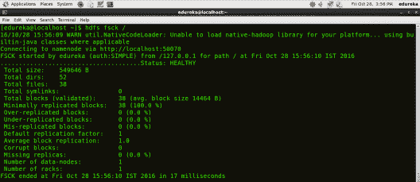

*   ## **ls**

HDFS 命令显示 HDFS 的文件和目录列表。

***命令:*****HDFSDFS****–ls/**

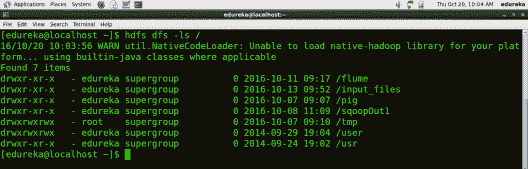

*   ## **mkdir**

HDFS 命令在 HDFS 创建目录。

***用法:*****HDFS DFS–mkdir/directory _ name**

***命令:*****HDFS DFS–mkdir/new _ edu reka**

***注意:** 这里我们尝试在 HDFS 创建一个名为“new_edureka”的目录。*

*通过* [*蔚蓝数据工程认证*](https://www.edureka.co/microsoft-azure-data-engineering-certification-course) *可以更好的理解。*

*   ## **touchz**

HDFS 命令在 HDFS 创建一个文件，文件大小为 0 字节。

***用法:*****HDFS DFS–touchz/目录/文件名**

***命令:*****HDFS DFS–touchz/new _ edu reka/sample**

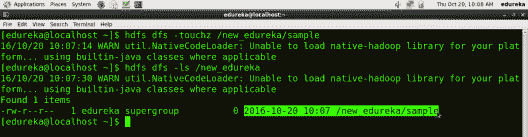

***注意:** 这里我们尝试在 hdfs 的“new_edureka”目录下创建一个名为“sample”的文件，文件大小为 0 字节。*

*   ## **杜**

HDFS 命令检查文件大小。

***用法:*****HDFS DFS–du–s/目录/文件名**

***命令:*****HDFS DFS–du–s/new _ edureka/sample**

*   ## **猫**

HDFS 命令，读取 HDFS 上的一个文件并将该文件的内容打印到标准输出。

***用法:*****HDFS DFS–cat/path/to/file _ in _ HDFS**

***命令:*****HDFS DFS–cat/new _ edu reka/test**

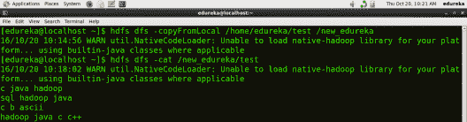

*   ## **正文**

HDFS 命令，获取源文件并以文本格式输出文件。

***用法:*****HDFS DFS–text/directory/filename**

***命令:*****HDFS DFS–text/new _ edu reka/test**

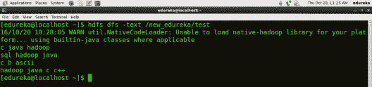

*   ## **从本地复制**

HDFS 命令将文件从本地文件系统复制到 HDFS。

***用法:*****HDFS DFS-copy from local<localsrc><HDFS 目的地>**

***命令:*****HDFS DFS–copy from local/home/edu reka/test/new _ edu reka**

***注意:** 这里的测试是本地目录/home/edureka 下的文件，命令执行后测试文件会被复制到 HDFS 的/new_edureka 目录下。*

*   ## 

HDFS 命令将文件从 HDFS 复制到本地文件系统。

***用法:*****HDFS DFS-copy to local<HDFS source><local dst>**

***命令:*****HDFS DFS–copyToLocal/new _ edu reka/test/home/edu reka**

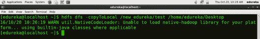

***注意:** 这里的 test 是一个存在于 HDFS 的 new_edureka 目录下的文件，命令执行后测试文件会被复制到本地目录/home/edureka*

*   ## **放**

HDFS 命令将单个或多个源文件从本地文件系统复制到目标文件系统。

***用法:*****HDFS DFS-put<localsrc><目的地>**

***命令:*****HDFS DFS–put/home/edu reka/test/user**

***注意:** 命令 copyFromLocal 类似于 put 命令，只不过源文件被限制为本地文件引用。*

你甚至可以通过加拿大 [数据工程认证](https://www.edureka.co/microsoft-azure-data-engineering-certification-course-canada) 查看大数据的细节。

*   ## **得到**

HDFS 命令将文件从 HDFS 复制到本地文件系统。

***用法:*****HDFS DFS-get<src><local dst>**

***命令:*****HDFS DFS–get/user/test/home/edu reka**

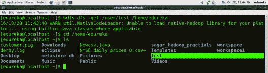

***注意:** 命令 copyToLocal 类似于 get 命令，只是目的地被限制为一个本地文件引用。*

*   ## **伯爵**

HDFS 命令，用于计算与指定文件模式匹配的路径下的目录、文件和字节数。

***用法:*****HDFSDFS-count<path>**

***命令:*****HDFS DFS–count/user**

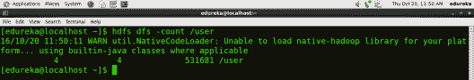

*   ## **RM**

HDFS 命令将文件从 HDFS 移走。

***用法:*****HDFS DFS–RM<path>**

***命令:*****HDFS DFS–RM/new _ edu reka/test**

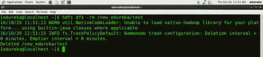

*   ## **RM-r**T5

HDFS 命令从 HDFS 删除整个目录及其所有内容。

***用法:*****HDFS DFS-RM-r<path>**

***命令:*****HDFS DFS-RM-r/new _ edu reka**

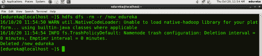

*   ## **CP**

HDFS 命令将文件从源复制到目的地。该命令还允许多个源，在这种情况下，目标必须是一个目录。

***用法:*****【HDFS DFS】**

***命令:*****HDFS DFS-CP/user/Hadoop/file 1/user/Hadoop/file 2**

***命令:*****HDFS DFS-CP/user/Hadoop/file 1/user/Hadoop/file 2/user/Hadoop/dir**

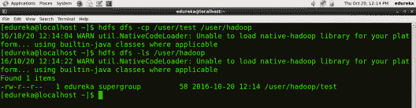

*   ## **mv**

HDFS 命令将文件从源移动到目的地。这个命令也允许多个源，在这种情况下，目标需要是一个目录。

***用法:*****HDFS DFS-mv<src><dest>**

***命令:*****HDFS DFS-mv/user/Hadoop/file 1/user/Hadoop/file 2**

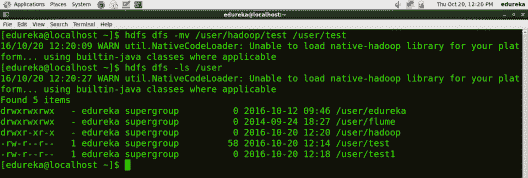

*   ## **删** 删

HDFS 的命令使得垃圾桶变空。

**命令:****HDFSDFS-expunge**

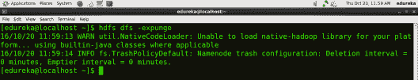

*   ## **rmdir**

HDFS 命令删除目录。

***用法:*****HDFS DFS-rmdir****<路径>**

***命令:*****HDFS DFS–rmdir/user/Hadoop**

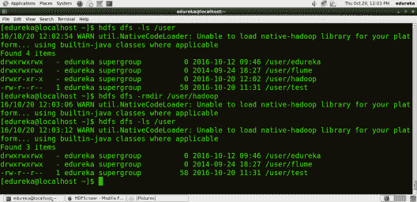

*   ## **用法**

HDFS 命令，返回对单个命令的帮助。

***用法:*****HDFS DFS-用法<命令>**

***命令:*****HDFS DFS-用法 mkdir**

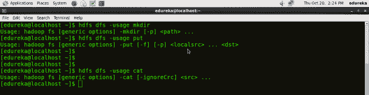

***注意:** 通过使用 usage 命令你可以得到任何命令的信息。*

*   ## **帮** 帮

HDFS 命令，显示给定命令或所有命令(如果没有指定)的帮助。

***命令:*****HDFS DFS-help**

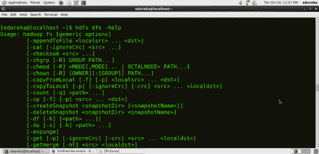

HDFS 命令博客到此结束，我希望它能提供信息，并且你能够执行所有的命令。更多 HDFS 命令，你可以在这里参考 Apache Hadoop 文档 **[。](https://hadoop.apache.org/docs/r2.7.2/hadoop-project-dist/hadoop-common/FileSystemShell.html)**

*现在您已经执行了上述 HDFS 命令，请查看 Edureka 的 [**Hadoop 培训**](https://www.edureka.co/big-data-hadoop-training-certification) ，edu reka 是一家值得信赖的在线学习公司，拥有遍布全球的 250，000 多名满意的学习者。Edureka 的[大数据硕士课程](https://www.edureka.co/masters-program/big-data-architect-training)使用零售、社交媒体、航空、旅游、金融领域的实时用例，帮助学习者成为 HDFS、Yarn、MapReduce、Pig、Hive、HBase、Oozie、Flume 和 Sqoop* *的专家。*

*有问题吗？请在评论区提到它，我们会给你回复。*