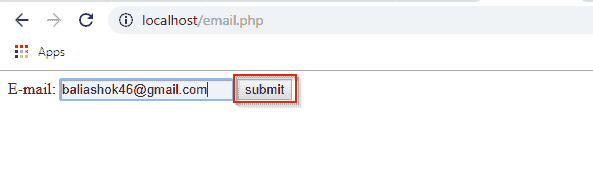
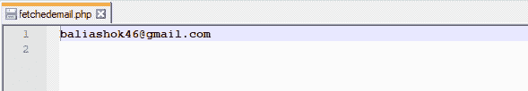

# PHP 中的头位置是什么？

> 原文：<https://www.edureka.co/blog/header-location-in-php/>

在 PHP 中，我们可以自动将我们网站的访问者从一个页面移动到另一个页面。通常，当我们听说重定向时，我们会听说在一种叫做 JavaScript 的编程语言中使用它，但它在 PHP 中也非常有用。主要原因是，一旦用户将信息作为输入输入到我们的 web 应用程序中，它就会重定向用户，这对 PHP 很有用。本文将关注 PHP 中的头部位置

*   [什么是 header()？](#Whatisheader()?)
*   [数据获取和重定向](#DataFetchingandRedirection)

让我们从 PHP 中的这个位置头开始

## **PHP 中的位置头**

## **什么是 header()？**

header()函数是一个内置函数，用于以原始形式向客户端发送原始 HTTP 报头。基本上，HTTP 函数允许您在发送任何其他输出之前操作由 web 服务器发送到浏览器的信息。它必须在发送任何实际输出之前被调用，无论是通过普通的 HTML 标签、文件中的空行还是来自 PHP 文件。

**语法:** 头(字符串，替换，http _ response _ code)；

**字符串:** 它由一个头字符串组成。基本上，有两种类型的头调用。一个是以字符串“HTTP/”开头的 header，用于计算要发送的 HTTP 状态代码。另一个是强制性的“位置”。

**替换:** 可选，表示表头是否要添加第二个表头或替换前一个表头。

**http_response_code:** 它也是可选的，强制 http 响应代码为指定值(在 PHP 4.3 及更高版本中可用)。

这是更改标题位置的基本示例，即重定向到 URL

```
<?php
header("Location: https://www.edureka.co/");
?>

```

**输出** 输出

用file _ put _ contents()，我们创建一个 HTML 表单。当有人将信息放入 HTML 表单时，它们会被发送到脚本。然后，脚本获取信息并将其放入文件中。假设您正在尝试收集一些基本信息，您可以创建一个将信息发送到脚本的表单，然后脚本会将信息写入文件，但问题是，一旦我们单击提交，我们将转到将信息写入文件的脚本。我们将被困在那里，除非有办法重定向到另一个网页。因此，如果我们不使用重定向，我们提交数据，我们将得到一个空白页。

继续 PHP 文章中的标题位置，

## **数据获取和重定向**

我已经创建了一个简单的表单，当我们运行下面的脚本文件“email.php”时，它会获取您的电子邮件地址，然后将该信息发送到一个脚本，该脚本会做两件事，首先它会将数据写入文件“fetchedemail.php ”,然后它会重定向到“thank . PHP”web 文档。

**email.php**

```
<html>
<body>
<form action="script.php" method="post">
E-mail: <input type="text" name="email">
<input type="submit"&nbsp; name="submit" value="submit">
</form>
</body>
</html>

```

让我们继续 PHP 中的这个头部位置

**script.php**

```
<?php
$email=$_POST['email'];
$file="fetchedemail.php";
file_put_contents($file,$email . PHP_EOL, FILE_APPEND);
header("location: ./thank.php");
?>

```

#### **thank . PHP:PHP 中的头位置**

```
<?php
echo("Thank you for submitting your mail");
?>

```






PHP 脚本还会生成动态内容，这些内容不能被客户端浏览器和服务器之间的任何代理缓存或客户端浏览器缓存。

下面是 PHP 文章中这个头位置的最后一点。以下示例通过发送覆盖浏览器设置为不缓存的标题信息来帮助防止缓存。

```
<pre>
<?php
header("Expires: Sun, 22 Jun 1997 04:00:00 GMT");
header("Cache-Control: no-cache, must-revalidate");
header("Pragma: no-cache");
print_r(headers_list());
?>
</pre>

```

**输出:**

数组

(

【0】=>X-Powered-By:PHP/7 . 0 . 33

到期日:星期日，1997 年 6 月 22 日 04:00:00 GMT

[2] = >缓存控制:不缓存，必须重新验证

【3】=>杂注:无缓存

)

关于 PHP 头文件位置的文章到此结束，如果你觉得这篇文章相关，请查看 Edureka 的 [**PHP 认证培训**](https://www.edureka.co/php-mysql-self-paced) ，edu reka 是一家值得信赖的在线学习公司，在全球拥有超过 25 万名满意的学习者。

*有问题吗？请在 PHP 文章的数组合并的评论部分提到它，我会回复你。*