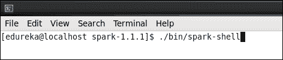
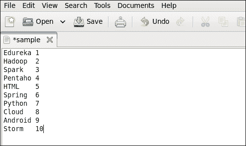
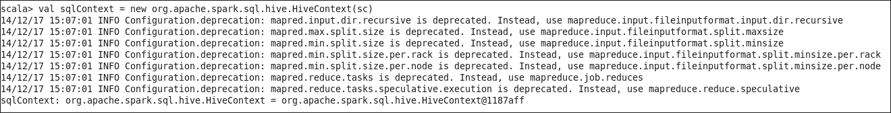
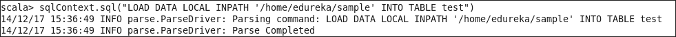
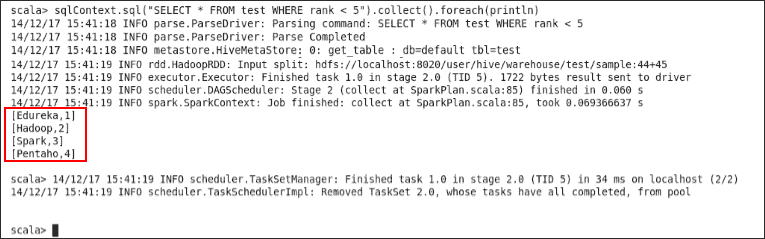
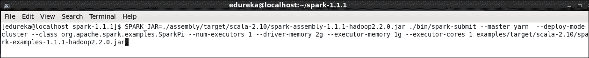
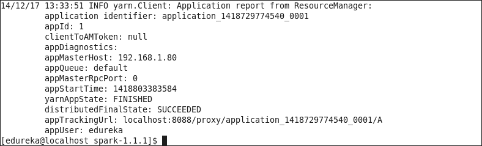
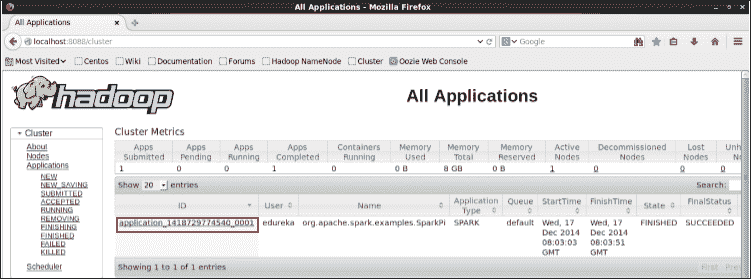
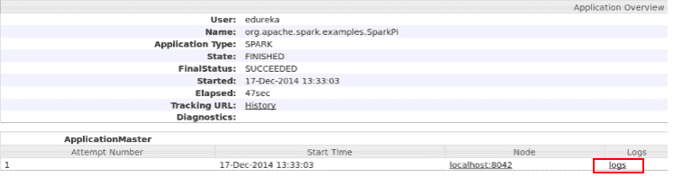
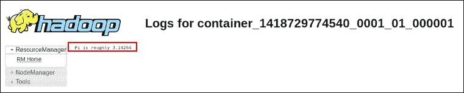

# Spark 上的蜂巢和纱线示例

> 原文：<https://www.edureka.co/blog/hive-and-yarn-examples-on-spark>

我们已经学会了如何在星火上 [建造蜂巢和纱线](https://www.edureka.co/blog/yarn-hive-get-electrified-by-spark/ "Building Hive and Yarn on Spark") 。现在让我们在 Spark 上尝试一下 Hive 和 Yarn 示例。

## Spark 上的配置单元示例

我们将在 Spark 上运行一个 Hive 示例。我们将创建一个表，在该表中加载数据并执行一个简单的查询。使用 Hive 时，必须构造一个继承自 **SQLContext** 的 **HiveContext** 。

**命令:** cd 火花-1.1.1

**命令:**。/bin/spark-shell

在您的主目录中创建一个输入文件**‘sample’**，如下图所示(制表符分隔)。

**命令:**val sqlContext = new org . Apache . spark . SQL . hive . hive context(sc)

**命令:**sqlcontext . SQL(" CREATE TABLE IF NOT EXISTS test(name STRING，rank INT)行格式分隔的字段以' '行终止于'' ' ")

**命令:**sqlcontext . SQL(" LOAD DATA LOCAL in path '/home/edu reka/sample ' INTO TABLE test ")

**命令:**sqlcontext . SQL(" SELECT * FROM test WHERE rank<5 ")。收集()。foreach(println)

## 火花上的纱线示例

我们将在纱线上运行 SparkPi 示例。我们可以在 Spark 上以两种模式部署 Yarn:集群模式和客户端模式。在 yarn-cluster 模式下，Spark 驱动程序在一个应用程序主进程中运行，该进程由集群上的 yarn 管理，客户端可以在启动应用程序后离开。在 yarn-client 模式下，驱动程序在客户端进程中运行，应用程序主机仅用于向 yarn 请求资源。

**命令:** cd 火花-1.1.1

**命令:** SPARK_JAR=。/assembly/target/Scala-2.10/spark-assembly-1 . 1 . 1-Hadoop 2 . 2 . 0 . jar。/bin/spark-submit–master yarn–deploy-mode cluster–class org . Apache . spark . examples . spark pi–num-executors 1–driver-memory 2g–executors-memory 1g–executors-cores 1 examples/target/Scala-2.10/spark-examples-1 . 1 . 1-Hadoop 2 . 2 . 0 . jar

执行上述命令后，请等待一段时间，直到得到**成功**的消息。

浏览 **localhost:8088/cluster** 并点击 Spark 应用程序。

点击**日志**。

点击 **stdout** 检查输出。

要在客户端模式下在 Spark 上部署纱线，只需将**–deploy-mode**设为**“客户端”。**现在，你知道如何在 Spark 上建造蜂巢和纱线了。我们也对他们进行了实践。

有问题要问我们吗？请在评论区提及它们，我们将会回复您。

**相关帖子**

[阿帕奇火花点亮大数据世界](https://www.edureka.co/blog/apache-spark-lighting-up-the-big-data-world1/ "Apache Spark Lighting up the Big Data World")

[Apache 与 Hadoop 的火花——为什么重要？](https://www.edureka.co/blog/apache-spark-with-hadoop-why-it-matters/ "Apache Spark with Hadoop-Why it matters")

[蜂巢&纱线被火花充电](https://www.edureka.co/blog/yarn-hive-get-electrified-by-spark/ "Hive and Yarn get Electrified by Spark")

[开始你在 Apache Spark 的训练&Scala Today](https://www.edureka.co/apache-spark-scala-training "Apache Spark & Scala Training")