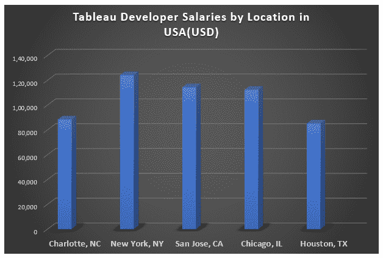
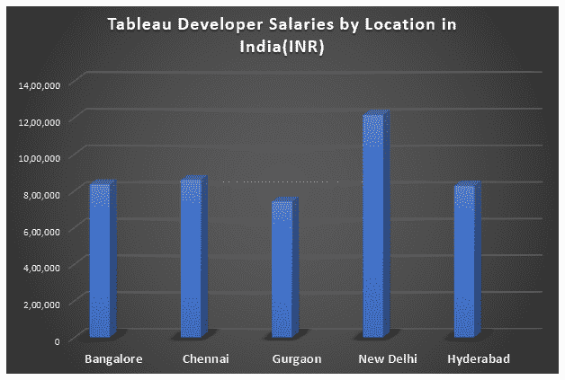
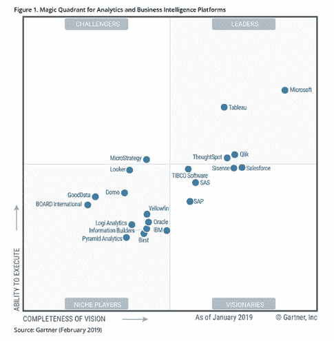

# 作为一名 Tableau 开发者，你能挣多少钱？

> 原文：<https://www.edureka.co/blog/how-much-would-you-make-as-a-tableau-developer/>

[***画面***](https://www.edureka.co/blog/tableau-tutorial/) 已经成为过去几年商业智能领域最热门的趋势之一。这种数据可视化工具在从初创公司到推动业务发展的公司中日益流行。因此，显而易见的是，平均 ***画面开发者工资*** 正在飙升。这篇文章将帮助你发现作为一个 Tableau 开发者你能挣多少钱？

## 作为一名 Tableau 开发人员，你能挣多少钱？

根据 2019 年的观察，Tableau 开发人员的平均工资是**【111，431 美元** ，但随着我深入挖掘，我意识到这个故事有多个方面。因此，在本文中，我将分析这个数字是如何随着地理位置、技能和经验年限等多种因素而变化的。

以下是本文将要涉及的主题。

*   [Tableau 按地理位置划分的开发人员薪资明细](#TableauDeveloperSalarybreakdownbyGeography)
*   [Tableau 按经验分列的开发人员薪资明细](#TableauDeveloperSalarybreakdownbyExperience)
*   [成为 Tableau 开发者所需的技能](#SkillsRequiredtoBecomeaTableauDeveloper)
*   [雇佣 Tableau 开发者的公司](#CompanieshiringTableauDevelopers)
*   【Tableau 开发者的范围

所以让我们深入这篇文章，看看作为一名 Tableau 开发者你能挣多少钱？

**Tableau 按地理位置划分的开发人员薪资明细**

虽然我们看到年薪高达168，500 美元，低至53，000 美元，但目前全美大多数 Tableau 开发人员的年薪在 9 万美元到 127，500 美元 之间。平均工资范围变化不大，这表明不管在什么地方，工资都是相当一致的。

然而，印度却不是这样。当钦奈、海德拉巴和班加罗尔等其他 IT 中心保持着 8 分左右的平均 lpa 时，新德里似乎吸引了更好的薪酬大师，因为新德里的平均薪酬为 **12lpa** 。

****

继续这篇关于作为 Tableau 开发者你能挣多少钱的文章。

**Tableau 按经验分列的开发人员薪资明细**

【Tableau 开发人员在美国的平均工资接近每小时 55 美元。虽然大多数入门级职位的起薪为每年 58，300 美元，但大多数有经验的员工甚至可以达到每年177，450 美元。

3-4 年工作经验的候选人可以期待 **平均 111，000 美元** 的薪水，这个数字一点也不差！

**雇佣 Tableau 开发者的公司**

如果你快速浏览一下当前的职位空缺，就会发现不止几家顶级公司在寻找 Tableau 开发人员。这些杰出的雇主包括但不限于脸书、戴尔、应用系统、博思艾伦、NetJets、加州大学、Groupon、通用汽车、索尼电子、Sunguard、美洲银行、毕马威和威瑞森。

因此，如果你渴望为行业内的知名人士工作，Tableau 的职业生涯是通往这一目标的必经之路。

继续这篇关于作为 Tableau 开发者你能挣多少钱的文章。

**了解我们在顶级城市的 Tableau 培训课程**

| 印度 | 美国 | 其他热门城市 |
| [班加罗尔的 Tableau 培训](https://www.edureka.co/tableau-certification-training-bangalore) | [达拉斯的 Tableau 球场](https://www.edureka.co/tableau-certification-training-dallas) | [华盛顿的 Tableau 课程](https://www.edureka.co/tableau-certification-training-washington) |
| [海德拉巴的 Tableau 培训](https://www.edureka.co/tableau-certification-training-hyderabad) | [夏洛特的 Tableau 课程](https://www.edureka.co/tableau-certification-training-charlotte) | [奥斯汀的 Tableau 课程](https://www.edureka.co/tableau-certification-training-austin) |
| [金奈的 Tableau 培训](https://www.edureka.co/tableau-certification-training-chennai) | [纽约的 Tableau 课程](https://www.edureka.co/tableau-certification-training-new-york-city) | [西雅图的 Tableau 课程](https://www.edureka.co/tableau-certification-training-seattle) |

**成为 Tableau 开发者所需的技能**

Tableau 的开发人员应该具备数据解释的能力，分析任务的方法，并且有很强的商业头脑。通常情况下，雇主会要求计算机科学或信息技术，或任何相同的替代学士学位，以及随后的能力。

**分析技巧**

Tableau 的开发者需要有识别市场产生的数字的模式和趋势的诀窍。

**解决问题的技巧**

该职位通常涉及从项目开始到项目完成的 Tableau 软件工作，因此候选人需要能够解决开发阶段出现的任何问题，并找到解决问题的替代方法

**创新**

创造性和创新性地解决商业问题无疑是当下的需求。Tableau 开发人员需要在原型和客户测试阶段主动寻找解决方案和系统改进

**注重细节**

这个工作角色需要对细节给予最大的关注，以便发现代码或数据中的错误。

**团队合作**

开发人员作为一个大型团队的一部分，每天都在为共同的业务和部门目标而工作，因此，与他人专业合作的能力对这项工作的成功至关重要。

此外，还需要对行业工具的实际操作经验，例如

*   **当代商业智能技术** 如微软 Power BI、甲骨文 BI
*   **Sql Server 数据工具** 如 Sql Server Reporting Services(SSRS)、Sql Server Analytics Services(SSAS)和 SSIS
*   **数据分析工具** 像在线分析处理(OLAP)
*   Talend 和 Informatica 等 ETL 工具

继续这篇关于作为 Tableau 开发者你能挣多少钱的文章。

**范围**

Tableau 连续 7 次被**Gartner Research*****数据可视化*** 和商业智能评为 *市场领导者* ，尽管它在 2019 年 2 月滑至接近第二位。与市场竞争相比，当涉及到执行**的** **能力和愿景** 的完整性时，它仍然是市场领导者。

这表明 Tableau 的未来是非常光明和安全的，没有比现在更好的时机来加入这一潮流了。

这就把我们带到了本文的结尾。如果你希望掌握 Tableau，Edureka 有一个策划的  **[Tableau 课程](https://www.edureka.co/tableau-certification-training)** ，它深入涵盖了数据可视化的各种概念。

*有问题吗？请在这篇文章的评论部分提到它，我们会尽快回复你。*