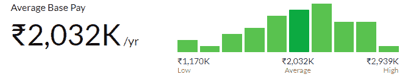

# 如何成为认证的 Scrum 产品负责人？

> 原文：<https://www.edureka.co/blog/how-to-become-a-certified-scrum-product-owner/>

Scrum 正迅速成为对采用敏捷哲学感兴趣的团队的首选框架。鉴于 Scrum 框架名气的增长，这种增长也推动了对 ***[Scrum 认证培训的空前需求也就不足为奇了。](https://www.edureka.co/certified-scum-master-certification-training)*** 在本文中，我们来看看如何成为一名认证的 Scrum 产品负责人。

本文涵盖的主题有:

*   Scrum 角色:Scrum 团队的剖析
*   谁是 Scrum 产品负责人？
*   [为什么成为 CSPO？](#why)
*   [成为 CSPO 的要求](#requirements)
*   谁可以参加 CSPO 认证？

## Scrum 角色:Scrum 团队的剖析

根据 [Scrum Guide，](https://www.scrumguides.org/scrum-guide.html) Scrum 是 ***“一个框架，在其中人们可以解决复杂的适应性问题，同时富有成效和创造性地交付尽可能高价值的产品。”***

换句话说，scrum 是一个轻量级的敏捷项目管理框架，可以用来管理所有类型的迭代和增量项目。Scrum 框架由 [三个角色](https://www.edureka.co/blog/what-is-scrum/#ScrumTeam)定义:

*   *产品负责人*
*   *Scrum Master*
*   *开发团队*

从商业的角度来看，任何 Scrum 团队中最重要的角色之一就是产品负责人(PO)。这是一个具有挑战性的角色，需要 PO 对产品做出重要的商业决策。**听起来很有趣？**我们来多探索一下。

## 谁是 Scrum 产品负责人？

正如 [Scrum 指南](https://www.scrumguides.org/) 中所描述的，Scrum 产品负责人负责将开发团队工作的产品价值最大化。然而，[产品负责人](https://www.edureka.co/blog/agile-scrum-tutorial/#scrum-team)如何实现这一点，取决于许多因素，包括团队、商业利益相关者和组织的开发过程。

产品负责人的工作描述相当简单。他们的工作是作为客户的代理，优先处理积压的工作，回答团队的问题，接受/拒绝团队产生的工作。产品负责人的典型职责包括:

*   管理产品积压&确保它是可见的、透明的和清晰的
*   指导团队在期望的时间内实现最佳目标和任务
*   提升已完成工作的价值并做出合理的决策
*   与开发团队和利益相关者合作
*   管理团队经济并积极参与会议
*   确保产品开发团队未来工作的透明度

为了履行所有这些职责，产品负责人需要诸如协调、冲突管理、创造性思维等技能，以及影响团队和其他利益相关者的能力。从业务的角度来看，产品负责人的角色是一个非常重要且具有挑战性的角色。如果这样的角色吸引你，那么你就准备好成为一名认证的 Scrum 产品负责人(CSPO)。

## 为什么要成为认证 Scrum 产品负责人？

随着敏捷迅速成为标准实践，scrum 框架成为全球最流行、最受欢迎的敏捷方法，对产品负责人的需求也在飙升。根据 Glassdoor 的数据，认证产品负责人的全国平均工资是印度的₹20,31,986。看看印度人渣产品负责人的工资范围。

此外，对 CSPO 专业人士的需求持续增长，像 SAP、Amdocs、思科、戴尔、惠普等财富 500 强公司都在不断地招聘 CSPO 专业人士。听起来很吸引人，对吧？那么，如何成为认证的 scrum 产品负责人呢？

## **成为 CSPO 的要求**

成为认证的 scrum 产品所有者没有资格标准。对于有兴趣获得产品负责人认证的专业人士，必须参加由**认证 Scrum 培训师(CST )** 教授的为期两天的课程。

成为认证 scrum 产品所有者的程序如下:

**Step1:** A 参加了由认证 Scrum 培训师(CST)教授的为期两天的课程。

**步骤 2:** 阅读敏捷宣言、Scrum 指南，并浏览 CSPO 学习目标。

**步骤 3:** 成功完成课程后，您将被要求接受 CSPO 许可协议。

**第四步:**完成你的 Scrum 联盟会员档案。

第四步:成为 CSPO 不需要考试。Scrum Alliance 会把下载 CSPO 证书的链接发邮件给你。

**第五步:** 通过获得 Scrum Education Units(SEUs)并每两年支付 100 美元更新您的认证来维护您的 CSPO 认证。

***注意:没有来自 Scrum 联盟的考试来获得 CSPO 认证。***

为了进一步发展你的技能，你也可以成为高级认证 Scrum 产品负责人或认证 Scrum 专业产品负责人。

## 谁可以参加 CSPO 认证？

参加 Scrum 认证产品负责人(CSPO)培训并获得认证对以下人员特别有用:

*   Scrum 团队的成员，比如开发人员和产品负责人
*   业务分析师/高级业务分析师
*   质量保证专家
*   产品经理/产品负责人
*   软件开发人员和编码人员
*   团队领导
*   系统架构师

除了对项目的“业务方面”感兴趣的人之外，可能是渴望获得认证 Scrum 产品负责人【CSPO】认证的合适人选。

总之，成为一名优秀的产品负责人并不容易——重要的是，在真正承担起这个角色之前，要理解这个角色的要求。然而，产品负责人是敏捷项目不可或缺的一部分，将会大大加快项目的速度，并在期限内实现目标。

“如何成为一名认证的 Scrum 产品负责人？”这个问题到此结束文章。如果你打算成为一名产品所有者，我已经涵盖了你应该知道的所有基础知识。 希望你清楚本文与你分享的一切。

在开始使用 Scrum 术语之前，确保你已经精通了它。

*有问题吗？请在这篇“如何成为认证 Scrum 产品负责人？”的评论部分提到它* *文章，我们会尽快给你回复。*