# 如何成为 DevOps 工程师？

> 原文：<https://www.edureka.co/blog/how-to-become-a-devops-engineer/>

DevOps 工程师在 Glassdoor 的美国 50 份最佳工作排名中名列第二。 “据《SD 时报》报道，DevOps 工程师的职位在 Indeed 上的发布量增长了 225%。根据 glass door 2022 年 12 月的工作数据，首席开发工程师的工资可能在147884 美元/年到242000 美元之间。在这篇关于“如何成为一名 DevOps 工程师”的文章中，我将为你提供一份完整的路线图，帮助你成为一名成功的 DevOps 工程师。

但是，谁是 DevOps 工程师呢？

## **谁是 DevOps 工程师？**

嗯，  DevOps 工程师是了解软件开发生命周期的人，对开发数字管道(CI/ CD 管道)的各种自动化工具有透彻的了解。

仍然想知道谁是 DevOps 工程师？然后点击 **[上的](https://www.edureka.co/blog/devops-engineer-role)**帖子 开发工程师角色和职责，让我知道你的想法。

现在的问题是，谁能成为 DevOps 工程师？

## **谁能成为 DevOps 工程师？**

如果你是一名开发人员，一名运营人员，或者一名质量保证人员，甚至是一名新生，你都可以成为一名 DevOps 工程师。但是，让我告诉你，如果你想称自己为一个 DevOps 家伙，这将是一个相当长的旅程

*我肯定会推荐**结构化 [DevOps 工程师课程](https://edureka.co/masters-program/devops-engineer-training)因为**它不仅仅是理论知识，更多的是实践知识。您需要适当的基础设施来执行这样的实践。还有，DevOps 工程师不是只懂各种工具的人。它更多地是关于如何以及在哪里使用各种开发、测试和部署技术来获得最大的好处(构建 SDLC 解决方案)。*

现在我将开始这篇文章，关于如何成为一名 DevOps 工程师？

## **如何成为 DevOps 工程师？DevOps 工程师路线图:**

让我们开始这段旅程，列出一些重要的 **[技能，这些技能是组织在开发工程师](https://www.edureka.co/blog/devops-skills)** : 中寻找的

1.  学习编程语言。(`Python, Ruby, Go, Node.js`)
2.  学习操作系统。(`Linux, Unix, Windows, Sockets`)
3.  版本控制/项目管理工具。(`GitHub, GitLab`)
4.  回顾网络安全和协议。(`HTTP, HTTPS, SSL, SSH`)
5.  将基础设施理解为代码。(容器、容器编排、配置管理、基础设施供应-`Docker, Kubernetes, Terraform, Ansible, CHEF, Puppet,`)
6.  探索源代码管理并为持续集成(CI)构建工具集成技术:(T0)
7.  了解如何为持续测试(持续交付)推进持续集成:(T0)
8.  了解如何部署和配置开发、测试和生产环境:(`Ansible, Puppet, CHEF`)
9.  投资应用和基础设施监控。(`Prometheus, Nagios, Datadog, New Relic, Sentry`)
10.  观察云服务提供商。(`AWS, Azure, Google Cloud, Heroku`)
11.  学习云设计。(`Data Management, Design, and Implementation`)

考虑以下路线图:

**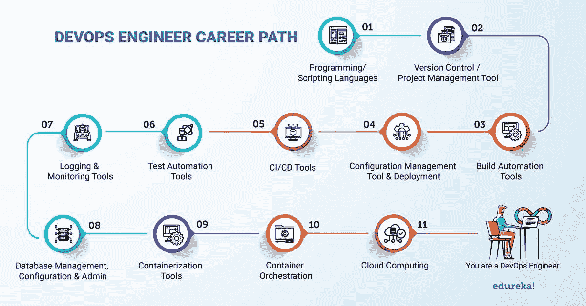**

让我们分别检查一下该计划中的每个关键里程碑。

### **1。学习编程语言。**

DevOps 工程师链接数据库，调试开发团队创建的代码，并自动化程序，即使他们通常不编写源代码。DevOps 生命周期的速度在很大程度上取决于自动化，DevOps 工程师对于 DevOps 自动化战略的执行至关重要。

DevOps 工程师还应该熟悉他们的团队用来理解现有代码、评估新代码和帮助调试的语言。

你应该学习的编程语言有:

*   Go(推荐)
*   红宝石
*   Python
*   Node.js

### **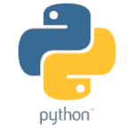  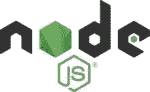 **

### **2。学习操作系统。**

操作系统(OS)是开发运维团队运营所需的技术堆栈的重要组成部分。除了团队用于交流和执行活动的本地机器之外，操作系统还运行着包含团队部署的应用程序的服务器。

为了让您不依赖可视化用户界面(GUI)来设置您的服务器，您需要学习如何使用命令行终端。通过使用命令行，可能需要在 GUI 中多次点击的任务变得更加简单，并且一些命令只能通过终端执行。由于每个操作系统都不同，建议学习多种操作系统。

以下是需要学习的常见操作系统:

*   Linux(推荐)
*   Unix 系统
*   Windows

 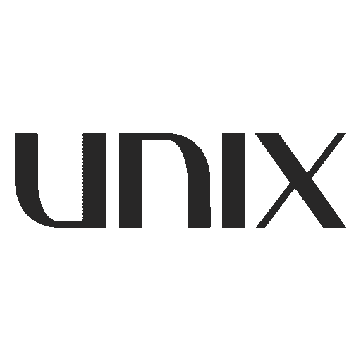

此外，您应该熟悉控制操作系统的创建和操作的更通用的方法和准则。对于 DevOps 工程师来说，技术和概念理解都至关重要。

需要学习的操作系统主题包括:

*   流程管理
*   插座
*   线程和并发

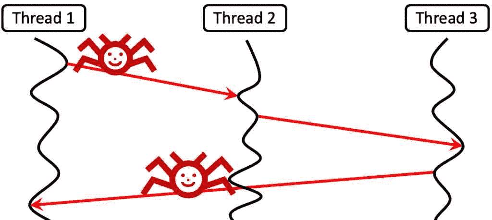

### **3。版本控制/项目管理工具**

你应该对至少一个版本控制/源代码管理工具有很好的实践理解，最好是 Git，并且精通 Git 工作流。

**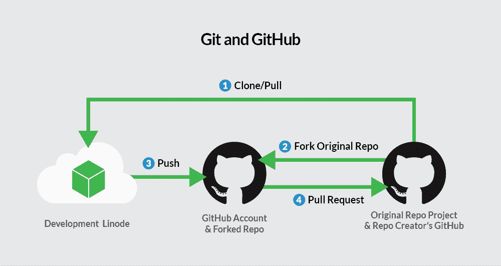**

### **4。回顾网络安全和协议。**

任何传输或接收用户数据的网络应用都是通过协议进行的。因此，理解协议如何支持各种请求类型至关重要。

为了阻止恶意行为者拦截您的数据或进入您的应用程序，了解与这些传输方法相关的危险以及如何保护它们同样至关重要。无论你在 DevOps 生命周期中处于什么位置，网络安全都是一项至关重要的技能。

您应该学习的网络协议有:

*   HTTP
*   [HTTPS](https://blog.hubspot.com/website/http-vs-https)
*   SSL
*   宋承宪

### **5。将基础设施理解为代码。**

一种称为基础设施即代码(IaC)的技术简化了基础设施的供应，以支持应用程序的部署。使用模板文件，可以配置和管理网络、服务器和其他基础设施，以创建精确满足应用程序需求的设置。您可以使用 IaC 自动执行此过程，以加快部署和升级。

要学习的 IaC 技巧包括:

*   集装箱
*   配置管理
*   容器编排
*   基础设施供应

### **6。探索源代码管理并为持续集成(CI)构建工具集成技术:**

学习 Git 后的下一步是理解如何自动化构建过程，并持续构建对源代码库的最新提交。为了做到这一点，您必须理解 Jenkins 和其他自动化服务器是如何操作的。基本上就是如何把 Git 这样的源代码管理技术和 Maven 这样的构建工具结合起来。是的，我指的是为持续集成创建一个管道。

**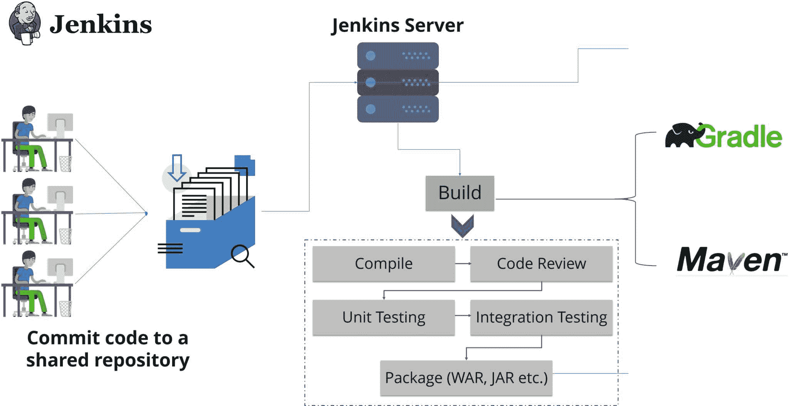**

### **7。了解如何推进持续测试的持续集成(持续交付):**

下一步是学习如何自动化测试阶段并简化它，因为，我相信你们都经历过，有时代码在开发环境中运行顺畅，但在测试环境中却不行。您需要知道如何在测试服务器上模拟开发环境。你需要知道像 Puppet、Chef 和其他程序是如何操作的，你也可以利用 Docker 容器来做这件事，所以学习 Docker 是必不可少的。此外，您需要了解如何在每次提交后持续测试您的代码。同样，您必须将 Jenkins 与 Selenium 等自动化测试技术结合起来。连续交付是用于这一目的的词。

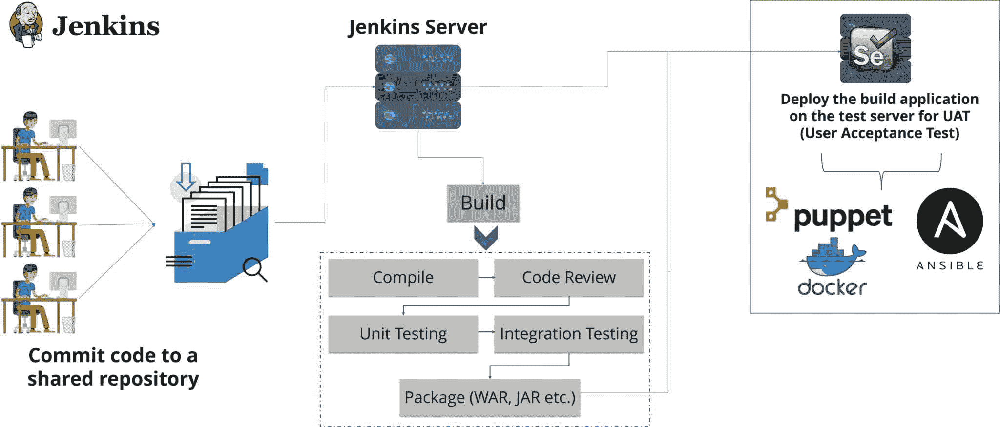

要学习的持续集成工具包括:

*   詹金斯
*   竹子
*   TeamCity

****

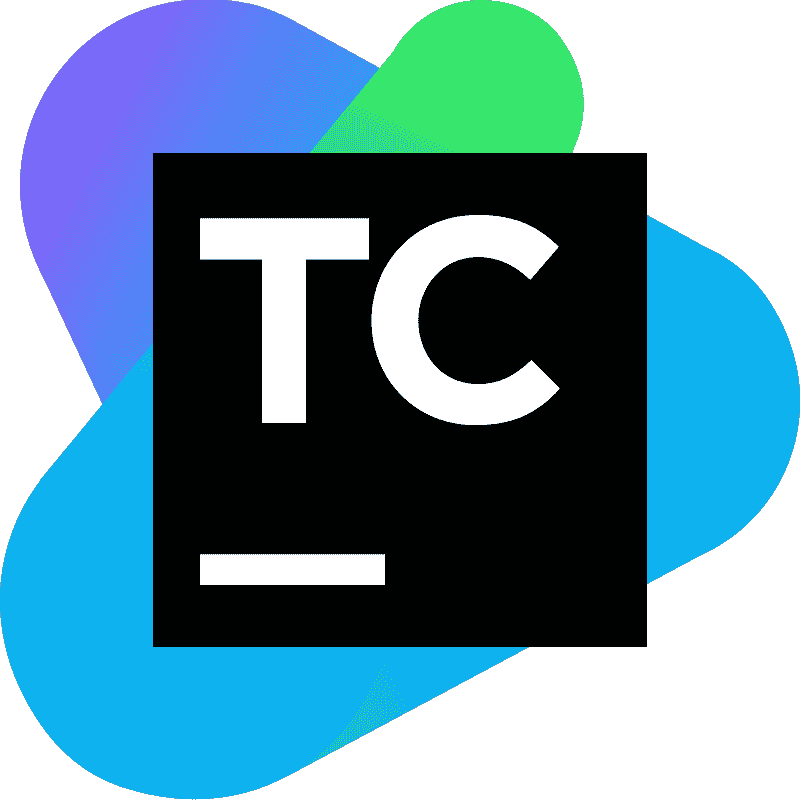 

**8。了解如何部署和配置开发、测试和生产环境:**

最后，您需要知道如何在生产服务器上安全地部署应用程序。同样，在生产环境中配置和部署它需要使用像 Puppet 或 Docker 这样的工具。

**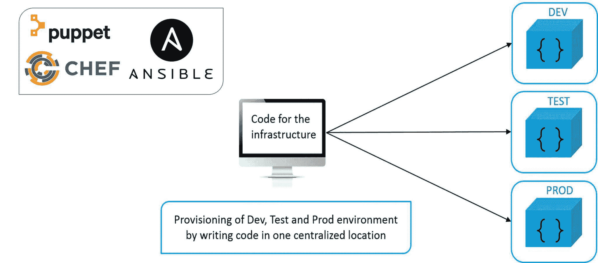**

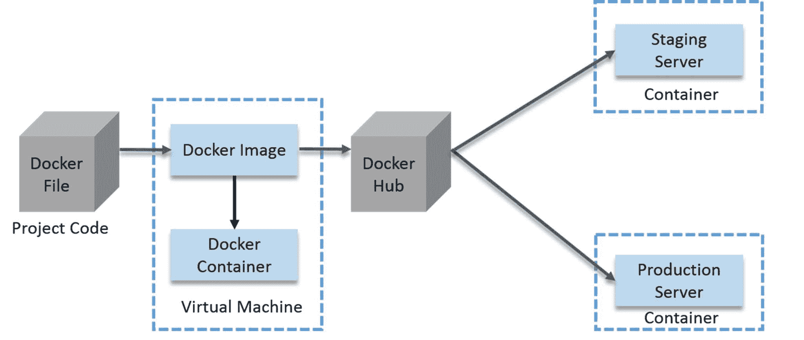

学习持续部署的工具包括:

*   木偶
*   可回答的
*   厨师

### ****

### 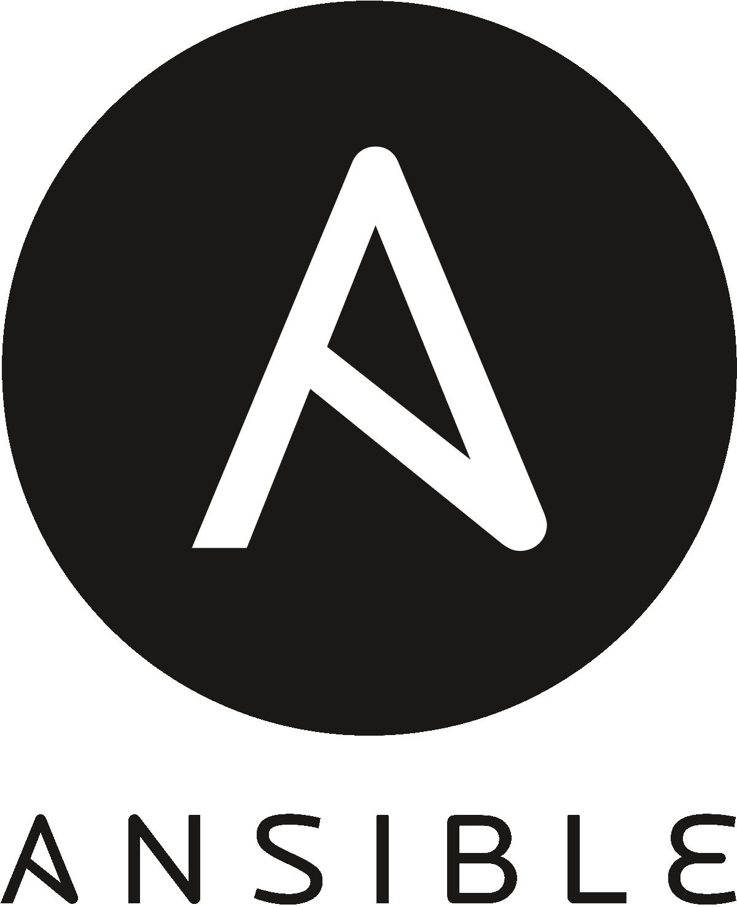

### 

### **9。投资基础设施和应用程序监控。**

监控是密切关注您的应用程序和支持它的基础架构出现问题的警告信号的过程，以便您的运营团队可以在问题变成停机之前解决问题。此实践的应用程序和基础结构组件可以分开。

**应用检查**

最好是监控大量的指标，因为程序的内部故障会以多种方式出现。

例如，当客户试图注册时，低于平均水平的表单转化率可能表明表单不能正常工作。为了让您有更多的机会发现问题，当注册请求和转换率一起发送时，您的监控工具应该发出代码错误的信号。

要学习的应用监控工具包括:

*   普罗米修斯(推荐)
*   纳吉奥斯
*   Datadog

**基础设施监控**

支持您的应用程序的基础架构的问题通常会产生至少与应用程序本身同样严重的影响。

例如，在线应用程序的云托管问题可能会导致用户在尝试访问时中断。监控工具检查性能指标和应用程序堆栈产生的错误，以便及早发现错误。这些错误对你的用户体验的影响越小，你的团队反应就越快。

了解以下基础设施监控工具:

*   新遗迹(推荐)
*   耶格
*   AppDynamics

    ### ****

    ### 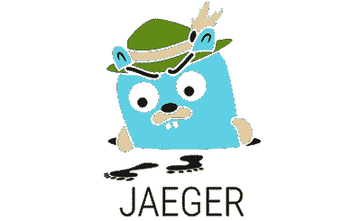

    ### 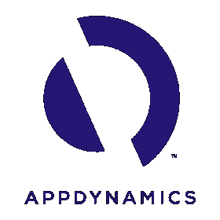

### 10。观察云服务提供商。

大多数情况下，现代应用程序都托管在云中，即使不总是如此。当您不再需要为您的应用程序托管服务器时，云服务可以节省您的资金，并为您提供更多的可扩展性和其他优势。要为您完成的项目选择最好的托管服务提供商，理解各种可用的云服务及其独特的费用和优势至关重要。

要了解更多信息，请考虑以下云服务提供商:

*   AWS(推荐)
*   蔚蓝色
*   谷歌云
*   Heroku

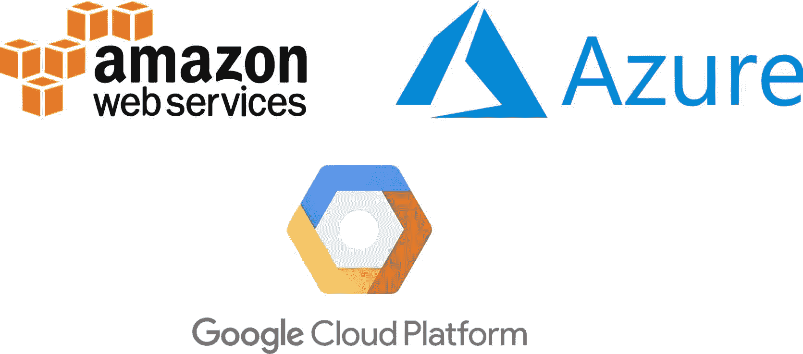

### 

### **11。学习云设计。**

云设计模式背后的概念赋予了云应用程序可伸缩性、可靠性和安全性。理解这些趋势和理解云提供商一样重要。

在部署之前，您可以将许多东西应用到云中托管的应用程序以及您的开发流程中，并从云最佳实践中学习，例如高延迟。例如，如果您的本地存储发生故障，您仍然可以通过将源代码备份到支持云的存储库中来访问它。

要学习的云设计模式有:

*   可用性
*   数据管理
*   设计和实施

虽然我们讨论的信息并不能完全代表你成为一名成功的 DevOps 工程师所需要的知识，但它确实涵盖了你在关注细节之前应该了解的基础知识。一旦你有了这样的背景来指导你的研究过程，你会发现学习变得简单多了。

在结束讨论之前，让我们根据 DevOps 路线图的各个里程碑来回顾一些要点。

## **devo PS 路线图的要点**

#### **1。利用你以前的技术技能。**

我很幸运已经学会了 HTML、CSS 和 JavaScript，可以再次使用 web 开发训练营的例子。这一背景使我对讨论的其他技术更感兴趣。我曾在一家移动响应能力存在问题的商业网站上工作过，这一事实激励我将更多的注意力放在我们训练营的这个组成部分上。

软件开发生命周期的任何先验知识都可以帮助开发运维工程师更好地协调不同的开发运维阶段，并与他们的团队成员合作。DevOps 工程师处理整个软件开发生命周期。此外，当他们提出改进渠道的想法时，这会给他们更多的自信。

#### **2。优先考虑概念，而不仅仅是工具。**

技术专长至关重要，但是如果你不明白为什么要使用某种方法，你就无法向团队传达你的推理。理解技术的基本思想是必不可少的，因为 DevOps 工程师在他们团队中所做的一切之上推广 DevOps 方法。此外，概念上的掌握将有助于您以后学习更深入的技术信息。

#### **3。不要只专注于一个专业领域。**

由于 DevOps 工程师参与了 DevOps 生命周期的每一个阶段，因此最好掌握一些一般知识，而不是专业知识。您团队的贡献者应该是各自领域的专家(开发、网络、监控等。).你负责在每个贡献者之间转移完成的工作。

如果你确实对整个过程有了很好的理解，并且想了解更多，也不要限制自己。对学习充满热情的 DevOps 工程师会在这个领域取得成功。只要确保你也关注大局。在一个像 DevOps 这样不断扩张的领域里，总会有大量的知识——比如书籍——可供消费。

#### **4。不断寻找新的教育机会。**

这八个阶段只是开始；要成为一名 DevOps 工程师，你必须继续紧跟新兴趋势，寻找新的教育机会。当您掌握了我们的路线图后，请查看这个交互式路线图。

## **应该从哪里学 DevOps？**

正如我之前指出的，您可以访问所有关键 DevOps 技术的官方网站，以获得理论上的理解。但是你需要实践经验来获得 DevOps 的工作，而不仅仅是理论上的理解。

为了实现这个目标，你必须参与你的组织中已经存在的项目。

如果没有，你也可以考虑一下 Edureka 提供的项目！，将涵盖所有开发运维阶段和所有关键开发运维工具。

想知道 DevOps 工程师需求如何，或者 DevOps 工程师工资多少？查看我的博客 **[DevOps 工程师的工作和薪水。](https://www.edureka.co/blog/devops-engineer-salary/)**

另外，如果你想了解更多关于 DevOps 的信息，我推荐你去看看下面的博客:

1.  [**DevOps 教程**](https://www.edureka.co/blog/devops-tutorial)
2.  [**十大 DevOps 工具**](https://www.edureka.co/blog/top-10-devops-tools/)
3.  [**饭桶教程**](https://www.edureka.co/blog/git-tutorial/)
4.  [**詹金斯教程**](https://www.edureka.co/blog/jenkins-tutorial/)
5.  [**【对接教程】**](https://www.edureka.co/blog/docker-tutorial)
6.  [**傀儡教程**](https://www.edureka.co/blog/puppet-tutorial/)
7.  [**厨师教程**](https://www.edureka.co/blog/chef-tutorial/)
8.  [**Ansible 教程**](https://www.edureka.co/blog/ansible-tutorial/)
9.  [**Nagios 教程**](https://www.edureka.co/blog/nagios-tutorial/)
10.  [**AWS 教程**](https://www.edureka.co/blog/what-is-aws/)

有关于这个话题的问题，请在评论区提出来。

如果你正在寻找 DevOps 或 [DevOps 专业证书项目](https://www.edureka.co/executive-programs/purdue-devops)课程的在线结构化培训，我希望你喜欢这篇关于“如何成为 DevOps 工程师”的文章。看看这个 [DevOps 认证](https://www.edureka.co/devops-certification-training)项目包括 2000+小时的互动学习和 12 门课程；这将使你走上成为一名成功的 DevOps 工程师的道路。