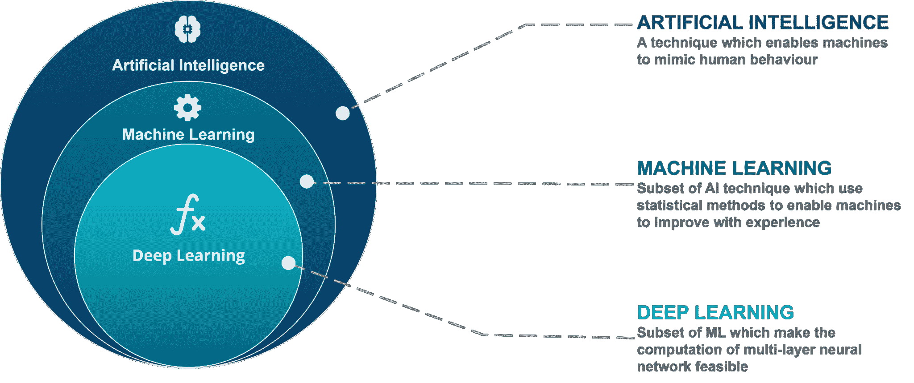
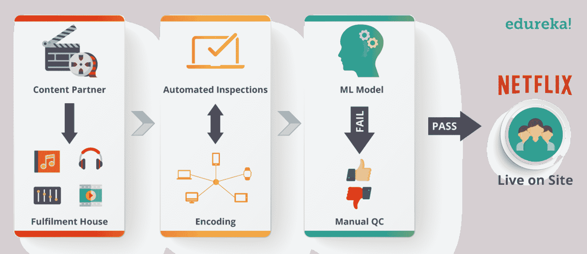
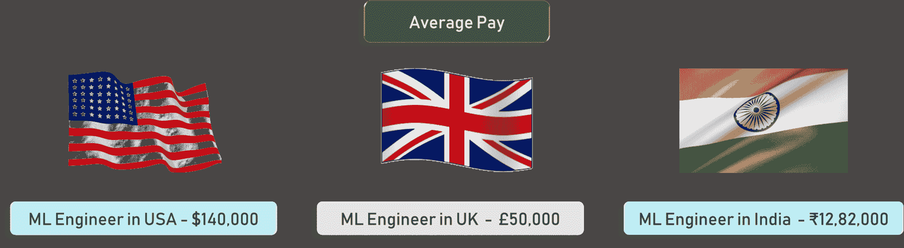

# 如何成为一名机器学习工程师？–学习路径

> 原文：<https://www.edureka.co/blog/how-to-become-a-machine-learning-engineer/>

## **如何成为一名机器学习工程师:**

我相信你们一定很好奇如何才能成为一名机器学习工程师，对吧？在读完这篇关于如何成为一名机器学习工程师的博客后，你最终会对这条令人惊叹的职业道路有一些详细的见解。

这些是我们将在这篇“如何成为一名机器学习工程师”的博客中探讨的概念:

*   [机器学习简介](#z1)
*   [谁是机器学习工程师](#z2)
*   [机器学习工程师是做什么的？](#z3)
*   [机器学习工程师角色和职责](#z4)
*   [机器学习工程师 v/s 数据科学家](#z5)
*   [成为机器学习工程师所需的技能](#z6)
*   [公司招聘机器学习工程师](#z7)
*   [机器学习的未来](#z8)
*   [一个机器学习工程师的工资和趋势](#z9)

## **机器学习简介:**

在我看来，机器学习是目前最新、最令人兴奋的技术之一。你可能在不知不觉中一天用了几十次。

你想知道这有多正确？

当我想到机器学习时，我会想到两件主要的事情。YouTube 推荐和脸书图像识别。

有了 YouTube，假设你正在观看 Edureka 新推出的 python 教程视频。一旦完成，你可能会得到使用 python 视频作为推荐的数据科学的统计数据。

那么 YouTube 如何知道它应该向你推荐什么呢？YouTube 做的事情确实很复杂，但它会分析一切，从你之前看过的内容到你看过的视频中的关键词。太棒了，对吧？

类似地，考虑一下——你和你的朋友去度假。你点击了很多图片，你想把它们上传到脸书。你做到了。 但是现在，光是找到你朋友的面孔并在每张照片上做上标记，难道不会花费太多时间吗？好吧。脸书足够聪明，可以帮你标记人。

机器学习已经如此微妙地融入我们的生活，以至于我们甚至不知道它的存在。

机器学习基本上是人工智能本身的一种类型。

从上图可以看出，深度学习和机器学习是从人工智能中分出来的。机器学习是人工智能的子集，深度学习是机器学习的子集，就这么简单。

总而言之，机器学习为计算机提供了学习的能力。无需明确编程就能学习的能力。

那么，机器学习是如何工作的呢？

很简单，首先，我们有一些训练数据。它可以是作为数据集的任何东西。例如，考虑一组猫和狗的图像，你希望机器告诉你哪个是猫，哪个是狗。

因此，一旦建立了数据集，我们就通过向它提供输入并教会它获得更好的准确性来迭代地训练算法。

下一步将是实际模拟输入数据，通过这一步，机器得到训练。

我们也将提供新的输入数据，让算法检查它是否与我们现有的数据相似，并基于相同的数据做出预测。

如果预测是正确的，那么我们的模型成功地为我们完成了这项比较任务。如果它失败了，那么输入与数据集不够匹配，或者它有些不同，或者它可能需要更多的训练。

**概括:**

但是，如果我们没有为模型提供适当的输入，会发生什么？

会碎吗？一切都会好吗？

通过归纳，我们确保即使对于模型从未见过的输入，也能产生合理的输出。因此，我们不会在大部分时间里出现错误，但我们会提供合理的输出。

**机器学习示例:**

这里谁不看电视节目呢？我确信网飞只是让我们想起了一桶爆米花和周末，但是你知道网飞有这么多复杂的算法吗？从建议到自动内容检查。所以我有一个案例给你:

这一切都始于摄制组为我们提供的数据集，这些数据集被改编成电影或电视剧。我们来概括一下，说内容。内容被编码成其各自的格式，并且同样需要的检查是自动完成的(是的，由机器而不是由人来完成)

这就是我们的机器学习模型介入并为我们自动筛选内容的地方。如果它通过了，那么内容就被认为是符合规范的。如果模型达到失败状态，则进行人工质量控制干预，最后在网飞站点上线。

在这里，我只是为你简化了一个非常复杂的过程，但就是这么简单明了。

接下来，在这篇“如何成为一名机器学习工程师”的博客中，让我们来看看谁是真正的机器学习工程师。

## **谁是机器学习工程师？**

机器学习工程师是开发机器和系统的高级程序员，他们可以在没有特定方向的情况下学习和应用知识。

那么，让我们简化一下。

他们只是热情的计算机程序员，但他们的关注点超出了专门为机器编程以执行特定任务的范围。他们创造程序，使机器能够采取行动，而不需要特别指导去执行那些任务。

现在让我们来谈谈你的目标。

每当我做讲座的时候，我总是会收到很多来自开发者的问题，他们想开始机器学习，但又感到停滞不前。通常，唯一阻碍他们的是一种自我限制的信念。

*   我的电脑不够好，无法在上面构建机器学习应用程序。
*   我现在只是一名学生
*   我不是一个很好的程序员
*   我工作太忙了
*   我没有足够的时间
*   我没有足够的经验

有自限原因而已。接受小事情，不要被它压垮。机器学习真的很简单。

所以现在，我们已经建立了机器学习工程师和学习者的目标。

接下来，在这篇“如何成为一名机器学习工程师”的博客中，让我们来看看机器学习工程师到底在做什么。

## **机器学习工程师是做什么的？**

我们已经知道，数据科学团队总是充满创意。你必须确保没有技术限制他们。尽管当前的 ML 框架是好的和可定制的，但迟早你的队友会有一个有趣的用例，这是他们中任何一个都无法实现的。嗯，不是用标准的 API。

但是当你深入研究它们的内部，稍微调整它们，并加入另外一两个库时，你就使之成为可能。**你滥用了框架，并充分发挥了它们的潜力。**这需要广泛的编程和机器学习知识，这对于你在团队中的角色来说是非常独特的。

即使 framework 提供了你编程所需的一切，仍然可能存在计算能力不足的问题。大型神经网络需要大量的时间来训练。如果使用运行在强大机器上的 GPU 框架，这一宝贵的时间可以减少一个数量级。您需要探索各种可能性，了解各种云方案的利弊，并选择最适合的方案。

接下来，在这篇“如何成为机器学习工程师”的博客中，让我们来看看机器学习工程师和数据科学家有什么不同。

## **机器学习工程师 v/s 数据科学家**

当一家公司或组织需要通过收集数据来解决问题时，他们会聘请数据科学家。

这些专业人员与利益相关者和研究负责人会面，了解经济、效率或客户目标。利用这些信息，数据科学家使用 Java 和其他计算机语言开发计算机程序。提供复杂算法的软件能够帮助这些精通业务的技术人员在大量数据中找到模式。这些数据随后被用于了解更多关于收视率、客户参与度、销售、工作流程和其他问题的信息。

数据科学家的工作职责包括:

*   消除数据集中的错误，避免结果失真
*   只寻找相关的数字
*   使用统计方法分析数据，并撰写一份报告，利益相关者可以使用该报告来通知变更
*   创建数据的图形、图表和其他可视化显示

嗯，机器学习工程师是算法的创造者，这些算法允许机器在自己的编程数据中找到模式，教它理解命令，甚至自己思考。在自动吸尘器和自动驾驶汽车中看到的人工智能是这些工程师的‘思想孩子’。

机器学习工程师的工作亮点包括:

*   研究新技术并在机器学习程序中实现它们
*   寻找建造机器人或计算机时使用的最佳设计和硬件
*   开发有形的原型向利益相关者展示
*   对机器进行各种测试，以确保它们按计划运行。

接下来，在这篇“如何成为一名机器学习工程师”的博客中，让我们来看看机器学习工程师的各种角色和职责。

## **机器学习工程师的角色和职责**

我们已经讨论了这些角色，但这里所有的东西都概括为三种方式。

第一个也是最重要的角色是为团队创造人工智能产品。当我们能够创建自己的机器学习模型时，这就实现了，对吗？

更重要的是，我们需要构建高效的应用程序。效率在这里起着非常重要的作用。

这些是机器学习工程师的一些职责:

1.  我们需要能够研究一些原型，然后将它们转化为应用程序。
2.  我们必须能够设计和构建我们自己的机器学习系统。
3.  我们必须做一些研究，找到合适的算法和必要的工具。
4.  是的，我们将根据需要开发机器学习应用程序。
5.  同样重要的是选择正确的数据集并找到正确的数据表示方法。
6.  我们还需要运行机器学习测试和实验，以不断改进用例的实现。
7.  最后，我们需要训练系统达到一流的精确度。但是有时你必须根据需求的变化重新培训他们。

嗯，这看起来确实很多，但实际上并不像听起来那么复杂。一旦你开始学习，并开始破解基础，这是非常简单的。

如果你想深入学习 AI-ML，来我们这里报名参加 Edureka 的这个研究生文凭[人工智能课程](https://www.edureka.co/executive-programs/machine-learning-and-ai)。

接下来，在这篇“如何成为一名机器学习工程师”的博客中，让我们来看看成为一名机器学习工程师所需的技能。

## **成为机器学习工程师所需的技能**

首先，肯定是基础知识和编程技能。

你需要掌握一些数据结构的基础知识，如堆栈、队列、多维数组、树、图，以及一些基本算法，如搜索、排序、优化、动态编程等。

你需要了解一点内存、缓存、带宽、死锁和所有这些简单的概念。

## **1。**概率统计:

伙计们，这里还有一些关于条件概率、独立性等等的基础知识。

机器学习将需要一些技术，如贝叶斯网络、隐马尔可夫模型和所有这些概念。

然后统计真的很简单，对吧？均值，中位数，方差和所有。均匀分布，如正态分布，二项式分布，还有什么，耶，毒物和均匀分布。

## **2。数据建模与评估:**

数据建模是估计给定数据集的底层结构的过程，目标是找到有用的模式，如相关性和聚类。

这个评估过程的一个关键部分是不断评估一个给定模型有多好。根据手头的任务，您需要选择适当的精度度量，如分类的对数损失、回归的误差平方和。

## **3。应用机器学习算法和库:**

我们有很多包、库和 API，比如 Scikit learn、Theano 和 Tensorflow。但是有效地应用它们需要选择一个合适的模型，一个适应数据的学习过程，以及理解超参数等等。

## **4。**软件工程与系统设计:

在一天结束的时候，机器学习工程师的典型产出或可交付成果是软件。通常，它只是一个小组件，适合更大的产品和服务生态系统。您需要了解这些不同的部分如何协同工作，与它们进行通信，并为您的组件构建其他人将依赖的适当接口。

仔细的系统设计可能是必要的，以避免瓶颈，并让您的算法随着数据量的增加而良好扩展。软件工程最佳实践(包括需求分析、系统设计、测试、文档编制)对于生产力、协作、质量和可维护性都很重要。

## 接下来，在这篇“如何成为机器学习工程师”的博客中，让我们来看看雇佣机器学习工程师的公司。

## **公司招聘机器学习工程师**

机会的数量呈指数增长，这很令人惊讶，因为当你是一名机器学习工程师时，你会成为潮流，而且你的薪水也会很高。

从苹果到优步，从脸书到 sales force——所有这些大公司都在不断地疯狂招聘员工，而且他们也支付高薪。

接下来，在这篇“如何成为机器学习工程师”的博客中，让我们来看看雇佣机器学习工程师的公司。

## **机器学习的未来**

机器学习最吸引人的可能是它看似无限的适用性。

已经有很多领域受到机器学习的影响，包括教育、金融、计算机科学等等，我无法一一列举。

机器学习几乎没有不适用的领域。在某些情况下，机器学习技术实际上是非常需要的。医疗保健就是一个明显的例子，对吗？

毫无疑问，世界正以迅速而戏剧性的方式变化着，你同意吗？

对机器学习工程师的需求将呈指数级增长。世界面临的挑战是复杂的，需要复杂的系统来解决。机器学习工程师正在构建这些系统。

如果这是你的未来，那么没有比现在更好的时机来开始掌握成功所需的技能和培养心态。

机器学习是泡沫中的一件神奇的事情。

在这篇“如何成为一名机器学习工程师”的博客中，让我们来看看机器学习工程师的薪水和趋势。

## **机器学习工程师的薪资和趋势**

作为一名大学新生，一名机器学习工程师的工资中位数接近 130 万卢比，而且还在上升。

根据今年早些时候进行的一项调查，这是最时尚也是最酷的工作之一。

在美国，一名机器学习工程师的年薪约为 14 万美元。在英国大约是 5 万英镑，在印度大约是 130 万卢比。

在我看来，这绝对是一大笔钱，机会是无穷无尽的。

 看这个走势图，一直涨啊涨。作为一名机器学习工程师，你的价值将不断增加，正如我一直提到的那样，作为一名机器学习工程师，你可以赚很多钱。

## **结论**

我希望这篇“如何成为一名机器学习工程师”的博客能帮助你学习开始将机器学习作为职业道路所需的所有基础知识。

拥有这份工作中最时尚的工作，同时又有高薪，那就太好了。

看完这篇关于“如何成为一名机器学习工程师”的博客后，我很确定你想了解更多关于机器学习的知识。要了解更多关于机器学习的知识，你可以参考以下博客，或者你也可以今天就参加我们的[机器学习认证课程](https://www.edureka.co/machine-learning-certification-training):

1.  **[什么是机器学习？](https://www.edureka.co/blog/what-is-machine-learning/)**
2.  **[机器学习算法](https://www.edureka.co/blog/machine-learning-algorithms/)**
3.  [**人工智能 v/s 机器学习 v/s 深度学习**](https://www.edureka.co/blog/ai-vs-machine-learning-vs-deep-learning/)
4.  [**初学者机器学习教程**](https://www.edureka.co/blog/machine-learning-tutorial/)
5.  [**Scikit Learn——机器学习使用 Python**](https://www.edureka.co/blog/scikit-learn-machine-learning/)

**如何成为一名机器学习工程师？|机器学习工程师工资|爱德华卡**

[https://www.youtube.com/embed/cA_94ewJloI?rel=0&showinfo=0](https://www.youtube.com/embed/cA_94ewJloI?rel=0&showinfo=0)

本视频涵盖了成为认证机器学习工程师的所有基本方面。它建立了角色、责任、技能、工资甚至趋势等概念，让你跟上机器学习的速度。

有问题吗？请在这个“如何成为一名机器学习工程师”博客的评论部分提到它，我会尽快回复你。